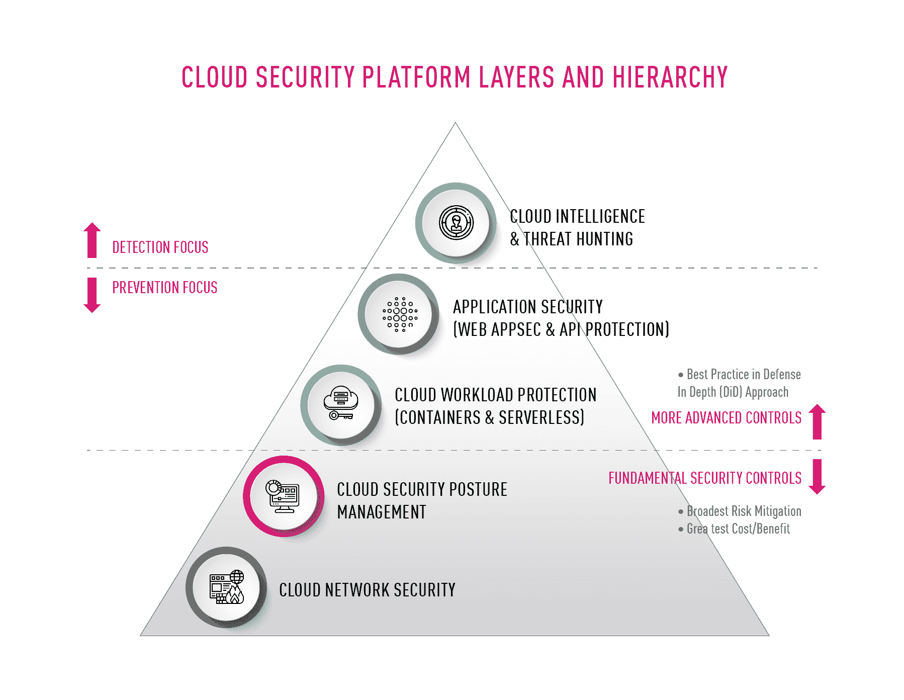

# 评估您的云网络安全解决方案的 10 项标准

> 原文：<https://thenewstack.io/10-criteria-to-evaluate-your-cloud-network-security-solution/>

随着组织扩展其云采用和业务关键型用例，其云基础架构的安全性通常会变得更加复杂。因此，分析师和顾问建议组织采取统一的多层方法来保护其云部署，并确保强大的云安全态势。像刚刚提到的方法已经缓解了安全问题，正如 Forrester 最近的一项研究所引用的那样，云安全信心是采用更多云服务的主要驱动力。

图 1:统一云本地安全平台的多个层

 [乔纳森·马雷斯基

Jonathan 是 Check Point 的云安全产品营销经理。他曾在从三人创业公司到大型跨国公司的公司中担任过各种产品、专业服务、营销和业务开发职位。他努力变得环保，并且在受伤期间参加马拉松训练。](https://www.linkedin.com/in/jonathan-maresky/) 

基于[共享责任模型](https://pages.checkpoint.com/shared-responsibility-model-introduction.html)，在基础设施层(IaaS)，云提供商负责保护他们的计算-网络-存储基础设施资源。这让云用户负责保护部署在基础架构上的数据、应用和其他资产。云提供商提供了许多工具和服务来帮助用户维护他们的共享责任模型，它们是任何云网络安全解决方案的重要元素。然而，云提供商不是安全专家，也不处理多云基础设施，因此需要这些工具和服务之外的额外安全解决方案来实现企业级网络安全。

一个关键的基础层是云网络安全。在这种情况下，组织通常部署虚拟安全网关来提供高级威胁防御、流量检查和微分段。这些解决方案包括多层安全技术，如[防火墙](https://www.checkpoint.com/cyber-hub/network-security/what-is-firewall/)、入侵防御系统(IPS)、应用程序控制、数据丢失防护等。

本文描述了为您的云部署检查和选择云网络安全平台时必不可少的 10 个标准。它解释了如何确保供应商解决方案具有对您组织的成功和安全至关重要的功能。

## **1。它是否提供高级威胁防御和深度安全防护？**

在当今复杂的网络安全环境下，威胁检测不足以有效保护云资产。这是因为在威胁侵入企业网络后检测到威胁会使组织的资产暴露在不可接受的网络安全风险中。

您需要针对已知和未知(零日)漏洞的多层实时威胁防御。该解决方案必须通过粒度和深度流量检查、增强的威胁情报和[沙箱](https://www.checkpoint.com/cyber-hub/threat-prevention/what-is-sandboxing/)等功能提供深度安全性，沙箱可隔离可疑流量，直到其被验证或阻止。这将允许您在入侵网络之前捕获并消除威胁。此外，这些高级功能必须部署在南北(输入/输出)和东西(横向)交通上。

## **2。解决方案是无边界的吗？**

安全团队无法通过由特定于供应商或特定于环境的安全工具组成的分散堆栈来提供企业级保护。该解决方案必须透明且一致地跨最复杂的多云和混合(公共/私有/本地)环境运行。统一的管理界面，有时称为“单一控制台”，应该提供云网络安全真相的单一来源，以及集中的命令和控制台。

## **3。是否有粒度流量检查和控制？**

如果没有深入的流量检查，组织很容易受到规避技术的攻击，这些技术试图通过看似合法的接入点执行未经授权的操作。寻找[下一代防火墙(NGFW)](https://www.checkpoint.com/cyber-hub/network-security/what-is-next-generation-firewall-ngfw/) 功能，例如超越基本白名单的精细匹配粒度、确保流量与允许端口的目的相匹配的深度检查、基于 URL 地址的高级过滤以及不仅在端口级别，而且在应用程序级别的控制。

## **4。有自动化吗？**

任何不能实现高度自动化的云解决方案都将无法得到支持，客户将会放弃它。为了匹配 DevOps 的速度和可扩展性，该解决方案必须支持高级别的自动化，包括安全网关的程序化命令和控制、与 CI/CD 流程的无缝集成、自动化威胁响应和补救工作流，以及无需人工干预的动态策略更新。

## **5。集成体验如何，易用性如何？**

集成对于这里描述的许多其他考虑事项是至关重要的，例如支持无边界操作和增加可见性。它在创建跨职能的云安全平台方面发挥着重要作用，该平台不仅可以解决基础架构安全问题，还可以解决应用程序安全、云安全状态管理等问题。

因此，该解决方案必须与您公司的配置管理体系配合良好，包括对基础设施即代码部署的支持。此外，该解决方案必须与云提供商的产品深度集成。一般来说，您的目标应该是通过最大限度地减少必须单独部署和管理的点安全解决方案的数量来简化操作和提高易用性。

## **6。是否有足够的可见度和可观察性？**

你不能保护你看不见的东西。该解决方案的仪表盘、日志和报告应在事件发生时提供端到端的、可操作的可见性。例如，日志和报告应该使用易于解析的云对象名称，而不是模糊的 IP 地址。如果发生违规，这种可见性对于增强的取证分析也很重要。

## **7。该解决方案是否可扩展并具有安全的远程访问？**

在高度分散和移动的工作人员的世界中，远程访问安全和高性能的公司网络是必须的。该解决方案必须保护对公司云环境的远程访问，并具备多因素身份验证、端点合规性扫描和传输数据加密等功能。远程访问还必须能够快速扩展，以便在业务中断时，例如在新冠肺炎疫情，任何数量的远程员工都可以安全高效地工作。

## **8。有上下文感知的安全管理吗？**

随着资产、变更和配置管理框架在漏洞补救工作中发挥核心作用，您的安全平台必须能够无缝发布变更，并实时适应所有相关的安全策略。云网络安全解决方案必须能够聚合和关联整个环境(公共云和私有云以及内部网络)中的信息，以便安全策略能够感知环境并保持一致。对网络、资产或安全组配置的更改应自动反映在其相关的安全策略中。

## **9。提供哪些供应商支持和行业认可？**

除了解决方案本身的特性和功能之外，密切关注供应商也很重要。寻找公正的建议，寻找能够推动您的云安全战略向前发展，并能够适应和扩展您不断变化的业务需求的供应商。考虑以下问题:

*   是否被独立行业分析师和第三方安全检测公司高度评价？
*   它能满足您的服务级别协议吗？
*   它有可靠的记录吗？
*   它能否提供增值服务，如网络安全咨询服务？它能支持您的全球运营吗？
*   它是否致力于创新，以使其解决方案经得起未来考验？
*   它的软件是否成熟，几乎没有漏洞，是否能及时修复？

## 10。总拥有成本是多少？

您希望您的云安全平台能够简化操作、优化工作流并降低成本，同时增强您的安全态势。通过查看许可模式的灵活性、云安全平台与现有 IT 系统的集成和利用程度、管理系统所需人员的级别和范围、供应商的 MTTR 和可用性 SLA 等来确定总拥有成本。你最不希望看到的是隐藏的基础设施、人员和其他成本，这些成本只有在系统启动并运行后才会显现出来。

## **结论**

转向云的组织需要能够控制自己的数据并保持其私密性，保护自己免受网络威胁，并安全地将其云与传统的内部网络连接，同时保持对法规要求的遵从。采用满足这些要求并与其云提供商无缝集成的云网络安全解决方案，将有助于组织在日益复杂的威胁环境中保持防护。

<svg xmlns:xlink="http://www.w3.org/1999/xlink" viewBox="0 0 68 31" version="1.1"><title>Group</title> <desc>Created with Sketch.</desc></svg>