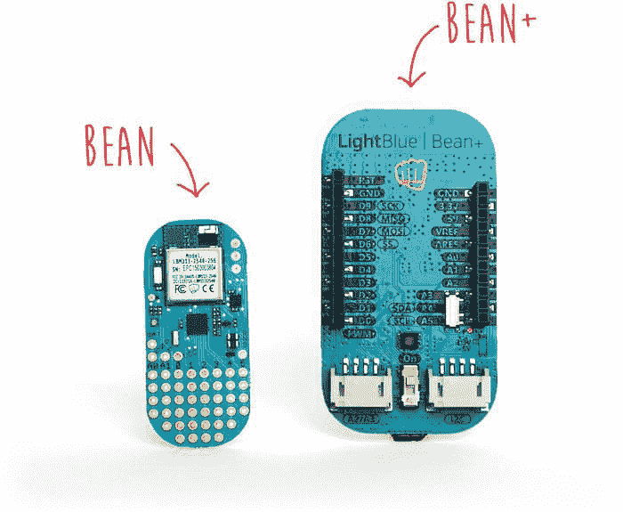

# 用于物联网原型制作的 10 块 DIY 开发板

> 原文：<https://thenewstack.io/10-diy-development-boards-iot-prototyping/>

[创客和黑客](/tag/off-the-shelf-hacker/)联网设备和物联网(IoT)入门开发板有很多选择。在过去的 18 个月里，DIY 市场随着各种电路板的出现而爆炸式增长。开发人员将不得不从基于微控制器的主板、片上系统(SOC)主板、单板计算机(SBC)和支持智能蓝牙和 WiFi 的专用主板中进行选择。

对于初学者来说，选择合适的板总是令人困惑。这里列出了 10 种开发板，非常适合您的第一个物联网项目。

## 10.加州公共卫生协会

[芯片](http://getchip.com/pages/chip)是新上市的产品。这款电脑标价 9 美元，是市场上最实惠的全功能电脑之一。它配备了一个强大的 1GHz 处理器，由 Allwinner R8 公司提供支持。芯片最好的一点是它带有嵌入式蓝牙 4.0 和 WiFi 无线电，提供开箱即用的连接。该板有 4GB 的高速存储空间来运行基于 Debian 的特殊 Linux 发行版。您不需要单独的 SD 卡来安装和运行操作系统。

这个板唯一的缺点就是没有 HDMI 输出。要将其连接到显示器，您必须使用复合输出的 TRRS 连接器。您可能需要一个适配器来将其连接到常规 VGA 或 HDMI 显示器。由于芯片支持无头操作，你可以开始没有连接到显示器。

通过 8 个 GPIO 引脚，芯片可以连接到各种传感器。该板还支持 PWM、UART 和 I2C，用于连接电机和其它执行器。

芯片的主要优势之一是成本和外形。开发人员可以通过 SSH 进入 Linux 操作系统并安装所需的软件包。GPIO 引脚可以通过命令提示符或特定于语言的库来访问。

[价格:9 美元](http://getchip.com/cart)

## 9.联发科 Linkit One

基于最小的 SOC，Linkit One 板具有兼容的 Arduino 引脚排列特性。该芯片组基于 MT2502A (Aster，arm 7 EJ-S TM)，速度为 260MHz。在连接性方面，Linkit One 拥有最全面的无线电集合–GPS、GSM、GPRS、WiFi 和蓝牙。

Linkit One 的独特之处之一是丰富的 API，可以从 Arduino IDE 中使用。SDK 附带了将电路板连接到 AWS 和 PubNub 的库。由于支持 Arduino 引脚排列，Arduino 生态系统的多个屏蔽可以与该板一起使用。

凭借小巧的外形和丰富的连接选项，Linkit One 可用于互联物联网设备和可穿戴设备的快速原型开发。

[价格:59 美元](http://www.seeedstudio.com/depot/LinkIt-ONE-p-2017.html)

## 8.粒子光子

[光子](https://www.particle.io/prototype#photon)是市场上最小的原型板之一。它配备了相同的 Broadcom BCM43362 Wi-Fi 芯片，用于 Next、LiFX 和 Amazon Dash 按钮。Photon 采用 STM32F205 120Mhz ARM Cortex M3 处理器，具有 1MB 闪存和 128KB RAM。配置完成后，可通过互联网访问该板，这使其成为构建互联应用的理想原型开发平台。

该板带有五个模拟引脚和八个数字引脚，用于连接各种传感器和执行器。Particle 发布的官方 iOS 和 Android 应用程序在直接控制这些 pin 码方面派上了用场。功能强大的基于网络的 IDE 允许你编写与 Arduino 兼容的草图。

开发人员还可以购买各种屏蔽，用于与继电器、电机和更广泛的 Arduino Uno 生态系统接口。

[价格:19 美元](https://store.particle.io)

## 7.特塞尔

Tessel 2 是面向严肃开发者的可靠开发板。它提供了可直接连接到模块端口的传感器和执行器选择。该板采用 580MHz 联发科 MT7620n 处理器，执行速度更快。它由一个 48MHz Atmel SAMD21 协处理器补充，以更好地管理电源和实时 I/O。它有 64 MB DDR2 RAM 和 32 MB 闪存，足以运行复杂的代码。Micro-USB 端口用于为电路板供电以及连接到 PC。

嵌入式 Wi-Fi 和以太网端口为 Tessel 带来连接。它收集了大量的传感器和执行器，并附带了所需的库。基于 [JavaScript 和 Node.js](https://thenewstack.io/year-ahead-node-js-internet-things/) ，很容易上手平台。寻找快速原型开发平台的开发人员可以选择 Tessel 2。

[价格:44 美元](http://www.seeedstudio.com/depot/Tessel-2-p-2622.html)

## 6.阿达果植物群

如果你对可穿戴设备感兴趣， [Adafruit Flora](https://www.adafruit.com/products/659) 就是为你准备的。这是一个基于最流行的 Arduino 微控制器的可穿戴电子平台。Flora 的大小使其成为嵌入衣服和服饰的理想选择。它带有一根细的、可缝合的导线，作为连接电源和其他附件的电线。最新版本的 Flora 配有微型 USB 和 Neopixel LEDs，便于编程和测试。

Adafruit Flora 基于 Atmega 32u4 微控制器，为 Arduino Mega 和 Leonardo 提供动力。有一个带保护肖特基二极管的板载极化 2 JST 电池连接器，用于 3.5v 至 9v DC 的外部电池组。鉴于其与 Arduino 的兼容性，大多数草图无需修改即可运行。您可以使用您可能已经熟悉的同一 Arduino IDE。

[价格:19.95 美元](https://www.adafruit.com/products/659)

## 5.浅蓝色豆

[LightBlue Bean](https://punchthrough.com/bean) 是一款兼容 Arduino 的微控制器板，配有嵌入式蓝牙低能耗(ble)、RGB LED、温度传感器和加速度计。Bean+是已经流行的继任者，它包括一个可充电的 LiPo 电池以及几个 Grove 连接器。

该板配有纽扣电池，这进一步有助于它保持小尺寸。它可以与 Android 或 iOS 设备配对，进行远程连接和控制。它还附带了一个名为 BeanLoader 的软件，用于从装有 BLE 的 Windows 或 Mac 上进行编程。BeanLoader 安装一个 Arduino IDE 附加组件，用于对 Bean 平台进行编程。

LightBlue Bean / Bean+由 ATmega328p 微控制器供电，带有 32KB 闪存和 2KB SRAM。Bean 拥有 8 个 GPIO 引脚、2 个模拟引脚、4 个 PWM 引脚和 1 个 I2C 端口，非常适合快速构建 BLE 物联网项目的原型。

[价格:30.00 美元](http://store.punchthrough.com/collections/all/products/bean)

## 4.Udoo Neo

Udoo Neo 是一台成熟的计算机，它也有一个 Arduino 兼容的微控制器。它的定位是树莓派和 Arduino 的结合。该板的引脚排列与 Arduino Uno 相同。Neo 在同一个处理器上嵌入了两个内核——一个强大的 1GHz ARM Cortex-A9 和一个 ARM Cortex-M4 I/O 实时协处理器。它集嵌入式 9 轴运动传感器和 Wi-Fi +蓝牙 4.0 模块于一身。你可以安装 Android Lollipop 或者一个名为 [UDOObuntu](http://www.udoo.org/docs-neo/Software_&_Operating_Systems/UDOObuntu.html) 的定制版 Debian Linux，它兼容 Ubuntu 14.04 LTS。

说到强大的功能和规格，Udoo NEO 不亚于一台台式电脑。Neo 采用飞思卡尔 i.MX 6SoloX 应用处理器，内置 ARM Cortex-A9 内核和 Cortex-M4 内核，配有 1GB RAM。微型 HDMI 端口可以连接到外部显示器和音频源。标准 Arduino 引脚布局与 Arduino 屏蔽兼容。你可以在 Udoo Neo 上安装 Node.js，Python，甚至 Java。

价格:64.90 美元

## 3.英特尔爱迪生公司

相信英特尔能够为高级物联网项目提供最强大的单板计算机。英特尔 Edison 是一款高性能双核 CPU，配有单核微控制器，可支持复杂的数据收集。它具有在 68 个国家/地区认证的集成 Wi-Fi、蓝牙 4.0 支持、1GB DDR 和 4GB 闪存。Edison 配备了两个分线板——一个兼容 Arduino，另一个尺寸较小，便于原型制作。

Arduino 分线板有 20 个数字输入/输出引脚，包括 4 个作为 PWM 输出的引脚，

六路模拟输入、一路 UART (Rx/Tx)和一路 I2C 引脚。Edison 运行的是名为 [Yocto](https://www.yoctoproject.org) 的嵌入式 Linux 发行版。这是少数获得微软、AWS 和 IBM 云连接认证的主板之一。

[价格:70.00 美元](http://www.intel.com/buy/us/en/product/emergingtechnologies/intel-edison-kit-462187)

## 2.树莓派

[Raspberry Pi](https://www.raspberrypi.org) 无疑是许多爱好者和黑客最常用的平台。即使是非技术用户也依赖它来配置他们的数字媒体系统和监控摄像机。最近推出的 Raspberry Pi 3 包括内置 WiFi 和蓝牙，使其成为最紧凑和独立的计算机。Pi 基于 Broadcom BCM2837 SoC，配有 1.2 GHz 64 位四核 ARM Cortex-A53 处理器和 1GB RAM，是一个功能强大的平台。树莓 Pi 3 除了 10/100 以太网端口外，还配备了 2.4 GHz WiFi 802.11n 和蓝牙 4.1。HDMI 端口使连接 A/V 信号源变得更加容易。

Raspberry Pi 运行在名为 [Raspbian](https://www.raspbian.org) 的定制 Debian Linux 上，提供了出色的用户体验。对于开发者和黑客来说，它提供了一个强大的环境来安装各种包，包括 Node.js、LAMP stack、Java、Python 等等。借助四个 USB 端口和 40 个 GPIO 引脚，您可以将许多外围设备和附件连接到 Pi。有第三方分线板将各种 Arduino 屏蔽连接到 Pi。以 35 美元的一次性价格，Raspberry Pi 3 无疑是最实惠和最强大的计算平台。

[价格 35.00 美元](https://www.raspberrypi.org/products/raspberry-pi-3-model-b/)

## 1.Arduino Uno

Arduino Uno 仍然是绝对初学者和专家的最爱。Arduino Uno R3 被认为是首批基于微控制器的开发板之一，是最简单但功能最强大的原型开发环境。它基于 ATmega328P，具有 14 个数字输入/输出引脚和 6 个模拟输入。虽然它只有 32 KB 的闪存，但它可以容纳处理复杂逻辑和操作的代码。

Arduino 享有最好的社区参与和支持。从传感器到执行器再到图书馆，它拥有一个欣欣向荣的生态系统。电路板布局几乎已经成为微控制器的黄金标准。几乎每个原型开发环境都试图与 Arduino 引脚分线兼容。开发草图的开源 IDE 是它受欢迎的另一个原因。基于 C 语言的简单语法，代码很容易学习。如果你渴望学习电子和物联网的基础知识，别再犹豫了。帮你自己一个忙，买一个 Arduino Uno R3。

[价格:22.57 美元](https://store.arduino.cc/index.php?main_page=product_info&products_code=GBX00066)

<svg xmlns:xlink="http://www.w3.org/1999/xlink" viewBox="0 0 68 31" version="1.1"><title>Group</title> <desc>Created with Sketch.</desc></svg>