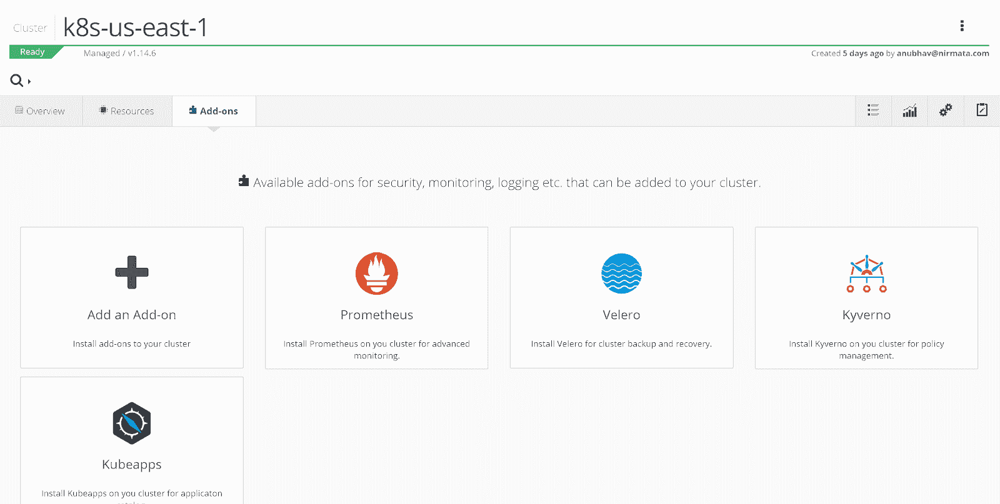
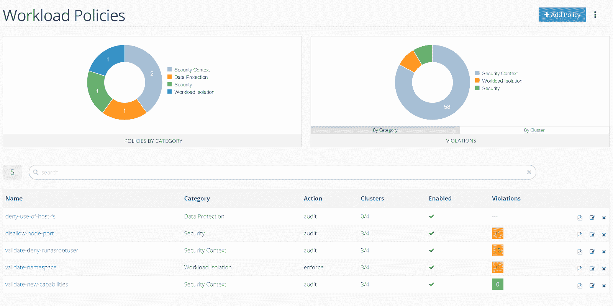

# 10 个 Kubernetes 最佳实践，您可以轻松应用于您的集群

> 原文：<https://thenewstack.io/10-kubernetes-best-practices-you-can-easily-apply-to-your-clusters/>

Kubernetes 优雅地自动化了应用程序容器生命周期管理，但其本身的配置和管理可能很复杂。在本文中，我将向您介绍 Kubernetes 的十个最佳实践，并向您展示如何轻松地将它们应用到您的集群中。

让我们从最佳实践开始吧！

## Kubernetes 最佳实践

### **不允许根用户**

 [吉姆·布瓦迪亚

Jim 在建立和领导高效团队方面拥有 20 多年的经验，并开发了支持通信系统的软件。在联合创办 Nirmata 并成为首席执行官之前，Jim 是思科云自动化业务的最初架构师和业务领导者之一，他帮助该业务的收入增长到超过 2 . 5 亿美元，IDC 认为该业务是全球云服务的第一名。在思科工作之前，Jim 领导了一些初创公司的工程团队，包括桌面虚拟化初创公司 Pano Logic 无线先驱“空中飞人网络公司”:以及电信设备制造商 Jetstream Communications。](https://nirmata.com/) 

默认情况下，容器中的所有进程都以 root 用户(uid 0)身份运行。为了防止容器主机的潜在危害，在构建容器映像时指定一个非根用户和最低特权用户 ID，并确保所有应用程序容器都作为非根用户运行，这一点很重要。

**不允许特权集装箱**

特权容器定义为容器 uid 0 映射到主机 uid 0 的任何容器。特权容器中的进程可以获得不受限制的主机访问权限。如果没有适当的设置，进程也可以从其父进程获得特权。不应允许应用程序容器在特权模式下执行，也不应允许特权提升。

**不允许添加新功能**

Linux 允许使用功能定义细粒度的权限。使用 Kubernetes，可以添加一些功能来提升内核访问级别，并允许其他潜在的危险行为。确保应用程序窗格不能在运行时添加新功能。

**不允许更改内核参数**

Sysctl 接口允许在运行时修改内核参数。在 Kubernetes pod 中，这些参数可以指定为配置的一部分。内核参数修改可被利用，添加新参数应该受到限制。

**不允许使用绑定装载(主机路径卷)**

Kubernetes pods 可以在容器中使用主机绑定挂载(即容器主机上挂载的目录和卷)。使用主机资源可以允许访问共享数据，也可能允许权限提升。此外，使用主机卷会将应用程序箱耦合到特定的主机。不应允许对应用程序窗格使用绑定装载。

**不允许访问 docker 套接字绑定挂载**

docker 套接字绑定挂载允许访问节点上的 Docker 守护进程。这种访问可以用于权限提升和管理 Kubernetes 之外的容器。因此，不应该允许应用程序工作负载访问 docker 套接字。

**不允许使用主机网络和端口**

使用容器主机网络接口允许 pod 共享主机网络堆栈，从而允许跨应用 pod 的潜在网络流量窥探。

### **需要只读根文件系统**

只读根文件系统有助于实施不可变的基础设施策略；容器只需要在即使容器退出也能保持状态的已装入卷上写入。不可变的根文件系统还可以防止恶意二进制文件写入主机系统。

**要求 pod 资源请求和限制**

应用程序工作负载共享集群资源。因此，管理分配给每个 pod 的资源非常重要。建议为每个 pod 配置请求和限制，并且至少包括 CPU 和内存资源。

**要求活动探测和就绪探测**

活性和就绪性探测有助于在部署、重启和升级期间管理 pod 的生命周期。如果这些检查没有正确配置，pod 可能在初始化时被终止，或者可能在准备好之前就开始接收用户请求。

## 应用 Kubernetes 最佳实践

现在我们已经了解了最佳实践，让我们看看如何将这些实践应用到您的集群中，并确保所有工作负载都符合这些实践。

对于许多 pod 安全设置，Kubernetes 本身提供了一个名为 [Pod 安全策略(PSP)](https://kubernetes.io/docs/concepts/policy/pod-security-policy/) 的策略对象。但是，PSP 本身在跨工作负载的配置和管理方面很复杂，并且可能会在 pod 未被调度的情况下导致错误。此外，PSP 是一种测试版资源，由于其固有的[限制和可用性问题](https://github.com/kubernetes/enhancements/issues/5#issuecomment-476332297)，不太可能普遍提供(GA)。因此，需要更好的解决方案。

[Kyverno](https://kyverno.io/) 是一个开源的 Kubernetes 本地策略管理框架，可以验证、变更和生成工作负载配置。Kyverno 安装了一个准入控制器 webhook 接收器。这意味着 Kyverno 可以检查所有创建、编辑和删除工作负载配置的请求。

Kyverno policies 是 Kubernetes 的资源，编写起来很简单。例如，下面是一个策略，它检查每个 pod 中的活性和就绪性探测器:

```
apiVersion:  kyverno.io/v1
kind:  ClusterPolicy
metadata:
  name:  require-pod-probes
spec:
  rules:
  -  name:  validate-livenessProbe-readinessProbe
 match:
    resources:
 kinds:
 -  Pod
    validate:
 message:  "Liveness and readiness probes are required"
 pattern:
      spec:
 containers:
 -  livenessProbe:
          periodSeconds:  "&gt;0"
 readinessProbe:
          periodSeconds:  "&gt;0"

```

Kyverno 是为 Kubernetes 设计的，因此对 Kubernetes 的工作方式有着深刻的了解。例如，如果由于策略强制而无法部署 pod，Kyverno 将检查 pod 控制器(例如，创建 pod 的部署)并报告 pod 控制器上的策略违规。违反策略的情况也作为 Kubernetes 资源被创建，并且与工作负载在同一个名称空间中。这给开发人员带来了很好的体验，因为检查和修复不兼容的配置很容易。

在集群中安装 Kyverno 很容易，只需使用这个命令:

```
kubectl create  -f  https://github.com/nirmata/kyverno/raw/master/definitions/install.yaml

```

接下来，您可以应用最佳实践策略，包括上述策略和其他策略:

```
git clone https://github.com/nirmata/kyverno.git
cd kyverno
kubectl create  -f  samples/best_practices

```

可以设置策略来验证新的和现有的配置，并报告违规情况。或者，您可以将它们设置为强制检查并阻止不符合策略的配置更改。

你可以在 GitHub 网站上了解更多关于 Kyverno 的信息。

## 使用 Kyverno 和 Nirmata

更简单的操作 Kyverno 和管理策略的方法是使用 Nirmata。只需[注册一个免费帐户](https://www.nirmata.io/security/signup.html)并通过选择管理现有 Kubernetes 集群的选项来注册您的集群。注册集群后，Nirmata 可以自动将 Kyverno 部署为集群附加服务:



当 Kyverno 在您的集群中运行时，Nirmata 会收集违反策略的情况，并将它们与工作负载关联起来。Nirmata 提供了简单的方法来集中管理多个集群的策略，管理违规，为工作负载创建异常，甚至为违规生成警报。



## 摘要

Kubernetes 功能强大，为工作负载提供了许多配置选项。然而，Kubernetes 开箱即用并不安全，需要仔细调整以确保集群资源和工作负载的安全。

[Kyverno](https://github.com/nirmata/kyverno) 可以轻松审核工作负载是否符合最佳实践并实施策略。Kyverno 存储库有几个最佳实践策略，您可以立即开始使用。

Nirmata 提供了一种简单的方法来注册任何 Kubernetes 集群并安装像 Kyverno 这样的附加服务。Nirmata 与 Kyverno 集成，为您的所有集群提供集中可见性、报告和可定制的警报。您可以开始使用 [30 天免费试用](https://www.nirmata.io/security/signup.html)，然后继续使用免费等级。

<svg xmlns:xlink="http://www.w3.org/1999/xlink" viewBox="0 0 68 31" version="1.1"><title>Group</title> <desc>Created with Sketch.</desc></svg>