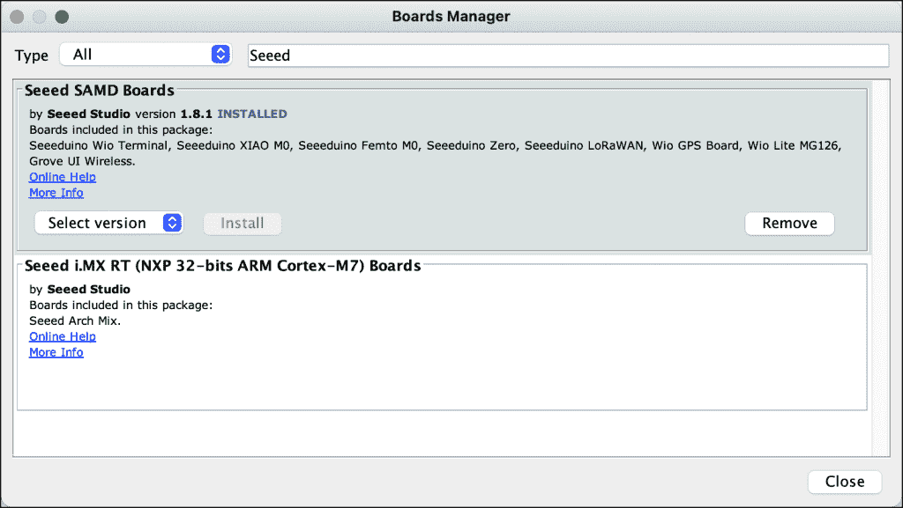
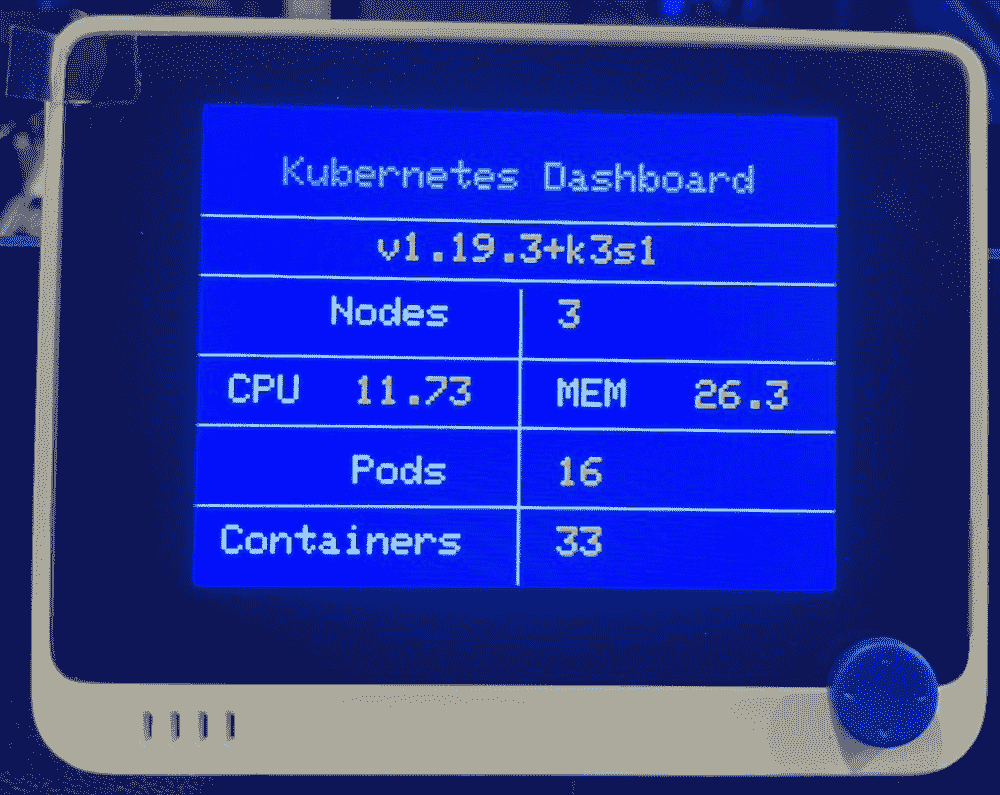
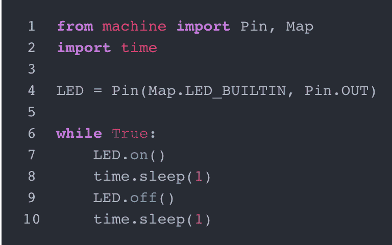
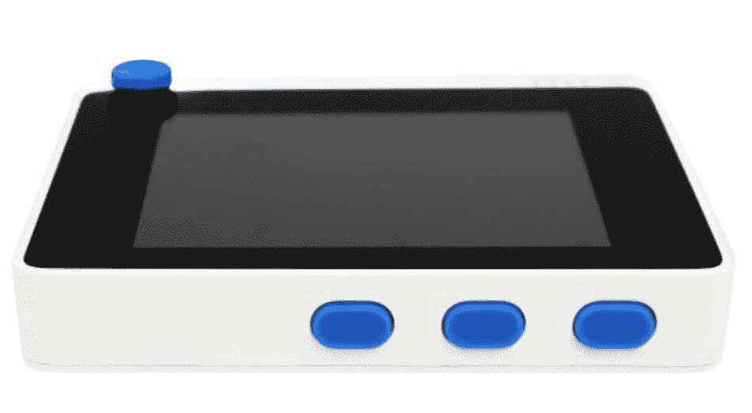
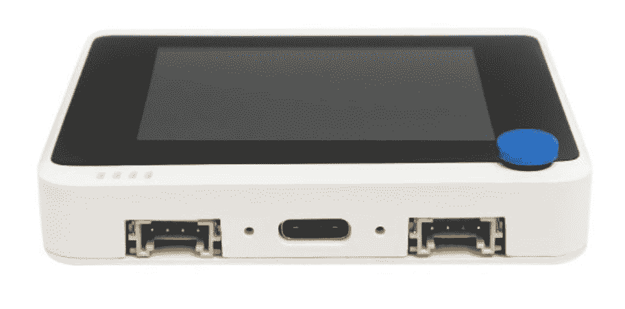

# Wio 终端是你需要的最后一个 DIY 物联网设备的 10 个理由

> 原文：<https://thenewstack.io/10-reasons-why-the-wio-terminal-is-the-last-diy-iot-device-you-need/>

像大多数物联网开发者一样，我通过 Arduino Uno 开始学习微控制器和设备编程的基础知识。随着我的进步，我切换到 Arduino Yun，它给了我无线连接。结合 [Grove Shield](https://www.seeedstudio.com/Base-Shield-V2.html) ，Arduino 转变成一个连接各种传感器和执行器的强大平台。

虽然 [Arduino Yun Rev. 2](https://store.arduino.cc/usa/arduino-yun-rev-2) 与 Grove 是一个很好的组合，但它没有带来集成的体验。尤其是在打包项目以使其可移植的时候。

物联网开发套件的领导者和流行的 Grove 平台的创造者 Seeed Studio 推出了一款名为 [Wio 终端](https://www.seeedstudio.com/Wio-Terminal-p-4509.html)的新产品。作为一名电子和物联网爱好者，我期待着探索这款设备。我最近设法得到了一些 Wio 终端设备，我必须说我并不失望。

以下是 Wio 终端成为您最不愿意购买的物联网设备的 10 个原因。

## 1.Arduino 兼容性

Wio 终端使用标准的 Arduino IDE 开发应用程序。如果你知道如何为 Arduino 写草图，你可以立即开始使用 Wio 终端。



Seeed Studio 提供了一个针对 Wio 终端的董事会管理器。您只需将 Arduino 指向 board manager URL 即可添加。

### 2.无线连接

Wio 终端配有连接所需的一切。该设备由 Realtek RTL8720DN WiFi 和蓝牙模块供电，提供双频 2.4Ghz / 5Ghz Wi-Fi (802.11 a/b/g/n)、蓝牙和蓝牙低功耗(BLE)

通过内置的无线电台堆栈，您可以从 Wio 终端与互联网建立出站连接。我通过调用外部集群中的 Prometheus 端点构建了一个迷你 Kubernetes 仪表板。



如果你熟悉 Azure IoT Hub 或 AWS IoT Core，你可以很容易地将 Wio 终端连接到云端，构建端到端的应用。

### 3.集成传感器

Wio 终端是传感器的发电站。从基于 IMU 的三轴数字加速度计(LIS3DHTR)到光传感器再到红外发射器，您可以快速开始您的项目。

借助兼容 Raspberry Pi 的引脚排列，可以轻松将更多传感器连接到器件。

### 4.软件支持

Wio 终端可以通过 Arduino sketch、ArduPy 或 MicroPython 进行编程。

[ArduPy](https://wiki.seeedstudio.com/ArduPy) 是 Arduino 和 MicroPython 的结合。 [MicroPython](https://micropython.org/) 使用通用的 Arduino API 来控制硬件。ArduPy 让你通过标准 Python 控制设备的 IO。



上面的代码显示了如何用 ArduPy 使 LED 闪烁。

### 5.内置液晶显示器

拥有集成的 2.4 英寸 LCD 是使用 Wio 终端的主要优势。您可以通过标准的 Arduino LCD 库绘制、打印甚至显示图像。我在迷你 Kubernetes 仪表板中广泛利用了这个特性。

### 6.广泛的协议支持

Wio 端子配有 SPI、I2C、I2S、ADC、DAC、PWM、UART(串行)端口。你可以连接伺服电机，继电器，甚至是支持 PWM 的风扇。

### 7.按钮和操纵杆

该设备带有三个可编程按钮和一个可以用作操纵杆的五向开关。



下面的代码显示了从代码中访问这些按钮是多么简单。

```
void setup()  {
    Serial.begin(115200);
    pinMode(WIO_KEY_A,  INPUT_PULLUP);
    pinMode(WIO_KEY_B,  INPUT_PULLUP);
    pinMode(WIO_KEY_C,  INPUT_PULLUP);
}

void loop()  {
    // put your main code here, to run repeatedly:
    if  (digitalRead(WIO_KEY_A)  ==  LOW)  {
        Serial.println("A Key pressed");
    }  else if  (digitalRead(WIO_KEY_B)  ==  LOW)  {
        Serial.println("B Key pressed");
    }  else if  (digitalRead(WIO_KEY_C)  ==  LOW)  {
        Serial.println("C Key pressed");
    }
    delay(200);
}

```

### 8.Grove 连接器

Seeed Studio 的 Grove 系列有数百个传感器和致动器，可以连接到 Grove Shield。Wio 终端配有两个多功能 Grove 引脚，可连接不断发展的生态系统中任何受支持的 Grove 传感器。



### 9.MicroSD 和 OTG 支持

内置的 MicroSD 插槽可以从您的程序中读取和写入数据。您可以捕获传感器遥测数据，并将其存储在本地以供可视化，或者将其转发到云中以供进一步处理。

USB-C 端口将 Wio 终端变成 OTG 主机或客户端。您甚至可以将 Xbox 控制器连接到它，或者将其转换为人机界面设备(HID ),以模拟键盘或鼠标。

### 10.运行 TinyML 模型

Wio 终端最强大的特性是能够运行 TinyML 模型进行推理。您可以转换可部署到设备的 TensorFlow Lite 模型。在以后的一篇文章中，我将向您介绍在 Wio 终端上训练、转换和运行 TensorFlow 模型的步骤。

总体而言，Wio 终端是学习、探索和构建物联网项目的终极设备。在节日期间为自己买一个，我相信你不会失望的。

贾纳奇拉姆·MSV 的网络研讨会系列“机器智能和现代基础设施(MI2)”提供了涵盖前沿技术的信息丰富、见解深刻的会议。在 [http://mi2.live.](http://mi2.live.) 注册即将到来的 MI2 网络研讨会，T3

<svg xmlns:xlink="http://www.w3.org/1999/xlink" viewBox="0 0 68 31" version="1.1"><title>Group</title> <desc>Created with Sketch.</desc></svg>