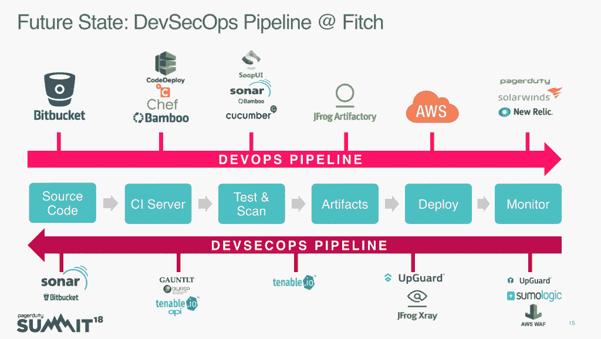

# 百年惠誉评级升级至 DevSecOps

> 原文：<https://thenewstack.io/100-year-old-fitch-ratings-upgrades-to-devsecops/>

当米尔·阿里在 2015 年加入 T2 惠誉评级公司时，已经有很多关于改变他们软件流程的讨论，这是由他们堆栈的不可靠性引起的。  惠誉评级是一家金融公司，与穆迪和标准普尔是美国证券交易委员会(SEC)指定的三家国家认可的统计评级机构之一。

惠誉指出，在一家有 100 年历史的公司中对 DevSecOps 进行改变并不容易，他现在是 shared services 的主管。  但问题不能再忽视了。阿里说，基本上，他们不明白生产中发生了什么。  有太多的停机，没有可追溯性，也没有很多跨管道的协作。当一个事件发生时，没有人知道为什么或该怎么办。  标准程序是重启数据库服务。对于一家受到 SEC 监控的公司来说，这显然是不可接受的。

### 主要挑战

一个挑战是普遍缺乏安全知识。其次是缺乏协作或对个人责任的理解。最后是自动化程度不够。

起初，要做的事情太多了，很难分清轻重缓急。团队后退一步，创建一个他们想要的远景，这个远景通知了他们所有的后续决策。

他们决定把安全缺陷推到首位。  剩下的任务分为三个方面。他们想在整个开发过程中应用这种安全性，并在整个公司范围内标准化这一过程。最后，他们想尽可能简化流程。

简单地说，阿里说，DevSecOps 正在扩展 DevOps 的合作，以包括安全性。

> “DevSecOps 的目的和意图是建立在‘每个人都对安全负责’的思想基础上，目标是在不牺牲所需安全性的情况下，以一定的速度和规模将安全决策安全地分配给那些拥有最高级别上下文的人。”—devsecops.org

### **在整个开发过程中应用安全性**

阿里说，将安全性集成到 DevOps 管道中非常关键，因此它是整个软件开发过程中不可或缺的一部分。

惠誉 DevSecOps 管道中的安全检查站

管理团队首先在每个团队中安排安全专家，因为他们打破了 DevOps 管道中的孤岛。  “让他们感到自己是团队的一部分，”他说，  “接受他们的投入，利用他们的技能。  使其成为自动化的一部分安全专家为您提供背景信息、专业知识、最新的风险是什么、我们需要注意什么？安全成了每个人的工作。

接下来，他们安装安全工具。“这不全是关于工具，”阿里说，“但你必须有工具在适当的位置，使安全成为可能。”  例如，良好的仪表板是自动化的关键。  持续交付管道安全性的首要任务是适当的访问控制、锁定构建系统以及标准化命名约定。

他们开始追求唾手可得的水果。  雅虎的数据泄露是因为其系统没有密码保护，所以有人干脆克隆了数据库。他说，没有最高安全级别的人不可能做到这一点。  所以第一步是将访问权限默认为 none。  权限必须被授予，并且完全基于角色和自动化。

“加密一切”成为新的座右铭。  可见进入管道是另一个关键区域。  “确保日志条目对人类有意义，”  阿里建议。  很多日志读起来像是胡言乱语，在故障排除时毫无帮助。

### 设立安全检查站

一旦基本的整体安全性到位，他们就开始在管道中构建自动化的安全检查点。他说:“如果事情没有通过，工程师会把它关掉，说‘我以后再来’，但他们从来不这样做。”。通过自动化检查站，你不会给他们这样的机会。他们使用 Gauntlt，它允许用户编写专门针对安全性的自动化测试。

惠誉 DevSecOps 管道

当 Ail 到达时，工程师们已经将扩展数据的解决方案部署到位，但每个团队都是独立工作的，因此有各种各样的解决方案，工程师们提出了大量不同的选项。虽然花了一些时间，但他们为每一条管道选择了满足其需求的最佳解决方案，并使之成为标准。

类似于 [PagerDuty 自己的 DevOps 改造](https://thenewstack.io/pagerdutys-3-year-journey-to-devops-culture/)，该项目耗时约三年。

### **DevSecOps 的神话**

阿里说:“有一些关于开发公司的神话需要被打破。  第一个误区是，如果你将安全自动化，你就会放弃控制权。  事实是，这会让你的公司*更加*合规。  自动化提供了一致性和可追溯性。

下一个神话是简单地添加安全工具会创建 DevSecOps。  不是增加新工具，也不是增加更多开发者。他说，这不是一种能力，而是一种心态。  “你可以很容易地用你拥有的开发人员做到这一点。”让安全成为他们工作的一部分和绩效评估的一部分。"

### **从哪里开始**

还是不知所措？从小处着手。  阿里以邮件整合起家。慢慢地，他们增加了工具，开始打破孤岛，改变期望。  电子邮件整合后，公司开始使用[page duty](https://www.pagerduty.com/)的警报服务，这导致了 Atlassian 的[吉拉](https://www.atlassian.com/software/jira) bug 跟踪系统的整合，整个管道被集中化，并有日志记录和智能监控。

三年后，他们现在在失败前捕捉事物。

### 开发者面临的最大挑战

必须设身处地为他们着想。  如果你告诉他们，你必须实现自动化，你必须使用 DevOps 工具，而现在我说的是‘同样内置安全性’，从他们的角度来看，突然间我有了三份工作，而不是一份。

“鉴于这一点，我会讨厌我的工作，”阿里说。  所以我来了，积极提供教练传福音和支持。他告诉他的团队，他们将提供培训、工具和框架，并支持他们的工作。

看到大多数  的工作实际上已经完成，开发团队意识到他们只需要利用自动化。  现在，没有人签入他们的代码，大家都很自然地在做。  部署不再是问题。

“仍然存在挑战，但我们已经为他们开辟了一条道路，让他们开始采纳，而不是退缩，”他说。

### **最终提示**

“你必须知道你把数据放在哪里，弄清楚里面有什么，你如何检查数据，谁与数据交互，以及如何保护数据，”他说。

“在你提出这些问题之前，你的应用和数据是不安全的。”

PagerDuty 是新栈的赞助商。

图片由 T.C. Currie 提供。

<svg xmlns:xlink="http://www.w3.org/1999/xlink" viewBox="0 0 68 31" version="1.1"><title>Group</title> <desc>Created with Sketch.</desc></svg>