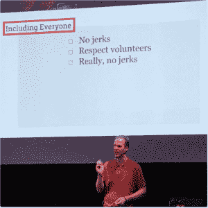
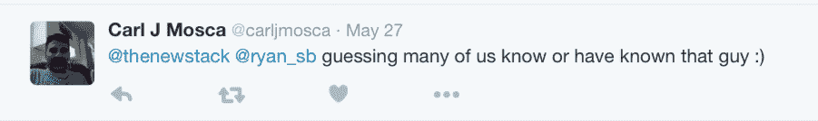

# 你是 10x 程序员，还是只是个混蛋？

> 原文：<https://thenewstack.io/10x-programmer-just-jerk/>

10 倍程序员的神话依然存在，但光芒正在消退。

瑞安·斯科特·布朗上周在纽约的无服务器会议上发言。

Red Hat 的高级软件工程师瑞安·斯科特·布朗在 T2 的无服务器会议上提出了一个想法，在一次关于开源志愿者的演讲中，他说不管一个开发者多么有生产力，如果社区的其他人发现这个程序员很难共事，那么生产力就是浪费了。

不是每个 10x 程序员都是混蛋。布朗说，远非如此。但是从长远来看，一个允许超级开发人员在同事之间胡作非为的经理对项目没有任何好处。

Jacob Kaplan-Moss，Django 的核心撰稿人，自称普通程序员，在他的 [2015 年 PyCon 演讲](https://www.youtube.com/watch?v=hIJdFxYlEKE)中谈到了 10x 程序员想法的破坏性，称其为“天才混蛋的神话”认为自己工作非常出色的程序员，即使他的行为是有害的，人们也不得不和他一起工作。

布朗这样说，“如果你有一个 10 倍的开发人员，他也是一个 10 倍的混蛋，他们赶走了你项目的 9 个贡献者，他现在是 1 倍的开发人员，仍然是一个混蛋。”

“10 倍程序员”的想法已经存在很多年了。Venkatesh Rao 在他 2011 年的福布斯文章“Developeronomics 的崛起”中说，“10 倍效应是一个有趣的观察，伟大的程序员不仅仅比普通人多一点点生产力(大约 15-20%)。他们的工作效率往往会提高 10 倍。”

呜！世界各地的首席执行官们说，他们指示他们的人力资源部门只雇佣 10 倍的程序员。开发者争相更新简历，给自己贴上超级高产摇滚明星的标签。但是 10 倍程序员，如果他们真的存在，也是如此罕见，以至于成为独角兽，UserScape 创始人伊恩·兰德斯曼去年在他的博客上说。

他说:有些程序员比普通程序员优秀得多，但他们不是速度超快的程序员。他把他们和《黑客帝国》里的尼奥做了比较。

> 这让普通的程序员，那些工作出色并完成项目的稳定的程序员，感觉他们的贡献并不重要。

“如果你愿意，他们可以看到组成矩阵的代码，而且他们可以修改它。他们可以将数百个完全不同的事实、想法、代码线一次串联到他们头脑中的一个地方，并建立起一种联系，这是 100 个其他开发人员在查看它时永远不会建立的，”Landsman 写道。

但他说，这些独角兽不应该出现在你的商业计划中。

Gruntwork 的联合创始人[叶夫根尼·布里克曼](https://twitter.com/brikis98)已经[为 10 倍程序员的神话](http://www.ybrikman.com/writing/2013/09/29/the-10x-developer-is-not-myth/)辩护，但是即使是他也说重要的是保持观点，而不是围绕这些罕见的人建立招聘策略。“不要让完美成为好的敌人:雇佣你能找到的最好的工程师，并给他们充分的发展机会，让他们变得更好。”

在一篇名为“[你不是 10 倍开发人员](https://www.seancassidy.me/you-are-not-a-10x-developer.html)”的帖子中，博主西恩·卡西迪称只雇佣 10 倍开发人员的想法是“荒谬的”

事实上，无休止地寻找独角兽绝不是经营企业的方式。软件生产是一项团队运动，如果你正专注于雇佣一个迈克尔·乔丹团队或者用豪斯医生填充你的急诊室，那只是糟糕的生意。或者，正如兰德斯曼所说，“如果你认为你的业务依赖于找到一只独角兽，因为你正在建立的东西需要 30 或 40 只独角兽来建立一个有价值的可靠产品，那么我认为你的麻烦非常大。”

软件开发人员比尔·乔丹最近的博客文章被《黑客新闻》转载，他谈到了建立一个团队的重要性，而不是偏爱高水平的员工。他建议要谨慎，因为高绩效者通常会走捷径，这会在应用程序中建立“技术债务”Jordan 推荐强大的管理技能，并超越编写代码所花的时间，包括计算 TCO(总拥有成本)的其他指标，如代码在 QA 中的表现如何，以及它是否会在生产中引起问题。

但是等等，还有更多。

卡普兰-莫斯认为这个神话在几个层面上是有害的。最重要的是，这让普通的程序员，那些工作出色并完成项目的稳定的程序员，感觉他们的贡献并不重要。

他谈到几年前参观堪萨斯大学时，一名学生展示了她预测堪萨斯河季节性洪水的程序。使用典型的工具，如 Amazon Web Services、Linux、PostgreSQL、Python、Django、GeoDjango，她发明了自己的分布式 GIS 数据处理管道。但是当卡普兰-莫斯给她提供面试机会时，她拒绝了，因为她不是“真正的程序员”

那是因为，在这个神话中，他说，编程是你是什么，而不是你做什么。这对每个人都是有害的。

“有各种各样的赛跑运动员——短跑运动员、长跑运动员、马拉松运动员等等。—各种形状、大小、性别、年龄和种族。他们都有不同的成功标准，并且都有能力通过自己的标准获得成功。我们必须找到这样一种微妙的、隐蔽的、有趣的方式来思考技术技能，”他说。

所以，基本上，根据专家的说法，你不是一个 10 倍的程序员，所以不要做一个混蛋。

真的，没有混蛋。

<svg xmlns:xlink="http://www.w3.org/1999/xlink" viewBox="0 0 68 31" version="1.1"><title>Group</title> <desc>Created with Sketch.</desc></svg>