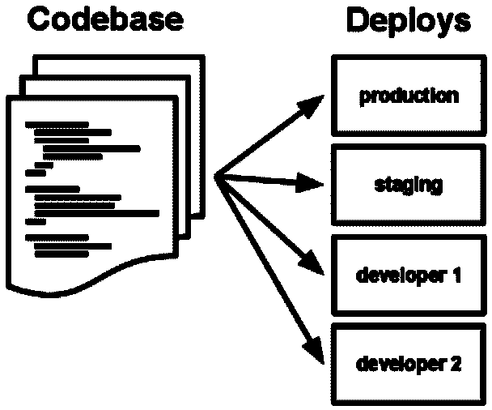

# 12 因素应用#1:为什么无服务器版本控制至关重要

> 原文：<https://thenewstack.io/12-factor-app-1-why-serverless-version-control-is-critical/>

Stackery 赞助了这篇文章。

 [托比·费

Toby 是 Stackery 的社区开发人员。她的角色和经历结合了软件工程师、作家和技术讲师的工作，用新兴工具构建有趣的项目，并与世界分享她的发现。在加入 Stackery 之前，Toby 是 NWEA、瓦卡萨和新遗迹公司的工程师。](https://www.stackery.io/) 

在[的十二要素应用](https://www.12factor.net/)中描述的原则已经开始指导大多数现代开发和运营，不管它们是否受到 it 的直接影响。符合 12 因素原则的应用程序应该更可靠，更易于维护，并为新开发人员和团队过渡提供更清晰的路径。

本系列(这是第一部分)将探索这 12 条原则中的每一条，以及你的无服务器应用程序如何最好地服务于它们。我们将讨论 Amazon Web Services (AWS)之外的各种工具，这些工具可以作为 AWS 的替代品或者增强 AWS 过程。

这些文章是为初学者而写的，但是希望即使是精通 DevOps 的有经验的代码女牛仔也能找到一些有用的信息。

## 原则 1:你的代码库应该由版本控制来管理。

这个原则偶尔会被误解为“使用 Git ”,但是这里有两个错误:

*   选项比 git 和 GitHub 多；
*   有很多方法可以使用任何类型的版本控制，这些方法并不真正符合这个设计原则。

### GitHub 之外的选项

管理你代码的工具比 [git](http://git-scm.com/) 多，比如 [Mercurial](https://www.mercurial-scm.org/) 或者 [Subversion](http://subversion.apache.org/) 。而且如果你决定用 git，也不一定要用 GitHub。GitHub 是为你的应用程序存储代码和版本跟踪信息的一个可能的服务(你的代码库或者仅仅是“repo”)。您可以运行一个本地 git 服务器，直到 2005 年左右，大多数使用版本控制的企业都是这样做的——许多企业仍然这样做！在领先的 GitHub 之后，GitLab 是下一个最受欢迎的选项，但 AWS 也有 CodeCommit，让您可以将代码存储在与无服务器堆栈相同的位置。

版本控制工具的任何特定实现都不会破坏这一设计原则。即使您的回购没有存储在任何地方，而是存储在您自己的笔记本电脑上的虚拟版本控制服务器上，您仍然可以跟踪变更。对于无服务器，当其他一切都在高度管理的云环境中时，使用私有裸机服务器进行版本控制没有什么意义。

使用来自 AWS 的 CodeCommit 使部署对您的 Lambdas 的更改稍微容易一些，或者如果您想自动将 git 与您的无服务器堆栈更紧密地集成，这里有一篇关于使用简单的无服务器堆栈从 GitHub(‘web hooks’)获取通知的文章[。](https://www.stackery.io/blog/webhooks/)

## 是代码库，不是代码库:定义一个应用程序

让你的应用程序工作的代码需要存储在一个单独的存储库中。等等，什么是 app？我们突然开始谈论电话了吗？“应用程序”这个术语有很多含义，要么是:

*   一个移动“应用程序”,作为一般访问网络的方式，而不是使用手机浏览器；
*   某种在服务器上运行的代码。

我们指的是第二项，这显然是一个非常模糊的概念。对购物结果进行排序的机器学习算法是 app 吗？数据库服务呢？但是我们从这些问题开始讨论代码库，代码库可以帮助我们定义。一个应用程序是一个单独运行的代码库。

如果你依赖于运行来自两个不同代码库的代码，你就有了两个应用程序！如果这些服务非常、非常紧密地联系在一起，并且在同一个服务器上没有彼此就无法运行，那么你就有可能没有真正遵循 12 因素，你应该考虑将所有代码转移到一个应用程序中。

## 每个应用一个代码库:我们不应该重用代码吗？

使用相同代码库的多个应用程序也不符合 12 因素。如果你有一个完整的独立节点 Lambda，它执行长时间运行的任务，并且不与你的其他函数通信，你把它放入同一个代码库中，你的库现在负责几个不相关的服务，因此有一些关键的漏洞。

如果一个代码块被多个其他代码库重用，你应该像对待你的应用程序和其他依赖一样对待它，把它打包成一个库。如果你需要帮助封装单个无服务器函数的代码，以便在多个其他栈上使用，这对于 [Stackery](https://www.stackery.io/) 工具包来说是一个很好的应用。

## 为什么这个原则至关重要？

想象一下:你给了你的一个开发人员访问代码回购的权限，他们在第一天提交了一些变更，第二天早上整个独立的团队都睡眼惺忪，因为新的开发人员不小心通过更改他们代码所依赖的包版本破坏了他们的服务。开发人员的噩梦——或者至少是疲惫和烦恼！

## 我有三个应用程序:“生产、暂存和开发”

这种困惑是可以理解的！当我们在临时服务器和生产服务器上重用代码时，这两个应用程序不是分开的吗？不完全是，那是两个部署(有些人会说‘部署’，虽然我并不在乎)。

From 12factor.net

根据原则 3:在环境中存储配置和 10: Dev/Prod 应该尽可能相似，这更有意义。代码库不应该在这多种环境之间改变或变异。

### 无服务器中的特殊问题

无服务器有可能以特殊的方式违反这一原则。如果你制作第一个 AWS Lambda 无服务器功能的过程是到 Lambda 仪表板，在 Lambda UI 中添加一些代码并进行部署，那么你就从根本上违反了这个原则。Lambda 的代码现在只存储在 AWS 接口中(从您团队中开发人员的角度来看),与您的版本控制系统没有任何关系！

关于配置和存储的处理，后面的原则更清楚地揭示了这一点。这个问题可以扩展到 Lambda 代码之外，通常被描述为“你的应用程序的关键部分存储在配置 UI 中的某个地方，并且必须随着你的代码库被手动复制以复制应用程序。”

AWS 的优秀员工对这个问题并不陌生，他们有很多解决方案。Lambdas 可以配置为直接使用来自版本控制库的代码，更一般地说，AWS CloudFormation 能够将所有配置存储为代码。

在 AWS 之外，这个需求已经被作为代码为的“[基础设施”来追求](https://en.wikipedia.org/wiki/Infrastructure_as_code)

## Stackery 能帮上什么忙

当您第一次进入 Stackery 时，您会看到一个易于操作的画布，它允许您拖动并连接无服务器功能到存储、Cognito 和 API 网关等。最重要的是，只需轻触按钮，您就可以将所有这些部署到 AWS。这是让您的第一个无服务器应用程序启动并运行的简单而有趣的方式。

但是在创建第一个堆栈之前，Stackery 的 UI 会要求您指定一个代码库。所有漂亮的图形工具实际上都是作为代码存储在您控制的存储库中的。Stackery 使用[无服务器应用模型(SAM)](https://docs.aws.amazon.com/serverless-application-model/latest/developerguide/what-is-sam.html) 为您的应用堆栈创建模板。

虽然无服务器可以促使您使用更具可复制性、更精简的 12 因素流程，但工具和规划是确保您的无服务器应用程序不会比您的旧平台引起更多开发摩擦的关键。Stackery 将继续努力使这一过程变得更容易，未来的文章将探索这 12 个设计原则中的更多内容，以及如何从一开始就保持一致。

阅读本系列关于[无服务器依赖和配置](/12-factor-app-2-3-serverless-dependencies-and-configuration/)的第二篇文章。

通过 Pixabay 的特征图像。

<svg xmlns:xlink="http://www.w3.org/1999/xlink" viewBox="0 0 68 31" version="1.1"><title>Group</title> <desc>Created with Sketch.</desc></svg>