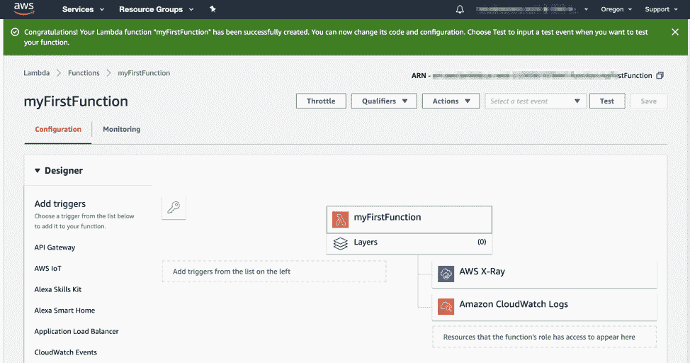
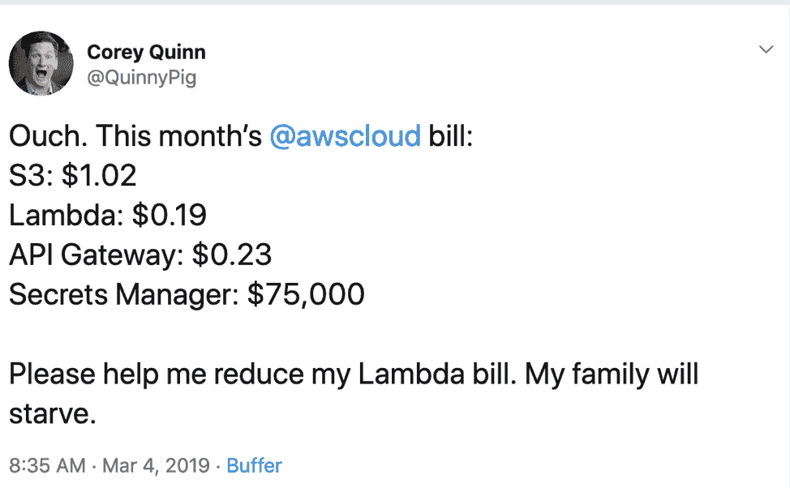

# 12 因素应用程序#2/#3:无服务器依赖项和配置

> 原文：<https://thenewstack.io/12-factor-app-2-3-serverless-dependencies-and-configuration/>

Stackery 赞助了这篇文章。

*这个[系列文章](https://thenewstack.io/12-factor-app-1-why-serverless-version-control-is-critical/)探讨了我们需要做些什么来遵循一个 [12 因素 App](https://12factor.net/) 的设计需求，以便于开发和维护。请每周查看未来的分期付款。*

 [托比·费

Toby 是 Stackery 的社区开发人员。她的角色和经历结合了软件工程师、作家和技术讲师的工作，用新兴工具构建有趣的项目，并与世界分享她的发现。在加入 Stackery 之前，Toby 是 NWEA、瓦卡萨和新遗迹公司的工程师。](https://www.stackery.io/) 

这周我和一个朋友兼同事喝了咖啡。她正在对一个相当老的软件即服务(SaaS)产品进行彻底的重新设计(从 SaaS 的角度来说是老的，但在八年前还是新的)。我一开始就问她是否会将这些东西转移到无服务器微服务中。她的回答令人大开眼界。

她是这样说的:“现在，我担心无服务器的开发令人沮丧，并且在生产中很难维护。”

这在我听来几乎是倒退。无服务器意味着消除麻烦，将顾虑转移给值得信赖的供应商，有更多的时间开发新功能，对吗？对吗？

但是在这里，我们来到了我在撰写关于无服务器应用的关键决策时谈到的基本思想:没有两个无服务器应用是完全相同的，并且您做出的设计决策极大地影响了您使开发人员的生活变得困难或容易。

无服务器应该是一个让开发体验*更容易*而不是更困难的选择，遵循这些指南会有所帮助。

不可或缺的[克里斯·芒恩斯](https://twitter.com/chrismunns)去年写了一篇关于 [12 因素](https://12factor.net/)方法论[中哪些适用于无服务器](https://aws.amazon.com/blogs/compute/applying-the-twelve-factor-app-methodology-to-serverless-applications/)的文章:

我最初计划写一篇关于六到七个仍然适用的因素的文章，但是有些文章很短，比如第二个因素。所以，我会把一些放在一起。这里我们得出两个密切相关的结论:依赖关系和配置。

## 因素 2:显式声明和隔离依赖关系

我们仍然看到一些 web 应用程序需要安装 C++ ML 库来进行图像识别，或者在一些长时间运行的任务中执行一些快速 curl 命令。这些应用程序需要在运行它们的机器上安装软件，如果你试图在干净和最小化的操作系统上运行它们，它们将会失败(没有 curl 的服务器？它已经发生了。

但是自从 Rails 出现以来，用一个点来列出一个应用程序的所有依赖项已经变得更加标准了。对于容器和无服务器，这是一个绝对的要求。没有一个聪明的操作向导可以偷偷溜进你的容器并安装那些没有列在依赖项中的东西。如果你试图使用没有列在依赖项中的包，像 Lambdas 这样的无服务器函数只会返回错误。

对于无服务器应用程序来说，满足这一要求的唯一方法是让它在执行过程中发出一些实际上的控制台命令。我只熟悉恶意代码执行导致的这种行为(参见[杰瑞米·戴利的文章](https://www.jeremydaly.com/event-injection-protecting-your-serverless-applications/))。简单来说:*不要从你的 Lambdas 内部运行控制台命令；你会让你的团队头疼，可能会打破现实。*

## 因素 3:在环境中存储配置

在我们继续之前:什么是配置？从开发到试运行，再到生产环境，配置会发生变化。将应用从一台服务器移动到另一台服务器时，您需要更改的任何代码或设置都是 config。

这条规则更多的是关于如何不存储配置，而不是关于存储配置的确切方式。也就是说:你不应该在你的代码库中存储配置，无论是在你的代码中间还是在服务器上某个单独的“配置文件”中。萨姆·戈尔茨坦对人们试图为你的无服务器应用程序存储秘密时所犯的错误做了一个很好的评论。

理想的 12 因素应用程序将配置存储在环境变量中。这些很容易在部署之间改变，不需要改变任何代码；与配置文件不同，它们被意外签入代码仓库的可能性很小。

如果你处于“我的第一个 Lambda”阶段，使用这个 UI 是没问题的，但是在那之后就不好了。

对于 AWS Lambdas，有一个 UI 允许您添加代码运行时可用的环境变量，但是使用这个 UI *违反了这个设计原则*,原因有二:

*   你的 Lambda 不再便携了。要尝试在暂存中运行它(并访问暂存数据库)，您必须编辑这些变量；
*   在大多数实际情况下，这种配置的存在是隐藏的，没有对这些变量的更改跟踪，它们在任何地方都没有明确的依赖关系，事实上，当数据库表名发生更改时，它们需要更新。

AWS 确实有内部工具来以更常规的方式处理这个问题，包括他们相对昂贵的 [AWS Secrets Manager](https://aws.amazon.com/secrets-manager/) 。

Stackery 还有一个干净的环境配置工具，可以让你把环境配置和你的栈的代码库分开存储*和*在多个配置上重用环境。

## 下一步是什么？

在我的下一篇文章中，我们将在“后台服务”的 12 因素应用程序设计之旅中讨论一些真正的内容当环境比这丰富得多的时候，那么多的无服务器是集中在功能上。下个月找第三篇！

通过 Pixabay 的特征图像。

<svg xmlns:xlink="http://www.w3.org/1999/xlink" viewBox="0 0 68 31" version="1.1"><title>Group</title> <desc>Created with Sketch.</desc></svg>