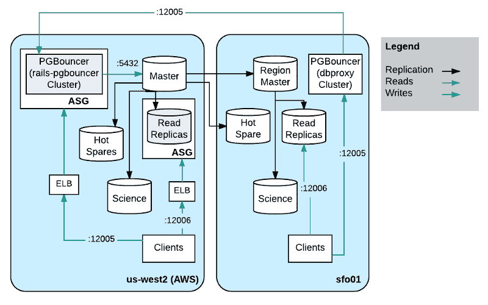

# 二十岁的 PostgreSQL 在大数据时代依然保持活力

> 原文：<https://thenewstack.io/20-postgres-still-sign-times/>

即使像谷歌的云扳手和 TiDB 这样的新数据库系统出现了，有 20 年历史的开源软件 T2 的 PostgreSQL T3 似乎还在坚持。

在二月份的[最受欢迎数据库](http://db-engines.com/en/ranking)排名中，关系数据库系统在[数据库引擎](http://db-engines.com)中排名第四，仅次于甲骨文、MySQL 和微软 SQL Server。

作为其最大的支持之一，亚马逊在去年年底为 AWS Aurora 数据库添加了 [PostgreSQL 支持，使得将 Oracle 数据库迁移到 AWS 云变得更加容易。](http://www.cloudpro.co.uk/cloud-essentials/public-cloud/6503/aws-adds-postgresql-compatibility-to-amazon-aurora)

“商业级数据库是专有的、昂贵的，并且需要供应商锁定。建筑商不喜欢这样，这就是为什么企业一直在尽可能快地转向开源[选项]，如 MariaDB、MySQL 和 PostgreSQL，”AWS 首席执行官安迪·杰西(Andy Jassy)当时说。

直播流媒体视频平台 [Twitch](https://www.twitch.tv/p/about) 的高级数据工程师 [Aaron Brashears](https://www.linkedin.com/in/aaron-brashears-49107619/) 写了关于[社交媒体平台如何使用 PostgreSQL](https://blog.twitch.tv/how-twitch-uses-postgresql-c34aa9e56f58#.8tahto97q) 来处理其大部分[在线事务处理](https://www.techopedia.com/definition/24436/online-transaction-processing-oltp) (OLTP)工作负载。

“Twitch 拥有大约 125 台数据库主机，为生产中的 OLTP 工作负载提供服务，通常作为集群的一部分。大约 4%的人运行 MySQL，2%的人运行 Amazon Aurora，其余的运行 PostgreSQL。“我们管理几个数据库的资源调配、系统映像、复制和备份，尽管大多数新群集都是针对 PostgreSQL 的 RDS。”

Twitch 如何使用 PostreSQL(点击了解更多信息)。

最近，柏林的自由开发者 Rene Dudfield 写了一篇文章，介绍了将该技术用于关系数据之外的 T2 的利与弊，包括实时变化提要、时间序列、对象存储、文档存储、全文搜索等等。

他写道:“我非常确定 PostgreSQL 是一个最小工具选择和瑞士军刀工具选择的某种组合，形状像一只蓝色的实心大象。”

## 庆祝

PostgreSQL 是从加州大学伯克利分校的 Ingres 项目发展而来的，去年庆祝了其第一个开源版本发布 20^(20)周年。

“在某些情况下，例如，Hadoop 或 Cassandra 是存储某些数据(IOT 数据)的最佳位置，这取决于卷，或者出于历史原因，您将数据存储在其他地方。现在您可以做一个 MapReduce 工作，通过外部数据包装器将它公开到 Postgres 中。在 Postgres 里面，你可以查询，可以写报告。EnterpriseDB 的产品开发高级副总裁马克·林斯特说:“这真的实现了一个多语言数据模型，在这个模型中，你可以在多个不同的地方拥有数据，并以一种有组织的方式处理这些数据。”enterprise db 赞助了开源项目，并提供专注于大规模使用的 PostgreSQL 商业发行版。

虽然 PostgreSQL 已经存在很长时间了，但据 Linster 说，它并没有过时，他指出了一些特性，如用于文档存储的 JSON-B 和用于地理信息系统的后 GIS 功能。

“从浏览器到数据库，一直到堆栈，你都可以使用 JSON-B。其他数据库要求你为移动浏览器解构文档，然后从零碎的部分进行处理。在 Postgres 中，你可以使用整个文档，”林斯特说。

他认为它的通用特性是它的优势之一。

“在 Postgres 中，你可以从无结构开始，但当你发现它时，你可以使用结构。想想这有多强大:我可以从表和关系开始，但我也可以从我还不知道我的结构会是什么样的领域开始。我可以有一个联系人字段，这是一个 JSON 字段，可以在该字段中记录多个电话号码和多个电子邮件地址。随着应用程序的成熟，我可能会提取一些信息或者开始以不同的方式管理它，但是我可以从非结构化开始。我可以决定，我的一些数据将保持非结构化，一些数据将严格结构化，”他说。

在 [PostgreSQL 9.5](https://thenewstack.io/postgresql-9-5-geared-liberate-enterprises-data-warehouse/) 中，数据库项目更接近于将数据分析与传统数据库相结合，这些功能以前被认为需要单独的系统。但是, [Gartner](http://www.gartner.com/technology/home.jsp) 分析师 [Massimo Pezzini](https://twitter.com/mpezziniGartner) 表示，“真实的情况是[ [混合交易/分析处理](http://www.enterpriseappstoday.com/data-management/how-htap-database-technology-can-help-you.html)或 HTAP]正在成为主流”，他指的是硬件成本的降低和司机之间实时分析的业务需求。

PostgreSQL [版本 9.6](http://www.prnewswire.com/news-releases/new-community-version-of-postgresql-96-boosts-performance-with-parallel-query-and-vertical-and-horizontal-scalability-features-300336537.html) 增加了并行处理能力，使用多个 CPU 内核来加快涉及大量数据的查询的响应时间。对冻结映射的增强消除了对某些数据块的多次数据扫描，减少了 I/O 开销。这些增强进一步增强了其扩展能力。

上周， [EnterpriseDB](https://www.enterprisedb.com/) 结合其企业 PostgreSQL 平台的[发布，发布了一个适配器，称为外部数据包装器(FDW)，用于兼容 Apache Spark 的 Hadoop。新版本 HDFS_FDW 可以从 EDB PostgresData Adapters 网页或 EnterpriseDB PostgreSQL](http://www.dbta.com/Editorial/News-Flashes/EnterpriseDB-Releases-EDB-Postgres-Platform-2017-116384.aspx)[GitHub](https://github.com/EnterpriseDB/hdfs_fdw)页面下载。

数据包装器允许你从 PostgreSQL(也称为 Postgres)内部连接到远程系统，然后从其他数据库读取和写入数据，并像在 PostgreSQL 数据库内部一样使用它， [Citus Data 的](https://www.citusdata.com/) [Craig Kerstiens](http://www.craigkerstiens.com/2016/09/11/a-tour-of-fdws/) 在 [FDWs](https://wiki.postgresql.org/wiki/Foreign_data_wrappers) 上的一篇帖子中解释道。

它们允许 PostgreSQL 查询包括来自多个来源的结构化或非结构化数据，如 NoSQL 数据库和 [Hadoop 分布式文件系统](https://www-01.ibm.com/software/data/infosphere/hadoop/hdfs/) (HDFS)，就好像它们在单个数据库中一样。

新版本使组织能够使用 Apache Spark 接口，将基于 HDFS 的分析工作负载与 PostgreSQL 中的运营数据结合起来。

## 未来展望

根据 EnterpriseDB 副总裁兼首席数据库架构师 Robert Haas 的说法，在 9.6 版本和预计于 2017 年第三季度发布的 10 版本中，社区正在努力最大限度地利用 PostgreSQL 的硬件资源。

“我们希望努力确保你可以使用 Postgres 的所有硬件资源。这曾经是一个瓶颈。我们内部锁定的方式将会有所改进，从而带来更好的并发性，这样你就可以给系统带来越来越重的负载，”他说。

他说，该项目需要具备核心能力，这样任何人都可以创建外部数据包装器，与 Spark 或 Hadoop 等其他数据源进行对话

“要做的一件重要事情是将尽可能多的工作推送到远程服务器。如果有人对他们看到的表发出复杂的查询，您不希望从远程端取回表，然后在本地进行处理。你想把尽可能多的计算推到远端，因为这样效率会更高，”他解释道。

“你在 9.6 中看到的，以及在 10 中甚至会看到的，是外来数据包装器的作者将越来越多的计算推送到远程服务器的能力增强了，从而将 PostgreSQL 变成了一个数据中心。在 9.6 中，如果数据包装器支持，我们现在支持将连接和聚合下推到远程服务器。”

逻辑复制将在版本 10 中推出。他说，物理复制现在已经在几个版本中可用，这促进了高可用性，但逻辑复制意味着在不同类型和版本的数据库系统之间复制行。它允许您复制单个表，而不是整个数据库。

下一版本将包含大量并行工作，允许基础架构和功能扩展到新的用例。

“我们正在做更多的工作来减少锁定瓶颈，一旦我们克服了锁定瓶颈，我认为将会有更多的工作来提高原始性能，其中一些性能的提高需要对底层代码进行重大重构，”他说。

特征图片:[凯伦·考克斯](https://www.flickr.com/photos/7374469@N02/)的《大象与玫瑰》，授权于**下 [CC BY-SA 2.0](https://creativecommons.org/licenses/by/2.0/)** 。

<svg xmlns:xlink="http://www.w3.org/1999/xlink" viewBox="0 0 68 31" version="1.1"><title>Group</title> <desc>Created with Sketch.</desc></svg>