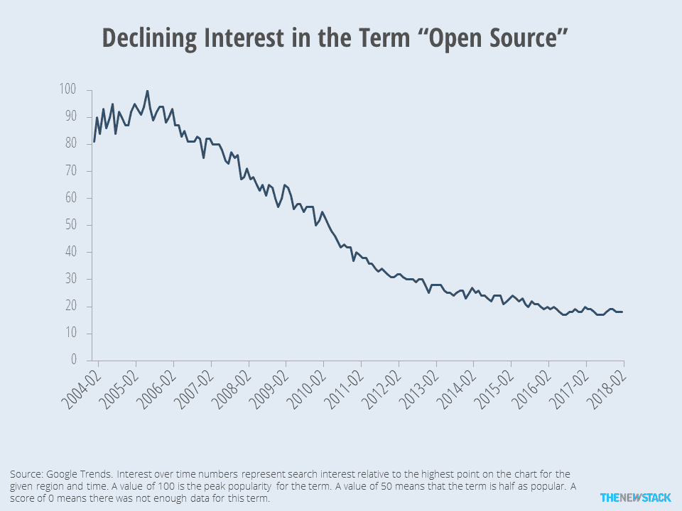

# 20 年过去了，人们对“开源”的兴趣正在下降

> 原文：<https://thenewstack.io/20-years-interest-open-source-declining/>

几乎每个人都在某种程度上使用[开源软件](/tag/open-source/)，无论是运行在 Linux 上的 web 服务器还是 Android 手机。“开源”一词 20 周年快乐。

开源是如此普遍，以至于人们对这个术语的兴趣急剧下降。Google Trends 追踪从 2004 年开始的各种搜索词的相对兴趣。根据这个数据，对开源的兴趣在 2005 年达到顶峰。那段时间发生了什么？我们不确定，但这可能是“开源”和“闭源”争论的高峰。对话变得更加微妙，共识是开源通常可以提供低成本、安全的软件选项。

这是否意味着“开源”已经失去了意义？由一封来自“传统”甲骨文游说者的信引起的[争议](https://www.theregister.co.uk/2017/10/12/oracle_must_grow_up_on_open_source/)表明，如果每个人都支持开源，也许没有人支持它。换句话说，如果你在你的软件中使用一些开源组件，并给自己贴上开源的标签，这意味着什么吗？

展望未来，我们将继续跟踪开源软件的兴趣和采用情况。然而，询问“你的公司使用开源吗”的调查是不相关的。相反，新的堆栈感兴趣的是知道有多少百分比的组件是开源的。或者更好的是，软件预算中用于许可、定制开发和维护的百分比。同样，我们期待类似 GitHub 所做的[那样的研究，提供关于个人参与开源项目程度的细节。一如既往，如果你有关于这个主题的好数据，](https://opensourcesurvey.org/2017/)[请分享](mailto:editorial@thenewstack.io)。

通过 Pixabay 的特征图像。

<svg xmlns:xlink="http://www.w3.org/1999/xlink" viewBox="0 0 68 31" version="1.1"><title>Group</title> <desc>Created with Sketch.</desc></svg>