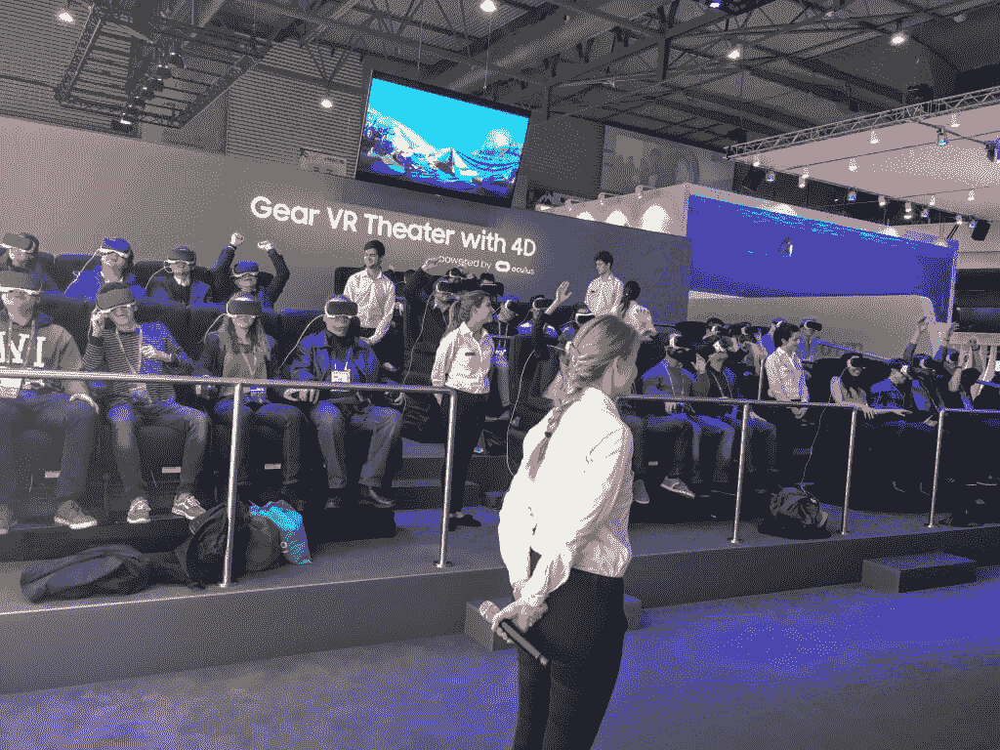
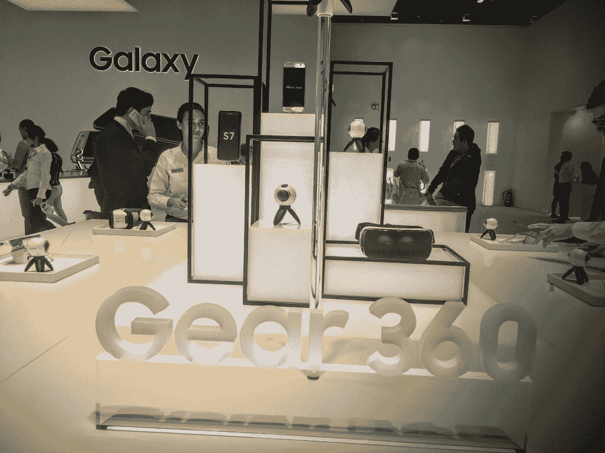
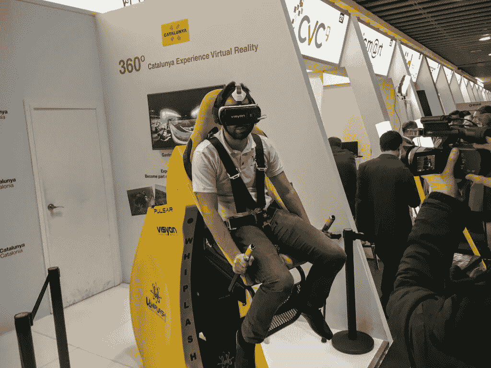
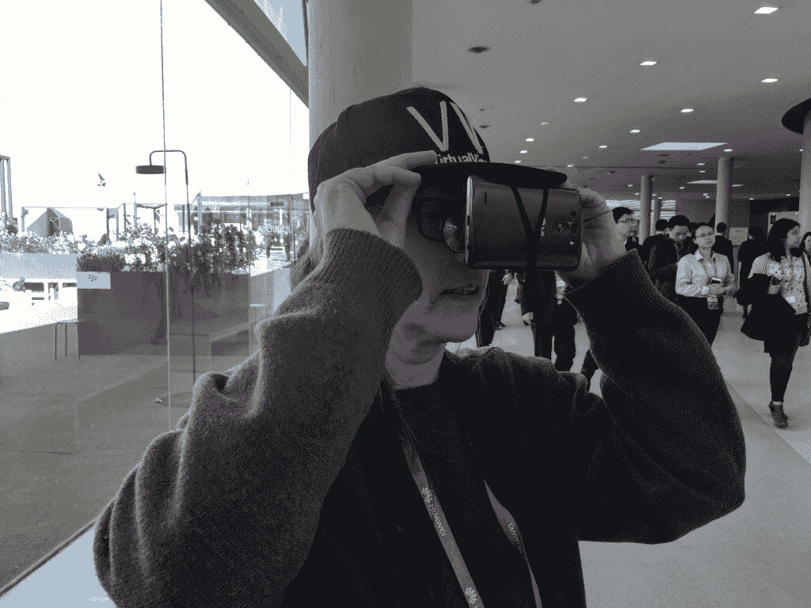
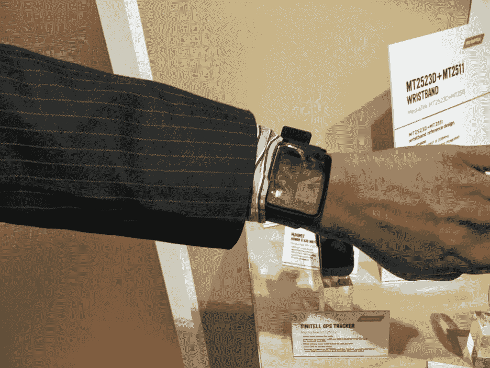

# 2016 年世界移动通信大会是关于虚拟现实的

> 原文：<https://thenewstack.io/2016-mobile-world-congress-virtual-reality/>

看来今年我们要正式拒绝现实了。它不再只是一个应用程序，还有一个完整的虚拟现实体验。虽然本周在巴塞罗那举行的 2016 年世界移动通信大会的官方主题是荒谬的广泛，“移动就是一切”，但它实际上是关于虚拟现实的虚拟移动性，它可以带你从几乎任何地方到任何地方。

作为移动世界的开端，脸书首席执行官马克·扎克伯格说:“虚拟现实是下一个平台。”不管是好是坏，它也是下一个社交网络。

毫无疑问，本周巴塞罗那最大的名字是三星。它不仅推出了旗舰智能手机 Galaxy 的 S7 版本，在他们的 MWC 展台和加泰罗尼亚广场(plaa Catalunya)设立了一个弹出式商店，排队长达数小时，所有这些都是为了虚拟乘坐六旗加州的扭曲巨像。从尖叫声和笑声来看，显然没有什么是垂直的，因为成千上万的人实际上经历了桶式翻转和近乎垂直的下落。

可爱的 Gear 360 用 3000 万像素的双摄像头以 360 度视角记录了这段旅程。三星的普拉纳夫·米斯特里说:“因为世界不在一个方向，世界就在我们周围。”

一旦材料被记录在你的 Gear 360 上，任何人都可以通过将 Galaxy 智能手机(Note 5 及更高版本)接入轻型三星 Gear VR 并开始观看来观看它。它的价格大约为 150 美元，当然，还要加上电话和 3d 摄像头。最酷的部分可能是，对于那些戴眼镜的人来说，它有可调节的镜片作为眼科医生，所以你不必在眼镜上面放一个大的护目镜来观看。

当然，由于它得到了脸书旗下 Oculus 的支持，虚拟现实最酷的部分可能不是我们去哪里，而是我们可以和谁一起去，因为扎克伯格希望利用它来创建“最社会化的平台”

虽然三星将过山车塞进 20×10 的展台是今年大会上最闪亮的东西，但它肯定不是唯一的 VR 明星。

虽然 Gear 360 的价格适合普通人，但彼得·杰克森可能会买几台[诺基亚的 OZO 360 摄像机](https://ozo.nokia.com/)用于*阿凡达 II* ，它有八个镜头，高清，环绕声麦克风，价格约为 6 万美元。

HTC 还预览了下周发布的 [Vive](http://www.htcvive.com/eu/) ,这款手机的售价为 799 美元，是游戏玩家的最佳选择。它配备了许多笨重的硬件，连接到各种电缆和无线控制器，你必须安装一对运动跟踪基站。它看起来很有前景，但如果便宜得多的 Kinect 没有成功，我们不确定这款会成功。

加泰罗尼亚自治区的旅游部门甚至与 Whiplash 合作加入了这款游戏，Whiplash 是一款单人呕吐派对游戏，让人们在虚拟现实游览巴塞罗那时颠倒过来。

虚拟现实无处不在。在去洗手间的时候，我甚至碰到了一些家伙，他们只是穿着我认为是虚拟现实版的自拍杆在会议上走来走去。你可以将任何智能手机夹在你的 VisualVizor 虚拟现实眼镜上——这是你在 IMAX 上摇晃的镜片——然后把它绑在棒球帽上。正如你在下面的测试机上看到的，它让谷歌眼镜看起来很温和，但是，嘿，10 美元和一部免费的 IMAX 电影，你有什么损失呢？

这不仅仅是虚拟的，我们也在增强现实。

虚拟现实带你去一个完全不同的地方，而增强现实让你看着正前方，以不同的方式看待它，就像《黑客帝国》一样。

我甚至看到有人在玩一种安静得多、不那么令人焦虑的叠人龙游戏，这是他在舞台上增强现实的一部分。

不要忘记那些让我们的虚拟体验完全脱离手的配件和可穿戴设备，比如[拥抱创新](http://www.huginnovations.com/index.php)‘令人印象深刻的直观智能手表，它遵循正常的人类行为和手势来执行简单的命令，如控制收音机、玩视频游戏或让护士的手远离手术室最恶心的部分，即计算机。

当然，还有苹果公司，它总是无处不在地缺席移动设备的最大会议，但我们不能不提他们将很快在虚拟或增强现实世界推出[重大产品的传言。](http://www.macworld.co.uk/feature/apple/apple-virtual-reality-release-date-rumours-features-leaks-patents-2016-tim-cook-flyby-media-vr-lab-stanford-3601447/)

虽然游戏和旅游行业是第一批 VR 头条新闻，但很快虚拟和增强现实将变得更有影响力，而不是好玩。事实上，联合国已经在“Cidra 上空的云”中使用了虚拟现实，通过约旦难民营中一个年轻的叙利亚女孩的眼睛讲述了难民的生活。

VR 和 AR 的可能性似乎是无穷无尽的，而且相当引人注目。当教育系统赶上科技时，我们可以通过尼尔·阿姆斯特朗在月球上的第一步或在伟大的金字塔中漫步来身临其境。如果世界顶级医师能够模拟世界上最偏远地区的可用资源，他们就可以向这些乡村医生传授救生技术，提供第二好的实时亲身体验。

想象一下电影行业或者色情行业会发生什么。虚拟和增强现实甚至有可能让董事会议变得更有吸引力。在接下来的几年里，通过改变我们每天看的东西，进入我们情感和记忆的核心，商业和娱乐的每个领域都将发生变化。

或者，就像成千上万的世界移动通信大会的与会者一样，我们会开始看起来像健忘的白痴一样，四处乱撞，相互碰撞，错过我们周围的真实情况吗？

<svg xmlns:xlink="http://www.w3.org/1999/xlink" viewBox="0 0 68 31" version="1.1"><title>Group</title> <desc>Created with Sketch.</desc></svg>