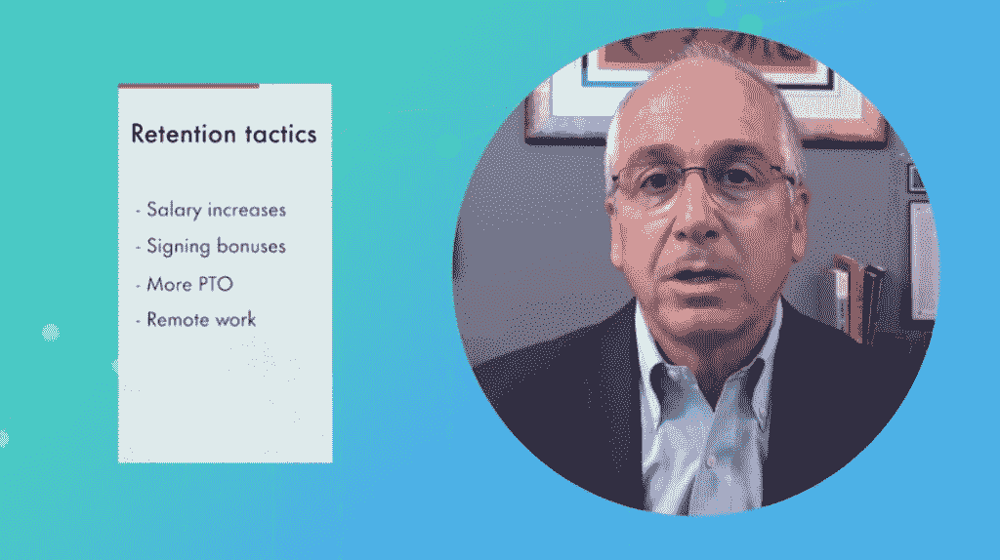
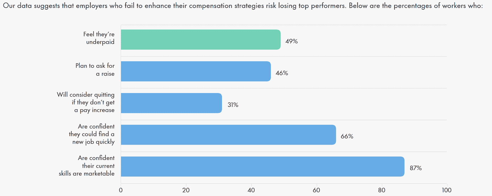
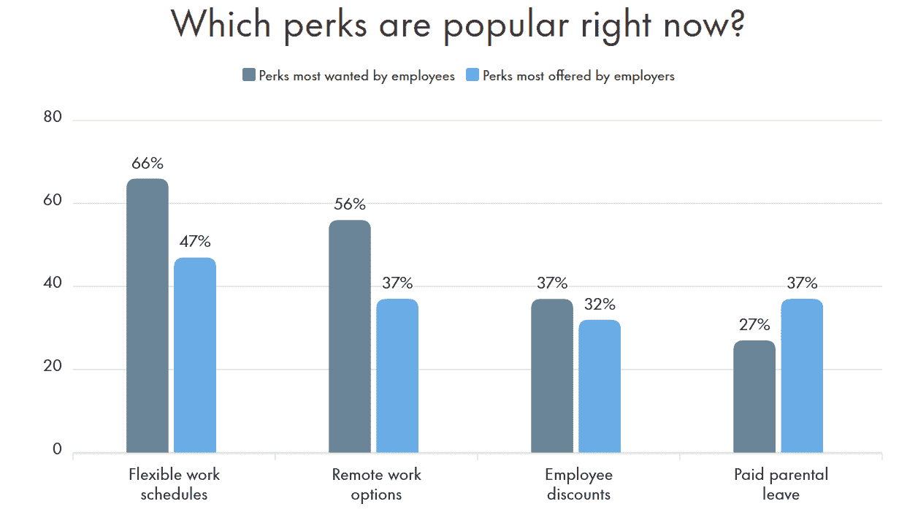
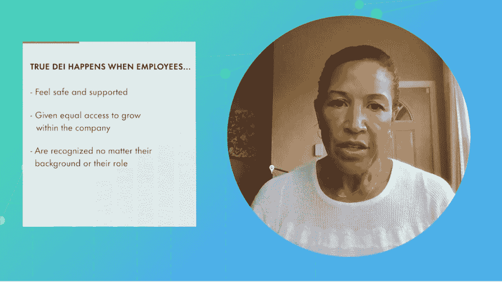

# 研究称，2022 年，1/2 的科技雇主将增加新工作

> 原文：<https://thenewstack.io/2022-tech-salary-job-market-projections-recruiter-robert-half/>

这是与众不同的一年——但是 2022 年我们的薪水会受到什么影响呢？2021 年的混乱是否创造了任何可能延续到未来一年的意外趋势？

人力资源咨询公司 Robert Half 已经做了 70 多年的薪酬报告，并发布了自己的预测。总的来说，[的年度薪酬指南](https://www.roberthalf.com/salary-guide/)的调查结果反映出对具有[云计算](https://thenewstack.io/category/cloud-native/)、[人工智能/机器学习](https://thenewstack.io/category/machine-learning/)和[数据](https://thenewstack.io/category/data/)分析(以及[网络安全](https://thenewstack.io/category/security/)和数据隐私)经验的工人的持续高需求。

此外，52%的科技雇主表示他们正在增加新的职位。

该调查还预测，2022 年平均工资增长 3.8%——基于今年夏天收集的数据，此时美国通胀率开始快速攀升，在截至 11 月的 12 个月中达到 6.8%，为近 40 年来最高。

但根据罗伯特·哈尔夫的报告，一些专业的工资涨幅预计将高于整体平均水平。例如，研究人员预计数据库管理员的平均起薪将增长 6.9%，前端开发人员的平均起薪将增长 6%。

《薪资指南》允许读者搜索特定城市与全国平均水平的差距。例如，在纽约市，工资比全国平均水平高出+40.5%。(而俄勒冈州的波特兰比全国平均水平高 11%，匹兹堡低 2%，塔尔萨低 7%。)也可以按职位和职业阶段以及地点搜索。

今年早些时候，该公司创建了一个详细的在线调查，然后由独立的研究公司进行。在 6 月至 7 月期间，它收集了 2800 多名高级经理的回应，不仅涉及技术领域，还涉及财务、法律、营销和行政支持等领域，涉及至少 20 名员工的公司。

此外，该公司还在八月中旬调查了 1000 多名工人。调查结果预测了 500 多个职位的起薪和就业趋势，其中包括几个科技领域的职位。

“受访者包括美国各地小型(20-249 名员工)、中型(250-499 名员工)和大型(500 多名员工)私营、上市和公共部门组织的高管、高级经理和员工，”Robert Half 的研究人员在他们的报告中解释道。

那么，这份报告对未来一年还有什么预测呢？

## 薪酬最高的 IT 工作

特别令人感兴趣的是该报告列出的[15 个薪酬最高的 IT 职位](https://www.roberthalf.com/blog/salaries-and-skills/the-13-highest-paying-it-jobs-in-2019)，其中除了网络/云架构师(和网络/云工程师)，还有一个单独的大数据工程师职位。“企业需要能够将大量原始数据转化为可操作信息的个人，以用于战略制定、决策和创新，”[罗伯特·哈尔夫的一篇博文](https://www.roberthalf.com/blog/salaries-and-skills/the-13-highest-paying-it-jobs-in-2019)中写道。

这些专业人员通常会创建公司的软件和硬件架构，以及人们处理数据所需的系统薪资中点:141500 美元。

薪酬最高的 15 个 IT 职位中还有 [DevOps](https://thenewstack.io/category/devops/) 工程师，“编码和工程之间的桥梁”(中点薪酬:125750 美元)。在其他地方，调查将云经验列为最受欢迎的技能之一(无论是 AWS、Azure 还是谷歌)。两个最受欢迎的认证是 AWS 云从业者和微软 Azure 认证。

对其他类型的开发人员仍有大量需求。另一个表格还提供了罗伯特·哈尔夫针对具体职位的薪酬指南[，分为“网络开发”以及“安全”和“网络和云”等类别。](https://www.roberthalf.com/salary-guide/specialization/technology)

该报告显示，对软件和应用开发商的需求尤其高。以下是在第 75 个百分位数中拥有高于平均水平的经验(和所有合适的技能)的候选人在所选职位中的收入——与第 25 个百分位数中较低者(在括号中)的收入相比。

*   应用架构师:167633 美元(115553 美元)
*   移动应用开发者:152288 美元(106950 美元)
*   高级软件工程师:150893 美元(104160 美元)

## 竞争激烈的招聘环境

今年，工作场所摆脱了停工期，展望未来——罗伯特·哈尔夫(Robert Half)的薪酬指南清晰而响亮地指出了这些信号。80%的技术经理表示，他们公司的人员流动正在增加；经理们表示，他们正在招聘科技专业人士，“达到或超过疫情之前的水平”

在一段总结调查结果的视频中，罗伯特·哈尔夫的高级执行董事说，公司预计这种增加的招聘将持续到 2022 年。

[https://www.youtube.com/embed/zF5E8Gb9Gwc](https://www.youtube.com/embed/zF5E8Gb9Gwc)

视频

然而，整整 96%接受调查的科技领导者也抱怨说，找到强有力的求职者变得很有挑战性。

“我们调查的 66%的美国员工非常有信心，他们可以在今天的市场上很快找到工作，”麦克唐纳在视频中说，因此小公司和大公司最终会激烈竞争同一批人才。“在接下来的一年里，”他补充道，“我们怀疑这种情况会继续下去。”

Robert Half 高级执行董事保罗·麦克唐纳总结了该公司的 2022 年薪酬指南(通过 YouTube)

现在，公司正在尝试各种策略来适应。也许不可避免的是，48%接受调查的技术领导者表示，他们现在提供签约奖金，而其他人则试图提供现金奖励，甚至无限休假。

虽然调查显示 51%的美国公司计划扩大永久职位的招聘，但也发现 38%的公司计划在 2022 年增加使用合同劳动力。(45%的受访者表示，他们已经将专业合同工作为员工的主要组成部分。)

有趣的是，这也是工人们普遍接受的安排。在接受 Robert Half 调查的员工中，整整 39%的人表示，他们希望在下一次职业变动中从事合同工作(咨询或基于项目的工作)。

## 不加薪？我不干了。

Robert Half 的一篇博客文章直截了当地宣布“[员工要求加薪——或者他们可能会走人](https://www.roberthalf.com/blog/salaries-and-skills/salary-trends-for-2022-numbers-to-know)……在人才市场吃紧的情况下，员工有更多的选择，雇主必须提供有竞争力的薪酬、福利和津贴。”

甚至有统计显示，31%的员工会考虑不加薪就辞职，而更多的员工说他们觉得工资太低(49%)，46%的人肯定会要求加薪。

许多员工不打算回到办公室，因为他们已经尝到了在家工作的滋味:报告发现，现在远程工作的员工中有三分之一(34%)表示，他们不会留在不允许他们继续远程工作的公司。“工人们也想要灵活的时间表，比如弹性工作时间和窗口工作制，如果得不到这些，他们就会辞职。”

尽管值得一提，调查还计算出员工更喜欢平均每周三天的远程工作。

事实上，43%的人说他们比六个月前参加了更多的视频会议。调查甚至发现，员工的“总体”感觉是，超过三分之一的视频会议是浪费时间。

但好消息是，53%的科技企业表示，他们将根据他们的*公司*的所在地，而不是员工的所在地，来确定远程员工的工资。

## 令人垂涎的福利:灵活性、远程工作

调查还确定了员工最渴望的额外津贴，以及雇主实际提供的额外津贴。

“88%的人力资源经理表示，由于疫情，他们公司增加了新的福利，”该指南指出，并列举了额外的带薪探亲假和儿童保育援助，以及心理健康资源和健身会员等健康项目。(当然，还有家庭办公设备的津贴！)

但除此之外，“精明的科技公司和团队会为员工的职业发展报销费用，”报告建议，“包括认证和非学分大学课程。”这种做法不仅包括绩效，还包括保留率。

然而，调查发现，51%的员工想要退休储蓄计划——尽管调查中只有 46%的雇主提供这种计划。

## 增加多样性

谈到多元化、公平和包容(DEI)，93%的受访员工表示，他们对公司的努力至少有些满意。当被问及为什么感到满意时，30%的人说他们的公司在过去 12 个月中有所改善，28%的人说他们的公司用行动支持了他们的说法。

Robert Half 的 DEI 高级经理凯西琼斯(Kacey Jones)在谈到该公司 2022 年薪酬指南的调查结果时表示。(通过 YouTube)

72%接受调查的高级经理表示，在过去五年中，他们的领导阶层的多元化程度有所提高。32%的人在寻找候选人时与 DEI 团体合作。39%的公司正在增加与 DEI 相关的员工培训。三分之一的人正在组织 DEI 讨论小组。

[https://www.youtube.com/embed/pNGMIsaGQZ4](https://www.youtube.com/embed/pNGMIsaGQZ4)

视频

这一切为我们进入 2022 年提供了一个有趣的视角，审视工作场所经理和员工当前的想法——这是员工比以往任何时候都更具灵活性的一年，但可能存在大量持续的不确定性。

<svg xmlns:xlink="http://www.w3.org/1999/xlink" viewBox="0 0 68 31" version="1.1"><title>Group</title> <desc>Created with Sketch.</desc></svg>