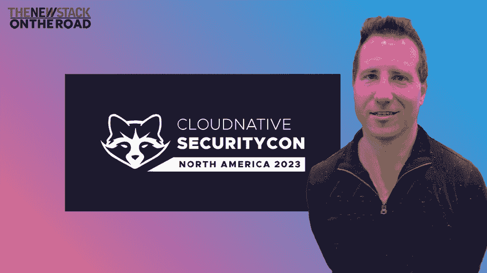

# 2023 热点:云 ide、Web 组装和 SBOMs

> 原文：<https://thenewstack.io/2023-hotness-cloud-ides-web-assembly-and-sboms/>

2023-02-16 13:30:17

2023 热点:云 ide、Web 组装和 SBOMs

播客，视频，

# 2023 热点:云 ide、Web 组装和 SBOMs

云 ide 很热门，但云计算原生计算基金会首席技术官 Chris Aniszczyk 强调，2023 年其他几个趋势正在形成。

Feb 16th, 2023 1:30pm by [Alex Williams](https://thenewstack.io/author/alex/ "Posts by Alex Williams")

西雅图——云 IDEs 炙手可热，但 2023 年其他几个趋势正在形成，[云本地计算基金会](https://cncf.io/?utm_content=inline-mention)的[首席技术官 Chris Aniszczyk](https://www.linkedin.com/pulse/cloud-native-predictions-2023-chris-aniszczyk/) 在新堆栈制造商播客的这一集《在路上》中强调了这一点。

[https://www.youtube.com/embed/fjMTXVOhWaw](https://www.youtube.com/embed/fjMTXVOhWaw)

视频

对话是在 CloudNative SecurityCon 上录制的。以下是我们所涵盖内容的分类:

*   [云 ide(或集成开发环境)](https://thenewstack.io/are-cloud-based-ides-the-future-of-software-engineering/)将会成熟，因为 [GitHub 的 Codespaces](https://thenewstack.io/this-week-in-programming-github-codespaces-portable-dev-environment/) 平台通过集成到 GitHub 服务中获得了认可。其他因素包括该领域的新创业公司，如 GitPod，它提供了一个安全的基于云的 IDE，以及 Uptycs，它使用遥测数据来锁定开发人员环境。“所以我认为你会，你会看到更多的人接触到它，他们会说，‘天哪，这让我的生活轻松多了，’”Aniszczyk 说。
*   [FinOps](https://thenewstack.io/finops-how-kubernetes-teams-can-best-work-with-finance/) 反映了对管理成本更为严格的观点，关注公司为开发者提供资源的效率。这种关注也转化为强调效率的绿色行动运动。
*   [软件物料清单(sbom)](https://thenewstack.io/how-to-create-a-software-bill-of-materials/)将继续成熟，Sigstore 将成为预计采用速度最快的项目。[见证](https://github.com/testifysec/witness)是[另一个 SBOM 项目。](https://www.testifysec.com/blog/keyless-signatures-sigstore/)在人们关注 SPDX 社区之前，它已经成为这场运动的中心超过十年了。
*   GitOps 和 [OpenTelemetry](https://thenewstack.io/opentelemetry-properly-explained-and-demoed/) :今年 KubeCon 在 GitOps 上提交的话题超高。OpenTelemetry 是 CNCF 第二受欢迎的项目，仅次于 Kubernetes。
*   [平台工程](https://thenewstack.io/platform-engineering-what-is-it-and-who-does-it/)火热进行中。Aniszczyk 提到了他正在关注的一个 CNCF 项目的后台项目。它有一个健康的插件扩展生态系统和相应的大型社区。人们取笑 Jenkins，但是因为插件社区，Jenkins 可能会和 Linux 一样存在。后台也是这条路。
*   Aniszczyk 说:“你可能会看到边缘案例的增加，比如相对于成熟的基于云的工作负载的较小部署。“WebAssembly 将与容器和虚拟机混合使用。这就是软件的工作方式。”
*   Kubernetes 是当今分布式结构的一部分。Linux 现在无处不在。Kubernetes 正在经历同样的演变。Kubernetes 正在进入飞机、汽车和快餐店。Aniszczyk 告诉我们，“人们将会把注意力集中在顶层，而不一定是核心的 Kubernetes 项目本身。”“这将是所有建立在上面的很酷的东西。”

[2023 热点:云 ide、Web 组装和 sbom](https://thenewstack.simplecast.com/episodes/2023-hotness-cloud-ides-web-assembly-and-sboms)

<svg xmlns:xlink="http://www.w3.org/1999/xlink" viewBox="0 0 68 31" version="1.1"><title>Group</title> <desc>Created with Sketch.</desc></svg>

TNS 所有者 Insight Partners 是新堆栈的投资者。

新堆栈更新一份时事通讯摘要，对本周最重要的新闻进行分析&。

新的堆栈不会出售您的信息，也不会与无关的第三方共享。如果继续，您同意我们的

[Terms of Use](/terms-of-use/)

和

[Privacy Policy](/privacy-policy/)

.