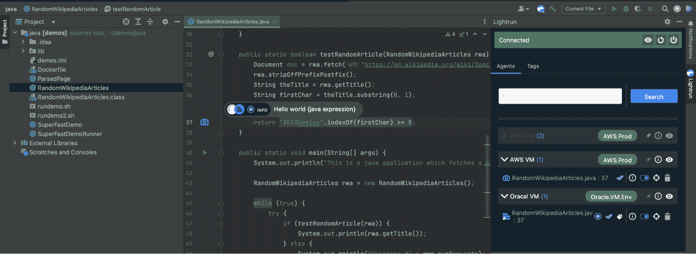

# 2023 年将是 FinOps 向左转向工程的一年

> 原文：<https://thenewstack.io/2023-will-be-the-year-finops-shifts-left-toward-engineering/>

对于任何开发运维团队和 R&D 团队来说，日志记录和可观察性对于能够排查和修复来自生产的关键问题非常重要。日志记录的主要问题是有许多解决方案，而且它们的规模和费用都在增长。此外，日志可以服务于不同的角色和不同的用例；因此，DevOps 工程师和开发人员使用日志的策略应该相匹配。

随着预计 2023 年的经济衰退，组织将寻求降低开支和削减多余和不必要成本的方法。对于工程团队来说，一个容易实现的目标就是云成本。

为了成功定制正确且经济高效的日志记录策略，DevOps 团队和开发人员需要更好地了解他们正在记录的内容，并从记录所有内容转变为记录重要的内容，从只记录静态日志转变为针对生产应用程序的静态和动态日志的混合方法。

此外，当组织采用可靠的左移 FinOps 方法时，它不仅会转化为总体成本降低和成本可预测性，还会转化为产品缺陷的更快解决(MTTR 减少)并提高开发人员的生产力和创新。

## **FinOps 核心原则及为什么** **It** **要左移**

FinOps Foundation 为从业者和决策者创造了一个蓝图，告诉他们如何采用最佳实践，并围绕整个云计算支出获得更好的控制、透明度和治理。

与软件开发周期不同，在软件开发周期中，获得代码变更和特性功能的反馈周期较短，而云成本的反馈周期较长；因此，了解云计算成本的影响需要几天甚至几个月的时间，这取决于公司对 FinOps 的采用程度。

如果业务、工程和 IT 部门之间没有适当的沟通，就很难优化成本并做出数据驱动的决策。

FinOps 基金会已经创建了一个详细的框架，允许集中的团队从“爬行”级别，通过“行走”，向最高的成熟度级别“运行”成熟他们的 FinOps 实践。这个框架平衡了 FinOps 铁三角(成本、速度和质量)。

根据组织所处的产品状态，领导者应该正确地决定是否扩大他们的云支出，以加快上市时间(TTM)。它可能经常以牺牲质量为代价，反之亦然。为了能够采用 FinOps 行动手册，应组建集中的团队，并遵循以下关键原则:

*   团队需要协作。
*   每个人都拥有自己使用云的所有权。
*   一个集中的团队推动 FinOps。
*   FinOps 报告应该是可访问的和及时的。
*   决策由云的商业价值驱动。
*   利用云的可变成本模型。

如上所列，这些原则不能仅由个人实现；他们需要跨团队协作。此外，为了获得适当和及时的可见性，以及了解一个组织为什么在云上投资并将其分成几个部分，工程必须是上述反馈循环的一部分。

**“**成熟的 FinOps 实践向左转移，以支持 FinOps 内部的主动活动，这使工程人员能够意识到云支出并对其负责，并让他们更好地优化并做出决策，作为其持续软件开发生命周期的一部分，**”**fin ops 基金会的合作伙伴计划顾问 Kevin Emamy 表示。

事实上，在最近的“[财务运营状况”报告](https://data.finops.org)中，30%的调查受访者表示，让工程团队围绕云成本优化采取行动是他们最大的挑战之一。

## **通过可操作的工程技术实现 FinOps 左移**

如上所述，实现 FinOps 文化始于让组织中的每个人都有责任并了解云支出，以及将云使用和预算与整体业务目标保持一致。做到这一点的方法是将云计算利用中最重要的功能带到桌面上，这就是工程师。

在整个 SDLC 过程中，开发人员构建他们的应用程序，并将其部署到不同的云提供商。他们的应用可以是云原生的，无服务器的(比如 Lambda，Google Actions 等。)，或者通过渐进式交付流程进行部署。

这些用例中的每一个都很复杂。然而，当出现生产问题或特性标志切换导致意外结果时，开发人员就需要合适的工具来完成这项工作。

为了调试远程和分布式应用程序，开发人员通常需要添加更多日志和遥测数据，这需要将应用程序重新部署到生产环境或目标环境中，他们需要针对这些环境来调试应用程序。这种循环在开发人员的时间和云计算资源(日志、存储等)上都是非常昂贵的。).

> 当 FinOps 成为整个组织文化的一部分，并且它从开发人员自身开始，一直到业务，这是显而易见的。

通过使开发人员能够采用使用[动态日志](https://lightrun.com)来解决生产中的问题，而无需重新部署和添加更昂贵的日志和遥测，开发人员可以在开发周期的早期拥有 FinOps 成本优化责任，并缩短成本反馈循环。

从开发人员开发环境(IDE)触发的动态日志和开发人员本地可观察性可以是一种可行的方法，以削减总体成本并更好地促进跨团队协作，这是 FinOps 的核心原则之一。

“与过去相比，FinOps 将成为一个更大的工程问题，在过去，工程团队可以自由支配云消费。云计算原生计算基金会的首席技术官 Chris Aniszczyk 说:“你会看到 FinOps 信息越来越靠近开发者，最终成为拉式请求基础设施的一部分。

请记住，确定优先级并决定何时触发成本优化并不总是容易的。这将取决于组织的规模、应用程序的复杂性和对与降低成本相关的任务的理解，以及其他因素。然而，考虑到这一点，当 FinOps 成为整体组织文化的一部分，并且从开发人员自身到业务开始，这是显而易见的。

上面的屏幕截图展示了直接从 IDE 对跨不同云虚拟机(VM)的远程工作负载进行故障排除的过程，而无需重新部署、停止应用程序、消耗更多静态日志等。

## **2023 年及以后，FinOps 的下一步是什么？**

随着包括开发人员、业务、IT 和财务代表在内的更加集中化的 FinOps 团队的形成，组织将对其云成本支出和治理变得更加严格，并在 SDLC 中更早地嵌入 FinOps 原则和流程，首先将成本节约行动作为开发人员 sprint 的一部分**。如果开发人员习惯于使用动态日志、虚拟快照和其他现代故障排除实践作为他们的日常 sprint 活动，留给 FinOps 的转变将成为现实。**

在 2023 年及以后的下一份“FinOps 状态”报告中，我们预计会看到更多开发者围绕 FinOps 和云成本优化计划采取行动。

<svg xmlns:xlink="http://www.w3.org/1999/xlink" viewBox="0 0 68 31" version="1.1"><title>Group</title> <desc>Created with Sketch.</desc></svg>