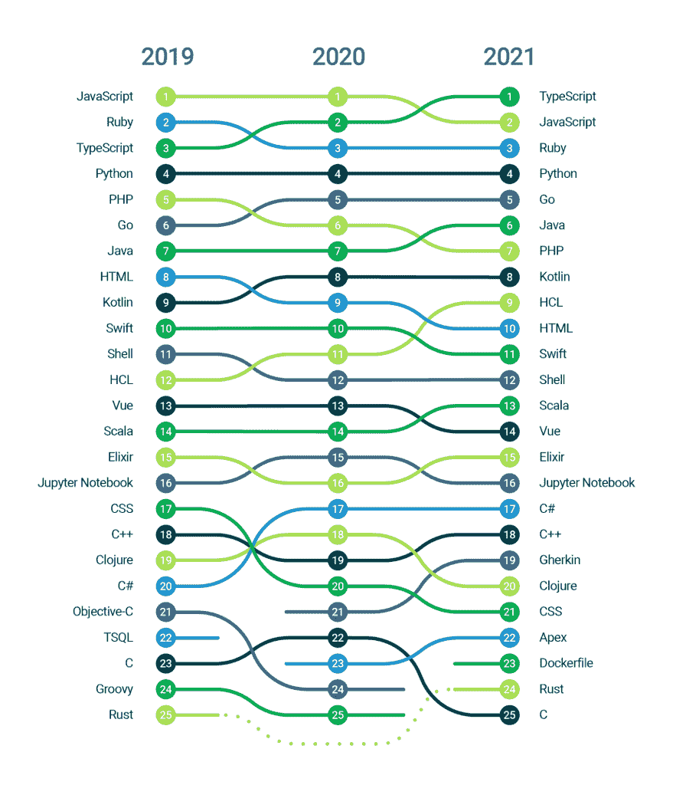

# DevOps Pros 使用的 25 种最流行的编程语言

> 原文：<https://thenewstack.io/25-most-popular-programming-languages-used-by-devops-pros/>

 [雅各布·施密特

雅各布是 CircleCI 的高级技术内容营销经理。他在技术编辑和学术出版领域拥有超过 15 年的经验，对让各种背景的受众都能接触到技术工具和概念有着浓厚的兴趣。](https://www.linkedin.com/in/jacob-schmitt-1b931631/) 

在持续集成领域工作的一个好处是，它提供了一个独特的视角，让我们了解软件团队如何组织他们的工作，在不牺牲质量、安全性或开发人员快乐的情况下快速交付价值。

在 CircleCI，我们支持 200 多万开发人员每月运行 9000 万个构建、测试和部署任务。在我们的年度“[软件交付状态”报告](https://circleci.com/resources/2022-state-of-software-delivery/?utm_medium=content&utm_source=thenewstack&utm_campaign=content-thenewstack-content-2022q3---blogLanguages)中，我们分析了来自超过 2.5 亿个工作流的数据。使用这些数据，我们可以确定导致 DevOps 成功的习惯和实践，这样我们就可以与社区分享这些知识和基准。

每年，我们都会检查工作流数据，以说明我们平台上的团队在四个关键指标方面的表现:

*   **持续时间**:工作流运行所需的时间长度
*   **吞吐量:**每天运行工作流的平均次数
*   **平均恢复时间:**工作流失败和下一次成功之间的平均时间
*   **成功率:**给定时间段内成功运行与总运行的比率

这项研究还揭示了团队用来完成工作的工具和技术的有趣趋势。在这份报告中，我们将围绕基于 CircleCI 的组织中最流行的编程语言挖掘数据。下图展示了在我们的平台上使用 25 种最流行的编程语言所完成的工作量的趋势。

图 CircleCI 上使用的前 25 种编程语言，按完成的工作量排序，2019–2021。

在我们开始之前，对数据有一个快速的警告:因为我们的数据集如此之大，需要大量的工作流运行来记录语言排名的变化。要进入前 25 名，一种语言需要在超过 150，000 次工作流运行中使用。进入前 10 名需要几百万。

这意味着，与其他使用谷歌搜索、GitHub stars 或开源存储库数据等指标来确定语言受欢迎程度的语言趋势报告不同，以下结果倾向于资源充足的团队，这些团队使用尖端技术，每天都进行许多更改。然而，即使较小的团队和创业公司也可以利用这些趋势和 SOSDR 基准来识别文化和技术变化，这将有助于他们与世界上最好的软件交付团队竞争。

### **侧栏:方法论**

“2022 年软件交付状态”报告中使用的数据代表了 2019 年 12 月 1 日至 2021 年 9 月 30 日之间运行的工作流。它被过滤，只包括使用 GitHub 作为他们的 VCS，至少有两个贡献者，并在 CircleCI 上运行工作流至少五次的项目。总的来说，这构成了来自 43，000 多个组织和 290，000 多个项目的超过 2.5 亿个工作流的数据。

现在让我们来看看在我们的平台上观察到的三个最有趣的语言趋势。

## Typescript 超过 Javascript 成为最流行的 DevOps 语言

TypeScript 是非常流行的 JavaScript 编程语言的超集，增加了可选的静态类型。自 2012 年由微软推出以来，它已被开发人员迅速采用，成为一种可扩展、人类可读的语言，有助于协作和加速开发。因为 JavaScript 代码是有效的 TypeScript，所以将 JavaScript 代码库迁移到 TypeScript 是相对容易的，并且可以以适合您的组织的任何速度完成。最近完成从 JavaScript 到 TypeScript 大规模迁移的团队有 [Stripe](https://stripe.com/blog/migrating-to-typescript) 、 [Airbnb](https://medium.com/airbnb-engineering/ts-migrate-a-tool-for-migrating-to-typescript-at-scale-cd23bfeb5cc) 和 [Etsy](https://www.etsy.com/codeascraft/etsys-journey-to-typescript/) 。

TypeScript 成为 CircleCI 上最常用语言的原因是什么？首先，类型安全使开发人员能够在他们的 IDE(集成开发环境)中或者在编译时而不是在运行时捕获错误，从而降低了将错误发布到产品中的风险。通过使代码更容易阅读、重构和共享，类型还支持快速入职和跨项目协作。这些生产力和增强信心的好处是 [TypeScript 在企业级采用的关键驱动力](https://thenewstack.io/how-typescript-helps-enterprise-developers/)，并且是持续集成提供的开发人员体验改进的自然补充。

有趣的是，在 CircleCI 上构建的 TypeScript 项目在成功率和吞吐量方面都比 JavaScript 项目排名高，但在平均恢复时间方面(MTTR)却不一样。这支持了 TypeScript 帮助开发人员在本地捕获更小的错误的想法，允许他们比 JavaScript 开发人员更频繁、更可靠地提交工作代码。然而，当 TypeScript 构建失败时，调试平均比 JavaScript 项目更耗时。

## Hashicorp 配置语言跃入前 10

HashiCorp 配置语言(HCL)是一种声明式配置语言，用于 HashiCorp 的云基础设施自动化工具，最著名的是 Terraform。作为 JSON 的超集，HCL 旨在提供一种人类可读的配置语言——支持注释、变量和函数——可以与机器生成的 JSON 互操作。这为开发运维团队提供了大规模调配和管理云环境所需的灵活性。

在过去几年中，HCL 在 CircleCI 上的使用量稳步增长，自 2019 年以来攀升了三个位置，成为该平台上第九大最受欢迎的语言。这并不完全令人惊讶，因为 HCL 也出现在 GitHub 的 [2018](https://octoverse.github.com/2018/projects#languages) 和[2019](https://octoverse.github.com/2019/#top-languages)“octo verse 状态”报告中增长最快的语言名单上。这表明基础设施即代码(IaC)已经跨越了从个体从业者到大规模交付软件的组织之间的广泛采用的鸿沟。

HCL 不仅是我们平台上使用的第九流行的语言，而且它还有第二快的 MTTR，仅次于 Gherkin(稍后会有更多内容)和第八短的持续时间。将 HCL 对开发人员友好的语法与 IaC 工具众所周知的速度和标准化优势相结合，可以实现闪电般的部署工作流，甚至更快的调试速度。

## 小黄瓜将行为驱动开发带入前 20 名

像 HCL 一样，Gherkin(在我们的列表中排名第 19)是一种用于定义 Cucumber 测试场景的领域特定语言，Cucumber 是一种支持行为驱动开发(BDD)的开源测试工具。Gherkin 遵循高度可读的 Given-When-Then 语法，该语法允许非技术风险承担者在开发周期的计划阶段定义预期的行为，并在验收测试期间验证行为需求是否得到满足。

作为测试驱动开发(TDD)的一个分支，BDD 打破了产品所有者和开发人员之间的传统壁垒，它围绕产品行为建立了共同的期望，而没有指定特性应该如何在幕后实现。Gherkin 在 2020 年出现在我们的名单上，随后在 2021 年上升，这表明组织越来越多地从开发过程的一开始就优先考虑跨团队合作和用户体验。

值得注意的是，根据我们的报告，小黄瓜项目拥有所有语言中最快的 MTTR。这可能意味着 Cucumber 的详细错误报告为开发人员提供了高度可操作的信息，使他们可以集中精力进行调试。此外，由于自动化验收测试位于测试金字塔的顶端，因此可以有把握地认为，在管道的早期阶段，更全面的单元和集成测试会捕捉到更重要的代码缺陷，从而使该阶段的补救相对简单。

## 结论

综合起来，这三个数据点讲述了一个引人注目的故事:精英软件交付团队正在采用人性化的工具和实践，使他们能够自动化和扩展，同时也消除了开发人员和管理人员的摩擦。在当今竞争激烈的生态系统中，快速行动的能力至关重要，但同样重要的是组织吸引人才、保持员工快乐以及消除信息孤岛和其他团队成功障碍的能力。从开发语言到测试框架，再到部署场景，高绩效者被鼓励协作、可重复性和生产力的工具所吸引。

在 CircleCI，我们正在建设一个世界，在那里[软件是一个想法问题，而不是交付问题](https://brand.circleci.com/613faff00/p/78b529-mission--vision)。要了解世界上最好的开发团队如何使用持续集成和交付来提高开发人员的快乐和更快地交付高质量的软件，请下载“ [2022 年软件交付状况”报告](https://circleci.com/resources/2022-state-of-software-delivery/?utm_medium=content&utm_source=thenewstack&utm_campaign=content-thenewstack-content-2022q3---blogLanguages)。

<svg xmlns:xlink="http://www.w3.org/1999/xlink" viewBox="0 0 68 31" version="1.1"><title>Group</title> <desc>Created with Sketch.</desc></svg>