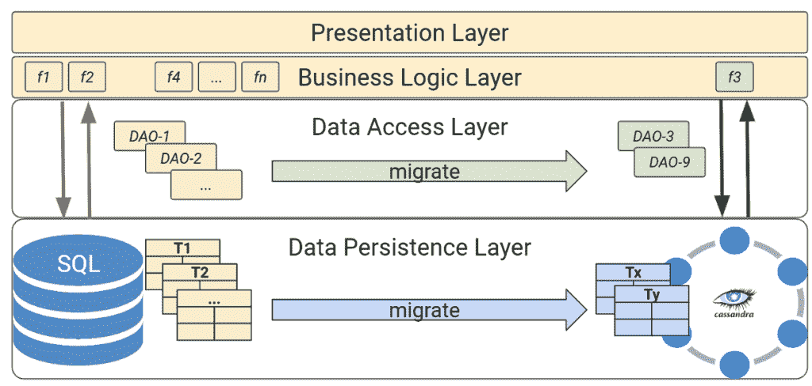
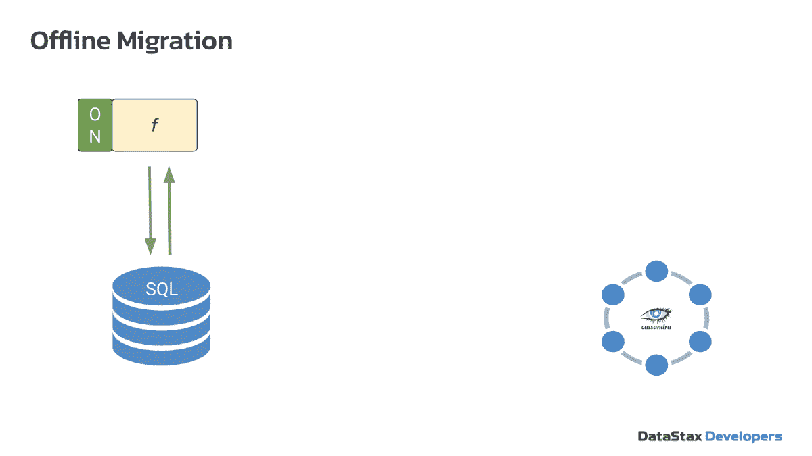
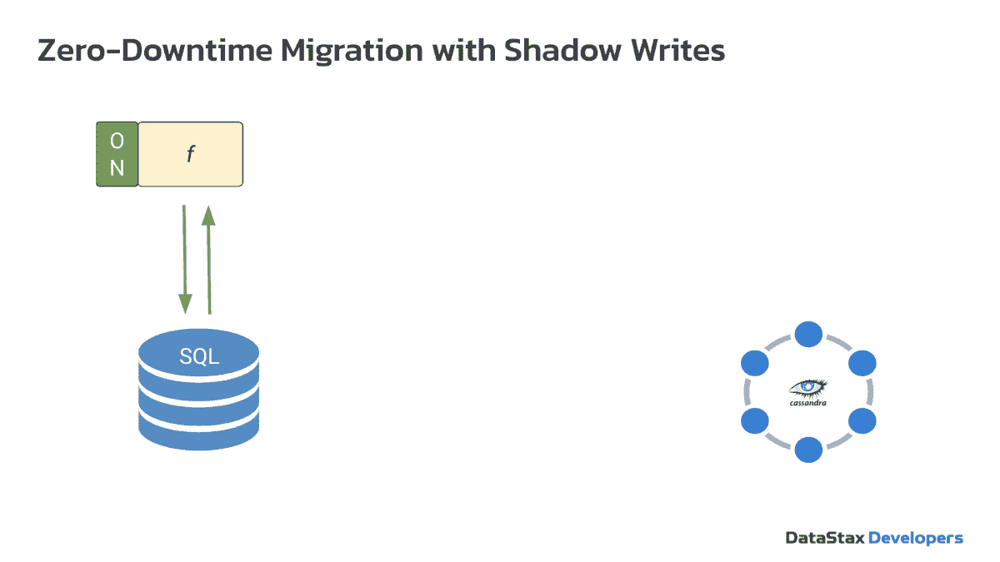
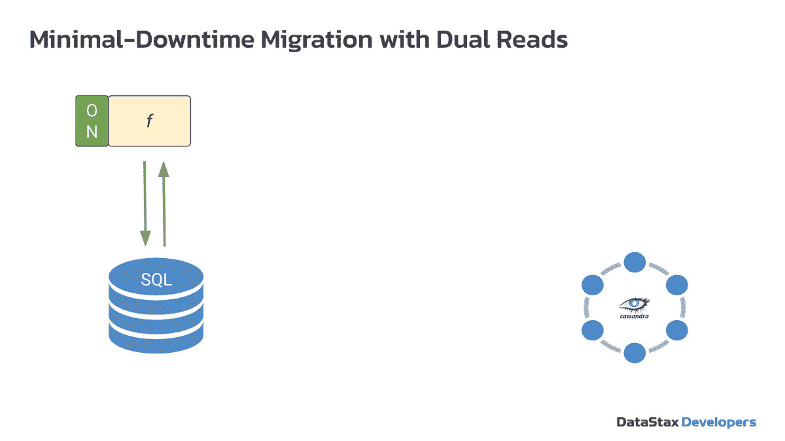

# 将 SQL 应用程序迁移到 Apache Cassandra 的 3 种方法

> 原文：<https://thenewstack.io/3-approaches-to-migrate-sql-applications-to-apache-cassandra/>

 [大卫·琼斯-吉拉蒂

大卫是 DataStax 的开发者拥护者，他对分布式数据库非常着迷。他在编程、数据库管理、云、服务器/网络监控和分析方面拥有超过 25 年的相关经验。](https://www.linkedin.com/in/david-gilardi) 

将传统的基于 SQL 的应用程序迁移到 NoSQL 会带来真正的挑战；这可能感觉像一个[滑动拼图](https://en.wikipedia.org/wiki/Sliding_puzzle)，需要对操作顺序有一个清晰的认识才能正确完成。但是如果规模和速度变得越来越重要，那么转移到 NoSQL 数据库是一条值得走的路。

在这里，您将了解如何将您现有的基于 SQL 的应用程序迁移到 NoSQL，对您的数据模型的实际影响，以及一旦您的新系统就位，您如何在两者之间切换。

我们使用 [PetClinic 参考应用](https://spring-petclinic.github.io)和开源的 NoSQL 数据库 Apache Cassandra 来完成这个过程。

 [塞德里克·伦文

Cédrick 领导 Datastax 的开发者权益团队。作为一名演讲者和培训师，他的第一个(但不是唯一的)爱好是 Java。2013 年，他创建了名为 FF4J 的开源特性 toggle 库，他一直在积极维护这个库。](https://fr.linkedin.com/in/clunven) 

Cassandra 是唯一一个分布式 NoSQL 数据库，它提供了满足成功的现代应用程序需求所需的永不停机的可用性、快速读写性能和无限的线性可伸缩性。

升级一个完全实现的 Cassandra 数据库的最简单的方法之一是通过 [DataStax Astra DB](https://dtsx.io/3tHYkiw) ，一个基于 Cassandra 构建的多云数据库即服务。Astra DB 免费高达 80GB 存储，每月 2000 万次操作；不需要信用卡承诺。

我们将在这里讨论的三种方法包括:

1)离线迁移
2)带影子写入的零停机时间迁移
3)带双重读取的最短停机时间迁移。

## **为什么从 SQL 转换到 NoSQL？**

 [阿尔特姆·切博特科

Artem 是 DataStax 的开发者拥护者。他的核心专长是数据建模、数据管理、数据仓库、数据挖掘和数据分析。15 年来，他一直领导和参与 NoSQL、关系、图形、XML 和出处数据库的研究和开发项目。](https://www.linkedin.com/in/artemchebotko) 

对于大多数人来说，您可能首先了解了关系数据库。关系数据库非常强大，因为它们同时确保了一致性和可用性。只要您的数据库运行在同一台机器上，它们就非常有效和简单。

但是，如果您需要运行更多的事务或者需要更多的空间来存储数据，那么您在单台机器上可以垂直扩展的范围是有上限的。问题出现了:关系数据库不能有效地伸缩。

向外扩展的解决方案是将数据分散到多台机器上，创建一个分布式系统。事实上，NoSQL 数据库的发明就是为了应对大数据在容量、速度和种类上的新需求。

随着大型科技的崛起，全球数据领域在过去十年中暴涨了 15 倍。而关系数据库根本无法应对新的数据量或新的性能需求。像谷歌、脸书或 LinkedIn 这样的大型全球运营公司创建并使用 NoSQL 数据库来高效扩展、走向全球并实现零停机。

像许多其他 NoSQL 数据库一样，Cassandra 受 CAP 定理的约束。该定理指出，在网络故障的情况下，分布式数据库系统只能保证这三个特征中的两个:一致性、可用性和分区容差。

Cassandra 通常被描述为“AP”系统，这意味着它在确保数据可用性方面出错，即使这意味着牺牲一致性。但这并不是全部。Cassandra 具有可配置的一致性:您可以设置所需的一致性级别，并根据您的用例将其调整为更接近 AP 或 CP。

这个 [YouTube 视频](https://dtsx.io/3hS1sTk)提供了对 SQL 和 NoSQL 数据库更深入的分析。

## **定义迁移问题**

从 SQL 迁移到 NoSQL 不是一步到位的过程，也没有绝对的路径或模式。虽然迁移有多种选择，但我们的目标是帮助您描绘出一幅完整的画面。

在理想的情况下，您在关系数据库上的应用程序不会遇到任何问题，也没有必要将它们切换到 NoSQL。但是，如果您遇到可伸缩性问题，或者如果您需要全球化，那么您有一些很好的理由进行迁移。Cassandra 在分布式架构上进行分区，以处理数 Pb 的数据，实现线性可扩展性，并在全球多个中心复制数据，以满足您的数据需求。

想象一下，如果您可以使用旧的应用程序，重写它的一部分，并迁移您的模式和数据来获得您的新应用程序，这将是多么容易。但现实中并非如此，因为关系数据库包含数百个表，不同的应用程序使用它们来实现不同的业务功能。

迁移整个应用程序可能需要很长时间，在此期间，应用程序和数据要求可能会发生变化。随着应用程序和关系数据库的发展，您的迁移必须跟上发展的步伐，变得非常复杂。

一种更现实的方法是将一个更大的应用程序的一小部分，比如一个在关系数据库中只使用 20 或 50 个表的特性或业务功能，在合理的时间内将其迁移到 NoSQL。为了理解这一点，让我们看一下数据架构中的四层:

1.  **表示层**向用户显示信息并从用户处收集信息。
2.  **业务逻辑层**作为表示层和数据访问层之间数据交换的中介。它处理决定如何创建、存储和更改数据的业务规则。
3.  **数据访问层**促进了应用程序和任何类型的持久存储之间的访问，在这里是 SQL 和 NoSQL 数据库。
4.  **数据持久化**层是由模式和表组成的实际数据库。

当我们迁移一个业务功能时，很可能业务逻辑不会改变，除非在极少数情况下。关系数据库中的某些特性并不完全映射到 NoSQL 数据库:例如，资产交易。

但是大多数时候，将会改变的是数据访问对象，它们现在必须与 Cassandra 进行交互。您还需要将数据持久层或者模式和表从 SQL 迁移到 NoSQL。

## **方法 1:离线迁移**

离线迁移方法

在离线迁移方法中，当您构建到 NoSQL 的迁移时，您完全关闭旧的 SQL 系统。这被认为是最简单和最安全的方法，因为数据丢失的可能性较小。这是数据迁移工作流:

1.  迁移数据模型。
2.  迁移函数和数据访问对象。
3.  提取、转换、加载(ETL)。

之后，您可以启动新的 NoSQL 函数，如果您测试的一切都正确，您就可以从实际的应用程序中读取和写入了。但是不能保证新的 NoSQL 应用程序在每种情况下都能工作，而且大多数应用程序不能承受停机时间，这就导致了第二种方法。

## **方法 2:采用影子写入的零停机迁移**

采用影子写入的零停机迁移方法

为了实现零停机时间，您需要同时并行运行两个功能:旧功能和新功能。在我们决定完全切换并关闭旧功能之前，请给我们足够的时间来测试它。这种方法的数据迁移工作流的前两步是相同的:

1.  迁移数据模型。
2.  迁移函数和数据访问对象。

但是现在，您可以开始使用新功能，就好像我们已经完成了迁移并运行了影子写入，允许来自实际应用程序的写入同时到达关系数据库和 NoSQL 数据库。

因为我们正在做影子写，我们将需要一个代理发送数据到一个关系数据库，同样的数据将被影子到 Cassandra。此时，我们正在大量测试写操作，并确保我们的表和数据模型设计正确。

如果在这个过程中犯了错误，您总是可以切换回关系数据库，因为那里有副本数据。虽然我们使用 Cassandra 作为例子，但是您可以使用任何其他 NoSQL 迁移来实现这一点。

下一步是提取、转换和加载历史数据到 Cassandra。之后，您继续运行这两个数据库，并确保读取按您预期的那样工作。一旦你准备好了，关掉旧的解决方案或者用新的替换旧的。[这段视频](https://dtsx.io/3pNTOxO)提供了更详细的解释。

## **方法 3:双读取最小停机时间迁移**

使用双重读取的最短停机时间迁移方法

这种方法的有趣之处在于，您将进行双重读取，这意味着同时运行关系数据库和 Cassandra 数据库，而不打算完全关闭关系数据库。同样，前两步是相同的:

1.  迁移数据模型。
2.  迁移函数和数据访问对象。

在第三步中，您可以使用新函数向 Cassandra 写入数据，但是历史数据仍然在关系系统中。当您进行读取时，您需要从 Cassandra 和关系系统读取，您将需要一个代理。一旦准备好了，就可以将历史数据从关系数据库 ETL 到 Cassandra。然后，关闭该功能，在 Cassandra 上使用。

在某些用例中，这种方法是有利的:

*   如果关系数据库中的历史数据并不重要，并且不经常读取，那么就没有必要移动数据进行 ETL，也没有必要花费资源将数据存储在 Cassandra 中。
*   如果历史数据使用 Cassandra 中没有的关系特性，或者不容易在应用程序中实现。
*   如果您已经预付了服务云 SQL 数据库服务，并且希望在拥有资源的情况下继续使用它。

这个[视频片段](https://dtsx.io/3MC34Pg)提供了更深入的解释。

## **结论**

以上三种方法有一个共同点:您总是需要迁移数据模型、函数和数据。但是，正如我们在这里所展示的，您可以挑选能够满足您的组织的需求和您的应用程序的特性的方法。

<svg xmlns:xlink="http://www.w3.org/1999/xlink" viewBox="0 0 68 31" version="1.1"><title>Group</title> <desc>Created with Sketch.</desc></svg>