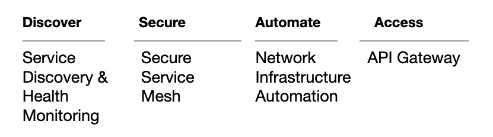

# 3 领事服务网神话终结

> 原文：<https://thenewstack.io/3-consul-service-mesh-myths-busted/>

 [范·潘

范是哈希公司领事部门的技术产品营销经理。他职业生涯的大部分时间都在基础设施领域，喜欢学习新技术和动手实践。当他不盯着电脑屏幕时，他会分享食物的照片，这让他的妻子感到沮丧。他与妻子和两个小男孩住在加州圣何塞。](https://www.linkedin.com/in/van-phan-726a823/) 

大多数基础设施工程师都很清楚 Terraform 是做什么的，那些关心安全性的人可能知道 HashiCorp Vault，但是 hashi corp consult 怎么样呢？

一些工程师将其视为服务发现解决方案。其他人认为它是一个服务网。有些人可能只从最早的用例——键值存储(KV)中知道 Consul。

是的，执政官做所有这些事情。但是自从 2014 年作为一个受欢迎的开源网络工具出现以来，它已经发展成为一个更加全面的网络平台。

因此，让我们来看看你可能有误解或没有充分利用的三种咨询能力。

## 领事支持零信任网络

 [阿什尔·赛义德

Ashher 是 HashiCorp 的产品营销负责人，工作地点在德克萨斯州的奥斯汀。当他不在追逐他的四个孩子时，他正在探索基于云的技术能够为现代化的组织带来什么样的可能性。](https://www.linkedin.com/in/ashher/) 

安全专业人员希望在他们的整个基础设施中应用零信任原则，尤其是在他们的整个网络中。使用传统的基于防火墙的安全性来保护网络边界或控制内部网络、VPC 和 VNETs 之间的访问越来越不够用。

传统的安全方法基于 IP 地址，作为不同网络中机器和服务之间的访问控制单元。但是授权(允许或拒绝)基于 IP 地址的单个服务之间的通信需要大规模的努力，特别是在机器和 IP 地址都是短暂的现代世界。

Consul 可以通过卸载由 Consul 的[服务网格](https://www.consul.io/docs/intro/usecases/what-is-a-service-mesh)处理的网络服务之间的流量来缓解这些棘手问题。关键是应用于每个注册到 Consul 的服务的服务标识。在这种情况下，服务标识取代 IP 地址作为控制单元，所有未来的策略实施都以此为基础。

咨询服务网格服务到服务通信流。

管理员可以根据服务名称而不是 IP 地址来允许或拒绝服务之间的通信。这使得管理服务之间的通信变得更加容易，特别是在微服务环境中，服务名称是固定的，而 IP 地址是动态的。例如，管理员可以强制实施默认安全的“全部拒绝”策略，这是走向零信任网络的第一步。从安全默认值开始，您可以根据应用程序和威胁模型的要求构建服务到服务的授权策略。

一旦获得授权，服务之间的通信将通过 mTLS 进行身份验证和加密。TLS 证书由 Consul 自动生成，并直接绑定到每个服务的身份。完整的身份验证过程和证书交换由领事的 sidecar 代理 Envoy 处理，并且还将确保网络上的流量是加密的。将所有这些放在一起，Consul 使开发人员不必向他们的服务添加单独的身份验证和加密代码，这最终提高了生产率。如果它被很好地构建到开发人员的工作流程和平台中，[开发人员甚至不会注意到它的存在。](https://thenewstack.io/for-my-next-trick-ill-make-a-service-mesh-disappear/)

## 执政官在库伯内特斯茁壮成长

另一个误解是 Consul 主要针对虚拟机环境。实际上，除了非容器化的工作负载，它还支持多种运行时，包括虚拟机、Kubernetes、Amazon ECS 和 HashiCorp Nomad，并且可以跨多个云工作。这是异构环境的完美服务网络。

执政官对 Kubernetes 有强大的功能。像[管理分区](https://www.hashicorp.com/blog/achieving-multi-tenancy-with-consul-administrative-partitions)和[透明代理](https://www.hashicorp.com/blog/transparent-proxy-on-consul-service-mesh)这样的特性是由 Kubernetes 需求驱动的。最近，开发了几个新功能，专门用于优化 Kubernetes 上 Consul 的用户体验。例如， [Consul 1.11](https://www.hashicorp.com/blog/announcing-hashicorp-consul-1-11) 引入了 [Consul K8s CLI](https://www.consul.io/docs/k8s/installation/install#consul-k8s-cli-installation) 工具，旨在简化 Consul 在 Kubernetes 上的安装和生命周期管理体验，而不需要 Helm charts 或 kubectl。Helm 仍然完全受支持，但现在用户可以选择使用不同的方法。

领事 1.11 也提供了一个更紧密的 Kubernetes 上的领事和金库之间的集成。这使得使用 Vault 在 Consul 的控制平面和数据平面上自动生成、存储和管理 TLS 证书变得更加容易。这是一个更广泛的倡议的一部分，旨在使库伯内特上的领事和金库更紧密地整合，以存储所有的秘密。

这一举措在 [1.12 版本](https://www.hashicorp.com/blog/consul-1-12-hardens-security-on-kubernetes-with-vault)中得以延续，该版本允许 Consul 在控制平面和数据平面上自动轮换 TLS 证书，无需任何停机时间。管理员不再需要手动轮换证书，也不再有因人为错误导致停机的风险。它还提高了安全性，因为可以更频繁地轮换证书，而不会增加管理员的负担。

领事按集群存储 Kubernetes 机密，而不是集中在保险库中。

最后，1.12 版本让用户可以选择在 Vault 上存储像 ACL 令牌和许可证密钥这样的秘密，而不是作为 Kubernetes 秘密。这也提高了安全性，因为 Vault 默认情况下会加密所有机密，并为集中式机密管理和治理提供了许多附加的审核和报告功能。

## 执政官比你想象的要容易

你有没有去过赌场或者看过一部电影，里面的人在赌桌前欢呼？如果你不知道规则，掷骰子可能看起来令人困惑，而且相当吓人，因为事情太多了。然而，craps 实际上是由许多简单的赌注组成的，玩家可以选择只在他们感兴趣的部分下注。

同样，如果您是 Consul 的新手，很容易被它的众多选项和功能所淹没。但是你不需要使用所有的咨询能力。每个客户都有不同的使用案例，从服务发现到保护网络服务，再到自动化网络设备，他们不需要立即利用所有的优势。

网络领事关注的四大支柱。

那么你从哪里开始呢？无论您的用例是什么，部署 Consul 后要做的第一件事就是注册您的服务。一旦您的服务被注册，它们就有了一个可用于服务发现或服务网格功能的身份。经过多年的发展，Consul 已经变得易于部署、管理和使用。Consul 的大部分功能对应用程序开发人员是透明的。事实上，使用 Kubernetes 上的 Consul 几乎可以毫不费力地自动注册您的服务。只需在您的[领事舵值文件](https://www.consul.io/docs/k8s/helm#connectinject)中将 [connectInject.enabled](https://www.consul.io/docs/k8s/helm#v-connectinject-enabled) 和 [connectInject.default](https://www.consul.io/docs/k8s/helm#v-connectinject-default) 参数设置为 true 即可。这会将 Consul 配置为在 Kubernetes 集群中的每个服务上自动注入一个 Envoy sidecar 代理。此外，[透明代理](https://consul-8zr6c74p2-hashicorp.vercel.app/docs/connect/transparent-proxy)在默认情况下是启用的，它将确保服务之间的流量通过特使代理自动重定向。这使得开发人员不必手动编辑他们的应用程序的 Kubernetes 清单来考虑任何上游服务。

想要更简单的吗？如果你不想麻烦安装和管理领事服务器，HCP 领事是一个全面管理的服务，照顾所有这一切给你。HCP 领事服务器安装在一个名为[哈希公司虚拟网络](https://cloud.hashicorp.com/docs/hcp/network) (HVN)的专用单租户云基础设施环境中。只需在您的环境中安装 Consul 客户机，并将它们加入 Consul 服务器集群。我们可以轻松地将 HCP 领事服务器从我们的 HVN 连接到贵组织 VPC 的客户端。Consul 的服务网格内的所有连接在默认情况下都是安全和加密的，没有任何额外的管理开销。HashiCorp 专家工程师为您管理更新服务器软件和确保服务器弹性的所有最佳实践。想开始吗？看看这个 [HCP 领事教程](https://learn.hashicorp.com/collections/consul/cloud-get-started)。

综上所述，你会发现 HashiCorp Consul 比你想象的做得更多，也更容易。Consul 帮助您实现零信任安全，其中所有应用程序流量都经过授权、认证和加密。它提供跨所有平台、运行时和云的基于服务身份的安全性。Kubernetes 上的 Consul 与 Vault 进行了本机集成，并提供了一个专门的 CLI 来简化 Kubernetes 工作流。总的来说，该项目的目标仍然是让用户能够在任何基础设施上为任何应用程序运行许多现代网络功能。

## 资源和使用案例

<svg xmlns:xlink="http://www.w3.org/1999/xlink" viewBox="0 0 68 31" version="1.1"><title>Group</title> <desc>Created with Sketch.</desc></svg>