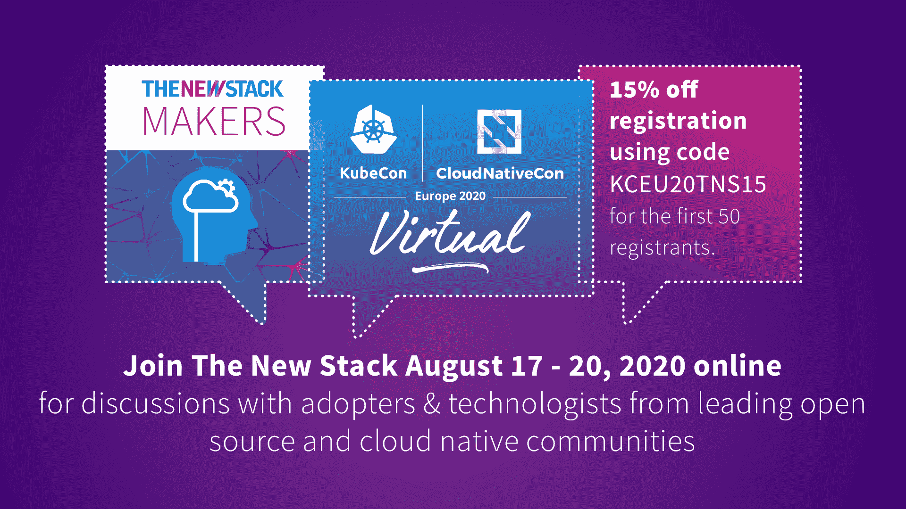

# 3 个数字化转型的障碍—以及如何绕过它们

> 原文：<https://thenewstack.io/3-digital-transformation-roadblocks-and-how-to-get-around-them/>

[KubeCon + CloudNativeCon](https://events19.linuxfoundation.org/events/kubecon-cloudnativecon-north-america-2019/) 和 [CircleCI](https://circleci.com/) 赞助了这篇文章，实际上是在期待 [KubeCon + CloudNativeCon EU](https://events.linuxfoundation.org/kubecon-cloudnativecon-europe/) 于 8 月 17 日至 20 日发布。

 [迈克尔·施塔恩克

Michael 是 CircleCI 的平台副总裁，负责管理 SRE、安全和工具。在此之前，他曾在 Puppet running PE、Platform engineering 和 SRE 工作。他与人合作撰写了两份*开发状态*报告，以及最近一份关于数据驱动的持续集成的报告。他也是一位受欢迎的演讲者，参加过各种 DevOps 日、CTO 峰会、Puppetize 会议等。他还创建了软件包仓库 EPEL，并在 2005 年写了一本关于 SSH 的书。](https://www.linkedin.com/in/mstahnke/) 

在我的职业生涯中，观察技术在几乎每个行业的传播是我见过的最迷人的事情之一。15 年前，一些公司认为设置内部存储、防火墙和虚拟专用网络是一项技术工作，而现在，这些公司拥有专门开发应用和服务的完整工程团队。无论是制鞋公司[利用应用程序推动电子商务](https://digiday.com/marketing/how-adidas-is-using-apps-to-fuel-its-e-commerce-ambitions/)，百货商店[开发技术以促进店内和网上销售](https://fortune.com/longform/nordstrom-high-touch-tech-fortune-500/)，还是重型设备制造商[开发技术服务和自动拖拉机](https://www.chicagobusiness.com/technology/entering-race-tip-top-tech-talent-caterpillar)，我都看到许多老牌公司进行了巨大的数字化转型，以便能够生存和竞争。

然而，改变是艰难的——尤其是数字化转型所需的大规模系统性变革。在我 20 年的科技生涯中，我曾与几家公司合作过，这些公司一开始就有变革的计划，但最终结果却乏善可陈。这很少是彻底的失败——团队或部门中通常存在小部分成功——但是当大型项目停滞时，我几乎总是看到一组常见的模式出现。这里有三个最大的障碍，以及如何绕过它们。

## **1。团队不接受该计划**

管理任何重大的结构性变革都必须自下而上，而不是简单地从高层获得授权。任何组织中的领导者在开始结构性变革之前首先关注的事情——无论是安装新的电子邮件系统或安全工具，还是围绕 DevOps 重组整个业务部门——是他们如何在这些努力中带动每个人。如果有一群愤世嫉俗的员工认为一个重要的项目只是下一个时尚，我向你保证它会是。

领导者必须意识到这些项目需要[文化变革](https://circleci.com/blog/how-to-lead-your-team-to-devops-maturity/)以及程序变革。员工是否了解他们所扮演的角色在他们进入的新世界中是如何变化和发展的？他们想成为其中的一部分吗？

应对这些问题的一个好策略是，确保参与任何重大变革的每个组织都有[内部拥护者](https://circleci.com/blog/how-to-bring-a-new-tool-to-your-team-and-not-get-squashed-in-the-process-5-tips-for-successful-adoption/)，人们可以团结在他们周围。然而，冠军不能简单地被任命。关键是找一个真正理解为什么一个项目是重要的，并且有动力和灵感去完成它的人。理解项目如何以及为什么会让他们的工作和周围的人变得更好的员工。

拥有或管理大型项目的一部分是知道是什么激励人们完成项目。我见过几个例子，一家公司将一个新项目投入到一个巨大的生产中，然后有人站起来，试图通过告诉员工这将对每股收益产生多大的影响来召集员工。好吧，如果我是一名员工，我没有太多的股票，那对我来说无所谓——那么这怎么会让我有动力去完成这件事呢？想一些简单的方法来激励伟大的工作。也许成绩最好的团队会得到一个假期，或者为另一个项目获得更多的预算。

## **2。公司未能标准化**

我曾经在一个在分布式环境中使用五种不同操作系统的地方工作过。一开始并不是这样，但我们的文化是这样的，如果一群人决定使用新的操作系统，他们就会这样做，这最终会成为我们做事方式的一部分。这种负担对于应用程序团队来说是最小的，因为他们有一种标准的方式来运行他们的特定应用程序。然而，对于系统团队来说，有 *n+1* 种方法来做事。每个涉及操作系统的流程现在都有了另一个分支。这意味着审核、安全控制、监控、备份和资源调配现在在流程中有了另一个分支—另一个“如果”语句。每个“如果”语句都增加了复杂性。有两条途径可以验证。随着时间的推移，你会意识到你在给组织制造阻力，而一门新的语言或多或少是永恒的。

这造成了巨大的成本——不仅是花费的金钱，还浪费了大量的时间和精力——并为其他问题打开了一扇巨大的窗户。最终，该公司花了九年时间从五个主要操作系统发展到两个。这巩固了标准化对我的重要性，因为最终，为他们的应用程序选择操作系统的人没有看到他们决策的痛苦。

当工具、实践或流程中的变化减少时，变化会更快。对于大型企业来说，实施新标准是一项巨大的工作，可能需要数年时间。这通常意味着有人将不得不放弃重要的东西，这将是痛苦的，但这也意味着随着变化的发生，发展和前进的东西越来越少。艰难的选择总是发生在这里，但没有捷径。如果他们不放弃一些东西，可变性将会永远跟随项目，在最坏的地方设置路障。标准必须是关于全局优化的，每个人都需要理解，有时全局优化是局部次优化。这并不意味着它是错的。

标准是减少差异的工具。更少的变化需要更少的适应、更少的校正和更少的争论，因为更少的“如果”陈述。

## **3。不愿意改变**

这个我见过很多次了。我和很多公司合作过，他们想变得更好，但不愿意改变任何事情。有一次，我和一家大型银行的几位高管开会，讨论工程策略。我一直听到人们说，“他们不会让我们这么做的。”我听了几次，最后问道:“他们是谁？我还以为*你*是他们呢！”

一个组织的发展速度没有速度限制，只有他们颠覆常规的意愿。公平地说，这并不容易——人们不喜欢颠倒他们的工作。他们知道帮助他们成功的工具和策略，并且通常反对改变它们。然而，变革通常要求他们这样做。

变化是一个持续的过程，领导者既需要理解它，也需要时刻意识到它。

## **结论**

当我看到一个停滞不前的项目时，我会从寻找这三个缺陷中的一个开始，并深入研究如何修复它。我还试图放大成功，以表明推出只是停滞不前，并没有被放弃。每个项目都会遇到困难，如果一个团队看到他们如何前进，无论多么微小，他们都会从中获得一些灵感。

最后——也是非常重要的——请注意，在几乎所有情况下，我谈到的一切都是文化性的，而不是技术性的。在任何技术组织中，经理的主要工作是管理团队的动力和士气。对于技术头脑来说，战略性地思考如何激发人们的内在动机并不总是第二天性，但这是一项需要学习的基本技能。

改变从来都不容易，在我看来，得不到团队的认同、未能标准化以及对改变的不安是阻止改变发生的最常见的障碍。如果公司投入必要的时间、精力和意志力去克服它们，最终总会有回报。

*要了解更多关于管理云原生技术的信息，请考虑参加 8 月 17 日至 20 日在欧盟举办的 KubeCon + CloudNativeCon 虚拟大会。*

通过 Pixabay 的特征图像。

目前，新堆栈不允许直接在该网站上发表评论。我们邀请所有希望讨论某个故事的读者通过 [Twitter](https://twitter.com/thenewstack) 或[脸书](https://www.facebook.com/thenewstack/)访问我们。我们也欢迎您通过电子邮件发送新闻提示和反馈: [feedback@thenewstack.io](mailto:feedback@thenewstack.io) 。

<svg xmlns:xlink="http://www.w3.org/1999/xlink" viewBox="0 0 68 31" version="1.1"><title>Group</title> <desc>Created with Sketch.</desc></svg>