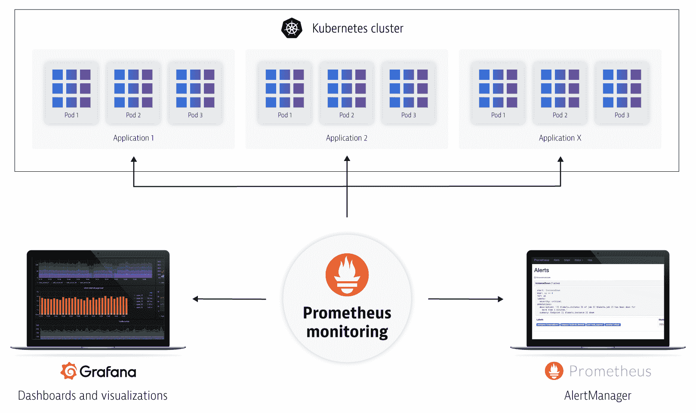
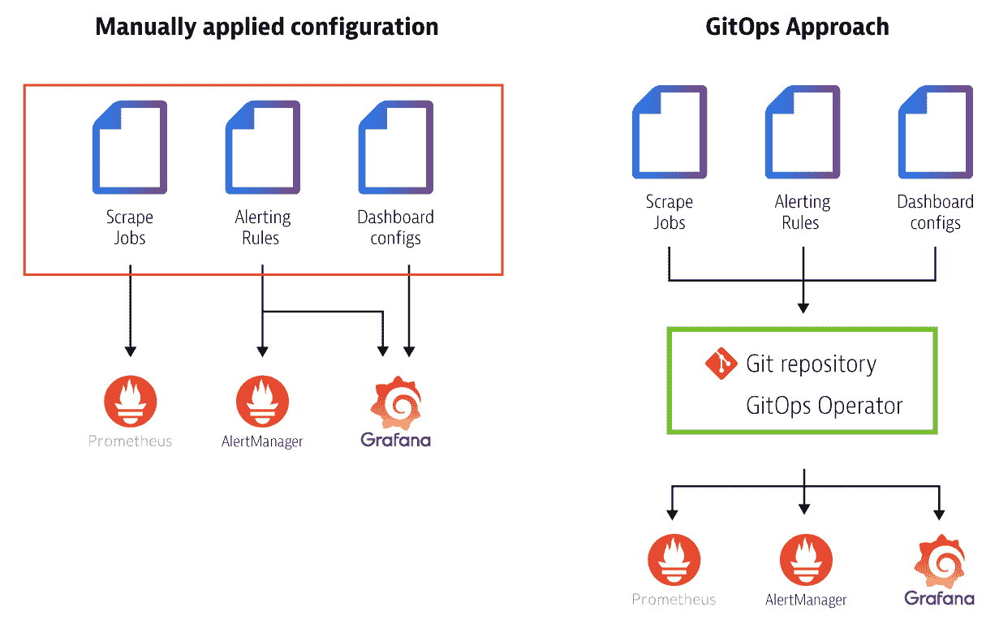
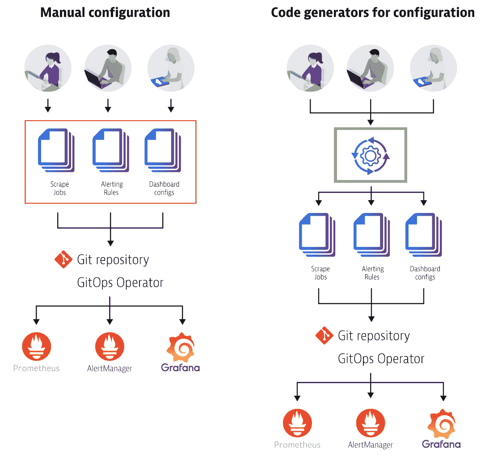
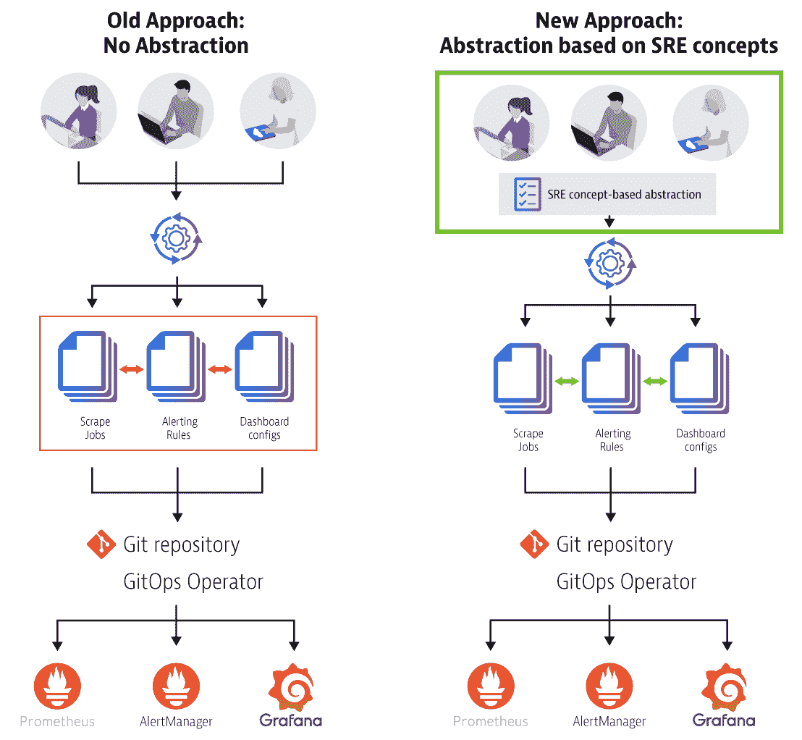

# 使用 Prometheus 监控 Kubernetes 的 3 个关键配置挑战

> 原文：<https://thenewstack.io/3-key-configuration-challenges-for-kubernetes-monitoring-with-prometheus/>

 [于尔根·埃兹尔斯托弗

于尔根是 Dynatrace 的技术策略师。他对云技术、自我修复应用和自动化充满热情。在 Dynatrace 创新实验室，他研究新兴技术以及如何在日常工作中利用这些技术。当他不工作时，你可以发现他在户外，骑自行车，徒步旅行或跑步。可以关注他@jetzlstorfer](https://www.linkedin.com/in/juergenetzlstorfer/) 

可观察性对于在 Kubernetes 集群中运行巨大的工作负载至关重要。Prometheus 是一个监控系统和时间序列数据库，已被证明擅长管理大规模、动态的 Kubernetes 环境。事实上，Prometheus 被认为是在 Kubernetes 上运行应用程序的基础构件，并且已经成为 Kubernetes 环境中可见性和监控的事实上的开源标准。

虽然 Prometheus 是开源的，但是在正确监控 Kubernetes 工作负载所需的配置方面，它并不是免费的。本文是关于 Prometheus 的两部分文章的第一部分，我重点介绍了平台运营商和站点可靠性工程师(sre)在将新工作负载引入 Prometheus 和配置管理 Prometheus 所需的工具生态系统时面临的最常见挑战，以及克服这些挑战的潜在解决方案。

***免责声明**:在本文中，我不讨论 Prometheus 和 multicluster 设置的高可用性设置的挑战。相反，我专注于如何扩展 Prometheus 来装载更多的应用程序，并为每个应用程序创建仪表板，以便更多的人可以使用它。如果你对高可用设置感兴趣，可以参考[灭霸](https://thanos.io/)或 [VictoriaMetrics](https://victoriametrics.github.io/) 等项目。*

为了让 Prometheus 在您的组织中做好准备，您可以配置[抓取](https://prometheus.io/docs/introduction/first_steps/)以从您的服务中提取指标，使用 [Grafana](https://grafana.com/) 在您的数据基础上构建仪表板，并为您的生产环境中突破阈值的重要指标定义警报(见下图)。

一旦您习惯使用 Prometheus 作为您的首选武器，您的下一个挑战将是为您的整个应用程序和环境扩展和管理 Prometheus。自然，自动化是必需的，这样新的应用程序才能快速安全地上线。

对在我们的 Kubernetes 集群中运行的所有应用程序进行自动监控和仪表板管理，可以更轻松、更快速地装载新应用程序。

## **挑战 1:入职和配置应用**

现代工作负载通常由数百或数千个微服务组成，要么是同一应用程序的多个实例，要么是相互通信的不同小型应用程序，所有这些都由 Kubernetes 进行编排。这些工作负载不是在单个集群或单个环境中运行，而是分布在多个集群和环境中(或“阶段”，如*开发*、*强化*和*生产*)。

例如，截至 2019 年底，优步的工作负载[已经增长到超过 4000 个微服务](https://eng.uber.com/optimizing-observability/)。要管理和操作像这样的复杂应用程序，您需要高级的可观察性，这需要为每个应用程序的抓取、仪表板和警报进行专门的配置。您不仅必须创建这些配置，而且还必须将它们应用到每个环境中——这通常是手动完成的，并且是在每次发生变化时以特别的方式完成的。

**问题**:对于 Prometheus 和 Grafana 来说，这一切都代表了在您的生态系统中管理配置的巨大人工工作量。

### **解决方案:利用 GitOps 保持控制**

您可以采用一种[“GitOps”方法](https://thenewstack.io/what-is-gitops-and-why-it-might-be-the-next-big-thing-for-devops/)而不是专门应用配置，在这种方法中，Git 存储库保存所有配置、文档和代码，并且操作员组件自动将其应用到要管理的相应系统，例如 Prometheus、Grafana 甚至 Kubernetes 集群。所有更改必须首先提交到 Git 存储库，然后同步到 Prometheus、Grafana 或其他工具，而不是对 Prometheus 配置或 Grafana 仪表板进行直接更改——维护一个集中的 Git 存储库作为真实信息的单一来源。

GitOps 方法的众多好处之一是能够对所有配置和审计日志进行版本控制，以识别每次变更发生的时间和*原因*。在有问题的变更的情况下，您有能力轻松地回滚它们。通过将 Git 作为中央存储库，工作流与已经将其工作流基于 Git 的开发人员保持一致。使用这种方法，您还可以使用已经在开发过程中证明成功的[拉请求](https://docs.github.com/en/github/collaborating-with-issues-and-pull-requests/about-pull-requests)的概念来升级配置(即，在下一阶段应用之前)。

下图显示了一个 Git 存储库和一个作为中间层添加的操作符，用于管理所有配置文件。操作员必须拥有将配置应用到底层系统的逻辑和权限。

手动应用配置与 GitOps 方法。

## **挑战 2:手动创建配置和仪表板**

第一步是建立一个受版本控制的 GitOps 单一数据源，并将所有配置保存为代码。但是还是有很多手动配置要处理。

编写和学习 Prometheus [PromQL](https://prometheus.io/docs/prometheus/latest/querying/basics/) 查询不是一项简单的任务，这只是大局的一部分。除了 PromQL，您还需要 Grafana dashboard 配置(用 JSON 编写)来全面了解您的应用程序。您还需要 Prometheus 中的警报规则(用 Yaml 编写)来为生产问题设置警报。您可能还需要一两个工程师来编写 PromQL 或创建警报规则，这需要与在 Grafana 中配置仪表板不同的技能。

**问题:**你需要一个精通不同配置语言的工程师团队来编写和维护所有的手动配置。

### **解决方案:代码生成支持扩展**

代码生成拯救世界！您可以使用代码生成器来减轻手工工作，而不是手工为 Prometheus 及其警报管理器编写查询和规则，以及为 Grafana 编写仪表板配置。

一个很好的例子是[基于 SRE 概念生成普罗米修斯警报和记录规则](https://promtools.matthiasloibl.com/)，例如[金色信号](https://landing.google.com/sre/sre-book/chapters/monitoring-distributed-systems/#xref_monitoring_golden-signals)或[红色方法](https://thenewstack.io/monitoring-microservices-red-method/)，甚至[使用方法](http://www.brendangregg.com/usemethod.html)，它们被广泛认为是最有用和最关键的指标。另一个例子是生成 Grafana 仪表板(例如，参见 GitHub 网站上的 [uber / grafana-dash-gen](https://github.com/uber/grafana-dash-gen) 、[metal matze/SLO-libsonnet](https://github.com/metalmatze/slo-libsonnet)和[Prometheus-operator/kube-Prometheus](https://github.com/coreos/kube-prometheus)，以及 Grafana Labs 网站上的[脚本仪表板](https://grafana.com/docs/grafana/latest/reference/scripting/))。

底线:使用代码生成器加速配置工作。生成的文件存储在 Git 存储库中，以获得我前面讨论的所有好处。下图比较了手动配置和代码生成配置，并展示了后一种方法如何完成繁重的工作并减少用户出错的机会。

手动编写配置与使用代码生成器。

## **挑战 3:配置偏离同步**

一旦您开始使用代码生成器，您最终会得到大量自动生成的配置文件。这些存储在 Git 存储库中的配置是相互独立的。没有控制机制使它们基于相同的输入文件；事实上，这甚至是不可能的，因为代码生成器可能依赖于不同类型的输入。

例如:更改代码生成器 1 的输入输出的结果现在与代码生成器 2 或 3 的输出不同步—生成的文件之间没有同步机制。为了减轻这种情况，一个输入的改变可以触发所有生成器的执行，但是实际的问题是每个生成文件的输入是不同的格式，因为代码生成器是独立的解决方案。只有少数解决方案可以解决这个问题，例如[普罗米修斯-操作员/kube-普罗米修斯](https://github.com/prometheus-operator/kube-prometheus)。

**问题:**需要手动工作来对每个输入格式进行所需的更改，并最终创建新一代的配置文件。

### **解决方案:使用抽象来促进重用，并保持生成文件的同步**

软件工程中的抽象促进了重用，同样的概念可以帮助克服配置文件不同步的挑战。引入一种中间语言来涵盖常见的 SRE 概念有助于提供相互理解和技术基础。

下图显示了引入一种中间语言，如 jsonnet 或您自己定义的语言，如何允许您定义通用概念并为不同的平台(如 Prometheus 和 Grafana)生成特定的配置文件。使用这种高阶编程语言使您能够抽象实现细节。您使用的语言必须提供所有在普罗米修斯监控领域流行的概念。

近年来，关注源自 SRE 社区的术语和概念已成为共识。一个成熟的概念是建立在服务水平目标(SLO)的概念之上，允许您为每个微服务定义目标。将它放入机器和人类可读的代码中(使用 Yaml 文件),允许您为多个工具生成配置，并使所有配置符合定义的服务级别目标。这降低了复杂性，并使其更容易应对 Prometheus 环境的运行和扩展。

比较和对比无抽象的旧方法和 SRE 基于概念的抽象的新方法。

但这只是故事的一半！在第二部分中，我将详细介绍 Prometheus 如何在与另一个名为 Keptn 的开源解决方案结合使用时，更快地为您的 K8s 环境提供自动化的高级可观测性。

<svg xmlns:xlink="http://www.w3.org/1999/xlink" viewBox="0 0 68 31" version="1.1"><title>Group</title> <desc>Created with Sketch.</desc></svg>