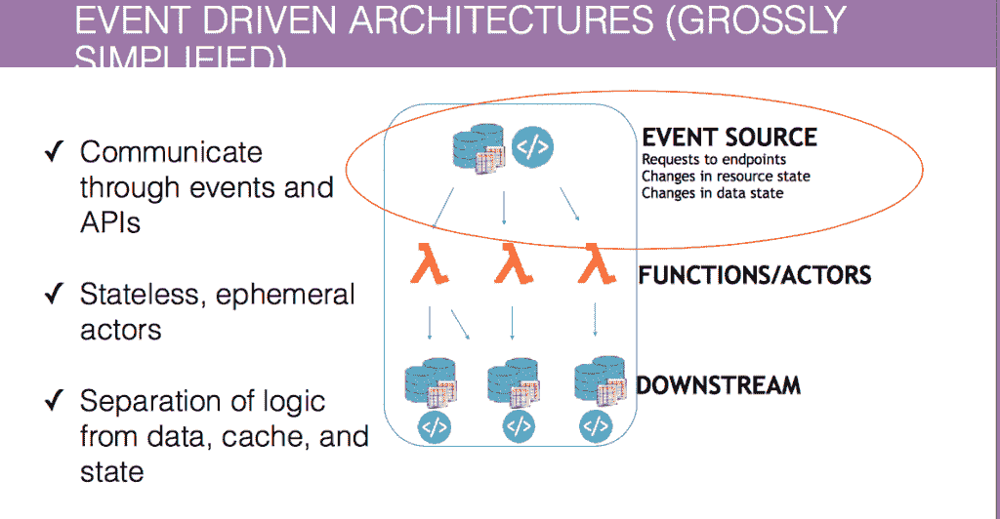
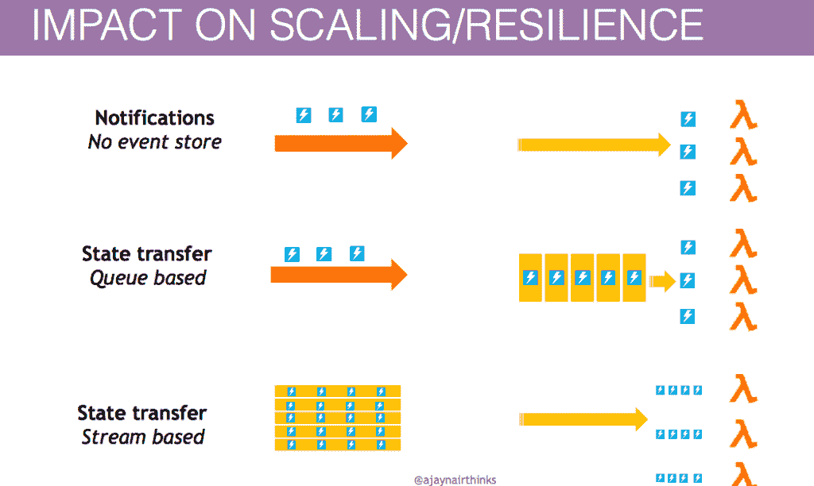
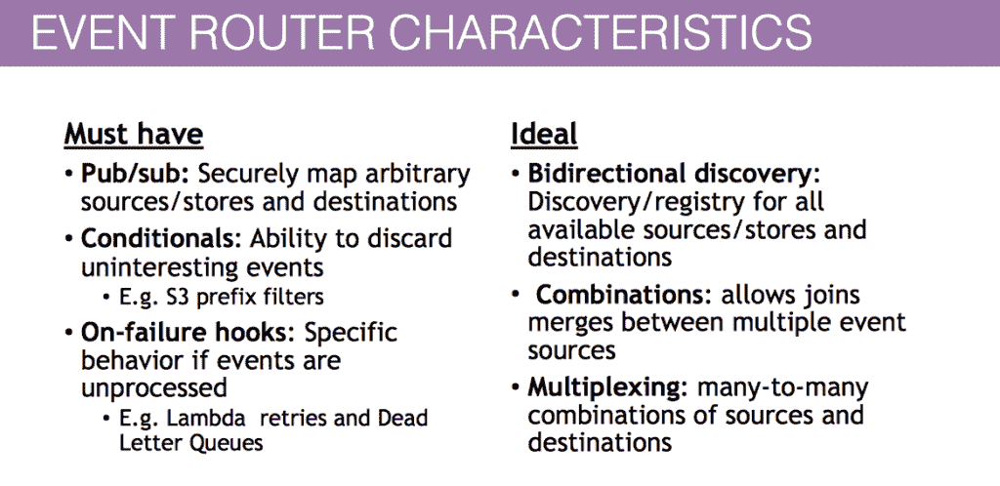
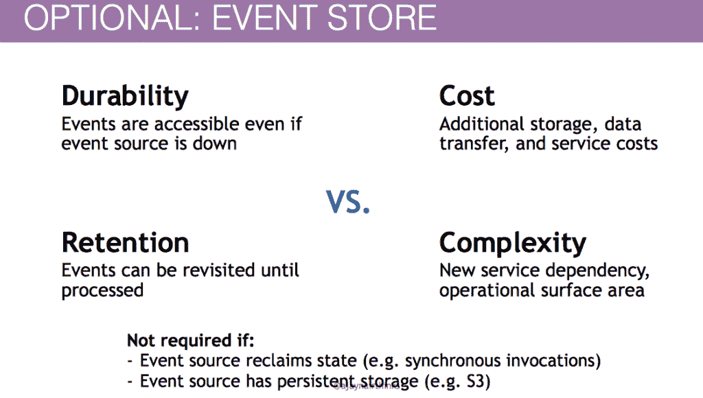

# 事件驱动架构的三个关键设计考虑因素

> 原文：<https://thenewstack.io/3-key-design-considerations-event-driven-architecture/>

为什么一家公司会对迁移到事件驱动架构(EDA)感兴趣？亚马逊网络服务(AWS)的首席产品经理 Ajay Nair 最近在旧金山举行的 [Emit 无服务器会议](https://serverless.com/blog/key-takeaways-for-the-future-of-serverless-emit-2017/)上发言时举了一个例子。

一个 AWS Lambda 客户在生产中有 130 个功能。Nair 解释说，迁移到 EDA 后，部署时间从 30 分钟减少到了几秒钟。现在，每月交付的功能增加了 15 倍，成本降低了 97%。他说，该公司能够实现交叉效益、敏捷性和上市时间。

Emit 会议的重点是事件驱动架构，AWS 正在引领这项新技术的推广。奈尔说，在这个新世界里，做一个好公民很重要。归结起来就是一个简化的架构实践。“所有的逻辑都体现为功能，”他说。“有一些被称为事件的东西触发了这些功能，然后这些功能与下游的东西进行对话，这些东西反过来可能是事件过程或原型或作用于特定事物的演员，”他解释道。

关键特征是 EDA 通过 API 和事件进行通信，参与者是短暂的和无状态的。这将逻辑从数据、缓存和状态中分离出来。

那么，在这种特殊的环境中，如何成为一个有效的事件源提供者呢？奈尔[提出了三个关键考虑因素](https://s3-us-west-2.amazonaws.com/emit-website/2017-slides/Being+a+good+citizen+in+an+event+driven+world.pdf)。

EDA 简化版

## 有效载荷设计

从一个好的思考过程开始，思考你对事件过程本身的设想是什么。“如果它需要你的服务参与其中，”奈尔说，“那就做个通知。”如果是可以转发的东西，那么就完全断开连接，把有效载荷放在通知中。

EDA 对缩放的影响

他说，要明智地选择你的有效载荷。不要把你不需要的信息储存得太多。作为基线，所有事件必须包含普罗维登斯信息。消息来源是谁？什么时候发生的？事件的相关性是什么？奈尔指出，时间戳信息特别有用。

接下来会发生什么取决于你对事件场景的看法。一种方法是使用事件作为通知。这个事件告诉你一些有趣的事情发生了。奈尔的一位队友称之为“被动-攻击性通知”，他说，“从某种意义上说，‘我会告诉你发生了什么，但如果你想知道更多，你必须回来和我谈谈。我不会告诉你发生了什么。"

奈尔说，这样做的代价是，你可以有更多跨军种的实时交流。但是，您最终会得到一个更紧密的耦合，因为现在每个下游服务都知道上游服务。另一个重要的权衡是事件源上的潜在流量翻倍。"你能接受额外的流量吗？"他问。

事件路由特征

这假设该函数有能力与原始服务对话，并询问该事件的有趣之处。第二种模式是相反的，在这种模式下，你不能与事件源顶嘴。奈尔说，这在联网设备的故事中是有意义的，物联网设备正在创造事件。或者如果你的服务没有一个公共的端点或者一些客户可以回叫你的东西。

在这些场景中，开发人员将把有效负载放在对象本身上。缺点是你要处理更多的数据。Nair 指出，你现在必须考虑事件中实际包含的安全结构，以及它是如何传递的。

所以，如果你是一个供应商，他说，考虑一下这些事情中哪些对你来说是重要的。您传递给下游包裹的信息是否有价值，值得停留在有效载荷本身中？或者你会要求它和你说话吗？它可以是一个简单的回拨网址，你把它放在那里说，“嘿，这是你回拨的方式，当你准备好的时候，如果你需要和我说话。”

## 事件存储

奈尔解释说，自我列出的事件并不真的产生，事件流可能是向前发展的关键部分。尽管有些场景是可选的，但是队列和流为事件的重放、重新创建和继续提供了一种持久可靠的方式。

“如果你有状态转移，而你的事件源没有状态的概念，”奈尔说，“它需要在某个地方着陆。”最好的解决方案是在中间放置一个事件存储。他说:这是一个重要的决定，不能掉以轻心。

从好的方面来看，活动商店提供了增强的潜在持久性和保留。使用事件存储，即使事件源关闭，事件仍然可用。由于事件仍然在那里，它们可以被重新访问、重放，用于恢复的生产存储。

他说，这里最典型的场景是事件源模型。“如果你有一个数据存储，可以存储你的链接、博客和发布，你会希望它进入一个持久的存储，然后你可以回去重放。”

缺点是需要额外的存储空间。此外，数据传输和保留增加了另一项功能的复杂性，因此也产生了服务成本。

可选项:事件存储

有两种情况不需要事件存储。第一种情况是，您是否正在使用 S3 模型或另一个具有持久存储的事件源。第二种是国家顶嘴的情况。“这是一种奇特的说法:如果是同步调用，就不用麻烦了，”他说。

有两种基本的事件存储模型:流和队列。streams 模型的优点是可以按顺序处理您的事件，并且多个使用者可以处理同一个事件列表。

缺点是如何在套件中所有这些不同的有序集合中处理事件的分片或分布。并发受到限制。路由/过滤规则更加复杂。

奈尔说:“队列就像一个持久的存放处。”因此，在客户的整个设备群停机的情况下，未处理的数据不会丢失。因为事件本身存在于队列中，所以您可以获得更好的可伸缩性和易用性，并且它提供了对事件的并发处理。

要考虑的缺点是事件的顺序没有保证，并且消费者有限。

Nair 说，“考虑‘我是否公开，比如说，一个事件流或一个事件队列，然后任何消费者都可以去发布它’是有价值的。”"

## 标准路由器

要做的第三个决定是关于路由器的可能用途。奈尔说，开发者需要考虑路由器需要具备哪些能力。很多 EDA 功能都被隐含地绑定到下游参与者。在许多情况下，您会发现服务提供商以某种形式体现了这些功能。Lambda 允许你在上面运行 pub 子结构。这使您能够安全地将多个源关联到多个目的地。

他说，在一个活动无处不在的世界里，确保任何制作活动的人都获得授权，任何消费活动的人都获得授权是至关重要的。此外，确认发出这种信号的人就是说这种信号的人。

例如，他说，“你不希望有人说‘我的账户上有一笔 10 万美元的存款’，然后在其他人都不知道的情况下把它偷偷放入事件流中。”确保映射器本身具有在这两者之间安全映射的能力至关重要。

<svg xmlns:xlink="http://www.w3.org/1999/xlink" viewBox="0 0 68 31" version="1.1"><title>Group</title> <desc>Created with Sketch.</desc></svg>