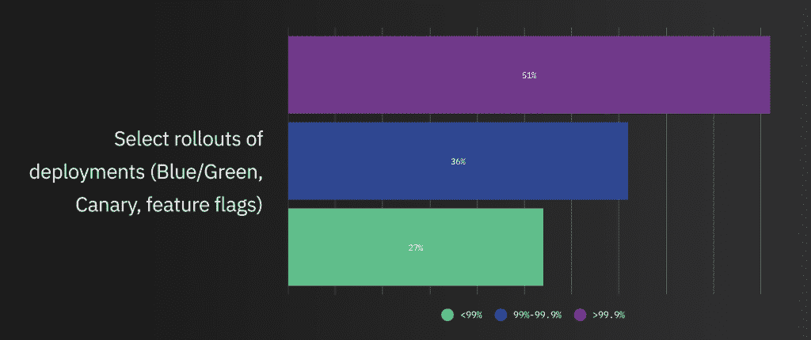

# 关于混沌工程状态的 3 个要点

> 原文：<https://thenewstack.io/3-key-takeaways-about-the-state-of-chaos-engineering/>

 [马修·福纳奇里

马特是 Gremlin 的联合创始人兼首席技术官。此前，他是 Salesforce 的高级平台工程师，负责提升查看和编辑每条记录的体验。在此之前，他改善了亚马逊零售网站的可靠性和客户体验，在那里他成立了 *Fatals* 团队，该团队在第一年将网站错误数量减少了一半。](https://www.linkedin.com/in/mattforni/) 

我做混沌工程已经将近十年了，可以追溯到我在亚马逊的时候——而作为一名工程主管，我成立了“Fatals”团队。我们负责诊断代码质量的缺陷，开发创新工具来分析和解决整个亚马逊平台的系统故障。

为什么混沌工程——以及更广泛的 SRE——主要诞生于亚马逊、网飞和谷歌这样的公司，这并不神秘。这些公司拥有庞大、复杂的系统，用户群强烈感受到停机带来的痛苦。看看顶级电子商务公司的停机时间的[成本，亚马逊因网站停机每分钟的*损失大约 20 万美元。*](https://www.gremlin.com/ecommerce-cost-of-downtime/)

然而，今天几乎所有的企业都是在线企业。疫情只是加速了许多公司的这种转变。五年前，我们成立了 Gremlin，其使命是通过教育和工具让互联网变得更加可靠，帮助客户采纳我和我的联合创始人科尔顿·安德鲁斯多年来在亚马逊、网飞和 Salesforce 等公司工作积累的实践。我们知道云和微服务的普及会增加每个人的复杂性。我们喜欢说，如果你想成为亚马逊或网飞，那么你最好准备好接受随之而来的挑战！

亚马逊和网飞的所有互联服务

简而言之，今天的系统过于分散和复杂，任何一个工程师或团队都无法完全理解。那么，作为一个行业，我们该如何回应这个事实呢？我听过很多人说:“我的系统已经够乱了，我们不需要再添加了！”这正是我们需要消除的态度。混沌工程不是添加**随机**混沌，而是引入**控制的**混沌——以验证我们的假设，并更好地理解当系统行为不当时实际发生了什么。无论您是否决定解决这些问题，这些问题都将继续存在于您的系统中，因此，为什么不在正常工作时间通过[游戏日](https://www.gremlin.com/community/tutorials/introduction-to-gamedays/)主动促使这些问题显现出来，而不是在不可预测的时间让客户面对中断呢？

在过去的五年里，Gremlin 团队付出了同样多的努力来推动在运营中更加积极主动的文化转变，就像我们为安全可靠地运行实验而开发工具一样。我们想对工程团队如何采用和理解混沌工程有一个大概的了解，这让我们产生了第一份 [*混沌工程状态报告*](https://www.gremlin.com/state-of-chaos-engineering/2021/?soce2021=true) *。*以下是我的一些要点:

**1)一致的混沌工程=更高水平的可用性:**很高兴看到这个基本论点得到了市场的验证。当然，我们早就知道提前解决问题可以为公司节省时间和金钱，并提高他们的整体可靠性。但是对于任何新的纪律，更重要的是看到重复和习惯的形成。最成功的组织不仅将混沌工程作为一种实践，他们还定期执行攻击**。可用性大于 99.99%的公司中有 45.9%至少每季度对**进行一次攻击**。**

 **

高可用性的公司是早期采用者。率先采用 canary deployments 和 feature flagging 等现代实践的公司，也是报告最高可用性水平(99.9%以上正常运行时间)的公司。报告中特别关注的工具是 DNS 故障转移/弹性 IP、断路器和部署的精选部署。这突出了混沌工程是高绩效团队正在采用的更大的工具和过程集的一部分。

【T2

**3)首席执行官需要更多地参与到恢复工作中来。事实是，你激励的工程文化就是你将拥有的文化。因此，举例来说，如果你只根据产品速度提升工程师——而不是根据这些新功能经过测试和能够承受失败的程度——那么你的工程师就不会优先考虑可靠性。这是网飞混沌猴背后的动力；工程师们知道，在任何时候，服务器都可能被拔掉，他们的系统必须能够承受这些故障。下面的图表应该是对所有高管的行动号召，让他们对你的团队所做的工作产生更大的兴趣，以使你的产品更可靠，并改善你的客户体验。**

我们期望继续看到混沌工程实践的广泛采用，并期待在下一份报告中揭示新的趋势。混沌工程社区继续看到新面孔和天才工程师在传播这个学科。我们很乐意听到更多关于你的团队如何处理混沌工程的信息——如果你需要帮助，请不要犹豫，在 Twitter 上联系我！

通过 Pixabay 的特征图像。

<svg xmlns:xlink="http://www.w3.org/1999/xlink" viewBox="0 0 68 31" version="1.1"><title>Group</title> <desc>Created with Sketch.</desc></svg>**