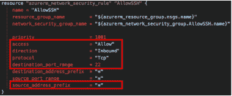

# 关于云安全的 3 个误区

> 原文：<https://thenewstack.io/3-myths-about-cloud-security/>

[帕洛阿尔托网络公司的 Prisma](https://www.paloaltonetworks.com/prisma/cloud) 在 2020 年 2 月 11 日举行的[云本地安全直播，2020 年虚拟峰会](https://vshow.on24.com/vshow/Palo_Alto_Networks/registration/16700)之后，赞助了这篇文章。

> "在集中精力满足今天的需求时，我们决不能被昨天的神话所束缚。"
> –[哈罗德·s·加宁](https://books.google.fr/books?id=h4hFBgAAQBAJ&pg=PR23&lpg=PR23&dq=%E2%80%9CWe+must+not+be+hampered+by+yesterday%E2%80%99s+myths+in+concentrating+on+today%E2%80%99s+needs.%E2%80%9D&source=bl&ots=0gU2wklWs8&sig=ACfU3U0appEBamUa-w2WUvxcS086TkMknw&hl=en&sa=X&redir_esc=y#v=onepage&q=%E2%80%9CWe%20must%20not%20be%20hampered%20by%20yesterday%E2%80%99s%20myths%20in%20concentrating%20on%20today%E2%80%99s%20needs.%E2%80%9D&f=false)，ITT 前总统，美国商业领袖和 IT 先驱。

在每个领域和每个时代，都有随着时间推移而发展的神话。有些是有益的，有些是有害的。以云安全为例，有很多。我想不出比“公共云比本地数据中心更安全”更普遍的说法了，我应该知道，因为很长时间以来，我自己也相信这一点。

但是在与世界各地数百家企业合作并与 [Unit 42 云威胁研究团队](https://unit42.paloaltonetworks.com/)一起分析数 Pb 的数据后，我现在知道这根本不是真的。让我们一起努力，寻找更好的前进道路。

### 误区 1:公共云比内部数据中心更安全

 [马特·乔迪

Matt 拥有近二十年的安全领导经验，目前是 Palo Alto Networks 公共云的首席安全官。他经常在 RSA 等行业活动上发表博客和演讲。他目前领导着云威胁团队，这是一个专注于公共云问题的安全研究人员精英团队。他还是罗格斯大学网络安全证书项目的顾问委员会成员，也是 IANS Research 的成员。](https://www.linkedin.com/in/mattchiodi/) 

这是云服务提供商(CSP)十多年来一直宣称的。当组织接受调查时，通常最担心的安全问题之一与云有关。因此，宣传云比目前大多数计算都存在的本地云更安全的概念是很好的。但让我们明确一点，CSP 在确保他们在共担责任模式中的份额方面有着非常出色的记录。像最近《福布斯》文章中引用的[这样的例子少之又少。这是云的安全性与客户在云中的责任。](https://www.forbes.com/sites/zakdoffman/2020/01/30/severe-perfect-100-microsoft-flaw-confirmed-this-is-a-cloud-security-nightmare/#3a61db16b4a4)

我清楚地记得在以前的工作中，我们的首席安全官曾经问我，“你真的认为云比我们的数据中心更安全吗？”对此，我自信地回答道:“当然！”回想起来，我大错特错了。因为尽管公共云有可能比传统数据中心更安全，但大多数组织都没有这样配置这些环境。

在 [2019 Unit 42 云威胁报告](https://unit42.paloaltonetworks.com/cloudy-with-a-chance-of-entropy/)中，Unit 42 的研究人员发现，65%的云安全事件是客户错误配置的结果。同样，云提供商在提供安全服务(API 等)方面做得很好。)到云消费者。但在向云消费者提供集成、全面的平台级控制方面，他们还有改进的空间。

根据[共享责任模型](https://www.paloaltonetworks.com/resources/videos/public-cloud-security-is-a-shared-responsibility)，许多组织从概念上理解他们在云中有安全工作要做。然而，他们往往无法将必要的流程和控制措施落实到位，以使其持续发生。这个流言可能有潜在的心理学基础，还是另有隐情？

### 误解 2: DevSecOps 只是在 DevOps 中增加了“安全”或“扫描”

我在这里包括了这个，因为根据我的经验，DevSecOps 是公共云的同义词。是的，它也可以包括内部部署。然而，我们只在一些最先进的环境中看到这种情况，这些环境在高度定制的私有云中运行 API 驱动的工作负载(想想整个数据中心，它们是围绕特定工作负载(例如游戏)专门构建的)。

DevSecOps 不仅仅是运行安全扫描器。DevSecOps 将彻底改变安全性作为一项功能的计划和执行方式。在当今的大多数组织中，安全是一个独特的、孤立的功能。开发人员和安全部门之间没有太多的互动——除了在产品发布前几天扫描一个新应用程序并发现一系列关键漏洞的时候。

当安全团队、开发人员和 IT 团队都倡导并以代码的形式交付基础设施和安全性时，车轮开始向 DevSecOps 移动。这主要是通过不可变的基础设施来完成的，如基础设施即代码(Iac)模板，如 AWS CloudFormation、HashiCorp Terraform 和 Azure Resource Manager (ARM)。

从历史上来说，安全团队和代码是不相容的。但在云原生时代，势在必行。组织当然也在朝着这个方向前进。在 [Unit 42 云威胁报告:2020 年春季](https://unit42.paloaltonetworks.com/cloud-threat-report-intro/)中，研究人员在 IaC 模板中发现了超过 199，000 个漏洞。发现 CloudFormation 模板是最易受攻击的，42%的模板注册了至少一个或多个高或中等严重性的漏洞。当然，IaC 模板是 DevSecOps 程序的关键组成部分。然而，如果模板本身配置不正确，这就意味着不幸的是，这个问题将被大规模复制。

不安全的 Terraform 模板:暴露于整个互联网的端口 22 上的 SSH 服务。

希望从 DevOps 转变为 DevSecOps 的组织应该首先关注人员和流程。在最近的一次网络研讨会上，我推荐了组织在进行这一转变时可以采取的五个战略步骤。

### 误解 3:CSP 天生提供公司需要的所有安全控制

这个神话与第一个密切相关，但有不同的摩擦。虽然第一个问题在不同程度上被划分到了共享责任模型中，但这一个问题正好触及到了客户控制(和关注)的范围。

当向客户提供任何服务时，提供服务的业务部门有责任确保从默认的第一天起就有足够的保护措施。尽管云消费者在很大程度上逃避了他们在共担责任模式中的责任，但电信运营商在积极推出新功能的同时还可以做得更多。

新功能是任何平台的生命线，企业已经开始依赖通信服务提供商提供的创新。然而，如果作为新功能的一部分，没有同样有用的嵌入式安全特性[和安全默认值](https://unit42.paloaltonetworks.com/hunting-the-public-cloud-for-exposed-hosts-and-misconfigurations/)，那就说明有问题。是的，通信服务提供商在他们的平台上有一些基本的安全控制，并且他们会随着时间的推移不断增强这些控制。然而，组织需要的不仅仅是 CSP 本身能够提供的。在最近 [Gartner 对公共云用户的调查](https://www.gartner.com/smarterwithgartner/why-organizations-choose-a-multicloud-strategy/)中，81%的受访者表示他们正在与两家或两家以上的电信运营商合作。企业级安全性需要跨多个云提供商和混合云的可见性和控制。这就是为什么早在 2013 年，一个围绕 IaaS & PaaS 安全的整个行业就兴起了，Evident.io、RedLock 和 Twistlock 等初创公司一直处于领先地位。

结论:永远不要相信，永远要验证

> 正如加宁所说:“我们在集中精力满足今天的需求时，决不能被昨天的神话所束缚。”

加宁的话当然适用于云计算。作为安全专业人员，推动我们的组织进入[云原生](https://thenewstack.io/why-the-age-of-the-cloud-native-security-platform-is-here-to-stay/)世界是我们的职责。这意味着我们必须做三件事:

1.  提倡[零信任安全模型](https://www.paloaltonetworks.com/cyberpedia/what-is-a-zero-trust-architecture)，它遵循“永远不信任，永远验证”的原则。
2.  通过 IaC 模板促进和鼓励自动化和可扩展的安全性。
3.  采用[云原生安全平台](https://thenewstack.io/why-the-age-of-the-cloud-native-security-platform-is-here-to-stay/)，该平台可与多个云服务提供商 API 紧密协作，并可有机集成到开发管道中，无论管道位于何处。

为了获得云提供的所有业务优势，我们必须确保用事实和行动来破除神话。

关于云中的安全性，还有无数其他的神话。我错过了哪些？在 [LinkedIn](https://www.linkedin.com/in/mattchiodi/) 上联系我，让我知道。

*欲了解安全思想领袖的更多见解， [Cloud Native Security Live，2020 虚拟峰会](https://vshow.on24.com/vshow/Palo_Alto_Networks/registration/16700)为您提供了一个向开发人员、DevOps 专业人员和 it 领袖学习经验和专业知识的机会，他们在容器技术和 DevSecOps 方面都有很大的利益。由 Palo Alto Networks 的 Prisma 主办，与 New Stack 合作，您仍然可以虚拟地参加 2020 年 2 月 11 日举行的活动，参加一整天关于云原生安全性的讨论，无论您身在何处，都可以在线参加。*

图片来自 Pixabay。

<svg xmlns:xlink="http://www.w3.org/1999/xlink" viewBox="0 0 68 31" version="1.1"><title>Group</title> <desc>Created with Sketch.</desc></svg>