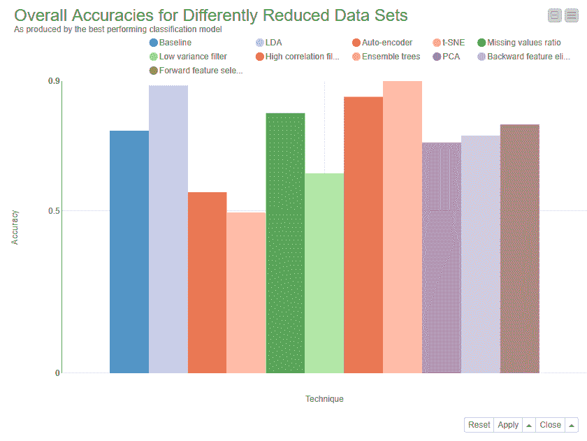
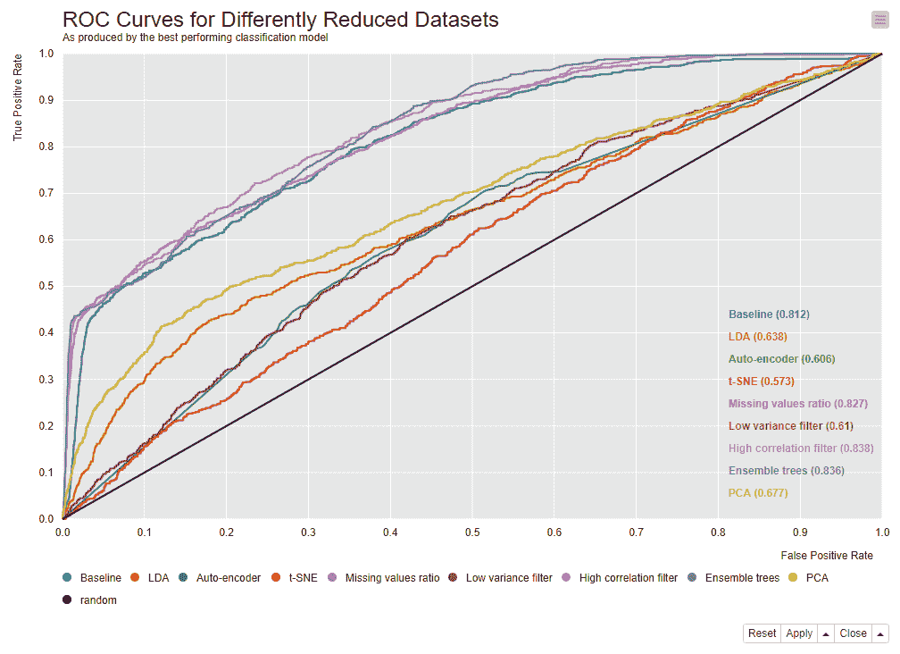
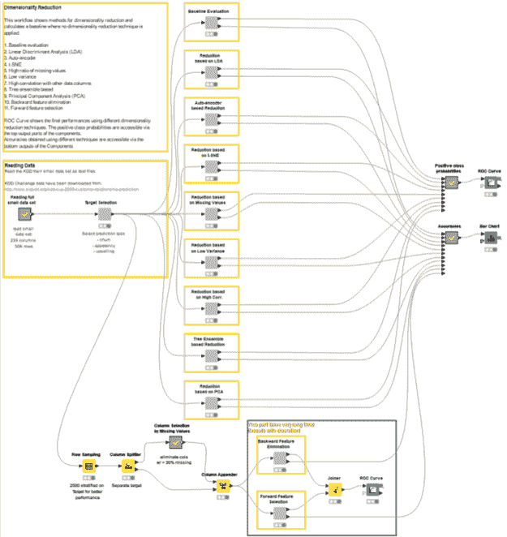

# 3 机器学习中数据降维的新技术

> 原文：<https://thenewstack.io/3-new-techniques-for-data-dimensionality-reduction-in-machine-learning/>

 [玛瑞特·威德曼

玛瑞特·威德曼是 KNIME 的一名初级数据科学家。她从定量社会学开始，拥有社会科学学士学位。康斯坦茨大学让她丢掉了理科硕士的“社会”。她的目标是通过视频和博客帖子向他人传达数据科学背后的概念。在 LinkedIn 上关注 Maarit。](https://www.linkedin.com/in/maarit-widmann-02641a170/) 

大数据的全面爆炸让我们相信越多越好。虽然大量的训练数据确实有助于[机器学习](https://thenewstack.io/category/machine-learning/)模型学习更多的规则并更好地推广新数据，但不加选择地添加低质量数据和输入特征可能会引入过多的噪声，同时大大降低训练算法的速度。

因此，在存在具有大量数据列的数据集的情况下，最好弄清楚这些数据特征中有多少实际上为模型提供了信息。有许多数据降维技术可以用来估计每一列的信息量，如果需要的话，可以从数据集中剔除。

早在 2015 年，我们[确定了](https://www.knime.com/blog/seven-techniques-for-data-dimensionality-reduction)七种最常用的数据降维技术，包括:

这些是传统技术，通常用于通过删除所有没有带来太多信息或没有添加新信息的列来降低数据集的维度。从那时起，我们开始使用三种额外的技术，也是非常常用的，并且也将它们添加到列表中。

让我们从最近增加的三种技术开始，然后回顾一下最初的七种技术。

## 数据集

 [罗莎丽亚·西里波博士

Rosaria Silipo 博士是 KNIME 的首席数据科学家，她是 50 多种技术出版物的作者，其中包括她的新书《实践数据科学:案例研究集》她拥有生物工程博士学位，并在多个领域为公司从事数据科学项目工作超过 25 年，包括物联网、客户智能、金融行业和网络安全。在 Twitter 和 LinkedIn 上关注 Rosaria。](https://www.linkedin.com/in/rosaria/) 

在我们对数据降维技术的第一次回顾中，我们使用了来自 2009 年 KDD 杯  [的两个数据集:大数据集和小数据集。大型数据集的特殊性在于其非常高的维度，包含 15，000 个数据列。大多数数据挖掘算法都是按列实现的，这使得它们随着数据列数的增加而越来越慢。这个数据集无疑带来了许多机器学习算法的缓慢。](http://kdd.org/kdd-cup/view/kdd-cup-2009)

KDD 杯 2009 小数据集的维数肯定比大数据集低，但仍具有相当多的列:230 个输入要素和三个可能的目标要素。数据行数与大型数据集中的数据行数相同:50，000。在这篇综述中，由于计算的原因，我们将集中在小数据集上，以显示所提出的技术在降低维数方面是多么有效。数据集大到足以证明数据降维的重要性，也小到足以在合理的时间内证明这一点。

现在，让我们继续(重新)实施和比较 10 种最先进的降维技术，所有这些技术都是当前可用的，并且普遍用于数据分析领域。

### 数据降维的另外三种技术

让我们从三种新增加的技术开始:线性鉴别分析(LDA)，神经自动编码器和 t-分布式随机邻居嵌入(t-SNE)。

**线性判别分析**

产生具有 *m < n，*的 *n* 个输入特征的多个 *m* 线性组合(判别函数),以使其不相关并最大化类别分离。这些判别函数成为数据集的新基础。数据集中的所有数字列都被投影到这些线性判别函数上，有效地将数据集从第 *n* 维移动到第 *m* 维。

为了将 LDA 技术用于降维，必须首先选择目标列。缩减维度的最大数目 *m* 是目标列中的类的数目减一，或者如果更小，则是数据中的数字列的数目。请注意，线性判别分析假设目标类别遵循多元正态分布，具有相同的方差[，但每个类别的均值不同](https://mail.google.com/mail/u/1/#m_-4943796153391674311_m_-786067132956420159_m_-17321881141686)。

**自动编码**

一个[自动编码器](https://kni.me/w/gW4nBo8ylCMIeP0D)是一个神经网络，用尽可能多的 [*n*](https://kni.me/w/gW4nBo8ylCMIeP0D) 个输出单元作为输入单元，至少一个隐藏层用 [*m*](https://kni.me/w/gW4nBo8ylCMIeP0D) 个单元，其中 [*m < n*](https://kni.me/w/gW4nBo8ylCMIeP0D) ，并用反向传播算法进行训练，将输入向量再现到输出层。它通过使用隐藏层的输出表示输入向量来减少数据中的数字列。

自动编码器的第一部分(从输入层到 *m* 单位的隐藏层)称为编码器。它将输入数据集的 *n* 维压缩到 *m* 维空间中。自动编码器的第二部分(从隐藏层到输出层)称为解码器。解码器将数据向量从 *m* 维空间展开为原始 *n* 维数据集，并将数据带回其原始值。

**t 分布随机邻居嵌入(** **t-SNE)**

该技术基于数据点之间的非线性局部关系将数据集中的 *n* 个数值列缩减为更少的维度*m(m<n】*。具体而言，其通过二维或三维点以这样的方式对每个高维对象进行建模，即，在新的较低维度空间中，相似对象通过附近的点进行建模，而不相似对象通过远处的点进行建模。

在第一步中，通过数值列的多元正态分布对数据点进行建模。在第二步中，这个分布被一个更低维的 t-分布代替，它尽可能地遵循原始的多元正态分布。t 分布给出了在数据集中挑选另一个点作为低维空间中当前点的邻居的概率。“困惑度”参数将数据密度控制为“任意点的有效邻点数”困惑值越大，数据中考虑的全局结构就越多。t-SNE 技术仅适用于当前数据集。无法导出模型以将其应用于新数据。

### 七种先前应用的数据降维技术

下面简要回顾一下我们最初的七种降维技术:

*   **缺失值比率**。缺少太多值的数据列不太可能携带太多有用的信息。因此，缺失值比率大于给定阈值的数据列可以被删除。门槛越高，减少的力度越大。
*   **低方差滤波器**。与前面的技术类似，数据中变化很小的数据列携带的信息很少。因此，方差低于给定阈值的所有数据列都可以被移除。注意，方差取决于列的范围，因此在应用这种技术之前需要进行规范化。
*   **高相关滤波器**。趋势非常相似的数据列也可能携带非常相似的信息，并且其中只有一个数据列足以进行分类。这里我们计算数字列之间的[皮尔逊积差相关系数](https://en.wikipedia.org/wiki/Pearson_product-moment_correlation_coefficient)和名义列之间的[皮尔逊卡方值](https://en.wikipedia.org/wiki/Pearson%27s_chi-squared_test)。对于最终分类，我们只保留其成对相关性超过给定阈值的每对列中的一列。注意，相关性取决于列的范围，因此，在应用这种技术之前需要进行规范化。
*   **随机森林/集合树**。决策树集成，通常称为随机森林，除了是有效的分类器之外，对于列选择也是有用的。在这里，我们生成一个大型的、精心构建的树集来预测目标类，然后使用每一列的使用统计信息来查找最具信息性的列子集。我们生成一个很大的非常浅的树的集合(2000 个)(两个级别)，每个树在总列数的一小部分(三列)上被训练。如果一个列经常被选为最佳拆分，那么它很可能是我们应该保留的信息列。对于所有列，我们计算得分的方法是，将该列被选择进行拆分的次数除以它作为候选列的次数。最具预测性的列是那些得分最高的列。
*   **主成分分析**。主成分分析(PCA)是一种统计过程，它将数据集的原始 *n* 个数字维度正交转换为一组新的 *n* 个维度，称为主成分。作为变换的结果，第一主分量具有最大可能的[方差](https://en.wikipedia.org/wiki/Variance)；在与前面的主分量[正交](https://en.wikipedia.org/wiki/Orthogonal)(即不相关)的约束下，每个随后的主分量具有最高的可能方差。仅保留第一个 *m < n* 主成分降低了数据维度，同时保留了大部分数据信息，即数据中的变化。请注意，PCA 转换对原始列的相对缩放很敏感，因此，在应用 PCA 之前，需要对数据进行规范化。还要注意，新坐标(PCs)不再是真实的、系统产生的变量。对数据集应用 PCA 会失去其可解释性。如果结果的可解释性对您的分析很重要，那么 PCA 不是您应该应用的变换。
*   **反向特征消除**。在这种技术中，在给定的迭代中，在 *n* 个输入列上训练所选择的分类算法。然后我们一次删除一个输入列，并在 *n-1* 列上训练相同的模型。删除错误率增加最小的输入列被删除，剩下 *n-1* 个输入列。然后使用 *n-2* 列重复分类，依此类推。每次迭代 *k* 产生一个在 *n-k* 列上训练的模型和一个错误率 *e(k)。*通过选择最大容许误差率，我们定义了使用所选机器学习算法达到分类性能所需的最小列数。
*   **正向特征构建**。这是反向特征消除的逆过程。我们只从一列开始，一次逐渐增加一列，即性能增加最多的列。后向特征消除和前向特征构造这两种算法在时间和计算上都相当昂贵。只有当应用于输入列数量已经相对较少的数据集时，它们才是实用的。

### 准确性和缩减率方面的比较

我们实现了所有 10 种描述的降维技术，将它们应用于 2009 年 T2 KDD 杯的小数据集。最后，我们从约简率和分类精度方面对它们进行了比较。对于基于阈值的降维技术，通过优化循环选择最佳阈值。

对于某些技术，最终精度和降级取决于所选的分类模型。因此，从三个基本模型中选择分类模型作为性能最佳的模型:

*   多层前馈神经网络
*   朴素贝叶斯
*   决策图表

对于这种技术，通过将所有三种分类模型应用于缩减的数据集并采用表现最好的一种来获得最终的准确性。

表 1 中报告了所有技术的总体准确性和曲线下面积(AUC)统计数据。我们将这些统计数据与使用所有列进行分类的基线算法的性能进行比较。

*表 1:基于在 2009 年 KDD 杯小数据集上训练的最佳分类模型的 10 种降维技术的输入列数、缩减率、总体准确度和 AUC 值。*

下面的图 1 显示了每种还原技术的精确度的图形比较。这里，所有的简化技术在 x 轴上报告，相应的分类精度在 y 轴上报告，如从上面提出的三个基本模型的最佳表现模型中获得的。

图一。在使用 10 种选定的数据降维技术进行降维的数据集上训练的最佳性能模型的准确性。

图 2 中的接收机工作特性(ROC)曲线显示了一组性能最佳的技术:缺失值比率、高相关滤波器和系综树方法。

图 2: ROC 曲线显示了在缩减的数据集上训练的最佳分类模型的性能:每个数据集通过不同的维度缩减技术进行缩减。点击放大。

### 实施 7+3 技术

下面的图 3 显示了实施和比较本综述中描述的 10 种降维技术的工作流程。在工作流中，我们看到 10 个并行的分支加上顶部的一个。10 个并行的较低分支中的每一个都实现了所描述的用于数据降维的技术之一。然而，第一个分支在具有 230 个输入特征的整个原始数据集上训练分类模型包。

每个工作流分支通过在缩减的数据集上训练的最佳执行分类模型来产生正类的总体准确度和概率。最后，使用正类概率和实际目标类值来构建 ROC 曲线，并使用条形图来可视化每个数据集的最佳分类模型所产生的准确度。

您可以从 [KNIME Hub](https://kni.me/w/7PBv1kGifxCng2qo) 检查并下载工作流。

图 3:10 种精选降维技术的实现。该工作流的每个分支输出由最佳执行分类模型产生的总体准确性和正类概率。然后，ROC 曲线和条形图比较在减少的数据集上训练的分类模型的性能。可以从 KNIME Hub 下载和检查工作流。

## 总结和结论

在本文中，我们介绍了 10 种流行的数据降维技术。实际上，我们通过添加三种额外的技术，扩展了描述其中七种技术的一篇已有文章。

我们在缩减的数据集上训练了几个基本的机器学习模型，并通过缩减率、准确性和曲线下面积将表现最好的模型相互比较。

请注意，降维不仅有助于加速算法执行，还能提高模型性能。

就总体准确性和缩减率而言，随机的、基于森林的技术被证明在去除不感兴趣的列和保留手头分类任务的大部分信息方面是最有效的。当然，这里对 10 种描述的技术的评估、归约和随后的排序被应用于分类问题；我们不能概括为数值预测甚至可视化的有效降维。

本文中使用的一些技术很复杂，而且计算量很大。但是，如结果所示，即使只是计算缺失值的数量、测量列方差和列对的相关性，并将其与更复杂的方法相结合，也可以获得令人满意的减少率，同时保持基准模型的性能不变。

在大数据时代，越多越好，这是不言而喻的，我们重新发现，太多嘈杂甚至错误的输入数据列通常会导致模型性能不令人满意。删除无信息(甚至更糟，错误信息)的输入列可能有助于在更通用的数据区域上训练机器学习模型，具有更通用的分类规则，并且总体上在新的、看不见的数据上具有更好的性能。

*更多关于 KNIME 的信息，请访问[www.knime.com](https://www.knime.com/)和 [KNIME 博客](https://www.knime.com/blog)。*

<svg xmlns:xlink="http://www.w3.org/1999/xlink" viewBox="0 0 68 31" version="1.1"><title>Group</title> <desc>Created with Sketch.</desc></svg>