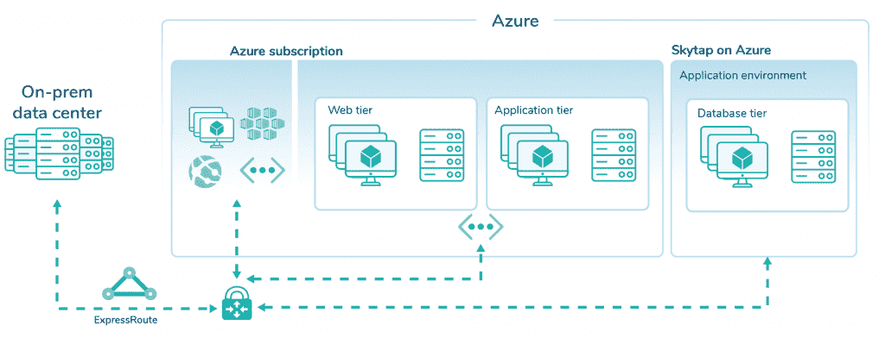

# 安全成功的云迁移的 3 个阶段

> 原文：<https://thenewstack.io/3-phases-to-a-safe-and-successful-cloud-migration/>

 [马修·罗梅罗

马修·罗梅罗是 Skytap 的技术产品宣传员，这是一种在公共云中本地运行 IBM Power 和 x86 工作负载的云服务。Matthew 在支持和创建云技术(尤其是 Microsoft Azure)的技术内容方面拥有丰富的专业知识。他在 3Sharp 和 Indigo Slate 工作了九年，负责管理企业 IT 服务和构建技术演示，在此之前，他在微软服务器和工具业务部门担任了四年的项目和实验室经理。](https://www.linkedin.com/in/matthewromero2021/) 

将复杂的业务关键型应用程序从内部迁移到云时，最安全、最有效的方法包括三个阶段。

在第一阶段，应用程序被“提升并转移”到云中，无需重构。

在第二阶段，IT 可以使用克隆环境来提高软件开发和测试的效率，同时一点一点地重构应用程序以使用云原生服务。即使不使用云原生服务，也可以引入环境构建的增量自动化，从非自动化的工作模型开始，逐步创建完全自动化的版本。

在第 3 阶段，大多数应用程序以云原生格式存在，但它保持着与内部的连接。本文中概述的概念创造了一条快速、安全的云创新之路，同时减少了对现有内部资源的依赖。

让我们详细了解一下这条“通往云的安全之路”。

## 第 1 阶段-提升和移位

在第 1 阶段，本地应用程序在目标云中复制，无需重构。这使 IT 能够将“云灵活性”应用于过去“云顽固”的系统，从而将快速克隆、短暂寿命、软件定义的网络和 API 自动化应用于现在运行在云中的应用程序。这一步完成后，IT 可以将环境“克隆”分发给多个工程团队，让每个团队以更快的速度同时独立工作。

创建将存在于本地的最终记录系统的“克隆”是一种很好的做法，但不要将任何组件重新设计为云原生对等物。创建相同数量的虚拟机/LPAR(逻辑分区)、相同的内存/磁盘/CPU 分配、相同的文件系统结构、相同的 IP 地址、相同的主机名、相同的网络子网等。

第 1 阶段–将应用程序从本地迁移到云，进行有限的架构更改。

请注意，在没有专门修改的情况下，运行在 IBM I 系列或 AIX 上的应用程序不能直接升级并转移到 Azure、谷歌云平台或 T2 亚马逊网络服务。但是，有些解决方案提供商提供这种能力。为这些传统应用程序添加云功能所带来的好处通常会超过这样做的投资成本。

一旦在云中创建了代表一个“环境”的 VM/LPAR 集合，该环境就被保存为一个称为模板的对象。该模板用于复制其他工作环境。克隆是模板的精确副本，包括主机名、IP 地址、子网和磁盘分配。多个环境克隆可以同时运行而不会发生冲突，尽管设置这些环境克隆所需的工作因云提供商而异。

从模板创建即用型环境是基于云的方法中最强大的组件。它提供了参考系统的多个精确副本，分发给众多工程/开发/测试团队，所有这些都可以并行运行。不需要更改单个服务器的 IP 地址或它们的主机名。

每个环境都在一个虚拟数据中心中运行，与其他环境协调一致。如果环境需要与其他本地资源通信，则通过隔离的 NAT 机制进行区分，如下所述。许多环境包含相同的虚拟机克隆基础映像，具有相同的主机名、IP 地址等。

图 2:从本地到云的工作流:应用成为可以克隆的模板。

如有必要，将模板分配给项目，并将这些项目分配给用户组。大多数云提供商提供内置的访问控制/安全模型，因此用户只能处理分配给他们的工作，例如，QA 用户无法看到单独分配给 ENG 的环境。用户还有角色分配，允许他们查看/编辑/管理在分配给项目的环境中定义的 VM/LPAR。

## 如何创建具有重复地址空间的克隆环境

要创建多个复制与最终目标系统相同的网络拓扑的工作环境，必须实现某种形式的隔离，以避免重复环境之间的冲突。在这种情况下，“复制”意味着在每个环境中重复使用相同的主机名、IP 地址和子网。理想情况下，每个环境都应该存在于其自己的软件定义的网络空间中，该网络空间对于正在运行的其他环境是不可见的。每个环境都成为一个虚拟专用数据中心。

这里有一种方法来实现这一点，使用“环境虚拟路由器”(EVR)。克隆环境通过 EVR 与上游本地资源通信，EVR 隐藏包含重复主机名和 IP 地址的较低虚拟机，并向更大的本地网络公开唯一的 IP 地址。这为多个重复环境的和谐共存创造了一种简单而优雅的方式，而不会破坏基本的网络结构。

通过允许存在重复的主机名和 IP 地址，各个主机不必经历容易出错且耗时的“重新分配 IP”过程。与“跳转主机”配对的 EVR 可以配置为转发 ssh 请求([通过 ssh 代理](https://www.techrepublic.com/article/how-to-use-ssh-to-proxy-through-a-linux-jump-host/)，OpenSSH 7.x 和更高版本)，这允许 SSH 进入环境中的每个唯一主机。在本地，用户将通过 SSH 连接到环境中的任何主机(例如 ssh user@environment-1-host-2)，这将向本地公开一个唯一的 IP 地址，然后转发到单个环境中的虚拟机。

图 3:具有重复 RFC 1918 IP 地址且无冲突的多个环境。

一旦克隆的环境被创建并传递给适当的团队，项目就可以进入下一个阶段了。

## 第 2 阶段–重新构建平台/重构

一旦应用程序组件被迁移到云中，它们就可以被用作开发/测试的“沙箱”，同时 IT 使用诸如“[边车](https://docs.microsoft.com/en-us/azure/architecture/patterns/sidecar)或“[扼杀者](https://docs.microsoft.com/en-us/azure/architecture/patterns/strangler)”等经过验证的设计模式将它们逐步重构为本机云服务。开发人员也可以慢慢地将自动化一点一点地构建到应用程序中，即使他们没有使用云原生服务。作为一种选择，应用程序可以简单地被重新托管(参见 Microsoft post "[The 5Rs of rational](https://docs.microsoft.com/en-us/azure/cloud-adoption-framework/digital-estate/5-rs-of-rationalization)"以获得关于如何做出这个决定的更多信息),而不会显著改变其原始的本地结构。

这种方法遵循了马丁·福勒描述的“扼杀者模式”方法。概念扼杀过程最近由微软在[用以下可视化描述:](https://docs.microsoft.com/en-us/azure/architecture/patterns/strangler)

图 4:迁移阶段中遗留和代码原生转换的平衡。

这种增量方法为最终重构应用程序的敏捷团队提供了以下好处:

1.  它允许以渐进的方式进行转换，而不是从零开始。重构 R&D 是以一种合理的方式完成的，这样整个应用程序可以继续运行。这阻止了在应用程序范围内创建完全“全新”的开发工作。跨越迁移工厂中的多个应用程序的“从头开始”的方法是高风险的，并且违背了“限制进行中的工作”的敏捷原则
2.  速度加快。通过克隆原始的本地应用程序，可以将参考应用程序的完整工作版本交付给执行短期冲刺的敏捷团队，每个团队调查要重构的应用程序的不同方面。
3.  将整个应用程序分割成更小的部分可以降低整个项目的风险，并有可能缩短整个迁移过程。交付一小部分重构，而不是整个应用程序，符合敏捷宣言的价值观“工作软件”和“响应变化”

## 第 3 阶段–迁移完成

在第 3 阶段，大部分应用程序以云原生格式存在，但保持一个专用连接返回到内部 IT。如果您将迁移过程想象成一个工厂，那么多个应用程序将以不同的速度通过装配线。当应用程序在阶段 3 退出工厂时，转换目标列表上的其他应用程序将进入阶段 1 和阶段 2。随着使用云原生服务和组件的经验增加，“工厂车间”可以加快速度，因为在转型过程中早期发现的问题的解决方案可以快速应用，而不需要过多的 R&D、试错和返工。

图 5:本地应用程序最初“原样”迁移到云(这里显示为一个 Skytap 和 IBM 云部署)。

图 6:重构后，许多/大多数应用程序组件现在都是原生云服务(这里显示为一个 Skytap 和 Azure 部署)。

## 安全、敏捷和成功

这种三阶段方法使组织能够利用云的优势，如按需扩容，并与许多敏捷软件开发最佳实践相匹配。它通过允许团队同时工作来加速许多工程、QA 和开发/测试流程，同时通过在迁移过程中不重新搭建平台或重新架构以及以小的、可管理的增量处理这些工作来降低风险。对于重要的本地应用程序来说，这是最安全的迁移策略，也是最有可能成功的策略。

<svg xmlns:xlink="http://www.w3.org/1999/xlink" viewBox="0 0 68 31" version="1.1"><title>Group</title> <desc>Created with Sketch.</desc></svg>