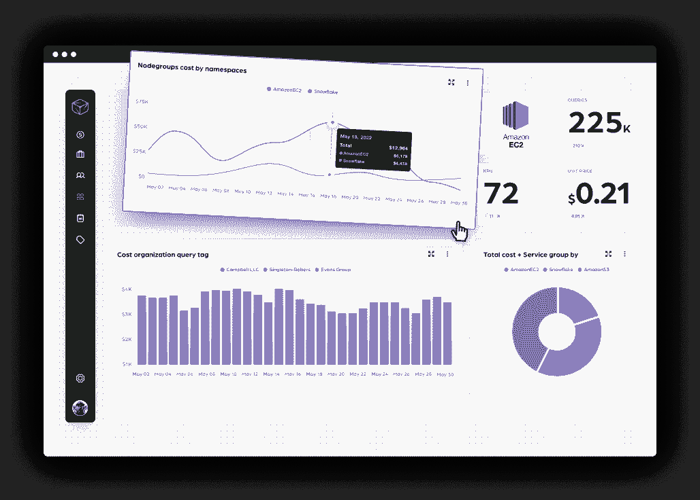
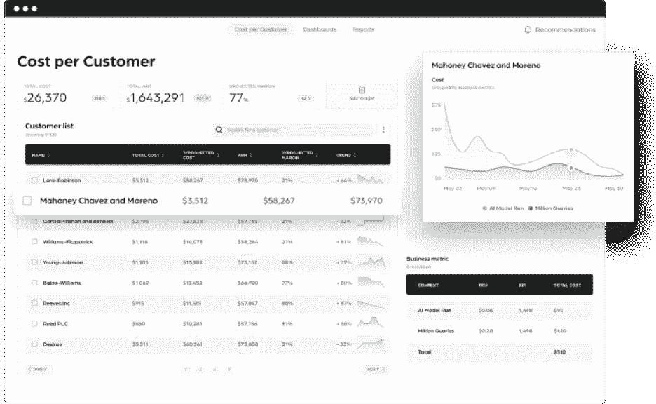

# FinOps 控制面板可以回答关于您的云账单的 3 个问题

> 原文：<https://thenewstack.io/3-questions-about-your-cloud-bill-a-finops-dashboard-can-answer/>

SaaS 公司的云基础设施通常是仅次于工资的第二大支出。这一事实可能会让你认为大多数公司都在控制他们的云支出，但事实很少如此。

当然，有些人可能会每月仔细查看一次 Excel 表格，试图弄清楚钱去了哪里以及为什么去了，但这通常是对以下事件之一的回应

*   他们正试图解决一项正在侵蚀公司利润的技术债务。
*   AWS EC2 有一份 30 万美元的账单，没有人知道该账单的哪一部分用于为该产品供电。
*   一个意外的成本高峰引起了首席技术官/首席财务官的注意。

所有这些都是说，成本永远不应该是事后才想到的。汽车制造商在制造汽车之前会谈论原材料的成本。为什么公司不讨论他们可以开发应用程序的不同价位？

## 利用财务运营促进成本共享

近年来，出现了一个叫做 FinOps 的新框架来帮助团队向财务责任进行文化转变。FinOps 倡导数据驱动的支出决策，并拥有 [六大关键原则](https://www.finops.org/introduction/what-is-finops/) :

*   团队需要协作。
*   每个人都拥有自己使用云的所有权。
*   一个集中的团队推动 FinOps。
*   报告应该是可访问的和及时的。
*   决策由云的商业价值驱动。
*   利用云的可变成本模型。

在 [Finout](https://www.finout.io/) ，我们正在构建身临其境的仪表盘，让 FinOps 团队控制他们的云成本。这个想法很简单。展示一个公司支付的所有云服务的清晰概览，让每个人将数据切割成尽可能小的单位，从亚马逊网络服务中每个 pod 的成本，到单个雪花查询的价格。

一旦团队对他们的开支有了详细的了解，让他们建立自定义的仪表板来跟踪对他们重要的事情。然后，他们可以通过回答关键问题来优化云支出，例如:

## 我们是否在预算范围内运行？

想象一下，你在一个机器学习团队中工作，该团队正在试验一种新工具，以赋予企业独特的竞争优势。让我们假设你每周有 1000 美元的预算来启动你在 AWS 上的基础设施。

你会每天关心你是否坚持你的预算。因此，您创建了一个仪表板，允许您监控 EC2 支出，并在您的使用量超过$1，000 时发送一条 Slack 消息。同样，如果您发现支出不足，也可以增加一个新实例。

## 缩减开支哪里有意义？

现在让我们扮演产品负责人的角色。您可能会发现某项功能占总支出的比例很高，但收入却很少。

如果没有理由继续运行该功能，您可以弃用它以减少支出。除了直接节省成本，你现在正在创造一种竞争文化，团队的目标是在提高支出收入比方面做到最好。

** 

## 这个客户花了我们多少钱？

知道你为支持一个特定用例所付出的代价可以让你知道谁是你最赚钱的客户。这些都是宝贵的见解，可以引导关键的产品开发，销售和营销决策。

 

在网络安全公司 Hunters 来到 Finout 之前，没有人知道哪个客户要对他们每月的云账单上的哪些费用负责。实施后，该团队能够实时监控客户使用情况的变化，确保任何支出高峰都基于客户或业务需求。

“当新客户入职时，我很冷静，因为我可以实时看到他们花了我多少钱，并了解我能给他们的最佳报价是多少。市场上没有这样的东西。”Hunters 的联合创始人兼首席技术官托默·卡扎兹说。

## 掌控您的云支出

随着云成本 [设定为到 2025 年消耗大部分 IT 开支](https://www.gartner.com/en/newsroom/press-releases/2022-02-09-gartner-says-more-than-half-of-enterprise-it-spending) ，公司开始注意他们的开支是很重要的。正确的起点是你的文化。向 FinOps 转变需要提高利润率和做出数据驱动的业务决策的共同愿望。

由于云成本管理是一个如此巨大的问题，许多平台多年来一直试图解决它，从 CloudHealth 和 Apptio 等传统公司到 AWS Cost Explorer 和 KubeCost 等免费工具，但问题仍然存在。

Finout 的解决方案不需要额外的代码、代理或变更标签——无论架构有多复杂。在此 向 FinOps 认证专家 [预订演示。](https://calendly.com/d/dth-yq8-zpb)

<svg xmlns:xlink="http://www.w3.org/1999/xlink" viewBox="0 0 68 31" version="1.1"><title>Group</title> <desc>Created with Sketch.</desc></svg>