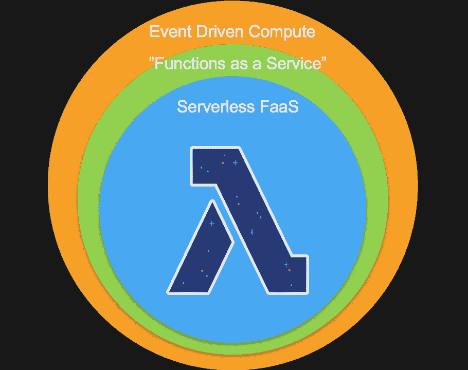
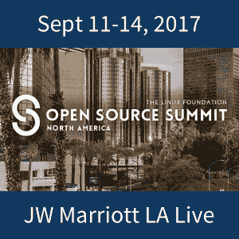

# 关于无服务器技术的 3 个问题

> 原文：<https://thenewstack.io/3-questions-serverless-technology/>

作为一项相当新的技术，[无服务器](/category/serverless/)既令人兴奋又令人困惑。早期采用者发现，这不是一个云架构选项，开发人员可以就堆栈溢出提出问题，并查看谁以前遇到过同样的问题。相反，[开发人员必须在团队中解决问题](https://thenewstack.io/five-tips-building-serverless-teams-enterprise/)，然后与他人分享他们的成果以帮助推进社区。

像 [IOpipe](https://thenewstack.io/iopipe-launches-lambda-monitoring-tool-aws-summit/) 和 [Snyk](https://thenewstack.io/security-serverless-gets-better-gets-worse/) 这样的初创公司正在崛起，它们已经评估了市场，并确定了它们可以通过填补空白来增加价值的关键工具领域。但是关于这项新技术的关键问题仍然存在。“无服务器”与“功能即服务”相同吗，还是一种更广泛的事件驱动架构？标准化的机会是什么？您如何管理可靠性？

## 1.FaaS 平台还是事件驱动架构？

在 2016 年的 AWS re:Invent 上，来自亚马逊网络服务的 [David Potes](https://twitter.com/davidpotes) 和 [Ajay Nair](https://www.linkedin.com/in/ajnair/) 概述了“ [无服务器计算宣言](http://blog.rowanudell.com/the-serverless-compute-manifesto/) ”，其中包含八个核心原则。最重要的是“功能是部署和扩展的单位”虽然函数是一段事件驱动的代码，但更广泛的无服务器社区似乎正在从关注“函数即服务”上后退，而不是倾向于一个定义，该定义认为起点是启动函数的事件触发器。

事实上，许多人将无服务器技术称为“功能即服务”但它们是一回事吗？

《 [DevOps 手册](https://www.amazon.com/gp/product/1942788002/ref=as_li_qf_sp_asin_il_tl?ie=UTF8&tag=the0757-20&camp=1789&creative=9325&linkCode=as2&creativeASIN=1942788002&linkId=51b66c60be79e1e132af8c5c9f39cb3c)》的作者 Patrick Debois ，在他的几次演讲中提出，与其说是“无服务器”，不如说是“全服务”这个定义表明，除了函数之外，还涉及到更多的事件触发器和组件。

无服务器的简化定义已经被 AWS 高级开发者无服务器倡导者 Chris Munns 分享。在今年早些时候奥斯汀的 Serverlessconf 上，他将 serverless 归结为四个特征:

*   没有要调配或管理的服务器
*   随使用情况扩展
*   绝不为闲置买单
*   内置可用性和容错能力。

注意，没有严格要求“功能”构成无服务器定义的一部分。相反，他提出了一种世界观，在这种世界观中，FaaS 位于一个更广泛的无服务器范式中:

克里斯·芒恩斯的 FaaS 概念是更广泛的事件驱动架构范式的一部分

“我认为有两件事正在进行中，”[本·凯霍](https://twitter.com/ben11kehoe)、[一位无服务器成熟过程的常规作家](https://medium.com/@ben11kehoe)说。他概述道:

一是无服务器不仅仅是 FaaS 大。“FaaS 只是你的计算机层，”凯霍解释说。“如果你运行 Kafka 将事件输入 FaaS，你必须在那里管理服务器。如果您使用 AWS Kinesis，您仍然需要提供(用于分片)，但是您的操作负载会大大减少。应用程序的所有其他部分也是如此:数据库、blob 存储、身份验证层、加密、分析、日志、指标等。

“所以，无服务器就是把你的业务逻辑放在 FaaS，其他一切都使用托管服务，”他说。

凯霍还指出，事件驱动的架构非常适合 FaaS。

“事件触发功能。但是 FaaS 本质上并不是事件驱动的，事件驱动也不是无服务器架构的专利，”他说。“我的感觉是，对于大多数组织来说，同时实现事件驱动和无服务器是一个太大的飞跃。”

## 2.无服务器标准？

作为一种较新的技术，无服务器还不够成熟，没有一个可供开发人员使用的多样化工具生态系统，同样，也没有出现任何标准或约定被整个行业接受为合适的部署方式。

提出需要标准的一个直接问题是 SaaS 提供者的出现——像 [Auth0](https://auth0.com/) 和[Twilio](https://thenewstack.io/twilio-functions-show-serverless-useful-model/)——提供功能。虽然这可能会降低无服务器新手的准入门槛，但令人担忧的是，在生产使用中，这意味着代码分散在(潜在的)多个提供商之间，使得维护、监控和调试更加困难。此外，没有什么可以阻止每个 SaaS 提供商使用稍微不同的术语或方法来编写他们的无服务器功能代码，这可能会给使用 SaaS 提供商的多个无服务器平台的开发人员带来挑战。

一个使用 Auth0 Extend 的开发人员正在创建一个集成，以便他们的客户可以使用数据预处理功能。

“我们在工业物联网领域工作，我们产品的一个特点是你可以上传你的传感器数据，”开发者指出。“目的是在发送传感器数据时，您可以在导入数据之前使用 Extend 来转换数据。例如，我们的 dashboard analytics 可能希望数据以特定的 CSV 或 JSON 格式发送，因此我们的客户会在数据上传时使用 Extend 来转换数据。”【T2

目前，在这个用例中，工作流没有其他无服务器元素——架构是基于云的——尽管系统确实使用 Azure 功能来完成一些类似 cron 的后端作业。但是不难想象，除了使用 Auth0 Extend，这个开发团队还可以使用类似 SendGrid 的无服务器平台来创建一个函数，如果数据预处理没有按预期输入，它会通知客户。

开发团队向客户提供此功能的美妙之处在于，使用 Auth0 Extend，客户可以在开发人员的界面中创建预处理功能。“我们喜欢 Extend 的原因之一是我们的应用程序中完全包含了这种体验，”开发者告诉我们。“我们的客户可以在数据到达我们之前在 AWS Lambda 中完成这项工作。你可以完成同样的事情。但这样我们的客户就会有两个平台。这只是一个自然的扩展点。”

不利的一面是，如果他们将额外的 SaaS 无服务器平台拼接在一起，复杂性很容易超过他们能够为客户群提供的便利和轻松。

## 3.功能可靠性

在无服务器设计中引起困惑的最后一个问题是，当函数没有按预期触发时，如何监控和响应函数。发生这种情况有多种原因:函数可能不响应 API 网关，可能由于编码错误而无法执行，或者由于缺少内存或其他可用资源而失败。

如果工作流中的一个步骤失败了，那么下一个步骤不会触发该功能，该怎么办？哪些功能是关键任务？如何审计和监控职能？

AWS 有一些关于 [函数错误重试](http://docs.aws.amazon.com/lambda/latest/dg/retries-on-errors.html) 的文档。如果一个函数因为尝试到达端点超时、无法解析输入数据或者遇到内存不足或其他资源限制而失败，Lambda 会抛出一个异常，但如何处理这些异常将取决于该函数是同步调用还是异步调用(例如，异步调用会导致两次重试)。

但是处理功能错误并确保有深入功能监控的行业方法的工作(就像最近由 [IOpipe](https://thenewstack.io/iopipe-launches-lambda-monitoring-tool-aws-summit/) 发布的)才刚刚开始。

为了帮助鼓励来自一系列[平台、工具提供商和项目](https://thenewstack.io/tns-guide-serverless-technologies-best-frameworks-platforms-tools/)的输入的共享行业观点，[云原生计算基金会](https://www.cncf.io/)已经创建了一个 [无服务器工作组](https://github.com/cncf/wg-serverless) ，迄今为止已经包括来自 AWS、IBM、微软、Red Hat、Auth0、VMware 和 Docker 等的参与。

目前，他们正在编写一份无服务器的白皮书来描述这个领域，其中一些争论正在进行中。随着问题的进一步澄清，工作组的几名参与者预计将在 10 月 8 日至 11 日在纽约举行的下一次 [Serverlessconf](https://nyc.serverlessconf.io/) 会议上分享他们的观点。

“在接下来的 12 个月里，无服务器技术和架构将会比以往任何时候都更快地发展和成熟。来自供应商、早期采用者和爱好者的对无服务器安全、操作、模式和架构的关注将会越来越多，”Serverlessconf 组织者[彼得·斯巴斯基](https://github.com/sbarski)，他也是《AWS 上的无服务器架构 》的作者

“我们还将看到大型企业更多地采用无服务器技术，因为他们试图找到竞争优势，击败发展缓慢的竞争对手，”Sbarski 说。

<svg xmlns:xlink="http://www.w3.org/1999/xlink" viewBox="0 0 68 31" version="1.1"><title>Group</title> <desc>Created with Sketch.</desc></svg>