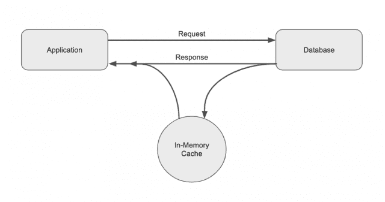

# 低效缓存比没有缓存更糟糕的 3 个原因

> 原文：<https://thenewstack.io/3-reasons-an-inefficient-cache-is-worse-than-no-cache-at-all/>

就其核心而言，数据库缓存是一个足够简单的概念:它是将内存中的数据存储放在充当记录系统的数据库前面(或旁边)的做法。

缓存允许组织将频繁请求的数据保存在高速 RAM 中，并通过减少对保存系统数据的较慢磁盘或基于闪存的数据库的调用来增强应用程序性能。这种效率带来了难以置信的性能优势。

基本缓存

虽然概念很简单，但实际上，缓存可能很复杂。高效的缓存需要精心的规划以及对应用程序架构和数据需求的深刻理解。必须围绕哪种类型的缓存模式最适合以及应该如何配置缓存做出明智的决策。

 [约翰·努南

John 是 Redis 的产品营销经理。作为产品领导者和产品营销人员，他在技术和商业战略的交叉领域有十年的工作经验。](https://www.linkedin.com/in/j-noonan/) 

应用程序应该使用内联缓存吗？如果是，通读、直写或读/写是最好的，还是缓存备用模式更合适？将所有内存保存在缓存中是不切实际的，那么您的缓存应该如何处理驱逐以确定哪些数据子集保留在缓存中呢？

驱逐策略的范围从最近最少使用到最早存储到随机驱逐等等。还有数不清的其他决策需要做出:缓存应该是持久的还是易变的？它将如何扩展？它会被复制吗？如果会，如何复制？

诸如此类…

因此，虽然缓存在概念上相对简单，但在实践中却非常复杂。所有这些复杂性为错误留下了空间，而这些错误可能代价高昂。事实上，实现一个低效的缓存往往比没有缓存更糟糕，原因如下。

## 1.低效的缓存会降低应用程序的速度

您可以通过缓存来提高应用程序的性能，使关键数据近乎实时地可用。然而，低效的缓存实际上会对应用程序的性能产生负面影响，并会降低应用程序的速度。

当请求导致缓存未命中时(请求的数据当前不在缓存中)，它会增加应用程序的端到端响应时间。这是因为应用程序必须从缓存中请求数据，而当缓存不包含所请求的数据时，也必须查询主数据库。在已经存在的数据库调用之外，还有一个没有结果的额外调用。在这些情况下，缓存没有带来任何好处，事实上，它增加了缓存响应时间，增加了延迟。

如果未命中不频繁，这不是问题，因为虽然最初的缓存未命中较慢，但对同一数据的所有后续请求都将加快速度(直到数据从缓存中被逐出)。但是，如果缓存效率低下，并且存在大量未命中，则缓存可能会降低应用程序的速度。如果高速缓存命中的速度仅仅比直接调用主数据库快一点点，这种情况尤其如此。

要使缓存产生净正面影响，它必须在缓存命中与数据库调用的响应时间方面带来显著优势，并具有较高的缓存命中百分比。

## 2.低效的高速缓存会消耗额外的昂贵资源

低效的缓存还会浪费宝贵的技术资源和预算。缓存需要部署昂贵的基于 RAM 的基础设施，目的是减少下游数据库的负载。然而，低效的缓存并没有很好地利用这种极其昂贵的硬件。

例如，采用次优回收策略的高速缓存会导致更多的高速缓存未命中、更慢的响应时间和更多的对主数据库的调用。这可能非常昂贵，尤其是如果您为每次操作支付数据库费用的话。这样一来，您会在没有带来必要价值的情况下产生 RAM 的开销——应用程序不会更快，并且作为记录系统的下游数据库的负载也不会减少。

此外，低效缓存还会带来间接费用，例如不可靠和性能不佳的应用程序带来的收入损失和客户流失成本。

## 3.低效的缓存会损害数据质量

在许多情况下，应用程序的好坏取决于支持它的数据。想想不正确的购物、用户资料、游戏或金融交易数据对数字客户体验的影响。

这些数据保存在内存中，因为它们对应用程序至关重要，需要快速和/或频繁地传递。否则，就不值得花这么多钱了。

但是低效的缓存会给这些关键数据的一致性带来潜在的问题。低效的缓存可能会导致缓存内存中保存的数据与数据库中保存的数据不匹配。

例如，一个应用程序可能已经向缓存写入了一个新值，但由于某种原因，它没有更新到主数据库。现在，底层数据库中有了一个陈旧的或不正确的值，并且缓存与记录系统不一致。

或者记录系统被更新为一个新值，但在为应用程序提供数据的缓存中从未更新过。现在，缓存中有陈旧(不正确)的数据，并且再次不一致。

此外，当缓存分布在多个节点上时，各个缓存实例之间可能存在一致性问题。当复制缓存以获得额外的弹性或实现地理分布时，这种情况很常见。

## 获得缓存的诸多好处

低效缓存带来的问题可以通过适当的规划、对应用程序及其数据需求的理解以及围绕缓存策略的适当决策来解决。

使用正确的缓存模式和回收策略可以实现缓存性能；通过性能可以降低成本，并且通过使陈旧数据失效的过程可以保持一致性。

虽然低效的缓存可能比没有缓存更糟糕，但高效的缓存会带来巨大的价值。它可以极大地提高应用程序的性能，减轻下游数据库的负担，并使应用程序更具可伸缩性和弹性。这就是为什么像 Redis 这样的开源技术如此广泛地追求缓存，Redis[是为了简单、高效、高性能和弹性而设计的，](http://antirez.com/news/109)直到今天还保持着这些原则。

<svg xmlns:xlink="http://www.w3.org/1999/xlink" viewBox="0 0 68 31" version="1.1"><title>Group</title> <desc>Created with Sketch.</desc></svg>