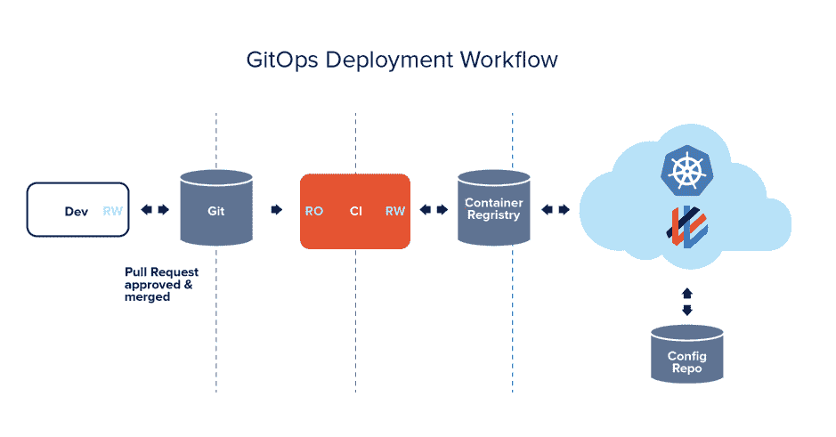
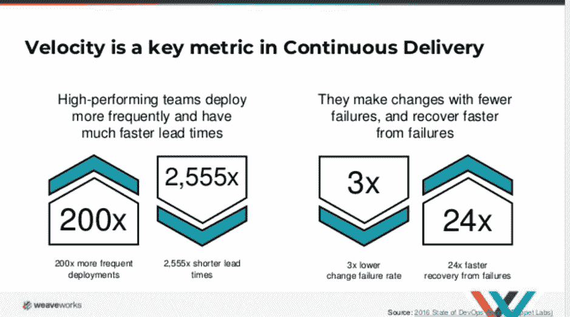
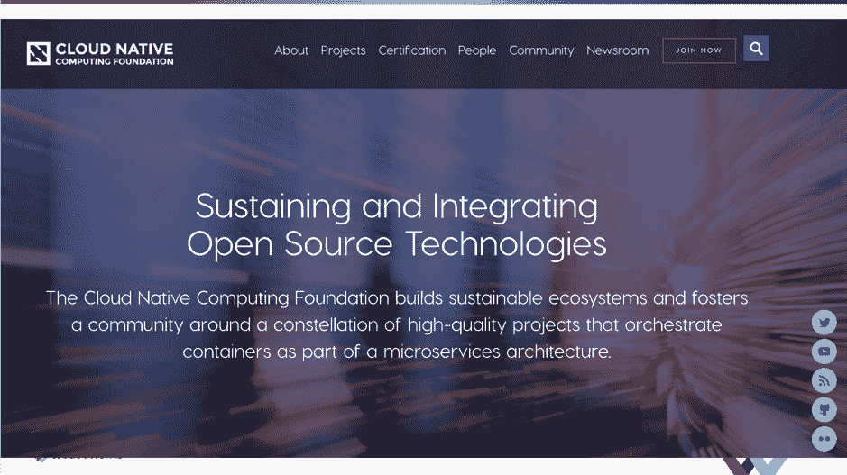

# 你不能忽视云计算的 3 个原因

> 原文：<https://thenewstack.io/cloud-native/3-reasons-why-you-cant-afford-to-ignore-cloud-native-computing/>

[KubeCon + CloudNativeCon](https://www.cncf.io/kubecon-cloudnativecon-events/) 赞助本帖。KubeCon + CloudNativeCon 将于 5 月 20 日至 23 日在巴塞罗那举行，将邀请 Kubernetes、Prometheus、gRPC、Envoy、OpenTracing 等热门项目背后的主要维护者以及其他领域专家、采纳者和最终用户参加，以推动云原生计算的教育和发展。

 [安妮塔·布尔勒

Anita 在软件开发方面有 20 多年的经验。她为 X Windows 服务器公司 Hummingbird(现在的 OpenText)和 Algorithmics 写了技术指南。她管理产品交付团队，开发并营销自己的移动应用程序。目前，Anita 在 Weaveworks 领导内容和其他市场驱动的计划。](https://www.linkedin.com/in/anita-buehrle-8b196789/) 

过去的五年见证了统称为云原生计算的技术的快速发展。这种向云原生技术的转变从根本上改变了当今软件开发的方式，导致采用 DevOps 实践和其他交付软件的新策略，其主要好处是提高您团队的速度，满足客户需求并使组织在市场中具有竞争力。

这些技术也有助于[像网飞](https://www.slideshare.net/adriancockcroft/goto-berlin)这样的科技巨头的成功，以及像优步这样的数字本土公司和其他以高度颠覆性的方式改变商业模式的公司。

尽管大多数组织缺乏 Netflixes 和 Ubers 的 DevOps 资源，但这些和其他科技巨头也创造了可复制的云原生框架，小型企业可以从中受益。

## 云原生长什么样

云本地计算体现了一组架构以及开发和交付基于这些技术运行的应用程序的最佳实践。通常，云原生应用被设计为一组运行在 Docker 容器中的微服务，在 Kubernetes 中进行编排，并使用 DevOps 和 GitOps 工作流进行管理和部署:

### 微服务架构

Docker 容器非常适合微服务。当微服务在单独的容器中运行时，它们可以独立部署，甚至可以使用不同的语言。因为容器是可移植的，可以彼此独立运行，所以使用容器创建微服务架构非常容易，并且如果需要，还可以将它们从一个环境移动到另一个环境或另一个公共云。

### 自动部署和编排

微服务是在一个名为 Kubernetes 的自动化、可扩展架构中部署和“编排”的。使用 Kubernetes，应用程序的容器被分组到逻辑单元中，以便于管理和发现。Kubernetes 的一个优势是它能够与您的应用程序一起扩展，而无需您向您的运营团队添加更多资源。

### 软件交付的现代 DevOps 和 GitOps 最佳实践

随着应用程序在容器中运行并在 Kubernetes 中编排，下一步是自动化部署以提高团队的生产力。持续自动化的特性流是 DevOps 区别于其他软件开发理念和实践的地方，比如瀑布模型，在瀑布模型中，开发遵循有序的阶段序列。有了 Kubernetes，提高团队效率的最有效方法就是使用他们熟悉的工具和工作流程。GitOps 是让您的部署管道通向 Kubernetes 的最有效方式。

现在您已经了解了云原生应用程序的样子，那么开始数字化原生转换的主要原因是什么呢？

## 缩短上市时间，提高运营效率

正在进行数字化转型并需要推动业务发展以保持竞争力的企业对为其开发团队创建所谓的“无形基础设施”感兴趣。为了更快地前进，需要重新考虑可能减缓开发速度的基础设施变化和请求。因为 Kubernetes 和它上面运行的应用程序几乎完全是声明性的，所以基础设施可以和源代码控制系统(比如 git)中的代码放在一起。将整个系统放在一个地方，开发人员不仅可以很容易地修改他们的应用程序，还可以修改基础设施——也就是 GitOps。

### 开发人员在 GitOps 中使用熟悉的工具和工作流

[GitOps 是一种在 Kubernetes 中构建云原生应用的运营模式](https://www.weave.works/technologies/gitops/)。GitOps 的目标是加快开发速度，以便您的团队能够安全地对运行在 Kubernetes 上的复杂应用程序进行基础设施变更和应用程序更新。它使用开发人员日常使用的工具和工作流来实现这一点，如 git 和 GitHub。

### 就像 DevOps 对于云一样，GitOps 对于原生云也是如此

原生云是 DevOps 转变背后的推动力，它使我们对如何进行软件开发有了一套全新的方法和理念。采用云原生和 DevOps 最佳实践的公司，如 GitOps，可以将平均部署时间从每周 1 或 2 次部署增加到一天 150 次或更多。

有了持续部署变更的能力，开发团队可以像 canary tests 一样进行高级部署，并更容易地向客户子集推出特性。此外，由于您的整个系统都保存在 git 中，向前或向后滚动只需点击一下鼠标，这使得开发人员可以进行频繁的低风险更改，而这些更改很容易被取消。凭借这种自动化和速度，企业可以在几分钟或几小时内将新想法投入生产，而不是几周或几个月，从而提高创新率和竞争力。

## 竞争优势和提高的底线

调整您的软件交付和基础架构策略以实现云原生的首要动机是竞争对手的差异化，这将最终带来更大的利润。完成过渡后，您还可以利用许多其他优势，其中包括:

### 提高可靠性和可扩展性

按需弹性扩展或云爆发提供近乎无限的计算、存储和其他资源扩展。企业可以利用内置的可扩展性来满足任何需求，而无需额外的基础架构规划或供应。

GitOps 和 DevOps 最佳实践不仅为开发人员提供了恢复更改的低风险方法，为创新扫清了道路，而且因为您还可以干净地回滚，所以从整个集群灾难中恢复也更快。更高的正常运行时间保证意味着企业更具竞争力，可以提供更严格的服务水平协议和更好的服务质量。

### 降低基础设施成本

由于云原生技术支持按使用付费模式，规模经济得以传递，并将支出从资本支出转移到 OPEX。由于前期资本支出的准入门槛降低，组织可以在应用程序开发上投入更多，而不是在基础架构成本上。由于云原生基础架构更加灵活和可移植，总拥有成本(TCO)也更低。

### 吸引和留住顶尖人才

使用 cloud native 和其他尖端开源技术可以让您更快地移动，并在基础架构上花费更少的时间，这对开发人员来说很有吸引力。雇佣更高质量的开发人员会带来更好的产品，从而为你的企业带来更多的创新。一个额外的好处是，开源贡献可以帮助建立你作为技术领导者的声誉。

### 减少供应商锁定

Cloud native 为您提供了多种工具选择，而不会受到传统产品的束缚。通过尽可能地利用多云兼容工具，您的应用程序更加可移植，并且超出了供应商掠夺性定价的范围。您可以轻松迁移到具有更好产品或合规性要求多云基础架构的备用公共云。

## 具有支持性生态系统和社区的灵活基础设施

[云本地计算基金会(CNCF)](https://www.cncf.io/) 成立于四年前，是 Kubernetes 的供应商中立之家，Kubernetes 是一个用于自动化部署以及扩展和管理应用程序的开源系统。Kubernetes 最初是由谷歌创建的，用于支持和运行他们的搜索引擎，但今天它有来自亚马逊、微软和思科以及 300 多家其他公司的贡献。

CNCF 的主要任务是围绕高质量项目的[星座构建可持续的生态系统和社区，这些项目支持和管理基于 Kubernetes 构建的云原生应用的容器。](https://landscape.cncf.io/)

## 现成的云原生组件

通过利用 CNCF 现有的许多孵化项目，企业可以轻松地建立基础设施，并为 IT 团队的更多创新奠定基础。在云原生技术之前，向单一平台添加新的业务组件意味着雇佣一个顾问团队，这可能需要几个月的时间来实施。

但是现在，通过使用 CNCF 的现成的、社区支持的组件，节省了很多时间。这使得企业可以专注于更重要的任务，如将机器学习或其他数据科学方法引入您的企业，以增加其创新和竞争力。

云原生技术引入了一种不同于 15 年前的软件开发方法，当时部署一个变更需要大量的协调工作。有了像 Kubernetes 这样的技术、它的支持生态系统和像 GitOps 这样的最佳实践，持续地部署变更是微不足道的，因为云原生使这一切成为可能。

要了解更多关于集装箱化基础设施和云原生技术的信息，请考虑参加 5 月 20 日至 23 日在巴塞罗那举办的[kube con+CloudNativeCon Barcelona](https://www.cncf.io/kubecon-cloudnativecon-events/)。

通过 Pixabay 的特征图像。

<svg xmlns:xlink="http://www.w3.org/1999/xlink" viewBox="0 0 68 31" version="1.1"><title>Group</title> <desc>Created with Sketch.</desc></svg>