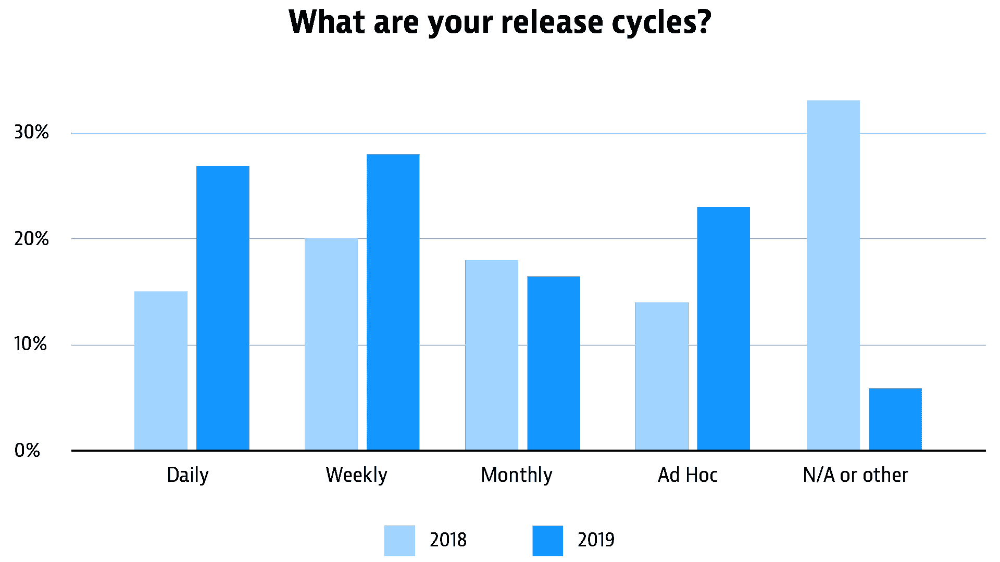
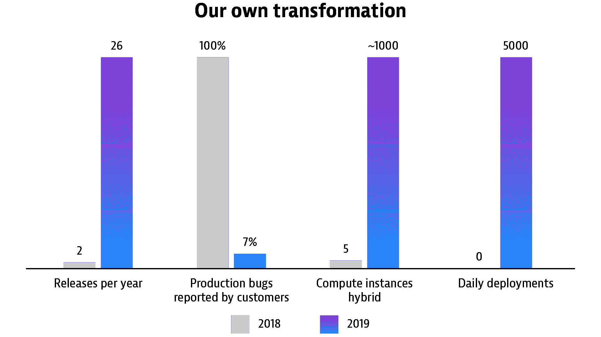

# 自动化软件发布管理的 3 个步骤

> 原文：<https://thenewstack.io/3-steps-for-automating-software-release-management/>

[Dynatrace](https://www.dynatrace.com/) 赞助了这篇文章。

 [沃尔夫冈·海德尔

Wolfgang 拥有软件产品线发展的博士学位，是优化工程生产力的专家。作为 CI/CD 方面的专家，Wolfgang 正在致力于提高构建和测试环境、交付管道和发布自动化的效率，以实现 DevOps 和连续范式，换句话说，就是开发制造机器的机器。](https://www.linkedin.com/in/wolfgang-heider-0a37a834/) 

“放还是不放？”是发布经理的日常事务。这是驱动许多软件开发或操作人员的问题，并且与部署新软件版本的风险直接相关。这是我个人在发布管理领域每天都要处理的事情，作为一个产品所有者，我建立了持续交付，实现了 DevOps 范例，并使其他公司变得更加敏捷。

发布经理很难对通常不完整的数据做出决策——根据组织的不同，可能有多个角色(如首席软件工程师、基础设施操作员，有时还有公司的法律机构)参与发布或不发布软件的决策，跨越数十或数百人。

随着自动化的不断发展，这些角色都在发生变化。没有时间手动收集决策所需的所有事实。已经过渡到敏捷软件开发、DevOps、连续交付或者测试自动化的组织，都强制执行任何决策的自动化——或者至少需要自动化来提供关于是否按下发布按钮的所有事实。发布流程的自动化使得发布频率和渐进交付策略得以提高，多个版本在预生产和生产中并行运行。

发布周期的增长速度导致需要尽可能地自动化，以确保组织能够在这个快速变化的动态环境中竞争。根据[云本地计算基金会今年发布的调查](https://www.cncf.io/blog/2020/03/04/2019-cncf-survey-results-are-here-deployments-are-growing-in-size-and-speed-as-cloud-native-adoption-becomes-mainstream/)，每日、每周和临时发布的数量急剧增加:

概述 Dynatrace 自身的数字化转型如何提高了软件发布和部署的频率。

对于大多数组织来说，软件产品的生命周期包括工具链，通常超过 10 种不同的工具，有助于自动化。增加的不仅仅是工具传播和自动化；每个版本的批准数量和决策过程也是如此。手工收集这方面的数据成为了发布自动化和自动化软件生命周期的瓶颈和致命弱点。

自动化任何基于发布风险的决策不仅仅是实现规则集和由自动化工程师编写一些脚本。它还需要领域知识，包括考虑软件提供什么服务，建立什么法律服务水平协议(SLA ),以及任何软件版本如何影响 SLA。

## 软件发布意识和影响分析的三个步骤

当评估一个新软件版本的风险时，会出现许多问题，人们努力使这个过程更加透明和可测量。以下是我作为发布经理使用的典型清单:

### 步骤 1:我们有新版本吗？已经通过分期了吗？

*   我们目前正在开发哪些新版本？
*   在我们的交付过程中，具体的版本进展如何？
*   新版本的变更日志是什么？
*   我们能预料到哪些已知的错误？
*   我们在测试结果和软件质量方面是安全的吗，或者我们有什么阻碍因素吗？

### 第 2 步:当前在生产中运行的软件处于什么状态？

*   当前版本在生产中提供了多少可用性？
*   当前版本在生产中的性能如何？
*   当前版本在生产中消耗多少资源？
*   我们在生产中是否有任何正在进行的发布和展示；即当前从先前版本重定向到新版本的任何负载？
*   新版本在可用性、性能和资源消耗方面表现如何？

### 步骤 3:发布会有什么影响？

在进行任何影响分析之前，需要回答上述问题。关于新版本和当前生产状态的回答有助于了解以下信息:

*   新版本会对资源消耗产生什么影响？
*   新版本会对性能产生什么影响？
*   总的来说，新版本对可用性有什么影响？
*   从营销的角度来看，这次发布会对我们的品牌产生负面影响吗？

定义一个发布的影响并试图量化它以确保公平和准确的决策是发布经理的全职工作。通常，发布的压力导致发布经理基于不完整的数据，或者在他们控制之外的商业条件的胁迫下，做出“发布/不发布”的决定。

## 为生产监控定义和评估 SLO

管理发布新软件版本的风险与产品中当前版本的可靠性紧密相关。Google 发布的[站点可靠性工程(SRE)资源涵盖了软件服务可靠性的许多操作方面，其中包含了度量标准的服务级别指标(SLIs)和度量标准的服务级别目标(SLO)的概念，以及用于定义目标的阈值。sli 和 SLO 为 SLA 提供了基础。](https://landing.google.com/sre/)

对于任何软件发布的场景，都会出现以下问题:

*   由于 SLO 故障而违反任何客户的 SLA 的风险有多大？
*   生产中任何 SLO 的当前状态是什么？
*   在违反 SLO 之前，我还有多少错误、失败的请求、缓慢的加载时间或停机时间(或“错误预算”)？
*   对于我的 SLIs / SLOs，新软件版本的表现如何？

SLO 的评估不限于生产，也可以应用于预生产或任何首次展示场景中的质量关口。Keptn，发布自动化的开源项目，[已经提供了基于 SLO 定义的自动化质量关口](https://thenewstack.io/how-keptn-automatically-configures-prometheus-ecosystems/)——生成用于 SLO 的度量标准，并根据任何目标进行评估。

## 在新软件交付给客户之前，在生产中对其进行 SLO 评估

在决定发布或不发布之前，有必要回答关于生产中的 SLO 的所有信息和所有问题，以及关于新软件发布在已定义的 SLO 方面如何表现的数据。需要考虑的另一个重要因素是发布的频率，以及为部署这些发布而手动收集数据所增加的工作量。

在不断变化的开发运维以及持续交付的世界中，如果自动化不能为任何数据收集和决策提供答案和建议，发布管理以及发布经理的角色会变得很麻烦，成为软件产品生命周期中的瓶颈。评估新软件发布的风险作为任何发布决策的基础，包括结合关于生产中 SLO 的当前状态和对 SLO 结果的潜在发布影响的答案。了解新软件版本的状态、内容和进度、生产的 SLO 状态以及新软件版本的 SLO 评估结果—无需对每个版本进行手动操作—使发布经理的工作变得更加轻松。

例如，如果生产中没有错误预算，一个简单的下一步可能是运营团队定义任何进一步版本的取消——这当然可以自动化。然而，即使为生产留下了一点错误预算，如果新版本在 SLO 评估方面表现更差(例如，与生产中当前运行的版本相比，性能相对下降，并且留下了最小的错误预算)，也应该自动停止发布。

发布过程中的新软件版本需要与测试运行分析结果一起进行评估，这些测试运行分析结果已经根据 SLO 评估进行了测试。为生产提供的 SLO 定义(例如，95%的请求需要在 600 毫秒内返回特定服务请求)可以在测试阶段进行评估，这样可以及早检测到性能下降。

因此，SLO 违规甚至可以在软件交付生产和客户之前检测出来，为新软件版本提供 SLO 违规根本原因分析**。**在预生产阶段建立监控定义，以安全可靠的方式将产品从试生产阶段转移到生产阶段，同时将对任何 SLO 产生负面影响的风险降至最低。

云计算原生计算基金会是新堆栈的赞助商。

通过 Pixabay 的特征图像。

<svg xmlns:xlink="http://www.w3.org/1999/xlink" viewBox="0 0 68 31" version="1.1"><title>Group</title> <desc>Created with Sketch.</desc></svg>