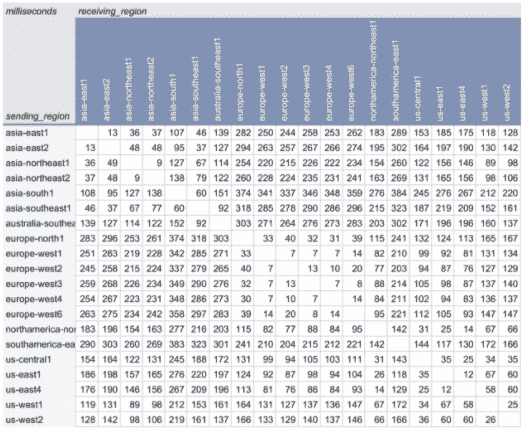

# 基准测试和供应 Google 云的 3 个技巧

> 原文：<https://thenewstack.io/3-tips-for-benchmarking-and-provisioning-google-cloud/>

 [杰西卡·爱德华兹

杰西卡加入蟑螂实验室，传播一个将改变全球科技公司游戏的数据库。她痴迷于编造技术故事，并在 AppNexus 和 MediaMath 领导过类似的营销工作。杰西卡不工作的时候，她会沿着纽约的东河跑步，欣赏精彩的冒险小说，在任何她能找到的地方欣赏现场音乐。](https://www.linkedin.com/in/jessica-edwards-33746a20/) 

云性能团队的工程师可以花一整天的时间来调优和优化云配置。但是如果这不是你的工作描述，你需要知道基准测试和优化的最佳实践。本文深入探讨了一些关键建议，包括充分利用[谷歌云平台(GCP)](https://console.cloud.google.com/?hl=fr) 的技巧。

2018 年，在为即将到来的版本发布做准备而执行常规测试时，我们有了一个奇怪的发现:[亚马逊网络服务](https://aws.amazon.com/?utm_content=inline-mention)测试集群的吞吐量比 GCP 测试集群的吞吐量高出 40%。

这一发现引发了对云性能的进一步内部调查。然后，我们正式确定了我们的测试和结果，并在 2018 年云报告中分享了这些发现。

每年，我们都会重新审视和微调基准，选择开源的、反映真实应用和工作负载的测试。现在是第三年，来自蟑螂实验室的[云报告](https://www.cockroachlabs.com/blog/2021-cloud-report/)继续随着来自开源社区、CockroachDB 社区和[云提供商](https://www.cockroachlabs.com/blog/aws-azure-gcp-respond-to-the-2020-cloud-report/)的输入而发展。

特别是与 GCP 团队的一次对话，让我对如何进行基准测试以及最终如何配置 GCP 以使其最适合您的工作负载有了一些深刻的见解。以下是我们收集到的一些见解，完整对话请点击[这里](https://www.cockroachlabs.com/webinars/cloud-provider-benchmarks-a-chat-with-gcp/)。

## #1:在您的云上使用性能基准测试工具

性能基准测试工具，如开源的 PerfKit Benchmarker(由 Google Cloud 团队维护)允许任何人测量在云中提供资源的端到端时间。PerfKit 报告标准峰值性能指标，包括延迟、吞吐量、完成时间和每秒输入/输出操作数(IOPS)。

基准测试工具应该有助于了解环境中正在发生的事情，同时提供不同地区的组件之间的延迟度量。为此，PerfKit 提供了一个公开可用的仪表板，显示所有谷歌云区域之间的跨区域网络延迟结果。以下是谷歌自己的全区域到全区域往返延迟测试的结果，使用 n1-standard-2 机器类型和内部 ip 地址。任何人都可以通过运行 [PerfKit 网站上的代码片段来重现结果。](https://cloud.google.com/blog/products/networking/perfkit-benchmarker-for-evaluating-cloud-network-performance)

除了像 PerfKit 这样的工具，还有许多资源可以帮助 GCP 用户从他们的产品中获得最佳性能。博客文章《[行为艺术:让云网络性能基准测试更快更简单](https://cloud.google.com/blog/products/networking/perfkit-benchmarker-for-evaluating-cloud-network-performance)》和一篇关于测量云中网络延迟的[后续报告](https://services.google.com/fh/files/misc/measuring-cloud-network-performance-perfkit-wp.pdf)，可以帮助你开始谷歌云基准测试和数据收集。

## #2:阅读基准研究

蟑螂实验室通过进行原创研究来更好地了解客户需求。这个过程首先涉及评估 CockroachDB 在不同提供商的云环境中运行时的性能。当该团队发现 AWS 和 GCP 之间的性能存在显著差异时，它在 2018 年发布了首份云报告，以帮助客户在选择云提供商时做出明智的决策。蟑螂实验室云报告的 [2021 版本更进一步，使用一系列微基准和典型的客户工作负载——如 CPU、网络、存储和 TPC-C 的衍生物——来比较 AWS、Azure 和 GCP 的性能。](https://www.cockroachlabs.com/guides/2021-cloud-report/)

云报告根据事务性(OLTP)工作负载对云提供商进行了基准测试。正如研究人员在报告和[重现步骤](https://github.com/cockroachlabs/cloud-report-2021)中指出的，所有基准都是在考虑事务性工作负载的情况下选择的。通过使用一组不同的基准来比较云性能，以机器学习为重点的工作负载可能会得到更好的服务。

## #3:在配置 GCP 之前评估工作负载

设置云部署时最常见的问题之一是:我应该使用提供商的默认配置吗？

当蟑螂实验室开始对 AWS、Azure 和 GCP 进行基准测试时，它需要在这三个提供商之间有足够的常数，以确保准确的结果。该团队通过使用每个提供商的默认设置来实现这一点，因此错误配置或配置偏差不会影响测试结果。

对于用户来说，默认配置可能是某些工作负载的理想选择。在改变默认机器配置之前，考虑机器的类型(系列、系列、机器类型等。)，例如，英特尔的 N2 与 AMD 的 N2D，并评估哪一个更适合您的工作负载。2021 年云报告中的一个发现是，运行英特尔 CPU 处理器的机器在单核测试中表现出色，但运行亚马逊 Graviton2 和 AMD 的机器在多核测试中表现更好。

## 了解有关配置和基准测试的更多信息

优化和基准测试您的云基础架构涉及许多细微差别和微调。我们上面的建议提供了一个起点。要获得更多关于基准测试和配置 GCP 的建议，请听 GCP 和蟑螂实验室之间的完整[对话。](https://www.cockroachlabs.com/webinars/cloud-provider-benchmarks-a-chat-with-gcp/)

通过 Pixabay 的特征图像。

<svg xmlns:xlink="http://www.w3.org/1999/xlink" viewBox="0 0 68 31" version="1.1"><title>Group</title> <desc>Created with Sketch.</desc></svg>