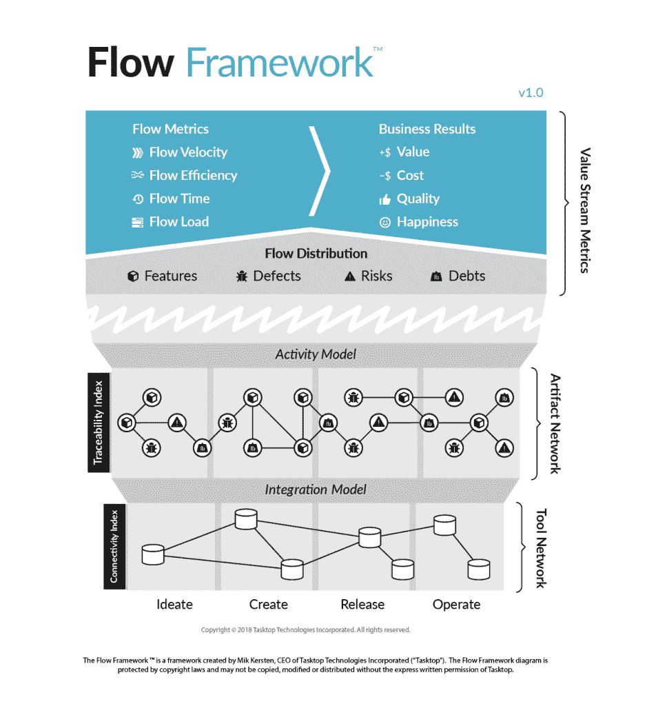

# 跟踪软件交付的 3 个趋势

> 原文：<https://thenewstack.io/3-trends-in-tracking-software-delivery/>

[Mik kers ten 博士](https://www.tasktop.com/mik-kersten)

[Mik kers ten 博士是 Tasktop 的首席执行官，也是《项目到产品:如何利用流程框架在数字颠覆时代生存和发展》一书的作者。](https://www.tasktop.com/mik-kersten)

在过去的十年中，软件取得了巨大的飞跃，使我们能够跟踪、分析和可视化在我们的组织中流动的难以置信的大量数据。存储很少成为瓶颈，非关系数据库的进步有助于捕获越来越多的数据，机器学习方法有望帮助获得意义和洞察力。

然而，对于绝大多数大型组织来说，有一种数据似乎不受任何商业智能的影响——用于跟踪软件交付本身的数据。即使是构建数据分析工具的组织也很难从许多工具和存储库中找到有意义的见解，这些工具和存储库捕获了他们自己最大的投资:构建软件。看来鞋匠的孩子们没有鞋子穿。考虑到所有的进步，这怎么可能呢？这种情况如何改变？如果您的任务是对用于规划、编码、交付和支持您组织的软件的工具中锁定的数据提供洞察力或可见性，那么您应该了解以下三种趋势:

### 趋势 1:开发工具的异构性和缺乏标准化只会变得更糟

我们已经学会了分析复杂的数据集，现代工具可以以令人难以置信的规模和速度做到这一点。然而，除了数据量之外，还有一些复杂因素会使分析变得异常困难。这正是软件交付工具的前景，展现了以下复杂的维度:

*   **工具和存储库的数量**:由于角色和平台的日益专业化，如今有数十种不同的工具在使用，其中最佳的是游戏的名称。例如，在分析销售和营销数据时，您可以通过访问 Salesforce 和 Marketo 中的数据来获得所需的大部分信息。为了获得软件交付的全貌，预计需要访问一打或更多的工具。
*   **工具随时间的变化**:部分由于开发人员和其他软件专家的最佳需求，工具链一直在以惊人的速度变化。在大型企业组织中，现在每年添加一个或多个新工具是很常见的，工具的退役滞后于入职。
*   **模式和工作流的复杂性**:由于不同软件角色的数量和复杂性(越来越多的不同种类的开发人员、测试人员、基础设施、支持、设计和交付专家)，工具本身也变得复杂了。这已经转化为需要被跟踪的工件(例如，特性、缺陷、标签)的复杂模式，以及这些工件的复杂工作流，有时涉及十几个不同的步骤。
*   **项目和团队的复杂性:**不同的团队和项目经常专门化他们使用的模式和工作流，以便使它们适应他们的交付需求。这增加了复杂性的另一个方面。
*   **模式、工作流和团队随时间的变化:**在复杂性的基础上，团队继续发展和改变模式和工作流，不仅在整个组织中，而且在每个项目和团队中，也将它们变成移动的目标。

考虑软件交付活动的最基本的报告，例如列出过去一年中为每个项目或产品交付的特性的数量。要生成这个报告，您需要能够连接到每个跟踪特性交付的工具存储库。根据异构性的级别，这可能涉及到与交付团队的多次对话，可能跨越多个业务线。但这是最简单的部分。然后，您需要能够识别与特性相对应的数据工件。

这一步可能涉及许多讨论，因为没有一个团队定义特性的单一标准模型。然后，您需要为一个要“完成”的特性确定工作流状态由于模式的大小和不一致性，这可能非常困难。除了这幅图之外，团队将每月对模式和工作流进行变更，以及对这些变更的坚持，您将面临一个棘手的问题。您可能成功地为一个团队或产品价值流完成了这一点，但是如果组织很大，将所有硬连线数据映射、转换和分析扩展到组织并确保其保持准确，可能是不可能的。

### 趋势 2:建模工具将会出现，在异构工具链上创建抽象

在我的[项目到产品](http://projecttoproduct.org/)报告中，我报告了对 308 个企业组织工具链的分析，在那里发现了上面总结的发现。我意识到这个问题足够严重，直接从软件交付工具本身进行报告是一场失败的战斗，就像期望组织或供应商按照通用标准工作一样。跨工具、团队和学科的专业化太多了。更有趣的是，由于上面列出的复杂性，在收集数据后绘制数据是另一场败仗。相反，我们需要两样东西:

*   **工具网络上的抽象层**:这一层需要指定我们想要向业务部门报告的工件，比如特性、缺陷和风险。
*   **一种将活动映射到该层的机制:**一旦一个特定的工件被创建，比如一个严重的软件缺陷，映射层需要将该工件的具体字段和工作流状态转换成我们想要报告的更抽象和更少粒度的状态。

例如，[流程框架](https://flowframework.org/)提供了一种工具和技术不可知的方法来完成工具网络层和工件层之间的这种映射。一旦完成，就可以直接在工件层进行报告，两层之间的集成模型将工件层与变更隔离开来。更重要的是，维护集成模型的责任可以传递给部署和维护(也就是不断改变)工具网络中的工具的团队。结合起来，这些活动使得检查软件交付中的价值流成为可能，流框架称之为价值流网络。 

### 趋势 3:组织将定义一组通用的模型和指标来实现智能和分析

工件模型和价值流网络一起使得实时检查软件组织中的活动流成为可能。通过细化工件模型，可以提供业务级别的洞察，并将这些洞察与其他业务度量相关联，例如价值和成本，如在流框架的顶层中可见的。有了这种一致和标准化的模型，高级分析和机器学习也变得可行，因为输入数据是干净的、连接的和可以关联的。

获得软件交付可见性的问题不是数据的大小，而是数据不断变化的结构的复杂性。处理这种复杂性的唯一方法是引入新的建模层，并将映射职责分配给创建、理解和修改数据的人员。有了这一点，可见性问题就从棘手变成了我们可以应用现有知识和工具的计划。随着 2019 年的到来，我们可以专注于将交付数据与业务成果联系起来的下一个巨大挑战。

通过 Pixabay 的特征图像。

<svg xmlns:xlink="http://www.w3.org/1999/xlink" viewBox="0 0 68 31" version="1.1"><title>Group</title> <desc>Created with Sketch.</desc></svg>