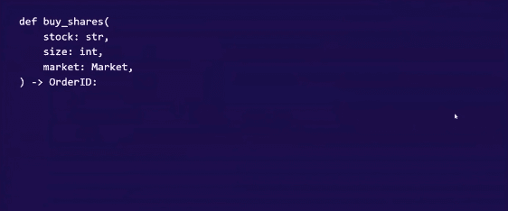
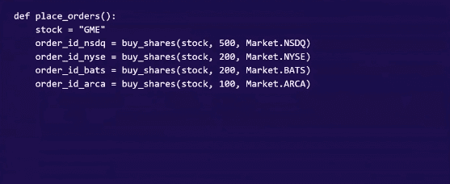
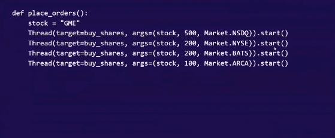
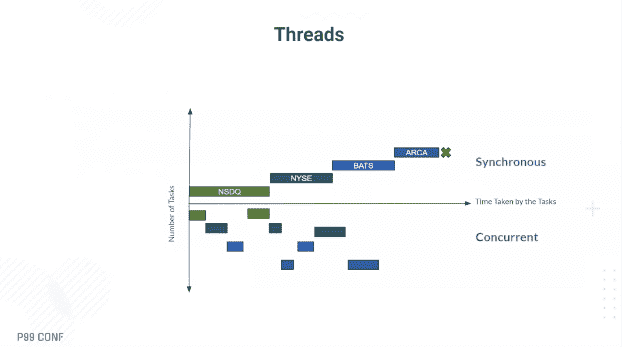
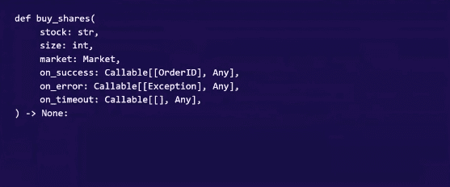
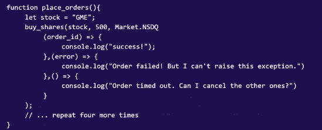
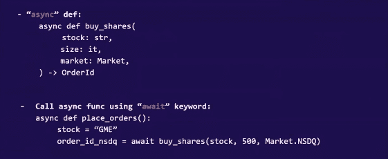
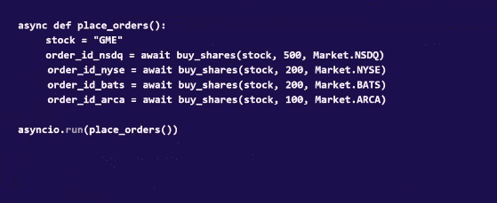

# 3 种异步编程

> 原文：<https://thenewstack.io/3-types-of-asynchronous-programming/>

想象一下，当你上传照片到你的页面时，你的 Instagram 会冻结。异步编程允许应用程序一次做多件事情。异步操作加速计算，从你的浏览器到最高的高频交易操作

金融服务公司 [Hudson River Trading](https://www.hudsonrivertrading.com/) 使用异步函数作为提高编程速度的首选方法。该公司的运营开发人员 [Sabina Smajlaj](https://www.linkedin.com/in/sabina-smajlaj-1829b330/) 在她最近在 [ScyllaDB](https://www.scylladb.com/?utm_content=inline-mention) 的 P99 Conf 上的讲话中解释了原因。

她的演讲“通过异步编程加速您的代码”围绕 Python 和 JavaScript 中异步编程的需求，深入探讨了异步编程的三种方法——线程、回调和异步函数。

她考虑了异步编程的多个因素，首先是并发性，但包括其他标准，如内存使用和可读性，编写异步函数。每种方法都有自己的最佳用例，有趣的是，在一次具体的体验正反两方面的讨论中，所有这些都被展示出来了。

每一个都是如何累积起来的？

## **为什么需要异步代码？**

JavaScript 是单线程的，因此，比方说，要编写一个可以一次向多个市场发送多个订单的应用程序，代码必须围绕 JavaScript 固有的“一次做一件事”的方法工作。虽然 Python 不是单线程的，但由于全局解释器锁(GIL)的缘故，它的性能也是单线程的。

Async 不仅提供了更好的用户体验，而且由于整个应用程序不会被每一个单独的事件所阻碍，因此它可以提高性能，使应用程序更加健壮和可靠，并有助于应用程序的可伸缩性。

让我们从一个基本的同步 API 开始。

向多个市场下多个订单看起来像这样。

同步代码并不适合高频交易。

## **螺纹**

一个线程在后台运行该函数，多个线程同时运行。一旦线程启动，代码就在后台运行，程序可以自由地继续执行其他任务。

要在 Python 中启动一个单独的线程，请指定哪个函数，并为下面的线程传入参数。下图是在具有不同参数的多个线程上运行的原始 *place_orders* API 的示例。

并发性将通过拆分任务来提高性能，这样它们只有在有事情要做的时候才是活动的，而不是在等待服务器响应的时候。

上面的时间图包括等待市场反馈的时间，但在图的下半部分，在并发部分，空白区域显示没有正在进行的活动。

通过并发，可以在等待期间调度另一个任务。通过利用系统不执行活动工作的时间，place orders 方法所花费的时间显著减少。

但是线程并不是 Hudson River Trading 异步编程的最佳方法，原因有几个。最重要的是线程在后台运行。这导致了两个主要问题:下订单时没有明确的确认，订单 ID 没有返回，程序有可能在线程仍在运行时退出。这使得线程立即成为不可行的解决方案。

线程的其他挑战包括错误处理。在 Python 中，如果线程内部出现异常，该语言只需向终端写一条消息，然后继续运行。如果有多个调用和线程，那么在堆栈跟踪中识别异常来自哪里是一个挑战。线程非常占用内存，有些语言，比如 Python，并不完全安全。

线程对于其他用例非常有用，只是不适合高频交易。Wix 用它们[彻底改造了](https://thenewstack.io/wix-multithreaded-node-js-to-cut-kubernetes-pod-costs/)它的 Node.js 服务器。

## **回调**

回调是网络编程中经常使用的一种 API，在这种情况下，语言会在后台运行请求，而不是自己启动线程。回调提供了一个等待多个选项返回的地方，所有这些都在一个线程中。

把回调看作是包含所有可能选项的图例。如果服务器响应成功则触发 *on_success* 功能，如果有错误则触发 *on_error* ，如果服务器超时则触发 *on_timeout* 。回调将程序带回一个线程，因此 JavaScript 和 Python 对于回调都是“安全的”,并且没有内存问题。与线程类似，事件可以并发运行，还有错误和超时处理。

虽然在正确的轨道上，但由于缺乏特异性，回调对于高频交易来说是不够的。让我们从错误处理缺乏特异性开始。

Smajlaj 说，由于错误处理是回调中的一个独立功能，“取消一些其他订单会很尴尬。”超时也太一般了，因为没有任何方法可以在上面放置定义或参数。还有一个问题是，在 place_orders 函数结束时，订单仍然处于未知状态。谁知道他们的订单是否已经下了？

最后，还有代码可读性的问题。

Smajlaj 说，“这段代码并不真正是从上到下读的，因为你必须不断地跳回来查看回调定义。”可读性的困难导致理解事件发生顺序的困难。

回调仍然有太多的模糊性，这使得它们对于高频交易公司来说不可行。

## **异步功能**

第三种技术是异步函数，它是在执行过程中暂停或等待，而工作在别处进行的函数。异步函数的定义和普通函数一样，只是在前面加了“Async”一词。

以上 API

下多份订单。

在 [JavaScript](https://thenewstack.io/brendan-eich-on-creating-javascript-in-10-days-and-what-hed-do-differently-today/) 中，异步函数通过封装承诺来使用异步 await 关键字。函数前的关键字 async 意味着函数总是返回一个承诺。关键字 await 让 JavaScript 一直等到承诺完成并返回其值。

从 JavaScript 和 Python 图像中可以看出，异步函数代码是从上到下读取的。它有内置的错误处理功能，可以一次发送所有订单，并且资源利用率低。

<svg xmlns:xlink="http://www.w3.org/1999/xlink" viewBox="0 0 68 31" version="1.1"><title>Group</title> <desc>Created with Sketch.</desc></svg>