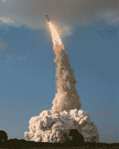
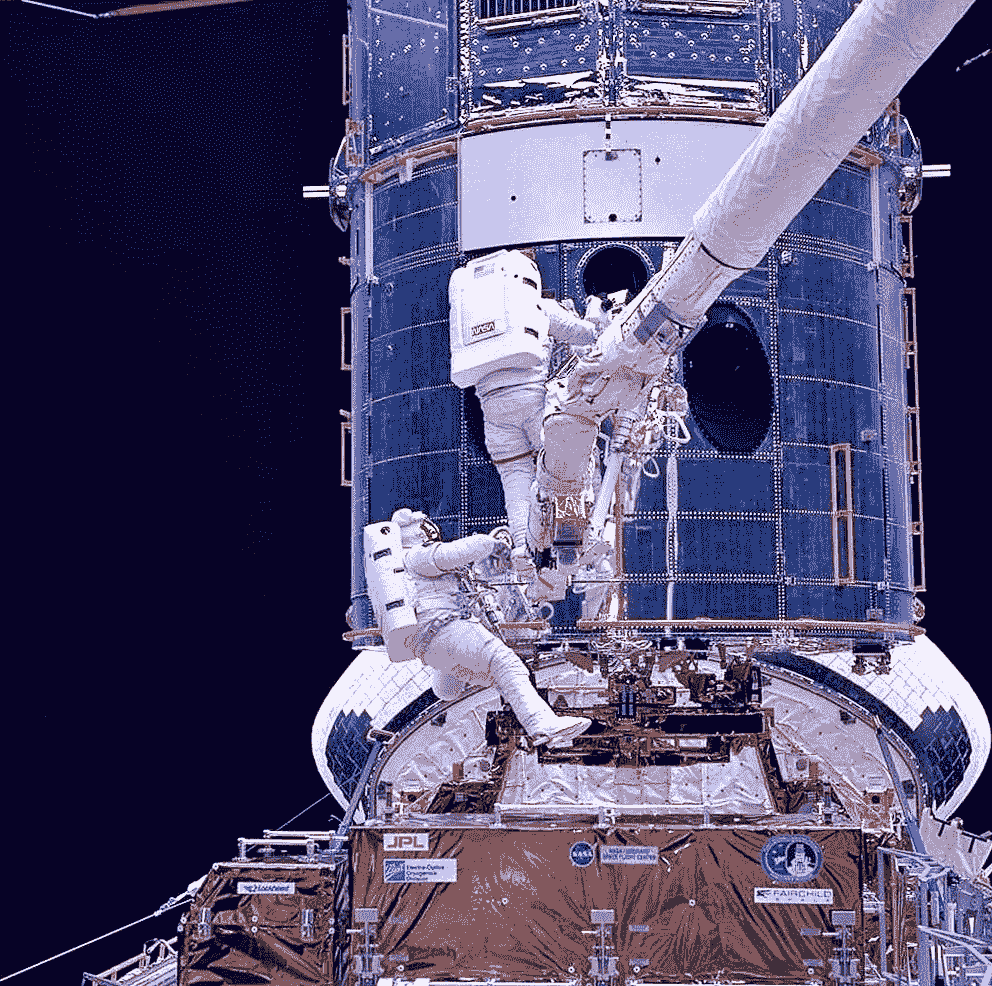
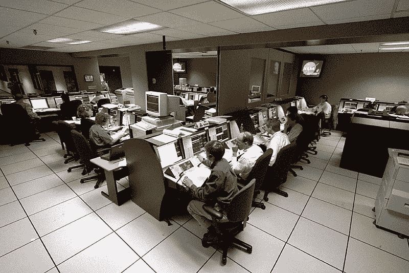
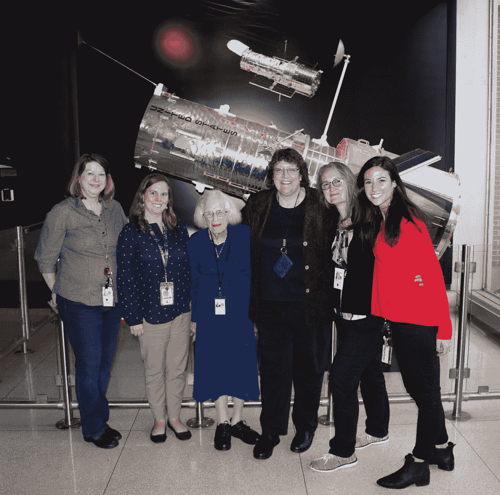

# 科学 30 年:哈勃太空望远镜及其背后的团队

> 原文：<https://thenewstack.io/30-years-of-science-the-hubble-space-telescope-and-the-teams-behind-it/>

有时将我们的思想转向太空是令人欣慰的，为人类每天的胜利和我们科学的稳步发展而自豪。但是[哈勃太空望远镜](https://www.nasa.gov/mission_pages/hubble/main/index.html)也提供了一个鼓舞人心的例子，说明我们可以用数据和一个强大的合作团队来完成什么。

随着该望远镜今年庆祝其在太空中的 30 周年纪念，我们被提醒这是精心设计、专注的长期支持和跨机构合作的骄傲产品。漂浮在地球大气层之外，侦察遥远的星系和我们自己的太阳系，这是美国宇航局，欧洲航天局和巴尔的摩太空望远镜科学研究所的联合项目。

1990 年在发现号航天飞机上发射后，“没有人能预测哈勃在接下来的 30 年里会看到什么奇迹，”一个周年纪念网页解释道。据 CBS 报道，哈勃现在被认为有许多发现，包括确定宇宙的年龄和证实超大质量黑洞的存在。

最近，夏威夷的双子座天文台将三年来对木星的观察与哈勃太空望远镜和朱诺飞船(绕木星运行)精心协调的图像结合在一起，创建了有史以来最高分辨率的木星大气图像。

太空望远镜的长寿不是偶然的。“哈勃的独特设计，允许宇航员用先进的技术对其进行维修和升级，这使它成为美国宇航局寿命最长、最有价值的天文台之一，”美国宇航局的一个网页解释说，“几十年来，它一直向地球传送转换的天文图像。”据 CBS[2013](http://www.cbsnews.com/network/news/space/home/spacenews/files/1ae7cac0d167055e41e1f0da7b0ac6a3-588.html)报道，它已经被航天飞机访问过五次，宇航员修复和升级了它的设备，最后一次访问发生在 2009 年。

“在最后一次航天飞机维修任务的四年后，哈勃太空望远镜像一块精美的手表一样运行着，没有任何重大的技术问题会阻止它继续进行开拓性的观测……”

## 2020 年庆典

《天文学杂志》指出，一些仪器“不再发挥作用，或者必须使用软件小心地屏蔽，以确保它们获取的数据是准确的。”但是，当这台坚固的望远镜达到 30 周年纪念时——仍然在进行科学研究，仍然在太空中漂浮在我们的上空——它背后的组织和它在地球上的粉丝们决定庆祝一下。

这台望远镜收到了来自[一群地球名人](https://twitter.com/i/events/1250510254531661829)的生日祝福。据网站 [Science Alert](https://www.sciencealert.com/nasa-has-translated-a-hubble-photo-into-music-and-it-s-absolutely-chilling) 称，NASA 甚至将一幅图像转换成了“令人震惊的怪诞音乐作品”，图像中的灯光变成了音符。“靠近图像底部的物体产生较低的音符，而靠近顶部的物体产生较高的音符……”视频的描述解释道，并指出大多数“斑点”实际上是星系。

“恒星和致密星系产生短暂而清晰的音调，而蔓延的旋涡星系发出改变音调的较长音调。图像中心附近的星系密度较高，这是这个星系团的中心，被称为 RXC J0142.9+4438，导致视频中途出现中音膨胀。”

[https://www.youtube.com/embed/H-Ci_YwfH04?feature=oembed](https://www.youtube.com/embed/H-Ci_YwfH04?feature=oembed)

视频

为了鼓励下一代的天文学家，欧洲航天局也发出了以哈勃为主题的艺术作品的呼吁，甚至鼓励人们为望远镜烤一个生日蛋糕。(“我们还邀请您发挥创意，用其他材料制作独特的生日蛋糕，如纸张、工艺品、粘土模型或乐高积木！”)

参与其中的太空机构创造了几个更有趣的周年纪念活动:

*   一系列特别的文章[庆祝其发现和成就](https://hubblesite.org/hubble-30th-anniversary/hubbles-exciting-universe)(称其为“有史以来最雄心勃勃和最具科学生产力的人类企业之一。”)
*   展出了哈勃拍摄的关于[星云、星系、星团和我们太阳系](https://www.nasa.gov/content/explore-our-universe-flickr-galleries)的最佳照片。
*   对[望远镜的控制中心](https://www.nasa.gov/content/goddard/hubble-360-degree-virtual-tour)甚至[望远镜本身](https://www.nasa.gov/mission_pages/hubble/observatory)的 360 度虚拟之旅，可以识别它所有的仪器。页面上的[视频称赞它是“我们通向星星的窗口”，指出它每天绕地球 15 圈，在地球上方 340 英里处盘旋，一架“大约校车大小”的望远镜以每秒 5 英里的速度穿过大气层。](https://youtu.be/XZ_WeTGCU9o)
*   你可以在一个网页上调出你生日那天拍摄的照片，然后在社交媒体上分享。“哈勃一周 7 天，一天 24 小时探索宇宙，”美国宇航局的一页解释道，并补充说“这意味着它在一年中的每一天都观察到一些迷人的宇宙奇迹……”
*   [美国宇航局播客](https://www.nasa.gov/content/hubbles-30th-anniversary-podcast)的一系列片段，“美国宇航局的好奇宇宙。”
*   [一系列电子书](https://www.nasa.gov/content/goddard/hubble-e-books)(PDF 格式)，名为“哈勃聚焦”，承诺探索“哈勃探索永远改变了天文学的特定领域。”

在该望远镜的 25 周年纪念日，美国宇航局还发布了一本特殊的电子书[，收集了 25 张“惊人而重要”的图像](https://www.nasa.gov/connect/ebooks/hubble_25_detail.html)，按照它们离地球的距离排序。

太空望远镜也在每年的周年纪念日进行某种仪式，周年纪念新闻稿解释道。“每年，NASA/ESA 哈勃太空望远镜都会将其宝贵的观测时间的一小部分用于拍摄特殊的周年纪念图像，展示特别美丽和有意义的物体。”

那么望远镜在 30 周年之际看到了什么？美国国家航空航天局吹捧这台望远镜“从未见过的两个美丽星云的景象”

欧洲航天局(European Space Agency)也在[宣布](https://www.spacetelescope.org/static/archives/releases/pdf/heic2007a-ESA-press-packet30th.pdf)将向欧洲各地的 30 个教育机构分发该图像的大型帆布副本，美国会有更多，“供周年纪念日在公共场合展示”因为疫情已经“影响了公开揭幕仪式的可行性”，他们转而将一系列活动“贯穿 2020 年，是对哈勃太空望远镜辉煌 30 年的全面庆祝”

## **项目背后的人**

在[中还有几十个关于望远镜](https://svs.gsfc.nasa.gov/Gallery/HubbleSpaceTelescope.html)的视频——美国宇航局强调[项目](https://www.nasa.gov/mission_pages/hubble/hubblecareers)背后的人。“哈勃团队中有来自小城镇和大城市的人，有在军队和工厂工作的人，有知道自己想要什么的人，还有慢慢发现自己使命的人……”

一个项目如果没有一些优秀的人在背后支持，是不会持续 30 年的。“从修理哈勃的宇航员到开发其软件的开发人员，从研究数据的科学家到传播其发现的人，望远镜得到了走过独特道路加入哈勃探险的人们的支持。”

[https://www.youtube.com/embed/xRJpOvogZLk?feature=oembed](https://www.youtube.com/embed/xRJpOvogZLk?feature=oembed)

视频

其中一页是赞美南希·格蕾丝·罗曼，这位研究型天文学家[成为了美国宇航局的第一任首席天文学家](https://svs.gsfc.nasa.gov/12845)。它讲述了她多年服务的故事，记得罗曼是“将哈勃太空望远镜从想法变为现实并建立美国宇航局太空天文台计划的工具。”早在哈勃望远镜发射的 31 年前，罗曼就已经在 1959 年提出了在人造地球卫星上安装[望远镜的计划，并且她一直在论证在地球大气层上安装望远镜的科学价值，直到这个想法成为现实。](http://articles.adsabs.harvard.edu/pdf/1959AJ.....64R.344R)

她现在被称为“T4”，哈勃的母亲

1958 年美国国家航空航天局成立仅 6 个月后，罗曼就加入了该组织。她在 2018 年的视频中回忆道:“我在大学的工资太低了，以至于公务员都不承认这是一种职业经历。”。但回过头来看，她说“在我的工作中，我很容易被接受为一名科学家。这些人非常合作，我觉得他们把我当成团队中的一员，没有任何问题。”尽管她补充说，她仍然希望看到如今女性在高层的比例更高，对于从事天文学家工作的女性来说，“工资仍然不平等。”

虽然科学仍在继续，但在高空中，“很难决定历史将如何看待我的成就，”格蕾丝告诉她的采访者。

她说，随着人类在前人贡献的基础上继续向未来前进，“人们通常对事情是如何开始的不太感兴趣”。

“所以我不确定他们会不会对我的角色有太多想法。”

* * *

# WebReduce

<svg xmlns:xlink="http://www.w3.org/1999/xlink" viewBox="0 0 68 31" version="1.1"><title>Group</title> <desc>Created with Sketch.</desc></svg>