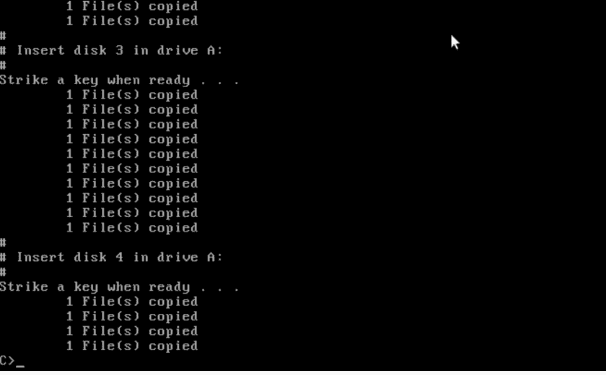
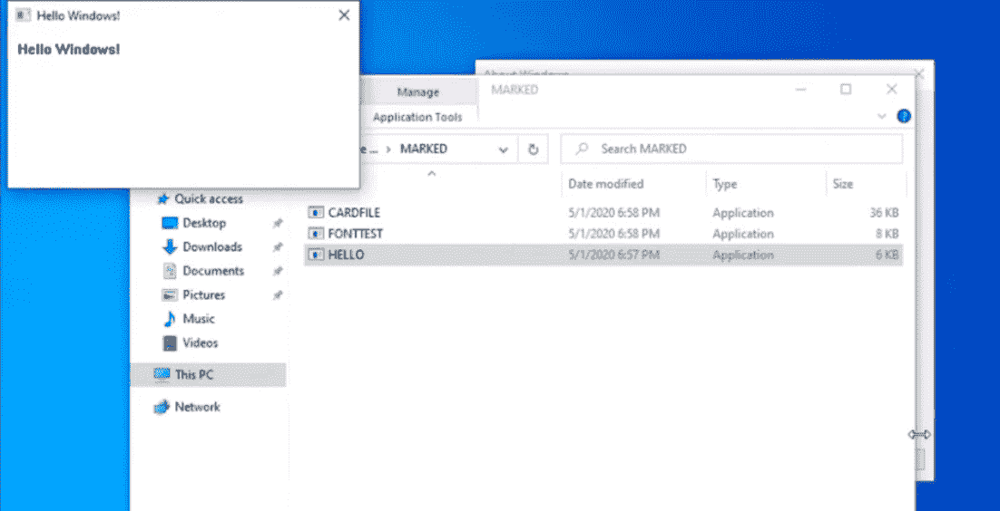

# 35 年后，一位复古计算爱好者将 Windows 1 重新投入使用

> 原文：<https://thenewstack.io/35-years-later-a-retro-computing-enthusiast-puts-windows-1-back-to-work/>

35 年前在 Windows 上编程是什么样的？

一个人决定找出答案。

总部位于纽约的开发人员迈克尔·卡萨德瓦尔冒险回到微软发布其第一个基于图形用户界面的操作系统 Windows 1.0 的时候——建立一个虚拟系统，他可以在那里安装其 1985 年的原始软件开发工具包，然后研究一个简单的“Hello World”程序附带的传奇样本代码。

卡萨德瓦尔令人着迷的实验让我们得以一瞥我们的起源，不仅展示了多少东西发生了变化，还展示了多少东西被保留了下来。

当然，到达那里是一半的乐趣…

## 历史娱乐

Casadevall 使用了甲骨文的 x86 虚拟化工具 [Oracle VM VirtualBox](https://www.virtualbox.org/) ，他在 Soylent News 上的一篇摘要中指出[他首次装载了 IBM 的 PC DOS 3.3，而不是微软的 DOS 3.3。“原因是当时 DOS 还没有作为一个独立的产品存在。相反，系统制造商将许可 DOS OEM 适配包，并创建他们自己的 DOS，如 Compaq DOS 3.3。](https://soylentnews.org/article.pl?sid=20/05/10/1753203)

很明显，Casadevall 为这个实验带来了很多技术专长。他在自己的 Twitter 个人资料[中称自己为“复古技术爱好者”和“涉猎信息安全的黑客”](https://twitter.com/FOSSfirefighter)

“我个人对复古计算感兴趣，这并不是什么秘密，”他在网站上发帖说，“记录个人电脑的历史和演变。”在后来的一段视频中，他称自己是“90 年代的孩子”，在一个圣诞节，他被一台运行 Windows 3.1 的帕卡德·贝尔电脑吓了一跳。

但是对于这个视频，他回到了更远的时间…

[https://www.youtube.com/embed/IRowVHPM1Gw?feature=oembed](https://www.youtube.com/embed/IRowVHPM1Gw?feature=oembed)

视频

这个项目面临一些挑战。

“Windows 1.0 早于作为标准计算机硬件的鼠标的存在，”他写道。事实上，Casadevall 很早就发现他无法模仿串行或总线鼠标。他想出了一个解决办法，将鼠标驱动程序从 Windows 2.0 安装盘复制到 Windows 1.0 安装盘上，这样它们就会作为一个选项出现在安装屏幕上。

他在 Soylent News 上写道:“第二个选择是使用 Windows 1.0 的 PS/2 版本，这是我在制作我的视频后才知道的。”"就像那个时代的 DOS 一样，Windows 被授权给原始设备制造商，他们可以根据自己的硬件进行调整."这是一个被遗忘的时代，它太原始了，以至于 Windows 仍然需要通过输入命令“win”从 DOS 命令行启动。Casadevall 写道，“有传言说 Windows 将被移植到微软基于 UNIX 的操作系统 XENIX 上运行。”

当然，至少有一种更简单的方法可以做到这一点。你可以使用 PCjs.org 的基于浏览器的模拟器，它已经支持鼠标工作。

他称 Windows 1“本质上是 DOS 的一个图形化插件，尽管通过深度魔法，它能够协同进行多任务处理。这完全是通过软件欺骗完成的……”

## **见第二盘**

在对磁盘进行分区并安装了 DOS 和 Windows 1 之后，是时候设置开发环境了。“不幸的是，几乎没有关于如何做到这一点的在线文档，”他写道。幸运的是，OS/2 博物馆已经扫描了一些原始的参考资料，并且“在仔细检查磁盘后，我发现了一个安装批处理文件。”它被恰当地命名为 INSTALL。BAT，并警告用户至少要有 512K 的内存。还需要配置为驱动器 A 的软盘驱动器和图形监视器(单色或彩色)。

“如果你没有上述设备或软件，中止这个批处理文件，”文件警告说。"建议使用鼠标，但不是必需的。"

在 Soylent News 上的帖子中，他提到了更加冗长的界面。“这一点润色可能是因为大多数用户将被期望自己安装 Windows，而不是预先安装它……”

但这只是对没有网页来分享信息的世界的一瞥。"有关软件开发工具包中文件的完整列表，请参阅文件文件列表。TXT 在磁盘 2 上…”一个屏幕解释道。

出于可能在 1985 年才有意义的原因，脚本和自述文件都在磁盘 2 上，而不是磁盘 1 上

事实上，SDK 分布在七个磁盘上，其中四个是在安装过程中插入的。当然，这都是由一个名为 INSTALL.BAT 的文件触发的。

第五张磁盘有 Windows 内核的调试版本，其余两张磁盘有示例编程代码，包括臭名昭著的 Hello World 示例。

并且用户需要执行更多的安装。“与后来的 SDK 版本不同，提供编译器是程序员的责任……”他的帖子指出。安装屏幕警告支持三个选项:

*   微软 C 编译器，版本 4.0
*   Microsoft Pascal 编译器，3.3 版或更高版本
*   微软宏汇编程序，版本 4.0

“非正式地(未经证实)，也可以使用 Borland C 的版本，”Casadevall 写道，“尽管这未经测试，而且似乎除了 USENET 上的一些注释之外没有记录。更有趣的是，上述所有工具都是 DOS 下的编译器，对 Windows 没有任何特定的支持。”

他在视频中指出，找到微软 C 4.0 并不困难，尽管他需要再浏览一遍手册，以找出如何正确设置它。因为硬盘在 1985 年并不常见，微软支持从软盘运行编译器。硬盘安装需要编辑那些关键的配置。SYS 和 AUTOEXEC。BAT 文件，以及手动复制所有必要的库和可执行文件。

编写代码还涉及到处理近指针(“在给定的段内功能上与普通的 C 指针相同”)和远指针(“8086 有使用它们的特殊操作码。”)

“当从任务管理器跳转到应用程序代码时，只要 Windows 需要加载正确的段，回调函数总是必须被声明。”

此外，Windows 1 清理堆栈的方式也很奇怪。

他指出，16 位 Windows 应用程序“存在于共享地址空间的大杂烩中”当时，Windows 没有立即回收被标记为未使用的内存。即使在应用程序终止后，它的一些部分仍会保留在内存中。

尽管如此，在通过磁盘驱动器多次交换软盘和一些故障排除后，Casadevall 使用文本编辑器编写了一个快速的 Hello World 程序(C ),然后用微软的 C 编译器编译它。它显然也创造了一个。EXE 版本的文件，只需输入不带后缀的文件名即可执行。程序立即打印出 NCommander 的测试信息。

“来自 DOS 的你好！”

## 很早以前的兼容性？

Casadevall 还想做一个实验:为 Windows 1.0 编写的“Hello World”程序还能在现代系统上运行吗？

一些研究表明，传统 DOS 和 16 位 Windows 程序的兼容性可以通过运行 NT 虚拟 DOS 模式(或 NTVDM)和 Windows on Windows(称为“Wow”)来实现)Casadevall 指出，即使在今天，NTVDM 仍然是 Windows 10 某些版本的一部分，尽管他指出，Windows 完全放弃了对传统 16 位的支持，并不包括 NTVDM。

但是微软仍然提供 32 位版本的 Windows 10——其中仍然包括 NTVDM。Casadevall 抓取了现在的 Windows 1909 版本并将其安装到虚拟机中，然后尝试安装他的 Windows 1 Hello World 应用程序。他写道:“双击 Hello 提示 Windows 下载并安装 NTVDM，这是很有希望的第一步。而第二次尝试，我可以确认:有可能！

“35 年的向后兼容！”

* * *

# WebReduce

<svg xmlns:xlink="http://www.w3.org/1999/xlink" viewBox="0 0 68 31" version="1.1"><title>Group</title> <desc>Created with Sketch.</desc></svg>