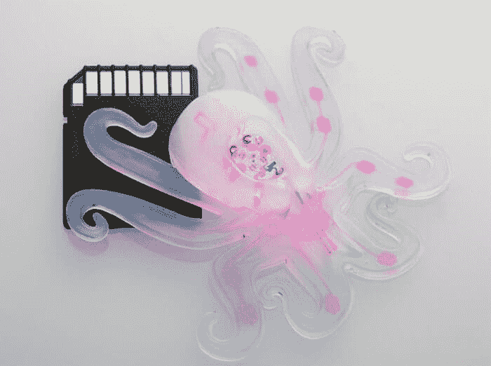
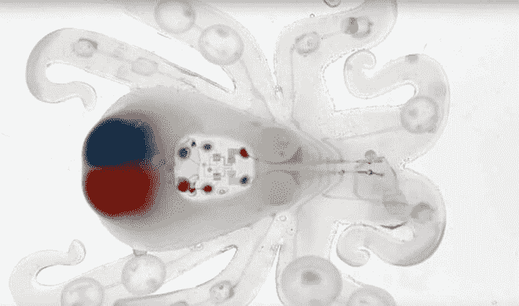
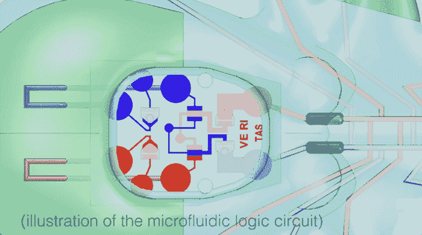

# 微流体章鱼机器人展示了软机器人的发展方向

> 原文：<https://thenewstack.io/3d-printed-autonomous-soft-octobot-controlled-microfluidic-circuits/>

由金属部件制成的硬边机器人的刻板形象现在正慢慢让位于一种新型的软机器人，由可变形材料制成，使其能够变形为不同的形式。近年来，科学家和工程师们一直致力于开发比硬机器人更通用的软机器人。尽管如此，这些早期的软体机器人仍然包含某种硬元件，例如电池、电路板和其他电子元件，或者连接到外部控制系统。

但这些限制现在可能会半途而废，这要归功于名字迷人的章鱼机器人。Octobot 被誉为世界上第一个自主的完全柔软的机器人，是哈佛大学研究人员的创造，利用一种结合 3D 打印，成型和软光刻制造技术的创新方法，并用微流控电路控制。

“软机器人领域的一个长期愿景是创造完全柔软的机器人，但斗争一直是用类似的软系统取代电池和电子控制等刚性组件，然后将它们组装在一起，”哈佛大学[威斯研究所](http://wyss.harvard.edu/)的工程和应用科学教授[罗伯特·伍德](https://www.seas.harvard.edu/directory/rjwood)解释道，他也是发表在 *[自然](http://www.nature.com/nature/journal/v536/n7617/full/nature19100.html)* 上的论文的作者之一。“这项研究表明，我们可以轻松制造一个简单的、完全柔软的机器人的关键部件，这为更复杂的设计奠定了基础。”

观看 Octobot 的发展及其制作过程:

[https://www.youtube.com/embed/1vkQ3SBwuU4?feature=oembed](https://www.youtube.com/embed/1vkQ3SBwuU4?feature=oembed)

视频

Octobot 的一个主要特点是，它完全由硅橡胶等柔软材料制成。身体本身是通过将硅酮聚合物倒入模具中制成的。3D 打印机将特殊的热敏墨水喷射到这种果冻状的基底上，当机器人被加热和固化时，这些墨水会蒸发掉，留下一个中空的静脉状网络，连接头部和四肢。

“通过我们的混合组装方法，我们能够以快速的方式 3d 打印出软机器人体内所需的每个功能组件，包括燃料储存、动力和驱动，”Wyss 研究所的合著者 Jennifer A. Lewis 教授在[新闻稿](http://news.harvard.edu/gazette/story/2016/08/the-first-autonomous-entirely-soft-robot/)中说。“Octobot 是一个简单的实施例，旨在展示我们嵌入自主功能的集成设计和附加制造策略。”

不仅 Octobot 的材料和制造模式是创新的，它的燃料来源也是如此。为了移动手臂，它使用一种常见成分过氧化氢的化学反应产生的加压气体，而不是依赖外部电源。

“软机器人的燃料来源一直依赖于某种类型的刚性部件，”迈克尔·韦纳说，他是一名博士后研究员，也是另一篇论文的合著者。“过氧化氢的奇妙之处在于，化学物质和催化剂之间的简单反应——在这种情况下，是铂——使我们能够取代刚性电源。”

 

大脑中由阀门和开关组成的“弹性”系统有助于控制两侧手臂的伸展。50%的过氧化氢燃料被送入两个储罐，这两个储罐膨胀并将燃料分配到微流体回路的其余部分，从而产生压力变化的级联连锁反应，导致运动。由于微流体逻辑电路的内在动力，液体流动是自我调节的，这实质上是基本[电子振荡器](https://en.wikipedia.org/wiki/Electronic_oscillator)的软件版本。根据 [*自然*](http://www.nature.com/news/beyond-terminator-squishy-octobot-heralds-new-era-of-soft-robotics-1.20487) 的说法，在这个阶段，Octobot 可以依靠 1 毫米的燃料运行 8 分钟左右。

你可能想知道这种设备有什么用，但软机器人将在刚性机器人无法到达的地方发挥作用，也许是在恢复操作的狭窄缝隙中，或者是在协同工作的情况下，它们可能被并排放置，与人类同事密切接触。

无论如何，研究人员现在正计划找到对软机器人进行编程的方法，以对刺激做出反应或执行特定任务，也许是通过创建更复杂的微流体回路并将柔性传感器集成到混合物中。因此，虽然它不会用压力驱动的迷你触手手臂接管世界，但 Octobot 实验证明，软机器人可以通过快速制造技术的组合以不同的方式制造，并通过非常规方式提供燃料和控制。

来自威斯研究所的图片。

<svg xmlns:xlink="http://www.w3.org/1999/xlink" viewBox="0 0 68 31" version="1.1"><title>Group</title> <desc>Created with Sketch.</desc></svg>