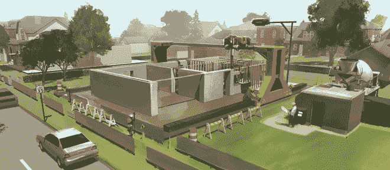
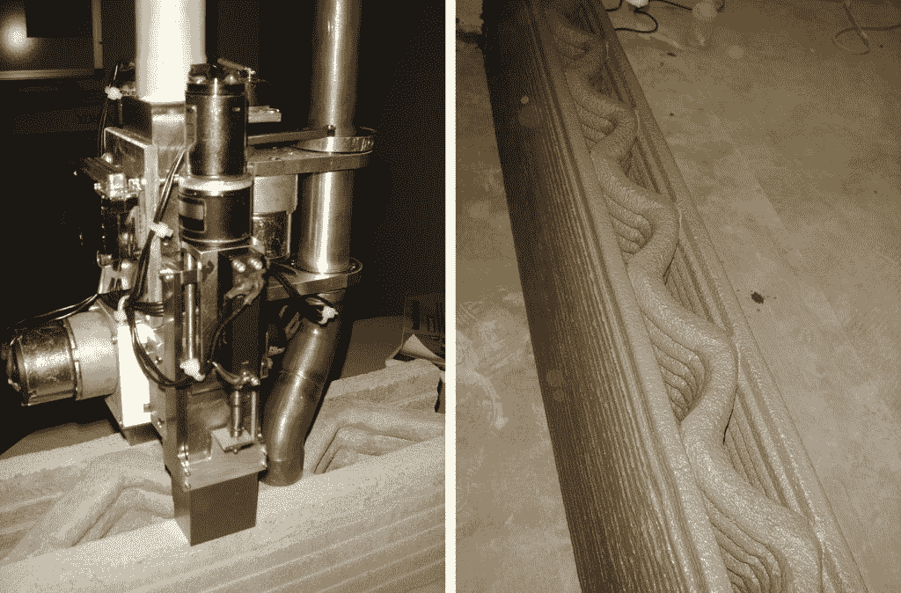
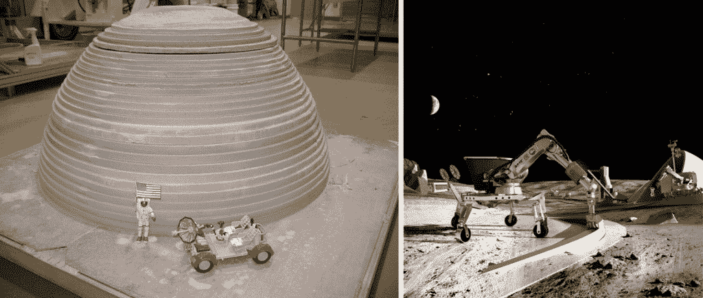

# 机器人为地球、月球和火星制造的 3D 打印建筑

> 原文：<https://thenewstack.io/3d-printed-buildings-made-by-robots-for-the-earth-moon-and-mars/>

我们中的许多人已经熟悉了添加制造或 3D 打印的各种产品，从家具和珠宝等日常用品到 T2 假肢等更专业的物品。但是 3D 打印可能有更重要的事情要做:近年来的几个原型提供了一个诱人的想法，即 3D 打印也可以用来快速廉价地大规模制造经济适用房，从本质上改变建筑业，从一个缓慢浪费的过程变成一个自动化和经济高效的过程。

由南加州大学教授 [Behrokh Khoshnevis](http://www.bkhoshnevis.com/) 、 [Contour Crafting](http://www.contourcrafting.org/) 开发的 3D 打印技术是这些 3D 打印技术的开创性技术之一，它采用了机器人控制的添加制造的基本前提，并将其扩大到可居住的结构——甚至有一天可能在月球上提供住所，使用直接来自月球表面的基底。

与打印塑料层的小型同类产品类似，Contour Crafting 利用安装在金属制成的便携式龙门架上的 3D 打印机，允许打印机头在所有轴上移动。这个巨大的、重量相对较轻的 500 磅的装置将使用定制设计的挤压机制“打印”出建筑 CAD 模型，该挤压机制吐出湿混凝土，由于特殊的硬化剂，混凝土保持其形状。粘性材料层逐渐形成中空或实心墙，这些墙非常坚固——比传统混凝土墙的强度高三倍——并且仍然可以定制，以同时添加管道和电气设备，甚至管道等基础设施。直线和不常见的曲线形式都同样可行。

使用轮廓工艺可以显著减少施工时间和成本；根据[网站](http://www.contourcrafting.org/faq/)和美国宇航局[技术简报](http://contest.techbriefs.com/2014/entries/machinery-automation-robotics/4737)，成本降低了 30%到 60%，建造过程加快了“至少 50 倍”与建筑相关的伤害——仅在美国每年就有 400，000 起——通过使用这种计算机化的建筑方法将会大大减少。Contour Crafting 的精确自动化还将减少 90%的建筑垃圾和建筑能耗，减少 70%的碳排放——考虑到现有的建筑行业每年排放 30%的全球碳排放，这是一个巨大的可持续优势。Contour Crafting 的成本效益、速度和潜在的较低环境影响意味着它也非常适合应急和高质量的低收入住房。

到目前为止，Khoshnevis 和他的团队已经打印出了 6 英尺高，4 英寸厚，由 6 英寸高的层组成的墙壁。由于“缺乏空间和适当的建筑许可”，更大的轮廓制作房屋尚未实现，但这项技术已经得到了认可，最近在美国宇航局的[创造未来设计竞赛](http://contest.techbriefs.com/)中赢得了第一名:

> 在过去的十年里，在学术资助下，我们已经证明了这一概念的可行性，目前已经有了一个可以建造 400 平方英尺的系统。具有实心或波纹芯墙的 ft 结构。在两年内，有了足够的投资，应该有可能展示 24 小时自动化建设一个完整的 2500 平方米。制成结构。

因此，难怪美国宇航局对未来在月球上建造潜在的采用这种技术感兴趣；最近的月球土壤实验表明，可以提取硫并加热，以产生波特兰水泥的合适粘合剂替代品，这意味着材料可以直接从月球上收获，而不是从地球上运输。

当然，轮廓加工等潜在的颠覆性技术确实引起了人们对该行业可能失业的担忧。然而，Khoshnevis 将这种转变比作发生在农业领域的同样转变，在农业领域，技术创新迫使以前的农民学习新行业的技能。混凝土 60 至 80 年的有限生命周期是另一个问题——使一种兼容的回收方法成为另一个需要解决的首要问题，一些人建议将这种加法技术与机器人减法技术相结合，如 [ERO 混凝土回收机器人](http://www.fastcodesign.com/1673081/recycling-robot-of-the-future-erases-concrete-buildings)。

然而，想象一下有一天我们的家园甚至整个街区可能会在不到一天的时间里由机器人零浪费地建造出来，甚至月球和火星殖民地也可能以这种方式建造，这是令人兴奋的。在一个不断发展的行业中，资源是有限的，但仍然存在不必要的浪费，这种革命性的催化剂可能是世界和未来太空探索所渴望的。

[https://www.youtube.com/embed/JdbJP8Gxqog?feature=oembed](https://www.youtube.com/embed/JdbJP8Gxqog?feature=oembed)

视频

<svg xmlns:xlink="http://www.w3.org/1999/xlink" viewBox="0 0 68 31" version="1.1"><title>Group</title> <desc>Created with Sketch.</desc></svg>