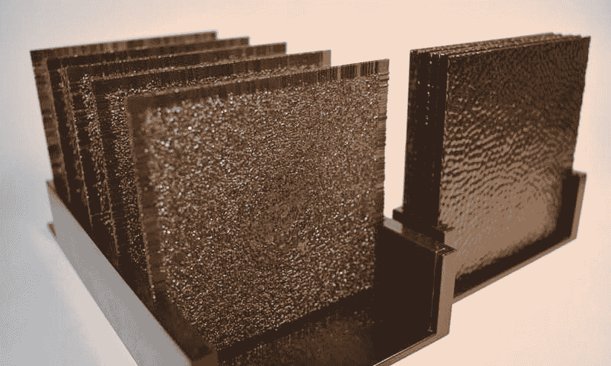
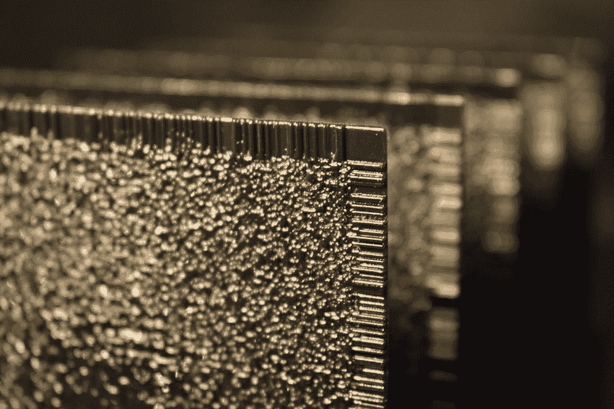
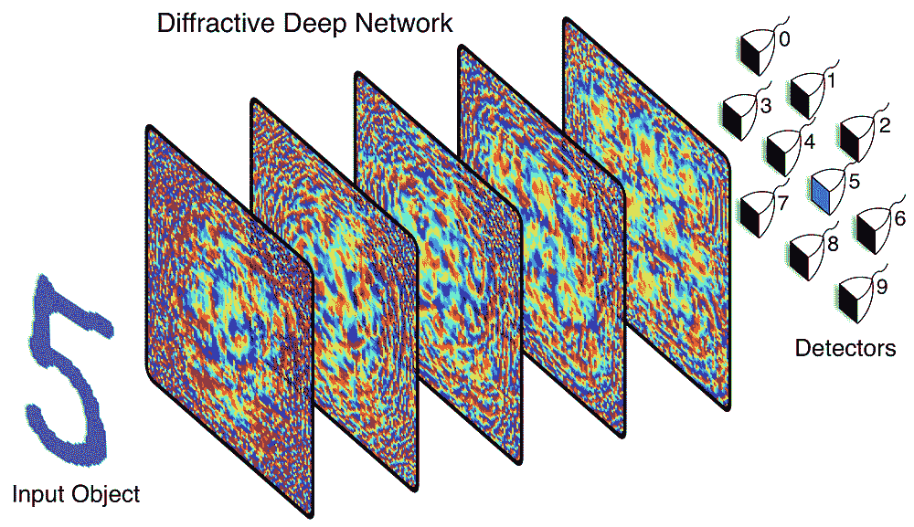

# 3D 打印衍射神经网络以光速处理数据

> 原文：<https://thenewstack.io/3d-printed-diffractive-neural-network-processes-data-at-speed-of-light/>

我们今天认为理所当然的许多便利技术中都包含了大量的机器学习:针对我们电子邮件收件箱的[垃圾邮件过滤器](https://thenewstack.io/worlds-first-spam-remembrance/)，检测[欺诈](https://thenewstack.io/how-graph-databases-uncover-patterns-to-break-up-organized-crime/)和[假冒](https://thenewstack.io/ibm-combines-ai-and-blockchain-to-identify-counterfeits/)，以及[数据管理](https://thenewstack.io/the-role-of-machine-learning-in-data-management/)。当然，许多这种机器学习的魔法在后台不可见地发生，但为什么这些机器学习模型做出某些决定而不是其他的[并不总是完全清楚](https://datascience.stackexchange.com/questions/22335/why-are-machine-learning-models-called-black-boxes)，即使对设计它们的专家来说，也是如此，这使得人工智能的这一方面有点像一个神秘的“黑匣子”。

但是显然还有其他方法来实现机器学习。加州大学洛杉矶分校的研究人员提出了一种让机器学习的内部工作方式真正可见的新方法，他们 3D 打印了一个神经网络，该网络使用光而不是电子来光学处理信息。

在他们最近发表在 *[Science](http://innovate.ee.ucla.edu/wp-content/uploads/2018/07/2018-optical-ml-neural-network.pdf)* 上的论文中，该团队描述了他们如何使用一种物理机制——即，代表[人工神经网络](https://en.wikipedia.org/wiki/Artificial_neural_network)层的衍射材料印刷层——来执行机器学习任务。他们的衍射深度神经网络(D ² NN)将能够做任何基于计算机的神经网络可能做的事情，例如图像识别——但以光速进行。

为了证明他们的概念，该团队首先训练了一个人工神经网络来识别和识别从 0 到 9 的手写数字。由于训练神经网络需要更多的计算资源，这种训练通常在计算机上进行。但是在设计和训练了神经网络之后，该团队接着开始 3D 打印这个最终的机器学习模型，作为一堆可以让光穿过的薄聚合物层。

这些层的像素化纹理类似于构成人工神经网络的人工“神经元”,该人工神经网络连接到网络中相同或其他层中的其他人工神经元。根据该团队的说法，这些打印的神经网络的行为就像一个具有物理神经连接的物理大脑——只是在这种情况下，是光连接人工神经元，并允许信息从一层转移到下一层。

研究人员写道:“给定层上的每个点要么透射要么反射入射波，这代表一个人工神经元，它通过光学衍射与下面层的其他神经元相连。”"通过改变相位和振幅，每个“神经元”都是可调的."

当呈现手写数字时，来自[太赫兹光谱](https://en.wikipedia.org/wiki/Terahertz_radiation)的单色激光穿过这些层，然后衍射神经网络可以通过将光聚焦到堆叠末端的十个“检测器区域”之一来分类哪个数字。

除了对数字进行分类，该团队还使用 3D 打印的神经网络进行了一些测试，该网络可以对各种衣服进行分类。对于每一种特定类型的数据，研究人员都必须打印出经过训练的神经网络的物理版本——类似于如何建造一个[机械计算器](https://en.wikipedia.org/wiki/Mechanical_calculator)来执行算术运算。该团队的实验显示，他们能够以光速执行这些相对复杂的任务，但准确性相对降低；在对数字进行分类的情况下，准确率为 91.75%，而识别服装的准确率在 80%左右徘徊。

虽然这些精度水平低于传统的基于计算机的神经网络，但它也有优势:除了以光速快速处理输入，经过训练和打印后，神经网络还可以在没有任何电力的情况下运行。虽然还不完全清楚这种全光神经网络如何集成并定期使用，但人们可以想象这项技术可以用于例如对高速移动的物体进行分类。它或许还可以用于智能手机上使用可见光的面部识别，而不需要手机电池供电，或者用于医疗成像领域，尽管这需要重新设计相机，以某种方式包含这种光学神经网络。此外，还有如何补偿 3D 打印过程本身产生的误差的问题。无论如何，该团队现在希望扩大他们的神经网络，以潜在地处理更复杂的任务，使用更多的层，并找到提高准确性的方法。

图片:加州大学洛杉矶分校

<svg xmlns:xlink="http://www.w3.org/1999/xlink" viewBox="0 0 68 31" version="1.1"><title>Group</title> <desc>Created with Sketch.</desc></svg>