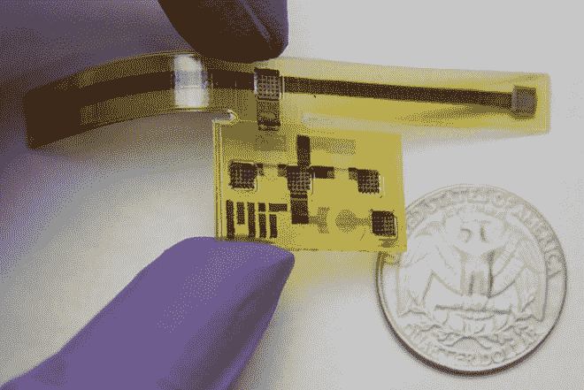
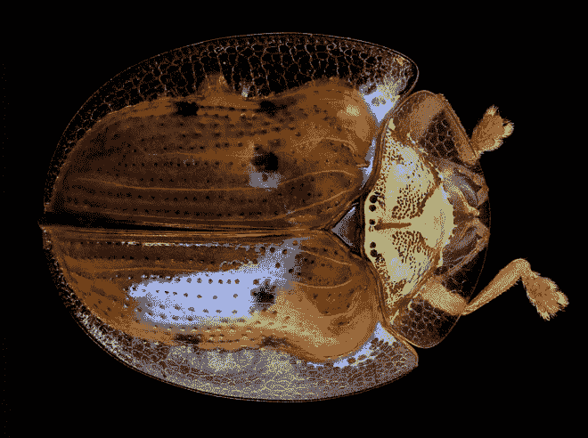
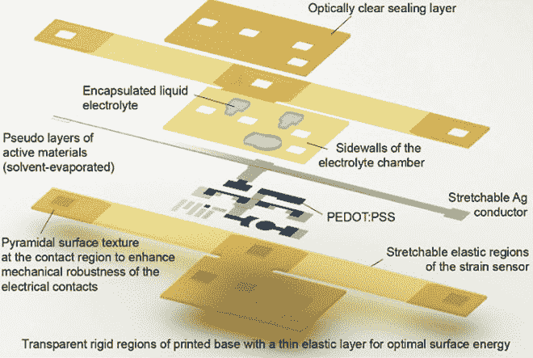
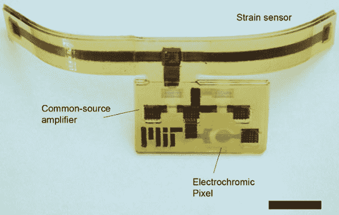

# 未来变形机器人的传感器和电路构成的三维皮肤

> 原文：<https://thenewstack.io/3d-skin-made-sensors-circuitry-tomorrows-shape-shifting-robots/>

柔性电子产品的前景在过去几年中吸引了大量的注意力，不仅可能应用于消费电子产品，还可能应用于建筑和医疗行业(想想可以折叠和扭曲的电话、光伏或医疗器械)。现在，麻省理工学院[计算机科学和人工智能实验室](https://www.csail.mit.edu/) (CSAIL)的一组研究人员已经开发出一种方法，利用 3d 打印将传感器和处理电路集成在一种柔性材料上。

这些带有传感器的可延展、可反应的 3d 打印“皮肤”有朝一日可能被用于包覆机器人、机器甚至我们的建筑。想象一下自主机器或系统能够感知它们的环境并做出相应的调整；例如，在阳光明媚的日子里，覆盖着这种表皮的玻璃钢高层建筑可以降低玻璃的透明度。在热量的影响下，柔性和打印的机器人部件可以变形并“[自我组装](https://thenewstack.io/shapeshifted-things-4d-printed-materials-programmed-for-self-transformation/)成另一种形式。

## 受生物启发

研究小组的[发现](http://www.kurzweilai.net/a-printable-sensor-laden-skin-for-robots-or-an-airplane)发表在最近一期的*先进材料技术*上，详细描述了他们如何能够构建一种设备，这种设备不仅可以检测施加在它身上的机械应力，还可以处理对它的响应，即改变其 3d 打印表面上特定区域的颜色。该小组的复合装置从金龟甲虫，或称“金甲虫”，一种被触摸时会改变其外壳颜色的昆虫那里得到线索，以类似的方式做出反应。

“在自然界中，传感器和互联网络[如人类神经系统]被称为感觉运动路径，”论文的主要作者 Subramanian Sundaram 说，他是电气工程和计算机科学的研究生。“我们试图看看我们是否可以在 3d 打印的物体中复制感觉运动路径。所以我们考虑了我们能找到的最简单的有机体。”

## 多材料三维打印机

然而，该团队的方法不同于构建柔性电子器件的传统方法。该团队没有选择柔性基板材料，然后在其上层叠电路，而是同时 3d 打印基板和电路，这扩大了可以制造的设备的可能范围。此外，该团队使用了麻省理工学院的 [MultiFab](https://thenewstack.io/printer-mit-can-see-print-views/) ，这是一种能够同时打印多达 10 种不同材料的 3d 打印机原型，这意味着这些多功能基板也可以在同一层中包含一系列不同的材料。由于不同的打印头可以挤出热和冷的材料，材料甚至可以在不同的温度下打印。发射紫外光的二极管阵列用于固化构成基底的湿的印刷材料。

该团队的混合设备被布置成有点压缩的 T 形结构，由一个宽底座和一个长的水平顶杆组成。这个顶端的杆子是由可拉伸的塑料制成的，嵌有一条银，这样在实验过程中，电极可以夹在两端。

形成该设备基础的宽片由更坚固的塑料印刷而成，包含两个印刷晶体管和一点半导体聚合物。研究人员称这种“像素”能够在顶部横杆拉伸时改变颜色，从而改变银带的电阻。

晶体管本身是由一个半导体通道组成的，通道顶部有一个金属线的“门”。当电流通过时，就会产生电场，使半导体在导电和不导电之间交替变化。与在栅极和半导体之间有绝缘材料的传统晶体管相比，该团队的设备使用含有氯化钾和甘油的液体水层作为绝缘体。当栅极带电时，钾离子进入半导体，改变其导电状态。

通过包括这种液体层，该团队的设计需要 1.5 伏的较低电压来运行，但另一方面是它没有那么持久，尽管这样一种结合了传感和处理能力的复合设备将使更复杂的自主系统成为可能。Sundaram 说:“我认为我们可以让它稳定工作两个月。“一种选择是用某种介于固体和液体之间的东西来代替液体，比如水凝胶。但这是我们以后要做的事情。这是一个初步的示范。”

在麻省理工学院阅读更多内容。

图片:麻省理工学院 CSAIL

<svg xmlns:xlink="http://www.w3.org/1999/xlink" viewBox="0 0 68 31" version="1.1"><title>Group</title> <desc>Created with Sketch.</desc></svg>