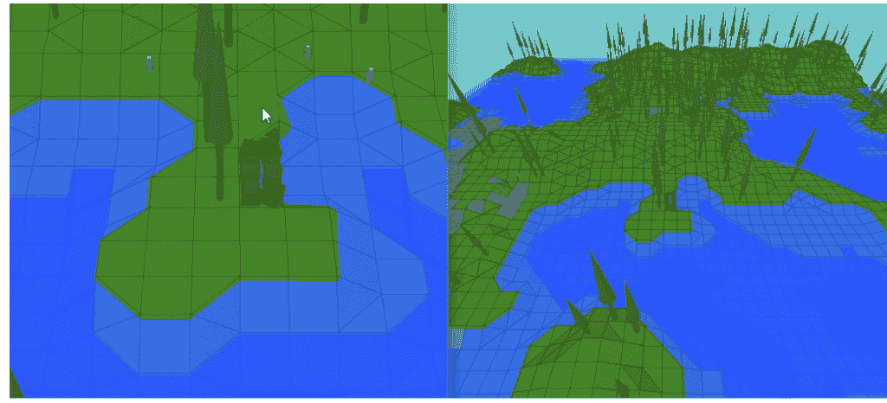
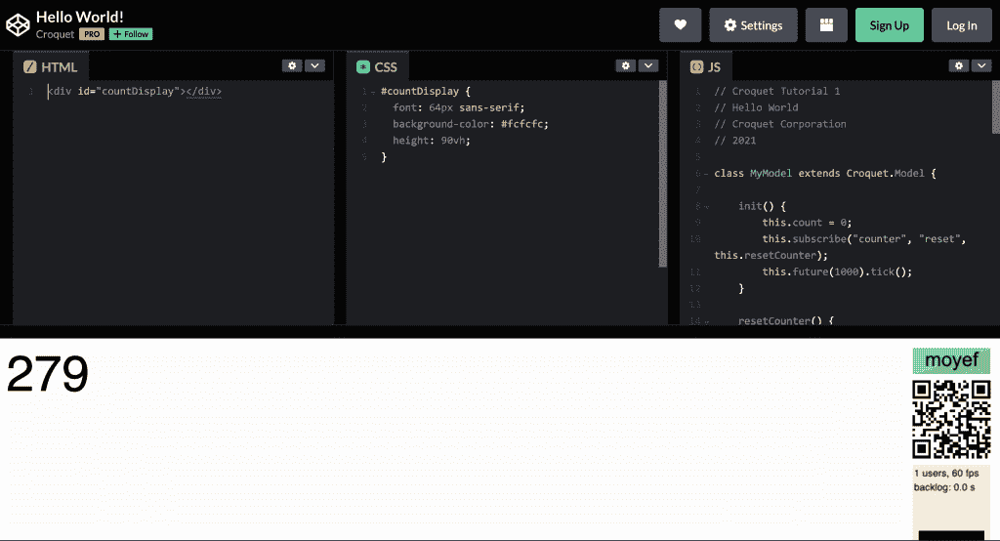
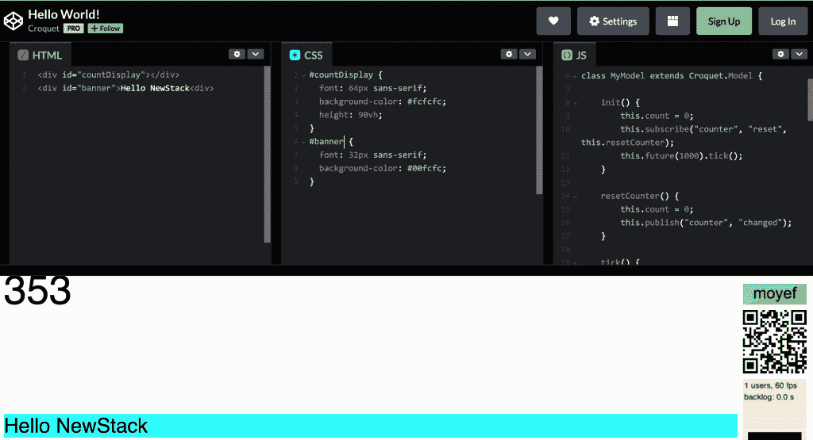
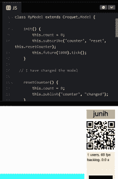

# 3D Web 开发:通过槌球游戏

> 原文：<https://thenewstack.io/3d-web-development-going-through-the-hoops-with-croquet/>

你可以一步到位地设计和制造你的突破性产品，或者分阶段交付你的项目。如果这听起来像一个敏捷顾问的信息，那么它就是。另一个可靠的方法是将你的提议分成不同的独立层。

我提到这一点是为了避开由[槌球](http://croquet.io)所做的各种陈述，所有这些陈述的受众都略有不同。它让你“完全构建客户端多用户网络应用”。但是槌球也是“元宇宙的操作系统”此外，“槌球操作系统是一种强大而简单的建立微脉管的开放方式”。那是[微伏](https://thenewstack.io/croquet-woos-javascript-devs-with-a-web-based-metaverse/)；不是微服务，或者 metaverses。

一旦一个人接受了渐进式建筑是有意义的，那么就没有必要担心所有与“元宇宙”这个词相关的事情今天，对即将到来的元宇宙/网络空间/绿洲的关注将集中在社会和监管问题上。Meta 的 Nick Clegg 焦虑不安地看着他们。在某种程度上，Croquet 需要面对这些问题，但是对于本文，我只关注 Croquet 处理的对开发人员更友好的工程挑战。

在多人游戏世界中，服务器必须是事实的关键——主要是出于信任的原因。当一个或多个玩家在堡垒之夜对决时，每个人都需要确保给定公平的延迟和每秒帧数，只有他们的武器技能决定事件。然而，对于许多用户发起的动作，即使在同一个游戏中，也不存在真正的信任问题。抢劫预定的箱子就是一个例子。

Croquet 明确表示，在它的系统中没有服务器——但是有**反射器**。事实上是一个全球性的舰队。欣赏他们所做工作的最快方法就是在两个不同设备的浏览器上并排运行[croquet.io/w3](https://croquet.io/w3/)。对于第二个设备，复制第一个设备的浏览器中生成的 URL，或者使用潜伏在左下方的二维码。你会通过两个浏览器看到相同的可操控景观(很像老神 sim Populous)。如果你使一个变形，另一个也会改变，即使你只在一个方向上滚动。您可能会想“好吧，两个设备都在寻找相同的服务器模型。”但是不，他们运行他们自己的模型代码，但是看着**一个共享消息流**。因此，反射器的工作是确保当我改变地面上的事实时(在这种情况下，通过改变模拟中的表面)，运行相同模型的客户端同时更新相同的消息。



一个 [Croquet 客户端运行通过发布/订阅进行通信的同步模型](https://blog.codefrau.net/2021/08/what-is-croquet-anyways.html)。就像互联网本身一样，反射器只是消息传递基础设施——让计算在边缘完成。

## Hello World 示例

我将在这里直接进入一个 [Codepen 例子来展示它是如何工作的。](https://codepen.io/croquet/pen/bPNgMY)

你应该看看“你好，世界！”用 Codepen 框架内连续窗口(HTML、CSS 和 Javascript)中的三个动态文件编程(它实际上不打印那一行)。你会在底部窗口看到一个倒计时的数字。我们将不需要任何伟大的编码技能来确定发生了什么。



Croquet 将一个应用程序分为**视图和模型。我们知道模特在做什么——她在表演。它的工作是发布活动，并提供发布活动的方法。但是，在此过程中，您在浏览器中看到的是视图。视图订阅了它需要知道的所有事件。它还发布来自用户的交互事件。所以当你达到那个不断增加的数字时，它就会重置。**

在我们的示例中，当您在 **countDisplay** div 中单击时(参见 HTML 窗口)，在 **MyView** 中捕获一个本地单击事件(参见 Javascript 窗口)。这是在构造函数中设置的。被引用的方法 **counterReset** 做您想象的事情——向适当的通道发布消息:

```
constructor()
{
    ...
    countDisplay.onclick  =  event  =&gt;  this.counterReset();
    ...
}

counterReset()  {
        this.publish("counter",  "reset");
}

```

因此，您的本地 **MyModel** (以及登录到会话中的任何其他模型)将通过订阅事件的“计数器”通道做出反应。收到“复位”消息后，模型复位计数器并发布“已更改”消息:

```
init()
{
    ...
    this.subscribe("counter",  "reset",  this.resetCounter);
    ...
}

resetCounter()  {
 this.count  =  0;
 this.publish("counter",  "changed");
}

```

就像白天过后是黑夜一样确定，**我的视图**拾取它订阅的“已更改”消息，并通过读取模型来更改视图:

```
constructor()
{
    ...
    this.subscribe("counter",  "changed",  this.counterChanged);
    ...
}

counterChanged()  {
    countDisplay.textContent  =  this.model.count;
}

```

一切都很简单。我们注意到，视图和模型之间唯一没有消息传递伴侣的直接交互是当视图直接从模型中读取计数值时，正如您在上面看到的。

我提到了一个会话，这就是 Javascript 代码的最后一部分所处理的；它用您的 API 键、视图和模型类名加入一个会话。Javascript 中唯一有意义的事情是将 **MyModel** 与 Croquet 注册在一起。

## 更改视图或模型时会发生什么

那么，如果您更改视图的某些部分会发生什么呢？

让我们修改代码，自己添加一个额外的欢迎横幅:



除了预期的问候是可见的，其他什么都没有发生。

但是，如果您更改模型会发生什么？

现在情况不同了。我只是添加了一个评论，但是你可能会注意到颜色框中的随机字母和二维码会改变，只要重新加载发生:



据我们所见，如果模型实际上不同，我们就不可能同步多个模型(当然，我只添加了一个注释)。请记住，模型是注册的，所以如果模型发生了变化，就必须有所作为。

会话由两个自动分配的颜色和一个连接到二维码和 url 的五个字母的无意义单词来标识。参与同一会话的用户(看到相同徽章的用户)保证同步。

对模型代码的任何更改都将创建一个带有不同徽章的新会话。只有当其他用户加载更改后的代码时，他们才能加入新的会话。正如您所期望的，模型永远不应该直接访问视图；请记住我们是如何在不干扰系统的情况下改变视图的。因此，视图是本地的，可能对用户来说是唯一的——共享模型无法了解用户的独立视图。同样，视图不能写入模型——模型由每个人共享，所以它不能改变。只通过发布/订阅消息传递伴侣进行交流，避免不适当的行为。


你可以从 Croquet 获得你自己的 API 密钥，看看你能做什么。虽然这种同步多用户活动的方法需要在信任边界进行更深入的检查，但目前它代表了无服务器工具集的一个有趣的新视角。

<svg xmlns:xlink="http://www.w3.org/1999/xlink" viewBox="0 0 68 31" version="1.1"><title>Group</title> <desc>Created with Sketch.</desc></svg>