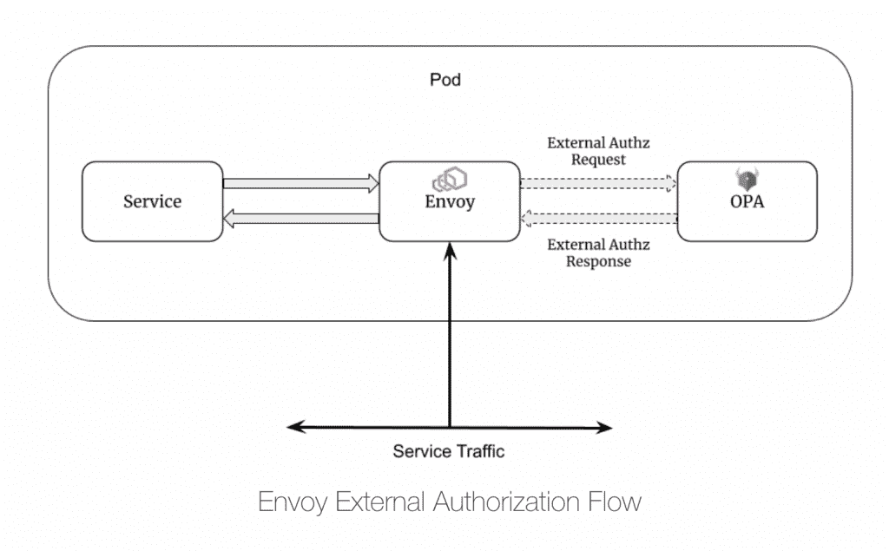
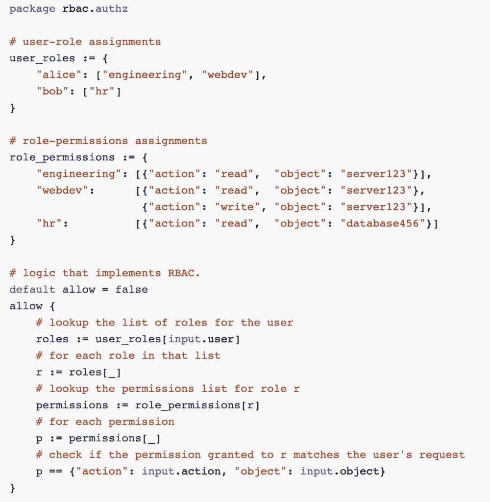

# 微服务授权的 4 个最佳实践

> 原文：<https://thenewstack.io/4-best-practices-for-microservices-authorization/>

云原生技术有着毋庸置疑的优势，但也面临着巨大的挑战。典型的例子:微服务授权。

 [安德斯·埃克纳特

Anders 是 Styra 的一名开发人员支持者，在主要是分布式环境的软件开发、安全和身份系统方面有着长期的背景。不在电脑前时，他喜欢看足球、烹饪和比利时啤酒。请在 Twitter 上关注他，地址是@ anderseknert](https://www.linkedin.com/in/anderseknert/) 

[对于许多公司来说，微服务](https://thenewstack.io/microservices-vs-monoliths-an-operational-comparison/)已经成为云原生应用的首选架构，无论是迁移传统应用还是构建新的云原生应用。与传统的单片应用程序相反，微服务架构意味着每个应用程序都由几十个或几百个单独的服务组成，每个服务都有自己的 API 集。

在微服务架构中，开发人员处于一个棘手的位置，不仅要保护单个外部 API 网关，还要保护每个具有安全授权步骤的微服务 API。事实上，[零锈架构](https://blog.styra.com/blog/zero-trust-with-envoy-spire-and-open-policy-agent-opa)的核心原则是每个请求都必须经过认证和授权。

对于开发人员和安全团队来说，为每个微服务调用实现授权的想法可能会令人望而生畏。幸运的是，有许多最佳实践可以让您走上正轨——并在跨团队的可扩展过程中实现标准化。

## **从底层微服务中分离授权逻辑和策略**

这是一个大的。简单地说，团队在授权中可以采取的最有力的步骤是将授权逻辑和策略从应用程序本身中分离出来——也就是说，避免将授权逻辑硬编码到微服务中。这允许团队轻松地更改策略的授权编码，而无需更改应用程序的编码。

更好的是:在像[开放策略代理](https://www.openpolicyagent.org/) (OPA)这样的工具上标准化您的授权，这允许您跨服务和团队一致地创建和执行策略。由于 OPA 非常灵活，这也为您提供了广泛的选择，让您可以实际设计授权实施，以及在应用程序中存储策略库的位置。

## **使用边车加强安全性、性能和可用性**

在过去，大多数授权决策都发生在网关上——如果开发者愿意，他们仍然可以在那里对微服务实施授权。然而，出于安全性、性能和可用性的考虑，通常最好也对每个微服务 API 实施授权步骤。如前所述，在零信任体系结构中，每个请求在被允许之前都必须经过身份验证和授权。

将每个授权请求发送到一个集中的服务是完全可能的。但是，这会显著增加延迟—例如，单个用户请求可能会遍历多个服务，如果每个请求都需要额外的网络中继才能到达集中式授权引擎，则会影响用户体验。

幸运的是，如果您使用 OPA 这样的工具，您还可以运行本地授权引擎和策略库，作为每个微服务的辅助工具。这是一个使用 Istio 服务网格的架构的例子，它使用了 Envoy 代理 sidecar。使用这个模型，您可以确保每个请求都通过授权检查，同时最大化服务的性能和可用性。

## **实施 JSON Web 令牌(JWT)验证**

为了满足在零信任模型中认证每个用户和每个服务对服务请求的需要，在这些实体之间建立安全信任也是一种最佳实践。输入 JSON web 令牌(jwt)。这些访问令牌提供了一种验证调用者身份的统一方法，因为它们是由您的体系结构中的可信身份服务器(如 OAuth2 或 OpenID Connect)签发的，您知道您可以信任与它们相关联的用户 ID(它们必须与令牌相关联的公钥相匹配)。

另外，jwt 是“自包含”的实体:它们记录了建立用户访问元素(如角色和权限)所需的所有数据(和元数据)——不需要外部调用集中式服务来执行查找。

与前一个技巧一样，您也可以使用 OPA 来完成这个步骤(验证 jwt)。简而言之，您可以在微服务 API 级别创建并强制实施要求令牌验证的策略，例如，对服务 A 或服务 B 的所有请求都必须包含有效的 JWT。此外，您还可以包含基于上下文的授权要求，例如用户必须是开发人员，当前处于待命状态，并且在特定的地理位置，这是发出请求所必需的。通过这种简单的方式，您可以开始在您的微服务集群中更有效地实施零信任。

## **利用 RBAC 和 ABAC 控制最终用户的行动**

同样，使用基于角色的访问控制(RBAC)来根据终端用户的工作职能控制他们有权在集群中做什么也是一种最佳实践。RBAC 不仅仅是一种最佳实践，它还是应用程序级授权的基础。不仅仅是获取一个用户名并评估它拥有什么权限，RBAC 允许你将权限分成角色——开发人员、营销人员、人员操作或任何其他角色。然后，您可以为该角色分配权限，这很容易分配或撤销。这是一种比基于每个用户分配权限更简单、更合理和可伸缩的方式。

在这里，您可以使用 OPA 之类的工具轻松实施 RBAC。在下面的策略示例中，我们可以看到如何根据用户 Alice 和 Bob 在 engineering and webdev (Alice)和 human resources (Bob)中各自的角色，允许他们在集群中的不同资源上执行不同的操作。

还要注意，这仅仅是 OPA 权限的开始。团队还可以轻松地实现基于属性的访问控制(ABAC)需求(上面提到过)，这允许更细粒度的授权——将属性分配给用户和资源，然后定义它们之间的逻辑。例如，您可以创建一个策略，规定用户只能访问服务 A(包含关键用户数据),前提是他们已经在公司工作了至少两年，或者他们控制着一定水平的预算。

一旦您开始使用 ABAC，您可以实施的一致的、可伸缩的授权的种类是没有限制的。最后一点:使用 OPA，您不需要预先决定 RBAC 还是 about 您可以使用对您的用例有意义的东西，并在两种模型之间轻松转换。

## **获得授权开始运行**

当然，这些都是微服务授权的一些基础。你很快就会想要构建其他安全功能，比如在微服务架构中整合 [SPIFFE/SPIRE 来认证不同的服务](https://blog.styra.com/blog/zero-trust-with-envoy-spire-and-open-policy-agent-opa)。幸运的是，有大量的资源来指导你前进。不仅有大量关于这些问题的[文档](https://www.openpolicyagent.org/docs/latest/)，而且你可以参加我们免费的 [Styra Academy 课程](https://academy.styra.com/courses/microservice)来学习如何设计微服务授权，以及如何在 Istio 和库马服务网格中与 OPA 一起部署示例应用。

虽然微服务总是会给开发人员带来挑战，但这些资源已经将曾经具有挑战性的任务简化为标准过程。祝好运和快乐的建设！

<svg xmlns:xlink="http://www.w3.org/1999/xlink" viewBox="0 0 68 31" version="1.1"><title>Group</title> <desc>Created with Sketch.</desc></svg>