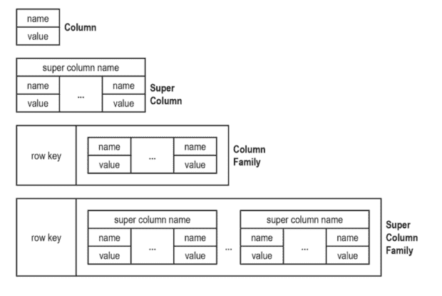
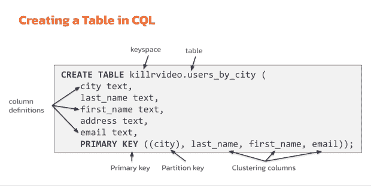
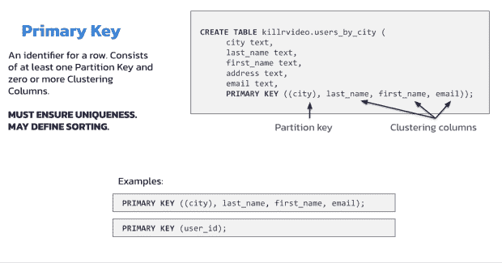
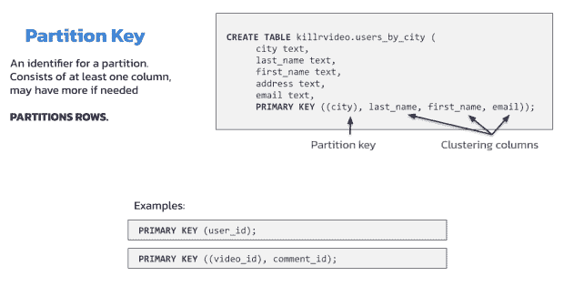

# 我们听到的关于 Apache Cassandra 的 4 个常见问题

> 原文：<https://thenewstack.io/4-common-questions-we-hear-about-apache-cassandra/>

自从 2007 年开发以来， [Apache Cassandra](http://cassandra.apache.org) 已经作为一个坚如磐石、高度可伸缩、可靠的 NoSQL 数据存储而建立了声誉，被世界上一些最大的企业所使用。但与卡桑德拉共事也需要一定的经验和专业知识。因此，可以理解的是，当了解这个开源数据库时，会出现许多问题。本文涵盖了开发人员在各种社区论坛上提出的一些热门问题。

## Cassandra 中的分区、聚类和组合键有什么区别？

理解宽列数据库中的主键与关系主键的不同是学习运用 Cassandra 的能力的关键一步。

像 Cassandra 这样的宽列存储使用列族的概念，列族是一个数据库对象，它包含一起使用的多列相关数据，类似于传统的关系数据库表。在给定的列族中，所有数据都以逐行的方式存储，使得给定行的列存储在一起，而不是单独存储每一列。



换句话说，列族是一个键-值对，其中键被映射到一个值，该值是一组列。与关系数据库类似，列族就像一个“表”，每个键值对就是一个“行”对于开发人员来说，在代码中或通过 API，宽列表可以表现为熟悉且易于使用的行列表。

让我们来看一些示例代码，以帮助将这些概念融入生活。



在上面的代码中，我们有一个键空间，一些像“城市”、“姓氏”和“名字”这样的字段主键在底部。顺便说一下，Cassandra 中的所有表都必须包含至少一个分区键。在上图突出显示的示例中，我们将按“城市”进行分区

接下来的任何内容都是簇列。注意“city”周围的括号，这表示这是分区键。如果您的分区键是复合的并且有多列，我们使用括号来表示分区键是什么。这样就清楚了哪些列是主键，哪些是聚集列。



主键的主要目的是确保一行是唯一的。它还可能包含零个或多个聚类列，这些列可以控制排序。但是主键也可以是“复合的”或“复合的”，这意味着它有两列或更多列。



分区键用于对我们的行进行分区，它有一个或多个列。

## Cassandra 如何找到包含我想要的数据的节点？

有些人似乎认为驱动客户端只是将数据发送到一个随机的节点。但是确实有一种非随机的方式，让你的驱动选择一个节点与之对话。这个节点被称为协调节点。通常选择它是因为它最接近。

客户端请求可以发送到任何节点——首先，它们被发送到驱动程序知道的节点。但是一旦驱动软件连接并理解了集群的拓扑结构，它可能会变成一个更接近的协调器。查看开源生态系统项目 [Stargate](https://www.datastax.com/products/datastax-astra/apis) ，了解如何将计算和存储分开以实现可扩展性。

开源 Cassandra 集群中的节点使用 gossip 协议相互交换拓扑信息。gossiper 每秒运行一次，并确保所有节点都保持最新的数据，这些数据来自您配置的任何一个 snicker。snitch 跟踪每个节点属于哪个数据中心和机架。这样，协调器节点也具有关于哪些节点负责每个令牌范围的数据。

您可以通过从命令行运行节点工具“ring”来查看这些信息，尽管如果您使用虚拟节点或“vnodes”，这将有点难以确定，因为所有 256 个虚拟节点(默认数量)上的数据将很快在屏幕上闪过。

在 [K8ssandra.io](http://k8ssandra.io) 上，这种行为更像是 Kubernetes 本地的，Etcd 被用来代替 Gossip 协议来传播集群元数据，以及安全的模式更新。

## Cassandra 中的二级索引是如何工作的？

索引是相当微妙的。它有助于理解数据库的内部结构。这个查询在 Cassandra 内部是如何工作的？看看这个示例代码:

```
Select *  from update_audit
Where scopeID=35  and
formid=78005  and
record_link_id=9897;

```

这个查询在 Cassandra 内部是如何工作的？

基本上，作用域 ID 等于 35 且表单 ID 等于 78005 的分区的所有数据都将被返回，然后它将被记录链接 ID 索引过滤。它将查找 9897 的记录索引 ID 条目，并尝试匹配与返回的行相匹配的条目，其中范围 ID 等于 35，表单 ID 等于 78005。将返回分区键和索引键的行的交集。

您可能会问，像记录链接 ID 索引这样的高基数列是否会影响查询性能。高基数索引实质上为主表中的几乎每个条目创建一行。性能可能会受到影响，因为 Cassandra 是为查询结果的顺序读取而设计的。随着索引基数的增加，索引查询本质上迫使 Cassandra 执行随机读取，查找查询值所需的时间也增加。

那么，Cassandra 会接触上面查询的所有节点吗？不，它应该只涉及负责作用域 ID 等于 35 和表单 ID 等于 78005 分区的节点。同样，索引存储在本地，只包含对本地节点有效的条目。

## Cassandra 和 Datastax Astra DB 有什么区别？

Cassandra 是一个开源的 NoSQL 数据库，它为您可能每天都在使用的大规模分布式应用程序提供支持。然而，这取决于你和你的团队自我管理。

另一方面，Astra DB 是一个无服务器的数据库即服务。这是一个基于 Cassandra 的完全托管、自动扩展的云服务，运行在您选择的公共云提供商上。

随着开源数据 API 网关 [Stargate](https://dtsx.io/3deFX0s) 的加入，Cassandra 和 Astra DB 都服务于文档、列和键值 NoSQL 工作负载。有了 Astra DB，星门就自动为你设置好了。

*了解更多关于卡珊德拉* [*这里*](https://dtsx.io/3S3YJGB) *。*

<svg xmlns:xlink="http://www.w3.org/1999/xlink" viewBox="0 0 68 31" version="1.1"><title>Group</title> <desc>Created with Sketch.</desc></svg>