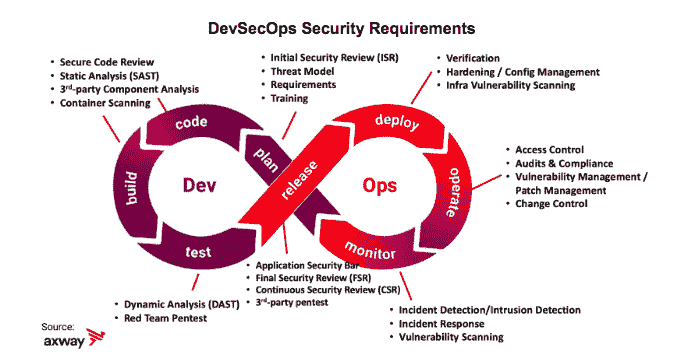

# 将安全性集成到开发运维中的 4 个新年决心

> 原文：<https://thenewstack.io/4-new-years-resolutions-to-integrate-security-into-devops/>

[GitLab](https://about.gitlab.com/) 赞助本帖。

 [布莱恩·莱文

Brian 是 Axway 的首席产品安全官。他领导 Axway 的产品和云安全小组，该小组为全球分布的 R&D 组织提供支持，为数百种应用程序和云服务提供安全工具、流程、最佳实践和 DevSecOps 交付。](https://www.linkedin.com/in/securitypm/) 

人们普遍认为，云原生开发和持续的云部署会破坏传统的安全模式。然而，这些中断可能带来的潜在问题和漏洞可能远远超过它们提供的机会。成功或失败取决于对发展传统安全开发生命周期(SDLC)和实现企业级开发运维安全性的几个关键基础要素的关注。

下定决心改善您业务的这些关键领域将为您的组织奠定坚实的基础，并为持久的 DevSecOps 转型做好准备。

基于从 Axway 转型中吸取的经验教训和最近研究的指导( [2019 年 DevOps 状态报告](https://puppet.com/resources/report/state-of-devops-report/)和[构建成熟安全模型](https://www.bsimm.com/)【BSIMM】第 10 版)，我们将描述四个基本解决方案，以确保您的安全计划跟上当今 DevSecOps 生命周期所需的速度和创新。

## 人与文化

如果没有积极主动的团队成员来执行将安全工具和流程集成到 DevOps 生命周期中所需的繁重任务，将一事无成。关注组织结构以及开发人员和运营人员如何与核心安全团队协作，有助于实现企业软件安全目标的规模和速度。

## 集中式软件安全团队

在 DevSecOps 文化中，至关重要的是所有的贡献者都理解他们的责任，并对每个交付的安全状态有最新的可见性。

核心软件安全组与各个开发运维团队保持一致并开展协作，以确保安全要求整合到 CI/CD 渠道中，并确保每个软件版本的安全性。

大多数软件安全计划都是从核心软件安全团队和指定的安全项目负责人开始的。这个核心小组可能被称为“软件安全小组”(SSG)，由 [BSIMM 框架](https://www.bsimm.com/about.html)定义。

随着组织转向 DevOps 交付，SSG 与开发团队合作，集成用于自动化 DevOps 测试的核心安全工具，如安全静态代码分析(SAST)、动态分析(DAST)、第三方软件组件分析、容器安全扫描等。

当需要做出困难的决策时，核心安全组还会就可接受的风险级别向企业提出建议，例如将安全问题的解决推迟到将来的版本。

**解决方案 1——确保您的核心软件安全团队(SSG)与开发运维团队保持一致，如果您还没有 SSG，请下定决心立即建立一个。**

> "如果没有 SSG，成功地在软件组合中执行安全活动是不太可能的."— BSIMM

核心软件安全组(SSG)应该是在软件开发、威胁建模、渗透测试和安全架构方面有经验的全职安全工程师。该团队通常负责定义安全要求、策略、开发威胁模型和执行手动测试。

在哪里找到他们— BSIMM 还建议，如果您正在从头开始构建 SSG，最好从已经嵌入 DevOps 计划的开发人员和运营团队开始，并向他们传授安全实践，而不是从 it 安全专业人员开始，并试图向他们传授所有关于软件开发、CI/CD 和 SDLC 的知识。

核心软件安全组对于在 DevSecOps 项目中建立早期成功至关重要，但是，SSG 本身通常不足以在 DevOps 中达到企业规模和[精英级别](https://thenewstack.io/googles-formula-for-elite-devops-performance/)连续交付性能。

## 安全冠军

在拥有数百个软件应用程序、开发项目和微服务的大型组织中，确保每次部署都达到安全目标最终是各个项目团队的责任。安全倡导者是一个重要的贡献者，他将安全工具和流程集成到开发运维周期中。

安全冠军是被分配到特定 DevOps 项目的开发人员、产品负责人和其他技术贡献者，因此最了解单个产品或微服务，即其用途、架构、代码库和特定管道配置。一般来说，他们是全职开发人员，将部分时间用于将安全工具集成到 CI/CD 管道中，并与软件安全组就威胁建模、安全测试、漏洞补救和其他安全需求进行协作。

由于更接近终端产品和流程编排管道，安全冠军可能会在创新曲线上“领先”核心安全团队，设计和开发新方法，并将新的第三方安全工具集成到开发管道和生产安全监控中。核心软件安全组和安全冠军之间的开放协作允许新方法从基层解决方案中崛起，并成为企业范围的标准和最佳实践。

> “安全性成为交付团队的共同责任，他们有权提高安全性。安全团队能够发挥咨询作用，从而节省时间并增强安全性”“ [2019 年开发运营状况报告](https://puppet.com/resources/report/state-of-devops-report/)

### 解决方案 2 —启动或加强您的安全冠军计划。

该计划可以采取多种形式，取决于您组织的规模和成熟度。许多组织将这个团队称为“安全冠军”，但是无论您决定使用什么名称，您都应该识别这些个人，庆祝他们的贡献，并提供他们成功所需的资源。

*   根据正在使用的角色和平台提供高级安全培训。安全冠军培训应该超越“10 大代码漏洞”的基础知识例如，您的 DevOps 安全冠军可能需要 Kubernetes、无服务器和特定于容器的安全培训。
*   创建一个在线社区和面对面的聚会来讨论挑战、解决方案和最佳实践。主持结构化和非结构化会议，在这些会议上，核心安全团队和拥护者可以就各自开发运维项目中的可行和不可行之处进行交流。
*   使用开源的 CTF 平台，如 [OWASP Security Shepherd](https://owasp.org/www-project-security-shepherd/) ，现场直播各种活动，如夺旗(CTF)，是培养安全冠军技能和友谊的好方法。
*   奖励和表彰，如“季度冠军”、t 恤衫和其他赠品，是传播安全文化和意识的好方法。

在哪里找到他们:首先，大多数安全冠军会找到你。他们是 DevOps 团队成员，已经通过提出安全风险、提交安全更新表达了对安全的更深关注，并且可能已经利用自己的时间完成了高级安全培训。理想情况下，选择能够影响和推动项目团队变革的成员。

## 流程和治理

虽然 DevOps 团队和安全工程师被授权和激励来执行 DevSecOps 转换，但是如果没有一些指导方针和防护栏，他们将走不远。

人们常说，“安全是每个人的责任。”要将这一口号转化为行动，需要明确的流程和治理，以便每个人都理解 DevOps 安全要求和他们角色的安全责任。

图 1:DevSecOps 持续安全生命周期的安全需求和过程。

## 阐明并协调开发运维安全要求

随着云原生开发带来了新的技术和框架，安全要求必须不断发展，以应对 Kubernetes、容器和无服务器计算的最新云安全风险和主要威胁。开发阶段的需求现在“左移”到包括部署后的安全需求，如前期设计中的监控和入侵检测。

对于 DevOps 团队来说，没有什么比到达发布阶段，然后由于安全需求被误解或完全忽略而不得不推迟部署或回滚更令人沮丧和沮丧的了。

由安全计划领导和业务线主管来定义和商定在哪里设置标准，并在开发生命周期中优先考虑安全性。

无论独特的要求对您的公司有什么意义，都必须明确定义 DevOps 安全门，并且所有团队都了解他们的职责，以获得通过的安全签准。

### 解决方案 3——明确定义 DevOps 安全通过标准，并将这些需求划分到产品待办事项中。

显然，DevOps 安全需求没有一个通用的定义。

您实施的正式程度和具体程序取决于太多的因素，无法一一列出，但关键的解决方案是以书面形式明确地写下来，并确保所有 DevOps 团队都认同。自上而下或自下而上的方法都可能成功，这取决于您的组织和文化。通常，工程主导的文化更喜欢自下而上的方法来实现[成功的买入和所有权](https://www.bsimm.com/)。

作为一个例子，Axway 产品安全组定义了一个“应用程序安全栏”这包括明确定义的安全门通过标准，例如:

*   威胁建模。
*   第三方组件分析。
*   动态分析(DAST)。
*   静态分析(SAST)。
*   集装箱安全。
*   手动测试。
*   基础设施加固。
*   安全监控。
*   生产漏洞扫描。

与一刀切的规范相反，应用程序安全栏是一个框架，在适用时应用，并基于每个 DevOps 项目的独特特征。

在每个新周期的规划阶段，项目团队与初始安全审查(ISR)保持一致，以突出特定的安全风险，确定应用哪些控制措施，并就何时处于合规/合格状态达成一致。

因此，所有跨职能的利益相关者都同意标准，并计划实现每个版本的安全要求，并通过最终的安全审查(FSR)进行验证。

成熟的 DevSecOps 团队在每个合并请求和预定的管道作业中都有自动化的安全测试。这个持续的安全审查(CSR)过程允许团队每天发布多次。

## 自动化安全风险签核

如果你坚持在每个版本中完美的实现所有的需求(安全或者其他),你将不会发布太多的软件。您需要建立一个安全风险接受程序，并在您的开发运维项目中直接进行批准和执行。

虽然核心安全组和安全倡导者拥有知识和智慧来确定哪些安全问题是必须修复的发布阻止程序，哪些安全问题可以推迟，但风险的最终责任必须由授权的企业所有者承担。

要求安全签核有多种好处:

*   提高业务和管理层对安全问题和风险的认识。
*   流程中的责任和监控，因为团队必须在风险签核中同意的解决时间表内交付。
*   在最坏的情况下，如果由于推迟某个问题而出现了实际的安全事故，责任在于适当的业务级别，而不是个人贡献者。

由于团队努力每天部署几次更新，等待忙碌的执行官的签名会极大地影响全球 DevOps 团队的工作流。

### 解决方案 4 —自动化您的安全签核流程，以适应加速的开发运维交付周期。

风险接受程序定义了谁有权根据影响和严重性进行批准、可以推迟的问题类型以及可接受的解决时间表(例如，绝不允许无限制的时间表)。批准过程应该自动化，例如，通过在 JIRA 票证中执行批准者的决定，并直接在 CI/CD 管道中强制执行固定的时间表。

作为一个例子，Axway 的持续安全审查(CSR)程序包括一个自动风险签署流程。

*   CSR 签准定义了根据严重性和时间表推迟有效安全调查的权限级别。
*   决策在 JIRA 执行和跟踪，到期日期在构建管道中自动完成。
*   如果问题没有在批准的时间内解决，构建将失败。

图 2:持续的安全审查和风险签署授权。

这支持日常部署，同时确保 DevOps 项目在可接受的时间表和 SLA 内满足安全要求。

在一个成熟的 DevSecOps 程序中，有大量的安全需求需要解决(参见上面的图 1)。决心专注于本文中强调的要素，你将处于有利地位，建立实现精英级绩效所需的文化和流程基础。

*想了解更多关于如何在 DevOps 中集成安全性的内容，或者想听听 Axway 在他们的演讲中详细讨论这个话题，请考虑注册 1 月 14 日的 GitLab [Commit SF](https://about.gitlab.com/events/commit/) 。*

通过 Pixabay 的特征图像。

<svg xmlns:xlink="http://www.w3.org/1999/xlink" viewBox="0 0 68 31" version="1.1"><title>Group</title> <desc>Created with Sketch.</desc></svg>