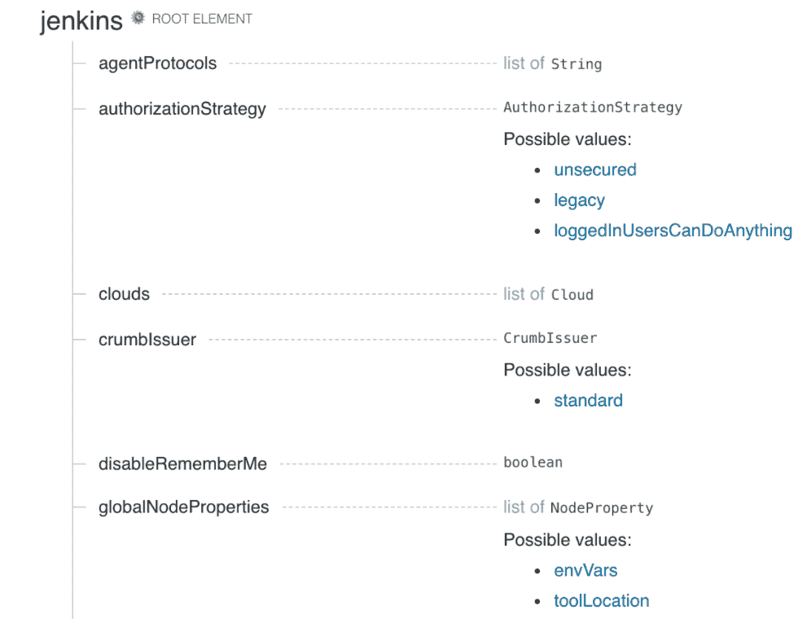
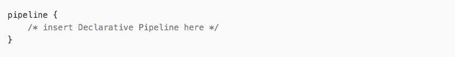

# 让 Jenkins 企业就绪的 4 大技巧

> 原文：<https://thenewstack.io/4-power-tips-to-get-jenkins-enterprise-ready/>

[CloudBees](https://www.cloudbees.com/) 赞助了这篇文章。

Jenkins 已经成为实现持续集成和持续交付(CI/CD)的一个强大的——也是最流行的——工具。根据 [CNCF 的调查](https://www.cncf.io/blog/2020/03/04/2019-cncf-survey-results-are-here-deployments-are-growing-in-size-and-speed-as-cloud-native-adoption-becomes-mainstream/)，Jenkins 在 CI/CD 软件平台市场拥有 58%的市场份额。

该平台之所以受欢迎，主要是因为其稳定的架构，尤其是 DevOps 团队可以依赖的深度 CI/CD 功能。CloudBees 和开源社区也在继续改进和扩展插件和提供的流程，包括一个配置为代码的插件，它可以极大地改进 GitOps 工作流。

然而，如果您不使用最佳实践，Jenkins 在设置、配置和管理方面会是一个挑战。当您构建和使用 Jenkins 管道时，有一些方法可以避免一些常见的困难和问题。许多用户可能还没有意识到 Jenkins 是如何变得更易于管理的——这主要归功于开源社区和提交者的支持。例如，一些用户可能专注于感知到的 Jenkins 缺点，而没有意识到他们的问题的解决方案现在已经存在。在许多情况下，采用最近引入的流程和工具不仅使 Jenkins 更易于安装和管理，还可以使 DevOps 团队利用其更强大的 CI/CD 功能。

詹金斯项目委员会成员[r·泰勒·克罗伊](https://twitter.com/agentdero)说:“对于一些接触詹金斯超过十年的用户来说，继续依赖他们在詹金斯任期之初使用的流程已经司空见惯。

克罗伊说:“当人们在新的工作岗位上回到詹金斯身边时，他们会说，五年前我用詹金斯时就是这么做的，所以我打算再做一次——这让他们自己陷入了麻烦。”。“我认为这是任何主流或普通软件的共同问题——但在过去几年里发生了很多变化。”

在这篇文章中，我们描述了如何更好地利用 Jenkins 作为开发和交付软件的重要工具。

## 你真的必须把配置当作代码来尝试

依赖 Jenkins 配置作为代码插件的选项已经存在了几个月，但作为解决许多 CI 挑战的一种方式，它经常被忽视，特别是在定义 Jenkins 配置时，正如插件的名称所暗示的那样。挑战包括自动化和简化 Jenkins 管道配置以及管理相关插件。代码为的 [Jenkins 配置的优点在于简化了流程，只需提交一个 pull 请求，然后在部署之前进行审查，因为配置是在一个简单的 YAML 文件中定义的。](https://www.jenkins.io/projects/jcasc/)

克罗伊说:“这是迄今为止最酷的——我不能在足够多的屋顶上大喊，配置就是代码。“一开始我非常怀疑这是否可行，但它确实有效。”

一旦添加了作为代码插件的配置，就会自动生成 Jenkins 控制器配置的代码表示。

“如果你试图自动化这个过程，这正是你开始的地方，因为你所有的配置现在都是代码，所以你可以把它放到一个存储库中，开始构建你的 Docker 容器，然后从那里开始，”克罗伊说。"当代码可用时，在配置之前这个过程是不存在的."

## 一个插件什么时候有意义，什么时候没有意义

插件的选择肯定会对 Jenkins 管道的功能产生影响，无论是积极的还是消极的。

[CloudBees](http://www.cloudbees.com) 的开发者[杰西·格里克](https://www.linkedin.com/in/jesse-glick-aa324b29/)说:“在因为方便而使用插件和在不必要时依赖插件之间有所取舍。

在 Jenkins 的世界里，存在着大量的插件。根据你对总数的统计，有超过 1500 个插件的更新正在被发布。每次安装插件时，都需要考虑它将如何成为 Jenkins 服务器系统的一部分，以及它将如何用于多个产品、项目，在某些情况下，团队共享服务器上的空间。

“因此，如果您更新管道，行为会发生某种变化，否则您为什么要更新它？”格利克说。“你需要确保改变行为不会突然破坏之前为另一个团队工作的东西。”

一个经验法则是，如果一个插件会影响 Jenkins 服务器的构建，那么在这种情况下最好避免它。

“服务器构建应该是你的项目或构建脚本的一部分，”Glick 说。“那不是 CI 系统关心的问题，而是开发者关心的问题。”

此外， [nVisium](https://nvisium.com/) 的 DevOps 工程师 [Shawn Smith](https://www.linkedin.com/in/shawnsmith08/) 说，插件通常有不同的发布时间表和依赖性，同时它们也与其他插件交互或依赖于其他插件。“随着你在系统中增加更多的东西，你花在测试和执行更新上的时间将会迅速增加，”Smith 说。

## 不要太‘GUI’

使用 GUI 选择声明式语法而不是脚本式语法的魔力可以使编辑和改进 Jenkins 管道的语法更加容易。然而，声明性选项有时可以作为一种过于简单的解决方案，来解决最好写成脚本的问题或修复。一些开发人员和管理员甚至可能选择 GUI，因为他们缺乏创建自己的脚本的编程技能。

然而，利用 Jenkins 的可编程管道(在 CloudBees CI 中可用)或可用的实际代码，可以帮助在管道中建立稳定性，减少使用中的问题。

根据 [Rookout](https://www.rookout.com/) 的联合创始人兼首席技术官 Liran Haimovitch 的说法，对你的 Jenkins 管道进行编码会使复杂性更容易管理。

Haimovitch 说:“当你编写自己的管道时，你得到的最大好处包括一个单一的真实来源，让你知道事情是如何建立的，并在需要时作为备份。”"管道组件可以重用，保持事物的一致性，减少样板文件."

Glick 说，应用声明性语法作为编辑或配置 Jenkins 管道的一种方式“适用于你可能遇到的大多数项目”。"脚本语法允许你明确定义你想做什么."

例如，脚本语法对于分配计算资源和为 Jenkins 管道选择不同的代理非常有用。“你能够预先选择某些事情并取得结果，”格利克说。“你实际上是在为你的 Jenkins 服务器的特定需求编写一个程序”。这涉及到“一个更陡峭的学习曲线，但它也让你做更有活力的事情。”

Haimovitch 说，Jenkins pipelines 还内置了对容器的可编程支持，包括 Docker 和 Kubernetes，DevOps 团队应该利用这些支持。

“当涉及到更复杂的工作负载时，比如集成测试，你甚至可以同时执行多个容器，”Haimovitch 说。"虽然这需要一些额外的工作，但您将受益于无与伦比的灵活性和性能."

## 利用这些多分支

Jenkins 和 Git 存储库之间肯定有很多重叠，特别是当 Git 功能继续扩展到不仅仅作为存储库时。Git 选项，以及 GitOps，也可以帮助解决插件给 Jenkins 管道带来的复杂性和不匹配。

使用多分支管道，如 Git 库可以提供的管道，可以用来将“重要状态从 Jenkins 中移除，并进入管道中的版本控制，”Bryce Larson，SaltStack 的高级 SRE 说。

拉森说:“如果你想做一份新工作，只需在 GitHub 上推一个新的分支，这个分支就会按照你想要的方式运行。”如果你有一个问题，人们不重新基础或跟上主分支，你的詹金斯管道是正确的，使用管道库。它使得您可以独立于更新 GitHub 分支来更新管道定义。"

## 用 GitOps 将这一切集合在一起

[企业管理协会(EMA)](https://www.enterprisemanagement.com/) 的分析师 [Torsten Volk](https://www.linkedin.com/in/torstenvolk) 告诉新堆栈，Jenkins 的复杂性及其提供的灵活性解释了为什么许多组织越来越多地将他们的 CI/CD 流程和相关的 Jenkins 管道与 GitOps 集成。

由此产生的集成应该导致以与标准应用代码相同的方式管理 Jenkins 插件、脚本和工作流，或者换句话说，在 GitOps 管理保护伞下的“DevOps-as-Code”。

“关键是通过拉式请求将所有变更集中到 Jenkins 设置的任何方面。这使您能够执行合规性、可重用性、资源消耗、成本和风险的标准，”Volk 说。“同时，采用 GitOps for Jenkins 使自动化工作流在整个企业中可用，并使任何人都能够贡献增强功能，而不仅仅是做他们自己的事情。”

然而，对于 Jenkins 来说，成功的 GitOps 以及任何其他技术——的关键在于逐步实现的方法，同时“始终关注 DevOps 工程师——不要觉得你通过强迫他们进入严格的代码控制制度来减慢他们的速度，”Volk 说。

“像詹金斯这样的平台的美妙之处在于，你基本上可以非常快速地做任何事情，而且你在过去使用它越多，你在未来就会发现越多的用例，”沃尔克说。“通过‘捕捉’Git 存储库中的相应代码来利用所有这些创造力，可以将您的自动化游戏带到下一个级别。”

今年的免费 DevOps World 不容错过。[立即注册](https://www.cloudbees.com/devops-world/register?utm_source=NewStack&utm_medium=website&utm_campaign=dw2020)观看由行业思想领袖主持的 100 多场技术和商业会议。参加 40 多个培训和研讨会机会和主题演讲。

**太平洋时间 9 月 22 日周二上午 7:30，在第一天的主题演讲后，收听 New Stack 对该活动的直播报道！TNS 创始人兼发行人 Alex Williams 将与 CloudBees 软件交付自动化集团高级副总裁兼总经理 Shawn Ahmed 以及 Broadridge Daniel Ritchie 的杰出工程师进行交谈。要观看，请前往[新堆栈的潜望镜频道](https://www.periscope.tv/thenewstack)。**

CNCF[和](https://cncf.io/)[盐栈](http://saltstack.com)是新栈的赞助商。

奥斯卡·诺德在 [Unsplash 上拍摄的特写图片。](https://unsplash.com/s/photos/four?utm_source=unsplash&utm_medium=referral&utm_content=creditCopyText)

目前，新堆栈不允许直接在该网站上发表评论。我们邀请所有希望讨论某个故事的读者通过推特或脸书与我们联系。我们也欢迎您通过电子邮件发送新闻提示和反馈:[feedback @ thenewstack . io](mailto:feedback@thenewstack.io)。

<svg xmlns:xlink="http://www.w3.org/1999/xlink" viewBox="0 0 68 31" version="1.1"><title>Group</title> <desc>Created with Sketch.</desc></svg>