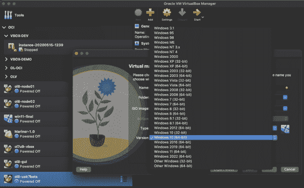
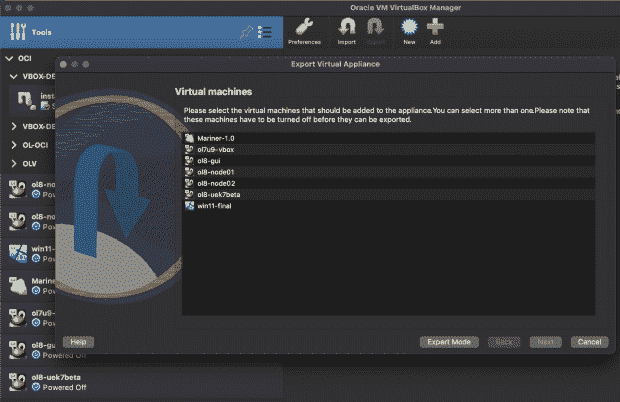
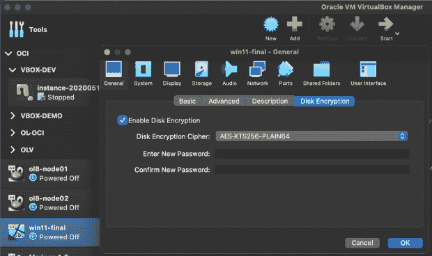
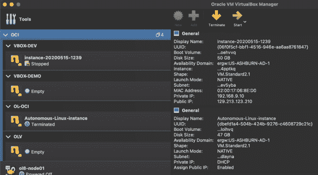

# DevOps 工程师仍然依赖虚拟机管理程序的 4 个原因

> 原文：<https://thenewstack.io/4-reasons-devops-engineers-still-rely-on-hypervisors/>

即使云原生开发开始起步，许多 DevOps 团队仍然依赖虚拟机(VM)作为其工具包的一部分。需求如此之大，以至于预计到 2027 年，Citrix、微软、甲骨文和 VMware 的热门虚拟机产品的许可证销售额将每年增长近 20%。

这种增长部分是由于虚拟机和虚拟机管理程序帮助分布式开发运维团队克服障碍的方式。例如，DevOps 工程师经常用小的、可管理的代码块编写服务。这意味着软件的复杂性不在于编码，而在于这些代码块是如何连接的。它是关于确保新软件将在不同的操作系统、平台和云上按计划运行。

将远程开发人员加入进来，DevOps 团队开始寻找一个安全、可控的环境，支持工程师在哪里以及如何最好地工作。事实证明，在这种情况下，虚拟机管理程序非常有用。这里有四个原因:

## **1。平衡选择和团队合作**

作为个人，DevOps 工程师通常对他们工作效率最高的操作系统(Linux、Windows、macOS)有强烈的看法。同样，一些工程师对特定品牌的工作站硬件有着强烈的兴趣。要求分布式团队在单个开发平台上标准化会导致挫败感和较低的生产率；最好给每个人提供他们想要和需要的东西。

此外，尽管操作系统和硬件可能会有所不同，但软件开发和测试环境需要与新应用程序部署的位置相匹配，即目标平台。一个好的 hypervisor 可以在开发者运行 Linux 的高端工作站、运行 macOS 的 Apple MacBook Pro 或者运行 Windows 11 的笔记本电脑上运行项目的特定目标环境。

如果 DevOps 团队处理的下一个项目指定了一个不同的目标环境，没有问题。虚拟机管理程序可以处理这种情况，因为虚拟机管理程序(如 DevOps 团队)是一流的多任务处理程序。

请记住，并非所有虚拟机管理程序的工作方式都相同。Oracle VM VirtualBox 是开源的，它使用相同的虚拟机管理程序来允许不同类型的多个操作系统在单个设备上并发运行。因此，无论您的顶级工程师使用的是 Windows、macOS、Linux 甚至 Solaris，当与使用不同操作系统/工作站/笔记本电脑的同事共享时，他们开发的应用程序都可以正常工作，无需更改。另一方面，一些专有系统在 Windows 上提供了与 Mac 不同的管理程序，这可能会使这种共享变得复杂。

VirtualBox 7.0 中的不同操作系统选项

## **2。最小化配置错误**

DevOps 工程师需要为给定的项目精确地指定目标应用程序部署环境。高度分散的团队经常会无意中让每个团队成员使用稍微不同的目标部署环境，使用不同的操作系统发布版本、库版本、补丁集或设备驱动程序版本。这导致了[配置混乱](https://thenewstack.io/cloud-misconfiguration-vulnerability-hiding-in-plain-sight/),这可能会使测试陷入困境，增加错误并减缓软件交付。

来自甲骨文的开源[流浪者项目](https://github.com/oracle/vagrant-projects)和[流浪者盒子](https://yum.oracle.com/boxes/)提供了预构建的基础映像，可以通过在团队内部和团队之间创建更易于共享的定制环境来帮助简化应用程序开发。例如，10 名 DevOps 工程师一起工作于一个项目，可能想要使用相同的操作系统、内核、驱动程序和库，但是可能意外地以 10 个稍微不同的安装结束。运行带有浮动扩展的虚拟机管理程序允许在每个工程师的桌面上轻松共享一个安装和配置脚本，确保目标环境完全相同。

在[github.com/oracle/vagrant-projects](https://github.com/oracle/vagrant-projects)上可以看到提供 Oracle 数据库、Oracle Dataguard、Oracle Real Application Clusters、Oracle Cloud Native Environment 等 Oracle 产品的示例 vagger 项目。

使用 VirtualBox 7.0，DevOps 工程师可以通过一个导出命令与团队成员共享安装。

## **3。高度安全的远程工作**

远程工作给企业带来了新的安全挑战。为了抵御网络攻击，组织通常会强制工作站和笔记本电脑对所有数据进行加密。在一个敏捷的世界中，DevOps 工程师必须前所未有地进行多任务处理，但他们的台式机或笔记本电脑可能没有足够的空间来容纳所有当前或最近的项目环境。一些工程师通过使用外部本地存储来解决这个问题，例如未加密的 USB 驱动器或外部固态盘。这可能成为一个巨大的安全漏洞。因为[远程工作](https://thenewstack.io/remote-work-is-great-but-far-from-universal/)是当今的行业规范，所以无论虚拟机是存储在本地还是使用便携式设备或云存储服务共享，Oracle VM Virtual Box 7 等虚拟机管理程序对虚拟机进行加密都至关重要。VirtualBox 7.0 对虚拟机数据、日志和配置文件使用 AES 128/256 位加密，不会影响所有受支持的来宾虚拟机的性能。

如果 DevOps 工程师在 Dropbox 或 Google Drive 上提供了一个虚拟机，该虚拟机可能会被下载，但仍然是加密的，只对那些有密码的人有用。

## **4。根据真实数据集测试应用程序**

现代应用开发要求从桌面轻松、快速地访问云容量，以进行应用测试。例如，使用拥有数百万条记录的数万亿字节大小的数据库来测试一个应用程序，坦白地说，仅靠一台笔记本电脑是不可能做到的。请记住，这个应用程序可能只是 DevOps 团队本月工作的项目之一。

虚拟机管理程序可以节省资源不足的漫漫长夜和周末测试，同时还可以节省测试基础架构的成本。例如，VirtualBox 7.0 提供了与 Oracle 云基础架构的内置集成，使 DevOps 工程师可以轻松地根据存储在云中的数据库测试应用程序。通过在本地虚拟机和云中运行的数据集之间创建一个专用网络隧道，VirtualBox 为工程师提供了一种安全的方式来与世界各地的同事共享完全相同的测试数据库。

许多应用程序部署在混合环境、内部和云中。DevOps 工程师需要针对这些环境测试和支持他们的应用。VirtualBox 云集成也意味着工程师可以将生产 Oracle 云基础设施实例导入 VirtualBox；然后，这些实例作为虚拟机在本地桌面上运行。团队可以将虚拟机作为模拟或半虚拟化实例导出到 OCI，然后创建多个虚拟机克隆，而无需重新上传同一虚拟机。这样的任务几乎是即时的，节省了 DevOps 团队的宝贵时间，极大地提高了效率。

VirtualBox 7.0 与 Oracle 云集成，有助于针对大规模云数据库进行测试。

## **结论**

现代虚拟机管理程序的设计和构建考虑到了 DevOps 工程师和云应用程序开发。与过去的版本一样，VirtualBox 7.0 是轻量级的，易于在从笔记本电脑到大型技术工作站的任何设备上使用，现在它提供了跨开发、测试和部署环境的新级别的云集成和安全性。事实证明，对于分布式云原生开发运维团队来说，虚拟机管理程序仍然是工具箱中的重要工具。

想了解更多？你可以在 10 月 17 日至 20 日在[云世界](https://www.oracle.com/cloudworld/)参观。

<svg xmlns:xlink="http://www.w3.org/1999/xlink" viewBox="0 0 68 31" version="1.1"><title>Group</title> <desc>Created with Sketch.</desc></svg>