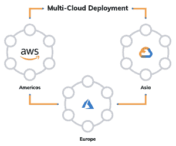

# 企业应该实施多云战略的 4 个原因

> 原文：<https://thenewstack.io/4-reasons-why-enterprises-should-implement-a-multicloud-strategy/>

[DataStax](https://www.datastax.com/) 赞助本帖。

 [塔拉·贾纳

Tara 是 DataStax 的产品和营销高级总监。](https://www.linkedin.com/in/tara-shankar-jana-tj-3291a321/) 

如今，组织越来越多地寻求在多云设计中简化应用工作负载部署的技术，以降低总拥有成本、构建同类最佳的解决方案并避免供应商锁定。无论是充分利用运行和管理私有云的成本，还是支持开发人员 velocity 高效构建现代化的智能应用，多云产品的优势对企业来说都是一个极具吸引力的命题。

根据分析公司[国际数据公司的最新报告](https://www.idc.com/getdoc.jsp?containerId=IDC_P33214)，到 2023 年，全球在公共云基础设施和服务上的支出将从 2019 年的 2290 亿美元几乎翻一番，达到约 5000 亿美元，而早期的云采用主要是在单个云提供商上构建新的应用程序，今天的企业越来越多地采用支持多种云的模式。

以下是考虑多云策略和部署的四个理由:

## **1。选择自由**

多云为组织提供了灵活性和选择的自由，可以在全球范围内的任何地方、任何设备和任何云上托管其应用程序和数据。基于多种云的工具和提供商允许企业利用每个云提供商的最佳功能。通过自由选择，各种合作伙伴可以适应企业的独特要求，并随着其业务在多云架构上的增长而扩展。

## **2。没有单一云提供商锁定**

如果一个企业选择一个单一的云提供商，那么它就面临着继续与该提供商合作的风险。一旦组织将其应用程序和基础架构转移到一家云提供商，他们很难转向另一家云提供商。任何此类迁移都会变得耗时、技术上具有挑战性，并且可能会产生高昂的成本。

## **3。更高的投资回报(ROI)**

虽然避免供应商锁定是采用多云方法的最重要优势，但竞争性定价也是向多云进行战略转移的一个同样令人信服的理由。借助多云方法，企业现在有了多种选择，而不是推动业务流程与单个云提供商保持一致，因此 it 可以找到适合其业务使用情形的提供商，而不必牺牲选择或成本利润。在多个云上托管应用程序可提供敏捷性、灵活性和更好的总拥有成本(TCO)，从而带来更高的投资回报。

## **4。减少停机时间**

采用多云方法并使用不同提供商的云服务消除了应用程序和业务系统中的单点故障。尽管公共云提供商通常提供高达三个 9(99.9%)的可用性 SLA，但企业将核心工作负载分布在多个云基础架构中以减少停机的可能性非常重要。

## **利用 DataStax Astra 实现多云技术**

data tax[Astra](https://www.datastax.com/products/datastax-astra)，一个云原生的 Cassandra as-a-service，现在已经在三大云提供商上可用:AWS，GCP 和 Azure。Astra 将部署时间从几周缩短到几分钟，消除了使用 Apache Cassandra 的最大障碍。

 Astra 可以根据使用模式匹配计算和数据库容量。开发人员可以在几分钟内创建一个数据库实例，并且该服务可以接受来自应用程序的 API 请求。

Astra 的 NoOps 和零停机功能可帮助企业和开发人员在任何云提供商(他们选择的)上快速构建云原生应用，实现零锁定，并能够横向扩展到最大的工作负载。

Astra 在所有三个主要云提供商上的可用性进一步推动了在[多云](https://www.datastax.com/resources/whitepaper/why-multi-cloud-imperative-any-modern-data-strategy)设置中部署应用的势头。

## **多云是未来**

在 TCO(总拥有成本)、可扩展性和可靠性方面，多云解决方案具有明显的优势。然而，尽管有上述许多潜在优势，但企业认为在管理多个云提供商时会面临一些挑战。其中包括构建多云解决方案、迁移应用、管理成本和安全性的复杂性。

然而，亚马逊网络服务(AWS)、微软 Azure、谷歌云平台(GCP)、IBM Cloud、VMware 和其他公司的持续投资，提供了引人注目的基础设施产品——每个产品都有自己独特和差异化的应用和服务优势。这些云提供商将在未来十年继续提供应用服务，以进一步帮助企业创新和大规模构建云原生应用，使多云的采用更加容易。

很明显，未来是多云的，只要企业继续寻找更简单、灵活、可扩展和最佳的工具和应用服务来构建他们的应用和基础架构，它就会一直存在。这对行业的发展意味着，更多的企业将积极考虑如何建立多云战略以及他们可以采用的支持解决方案，以确保更多的企业和开发人员能够在考虑多云的情况下进行构建。

通过 Pixabay 的特征图像。

<svg xmlns:xlink="http://www.w3.org/1999/xlink" viewBox="0 0 68 31" version="1.1"><title>Group</title> <desc>Created with Sketch.</desc></svg>