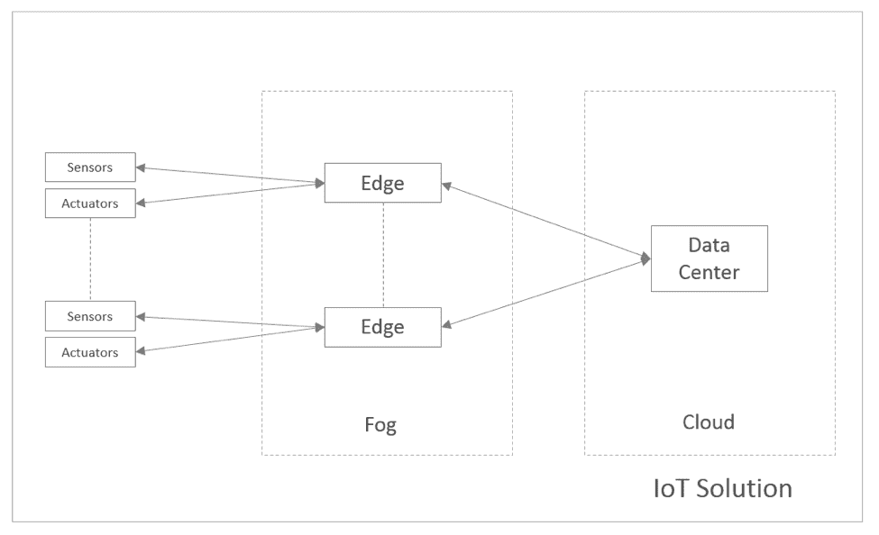
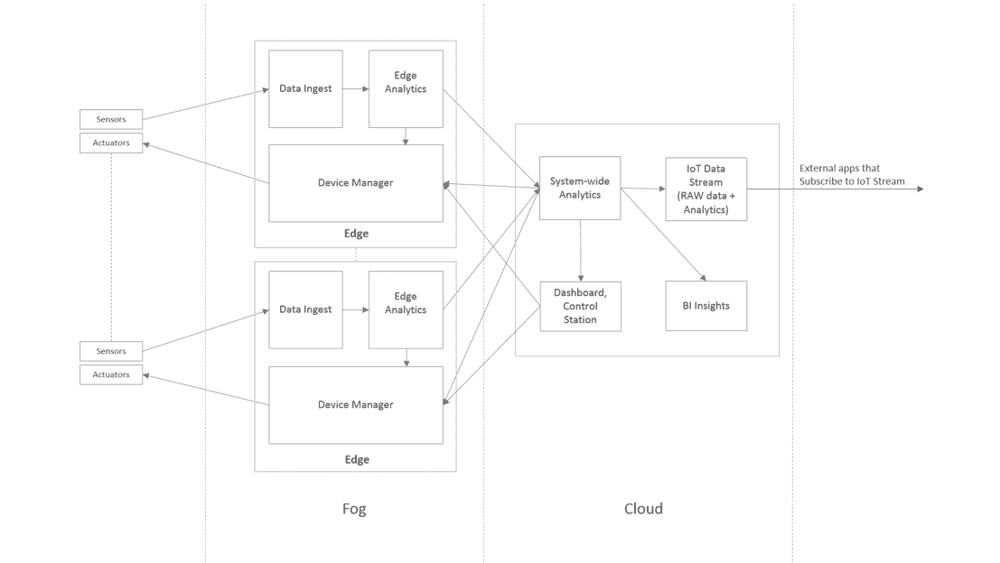
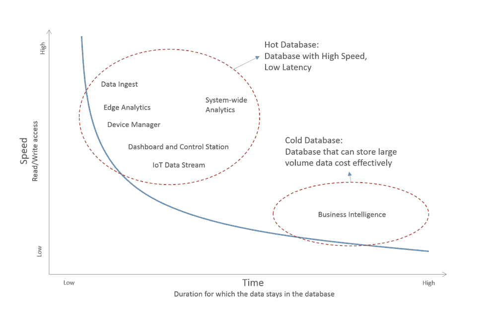
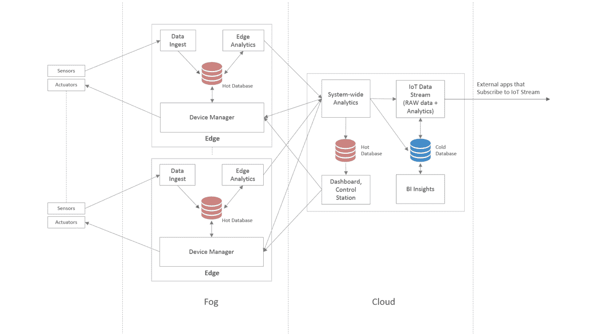

# 为您的物联网系统选择合适数据库的 4 个步骤

> 原文：<https://thenewstack.io/4-steps-to-select-the-right-database-for-your-internet-of-things-system/>

为物联网解决方案选择正确的数据库平台令人望而生畏。首先，物联网解决方案可以跨地理区域分布。与集中式的基于云的解决方案相反，更多的解决方案正在采用边缘的雾计算和云计算的组合。因此，您的数据库平台必须为您提供在边缘处理数据以及在边缘服务器和云之间进行同步的灵活性。

其次，根据您的物联网使用案例，您希望数据库具备的功能可能包括实时数据流、数据过滤和聚合、接近零延迟的读取操作、即时分析、高可用性、地理分布、模式灵活性等。本文将带您了解为物联网解决方案选择合适的数据库平台的四个步骤:

## 第一步。确定您的解决方案的数据需求

物联网解决方案依赖于从互联设备收集和处理数据，做出智能决策，如触发通知或操作，计算实时分析，从历史数据中收集模式等。

出于讨论的目的，在通用物联网解决方案中，您可以在整个企业中安装传感器和执行器。数以千计的传感器和执行器与边缘服务器相连。物联网解决方案持续收集来自所有传感器的数据，做出实时决策以控制传感器和执行器，提醒系统监控器异常活动，并向最终用户提供分析的历史视图。

图一。为示例物联网解决方案做好准备。

在你决定服务和与之配套的数据库之前，你有必要弄清楚*你在用你的数据做什么，以及 ***在哪里*** 。一些有助于了解您的数据需求并确定其优先级的问题:*

 **   哪些数据处理和决策被委托给边缘服务器？
*   云解决方案是部署在一个地区，还是分散在多个地区？
*   从设备传输到边缘服务器以及从边缘服务器传输到中央服务器的数据量是多少？峰值音量的估计值是多少？
*   物联网解决方案控制设备还是执行器？如果是，它们是否需要实时响应？
*   从历史数据中获得了哪些业务洞察力？

## 第二步。将您的解决方案分解为独立的软件服务

在这一步中，您将设计执行独立、特定任务的软件服务或组件。

当将前面描述的示例物联网解决方案分解为独立的服务时，您可能会得到如图 2 所示的设计。物联网解决方案本身在地理上是分布式的，其中一些组件部署在边缘网络上，其余组件位于中央位置。

图二。我们示例物联网解决方案的软件服务。

 [Roshan Kumar，Redis 实验室高级产品经理

Roshan Kumar 是 Redis 实验室的高级产品经理。他在软件开发和产品管理方面拥有丰富的经验。过去，Roshan 曾在惠普公司和许多成功的硅谷初创公司工作过，如 ZillionTV、Salorix、Alopa 和 ActiveVideo 等。作为一名热情的程序员，他设计并开发了 mindzeal.com，一个为年轻学生提供计算机编程课程的在线平台。Roshan 拥有美国加州圣克拉拉大学的计算机科学学士学位和 MBA 学位。](https://redis.com/) 

现在，让我们将架构分解为服务，并分析它们的职责和数据需求:

**目的**:收集和存储来自设备的日志和消息。

**数据库需求**:支持高速写操作，因为数据可能会突发到达，确保数据在异常情况下被捕获而不丢失。

**目的**:对输入的数据进行数据翻译、分类、聚合、过滤等功能。它负责边缘的实时决策。

**数据库需求**:支持亚毫秒级延迟的高速读写；提供工具和命令来对数据执行复杂的分析计算。

**目的**:向设备传达信息。

**数据库需求**:以最小的延迟访问和传递消息到设备。

**目的**:从边缘服务器收集数据，并执行数据转换和分析操作。

**数据库需求**:提供对数据执行分析计算的命令，并根据分析引擎的要求将数据存储足够长的时间。

目的:提供物联网生态系统当前状态的可视化表示。

数据库需求:保持数据的当前性和准确性，读取数据的延迟低于毫秒级。

**用途**:从历史数据中运行报表、查询和推理。

**数据库需求**:以经济高效的方式长时间存储数据；提供查询和分析数据的工具。

**目的**:将数据标准化为通用格式，并推送给订阅者。

**数据库需求**:高效执行数据转换操作的能力；支持发布和订阅功能。

## 步骤 3:根据数据需求对服务进行分组，并选择合适的数据库

下一步是根据每项服务的数据选择合适的数据库。图 3 将我们的物联网示例中的服务附加到图上，根据数据在数据库中的停留时间和服务所需的数据读/写速度对它们进行分类。

您将看到数据不断进出数据接收服务器，在数据库中停留的时间非常短。同时，数据可能以高容量和高速度到达。因此，我们需要一个具有低延迟的高速数据库来保存摄取服务的数据。另一方面，商业智能服务依赖于历史数据。

图 3。时间-速度曲线

下一步是对具有相似数据访问特征的服务进行分组，目的是限制数据库的数量(多余的数据库和不符合您要求的数据库)，从而减少操作开销。

图 4。数据库软件服务。

在图 4 中，我们将示例服务分为两个主要数据库——一个热和冷数据库。保存热数据的数据库部署在物联网设备附近，以最大限度地减少网络延迟。冷热数据的数据库选择有:

**热数据库:**随着 RAM 的价格越来越便宜，内存数据库通常是一个不错的选择。内存数据库以最短的延迟提供数据读写能力。选择热门数据库时，这些附加特性和功能将帮助您缩小选择范围:

*   灵活的数据格式—帮助您支持多种设备和通信格式
*   查询功能—使您能够实时运行高效的查询
*   消息传递和排队—推动通信和数据交换
*   分层内存模型—提供经济高效的内存模型和高性能
*   高可用性和灾难恢复—帮助您始终保持业务运营
*   地理分布—服务于地理分布的物联网部署
*   二进制安全—帮助您保存二进制数据

**冷数据库:**物联网解决方案的历史数据可能会增长到数 TB，在某些情况下可能会超过 1pb。存储历史数据的流行选择包括商用硬件上的存储解决方案。查询通常遵循 map-reduce 模式。通常，历史数据也在搜索引擎中被索引，用于模式匹配和数据聚合。如果您将数据存储在云中，请咨询您的云提供商，在您所在的地区什么是最具成本效益的数据存储解决方案。

## 步骤 4:评估成本、资源效率

将数据库分为热数据库和冷数据库有助于缩小数据库选择的范围。对于大多数物联网使用案例，一个高速数据库可以满足您的热数据库的所有要求。在冷数据库的情况下，选项可以从关系数据库到数据湖。设计者常犯的一个错误是创建一个多语言架构，为每个服务创建一个专门的数据库。这增加了应用程序堆栈的复杂性以及运营开销和成本。

拥有一个数据库的总成本是许多参数的函数。数据库本身的成本只是成本的一小部分。以下是一些成本:

*   **数据库许可成本:**成本可能是 CPU 数量、集群中碎片数量、数据库大小、吞吐量(每秒最大操作数)、时间(每年、每月、每小时等)的函数。)、高可用性和恢复特性、在多个云区域的可用性等。如果您使用的数据库是开源软件，根据许可证的类型，数据库成本甚至可能为零。
*   **基础设施成本:**基础设施成本取决于数据库的资源效率。例如，一个轻量级、线程安全的数据库仅用两台商用服务器就可以每秒执行[一百万次读/写操作，而传统数据库可能需要更多的服务器才能得到相同的结果。除了数据库效率，您的硬件成本是吞吐量、CPU 数量、RAM、数据大小、闪存、网卡等的函数。高可用性的数据库架构也发挥了作用。例如，](https://cloudplatform.googleblog.com/2015/04/a-guy-walks-into-a-NoSQL-bar-and-asks-how-many-servers-to-get-1Mil-ops-a-second.html)[基于仲裁的故障转移架构将只需要一个辅助服务器副本](https://redis.com/redis-enterprise/technology/highly-available-redis/)，但是基于非仲裁的架构将需要两个数据副本以避免[裂脑](https://en.wikipedia.org/wiki/Split-brain_(computing))。
*   **数据丢失成本:**拥有针对数据丢失的适当保险极其重要，尤其是对于商业物联网解决方案而言。您的总数据丢失成本是以下各项的总和:
    *   业务损失
    *   丢失数据的概率*恢复数据的成本

您可以通过与数据库供应商签订适当的 SLA 来抵消一部分成本。

*   **运营开销:**自动化是成功的法宝。一个提供自动化操作(如部署、配置、故障转移、扩展、数据分区、备份和恢复、监控和警报等)控制的数据库将有助于高效运行。

## 结论

当谈到为您的下一代物联网解决方案选择正确的数据库时，很容易迷失在当今可用的过多数据库中。但是，如果您将解决方案分解成组件服务，并了解它们的数据库需求，那么您可以有效地缩小数据库选择的范围。大多数物联网解决方案可以依赖热数据库进行实时数据收集、处理、消息传递、分析，以及冷数据库来存储历史数据和收集商业智能。这将使架构变得简单、精简和健壮。

最后一点，Redis，由 [Redis Labs](https://redis.com/) 赞助的开源内存数据库，作为热门数据库，是物联网解决方案的热门选择。它被物联网解决方案广泛用于数据接收、实时分析、消息传递、缓存和许多其他用例。

<svg xmlns:xlink="http://www.w3.org/1999/xlink" viewBox="0 0 68 31" version="1.1"><title>Group</title> <desc>Created with Sketch.</desc></svg>*