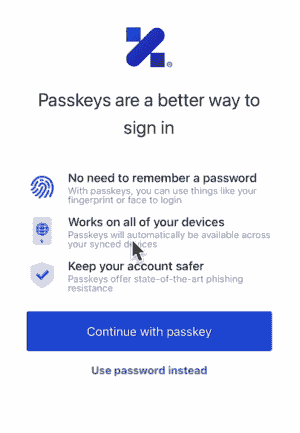

# 将塑造 2023 年应用开发的 4 大趋势

> 原文：<https://thenewstack.io/4-trends-that-will-shape-app-dev-in-2023/>

我参加了一个虚拟员工活动和黑客马拉松，一位演讲嘉宾邀请我们尽可能地举起手来。我们的一位高管从椅子上站起来，把手举到视频画面外。“这是一种创新的思维方式，”演讲者鼓掌说道。“我从没说过你必须坐着。”

作为一名开发人员，这段记忆一直伴随着我，因为我相信我们是推动创新的关键。开发人员是那些不断重组和重新思考如何构建应用程序的人。但是《2023》带来了一个情节转折。十多年来，企业似乎第一次将效率置于创新之上。那我们该怎么办？

这些是我在撰写这篇文章时问我的工程领导人同事的问题:在更严峻的经济环境中，什么样的趋势和技术将允许开发人员专注于创新？在不平凡的一年里，公司需要思考什么来帮助开发人员做好他们的工作？这是我们着陆的地方。

## 公司在开发者效率上投资(更多)

要求开发者“少花钱多办事”并不新鲜。多年来，由于人才稀缺和不断面临“超越创新”竞争的压力，开发效率一直是投资的关键领域。但是随着经济趋势摆在我们面前，我们将会看到更多的钱投入到开发软件和工具中。

目标是帮助开发人员在编写安全和可伸缩的代码时最大限度地利用他们的时间。技术投资将需要无缝集成到现有的[开发人员工作流程](https://thenewstack.io/workflows-for-the-new-developer-experience/)中，并帮助他们更快地发布功能，而不损害安全性、合规性或可靠性。

语言无关性、低代码和快速部署都是有助于提高开发人员效率的方法，并且允许开发人员在他们的语言专业知识范围内工作。这一领域的软件和工具将继续受到青睐，尽管只有那些能提供 10 倍效率的软件和工具才会胜出。

涉及某种程度安全复杂性的常用组件，如身份验证和同意管理，已经被公开为[拖放对象](https://auth0.com/blog/actions-integrations-are-now-ga/)。这些工具使现有开发人员保持高效，同时也帮助新开发人员更快地做出有意义的贡献。

而且不仅仅是工具。创新和安全之间的紧张关系自代码诞生以来就存在，但是软件开发的“左移”方法现在正成为主流。我希望在工具方面进行更多的投资，这将有助于主动管理安全。我们还将看到公司将工程和安全团队更紧密地结合在一起，在风险进入生产之前抓住它们，努力应用“设计安全”原则。

## 生成式人工智能成为主流

生殖人工智能已经吸引了全球开发者的注意力，ChatGPT 的病毒式推出和增长更是打断了这种关注。人工智能长期以来一直是公司的一个关键投资领域，但 2023 年，我们将看到基于生成式人工智能解决方案的应用程序增多。从 Google 和 Bing 对 ChatGPT 的竞争开始，我们可以看到公司集成这项技术的其他领域包括客户支持、内容搜索和聚合、教育，当然还有更智能的聊天机器人。

这意味着需要工具和平台来构建和部署基于 GPT-3 的模型，以及与这些人工智能模型集成的应用程序。随着这一领域的激烈竞争，深入了解 MLOps 平台和部署工具带来的生产力提升以推动速度和规模将变得非常重要。

除非人工智能框架与生成性人工智能技术相结合，以推动信任，并使模型响应可以解释，否则在基础设施，安全和其他决策应用中采用 GPT 模型将是困难的。

虽然生成系统正被用于构建概念验证代码生成工具，但我仍然怀疑我们能在自动生成有用代码方面走多远。但是如果[的生殖人工智能](https://thenewstack.io/generative-ai-how-companies-are-using-and-scaling-ai-models/)让位于更多的低代码机会，那将是一个有意义的胜利。

不只是开发者在用 AI。我们应该期待坏演员也能利用生成性人工智能解决方案发挥创造力——利用它们来制作更高级、更可信的钓鱼电子邮件和聊天机器人对话。DevSecOps 函数将会有一个有意义的增长，最佳实践应该包括针对已知漏洞仔细检查任何代码生成输出。

随着在几乎每个应用程序中使用这些技术的热潮，我们采用像密钥这样的防钓鱼因素变得更加重要。

## 万能钥匙以“密码黑仔”的身份首次亮相

图 1

作为技术专家，我们早就知道我们需要远离密码。随着多种连接设备和数字爆炸，密码并不方便。它们也不安全。我们在我们的平台上检测到每天[有 50，000 个密码被破解](https://auth0.com/blog/top-insights-from-our-2022-state-of-secure-identity-report/)，高于去年的 26，000 个。

这个领域有很多创新，但是没有一个有足够广泛的支持来实现主流采用。多年来，让密码变得“更安全”只是增加了用户、开发人员和帮助台的复杂性。即使在最好的情况下，密码仍然不足以保护用户身份。

Passkeys 是 FIDO2 身份验证的一种新形式，它使跨设备使用生物认证(面部扫描或指纹)成为可能。许多用户都熟悉解锁手机的这种体验。因为密钥被备份到云中，所以很容易将你的身份从一个设备转移到另一个设备。它们比密码更能抵御网络钓鱼和凭据填充攻击。

那么 passkeys 会取代密码吗？我认为，只要我们专注于开发者体验，我们今年将取得重大进展。密码是一种令人愉快的消费者体验，但除非我们让开发人员能够轻松地将密码认证集成到他们的应用程序中，否则消费者永远不会有这种体验。

密钥的实现需要几分钟，而不是几天。如果你想看看这在实践中会是什么样子，看看[这个博客](https://auth0.com/blog/our-take-on-passkeys/#Developing-with-Passkeys)，里面有主要的密钥流和由身份平台 Auth0(现在的 Okta 客户身份云)创建的演示。

## 加密技术的进步对抗数据泄露

开发人员的任务是实现安全的加密协议来保护敏感数据。加密过程产生了专家所谓的“T4”，即一团不知所云的数据“T5”，以确保其机密性。但是加密数据增加了开发人员的开销，他们需要在搜索数据或在其他应用程序中使用数据之前解密数据。

对于人工智能团队和任何与数据打交道的人来说，受到数据隐私和安全工作的约束并不罕见。(再次看到创新和安全之间的紧张关系。)通过可查询加密，这些团队可以继续以安全的方式分析和处理加密数据。

可查询加密是一项加密技术进步，它使得对加密数据执行搜索查询成为可能。多年来，学术界一直在思考像可查询加密这样的解决方案的可能性。但是随着 MongoDB 的[可查询加密](https://www.mongodb.com/docs/manual/core/queryable-encryption/)等功能的引入，该工具开始进入开发人员的真实环境。

随着隐私法对用户数据的收紧，我们将在这一领域看到更多的创新。更有趣的用例之一是允许用户查找他们自己的数据，而不允许服务提供商或其员工以明文形式访问这些数据。

今年将是各公司保持低调的一年。对于开发人员来说，这意味着在核心产品上增加关注，同时在其他所有事情上做出正确的构建与购买决策。如果你想尝试简化身份管理和安全的复杂性，你可以试试 Okta 客户身份云的[免费计划](https://auth0.com/signup)。

<svg xmlns:xlink="http://www.w3.org/1999/xlink" viewBox="0 0 68 31" version="1.1"><title>Group</title> <desc>Created with Sketch.</desc></svg>