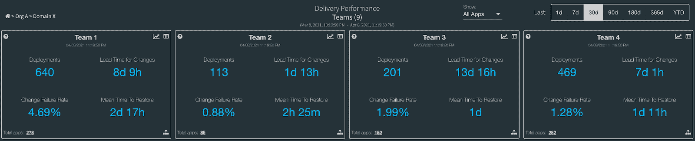
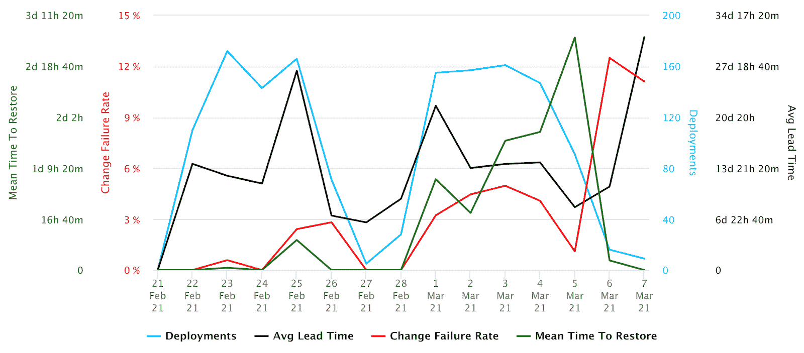
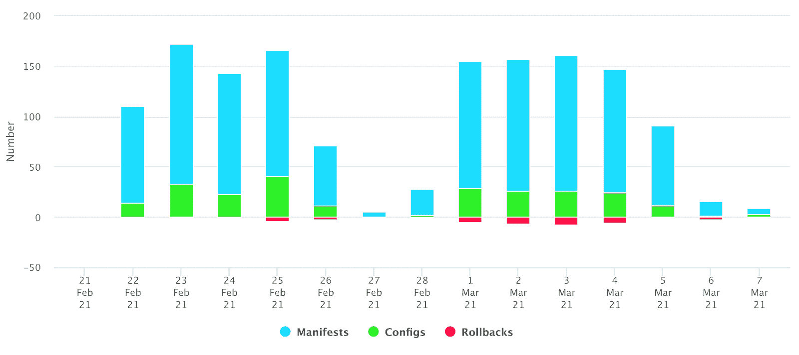
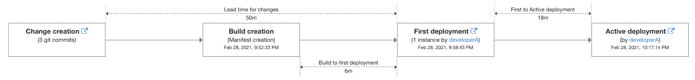

# 测量软件交付性能的 4 种方法

> 原文：<https://thenewstack.io/4-ways-to-measure-your-software-delivery-performance/>

 [阿拉文·坎南

阿拉文·坎南是易贝交付工程团队的工程经理。Aravind 喜欢和他的团队一起为移动、网络和基于服务的应用程序构建持续交付工具和框架。](https://www.linkedin.com/in/aravindkannan/) 

当您有数百个团队通过数千个持续集成和持续交付(CI/CD)管道将代码部署到数千个服务和应用程序的生产中时，测量这些应用程序的速度和稳定性对于确保快速交付高质量的软件变得至关重要。

本文重点介绍易贝如何使用 Nicole Forsgren 博士的著作 [Accelerate](https://www.ebay.com/sch/i.html?_nkw=9781942788331) 中详细介绍的四个软件交付性能指标来衡量和可视化我们在各种组织中应用程序的速度和稳定性。

[DevOps 研究和评估(DORA)](https://www.devops-research.com/research.html) 计划经过六年的广泛研究，通过年度[devo PS 状况报告](https://www.devops-research.com/research.html#reports)收集了来自全球 31，000 多名专业人士的调查数据。该报告通过预测工程和业务成果的四个关键指标，展示了精英和高绩效组织如何与中低绩效组织进行比较。

## 软件交付性能度量

下面是四个软件交付性能指标:

1.  **部署频率**–您的组织多久将代码部署到生产环境中？
2.  **变更的交付时间**–从代码提交到代码在生产中成功运行需要多长时间？
3.  **变更失败率**–部署需要回滚、修补等的频率。？
4.  **平均恢复时间**–出现问题时，恢复服务需要多长时间？

我们建立了一个系统，可以近乎实时地跟踪和可视化所有这些指标，能够深入到易贝的任何组织，并查看该组织内所有团队的这些指标的细分。团队可以查看所有应用程序的这些指标。此外，该系统允许访问历史趋势，以确定每个级别的四个指标中的任何改进或退化。团队还可以应用过滤器来查看特定时间段的度量。

### 部署频率

为了跟踪这个指标，我们从我们的构建和部署系统中寻找部署事件。当应用程序的新版本到达为生产流量提供服务的实例时，部署计数器就会增加，并被跟踪，直到它到达为流量提供服务的所有活动实例。这包括好的和坏的应用程序版本。

### 变革的准备时间

为了计算变更的交付周期，我们使用作为给定生产部署一部分的所有提交 SHA。交付周期是指从创建提交到部署到第一个流量服务实例所用的时间。

部署到生产环境的单个构建可以有多个提交，从而导致计算多个交付周期。为了计算单个总体指标，我们取这些交付时间的中间值，并将其用作该部署的“变更交付时间”。当查看某个组织、团队或应用程序的数据时，该组织、团队或应用程序的所有版本的“变更提前期”的平均值显示为“变更提前期”

### 变更失败率

变更失败率表示导致需要补救的影响用户的缺陷(如热修复、回滚、向前修复或修补)的所有生产部署的百分比。

我们目前将变更失败率衡量为给定时间段内所有部署的回滚百分比。如果单个实例正在处理流量，则即使从该实例进行回滚也会被视为失败。

### 平均恢复时间(MTTR)

平均恢复时间(MTTR)显示发生故障时恢复所需的时间。

我们将 MTTR 度量为在变更/发布进入生产阶段后回滚所花费的时间。例如，如果一个版本 N(坏版本)被部署到生产中，然后团队发现一个问题，需要他们通过部署 N-1(最后一个已知的好版本)来回滚 N，则从部署 N 到生产到部署 N-1 到生产之间的时间差被计算为恢复时间(TTR)。所有 TTR 的平均值为 MTTR。

### 结论:通过可见性提高

作为全公司“ [Velocity Initiative](https://youtu.be/kzdTsEd3NbM) 的一部分，易贝的各个平台和产品工程团队正在为一个共同的目标而努力:提高所有易贝团队更快交付高质量软件的能力。

测量和可视化这些度量有助于易贝的团队看到他们在交付速度和稳定性方面所处的位置，也有助于识别跨团队的软件交付过程中的改进领域。

有了对我们指标的这种了解，我们希望继续改进。

*有兴趣在易贝发展事业吗？我们在招人！要查看我们目前的职位空缺，请访问:*【http://ebay.to/Careers】

*<svg xmlns:xlink="http://www.w3.org/1999/xlink" viewBox="0 0 68 31" version="1.1"><title>Group</title> <desc>Created with Sketch.</desc></svg>*