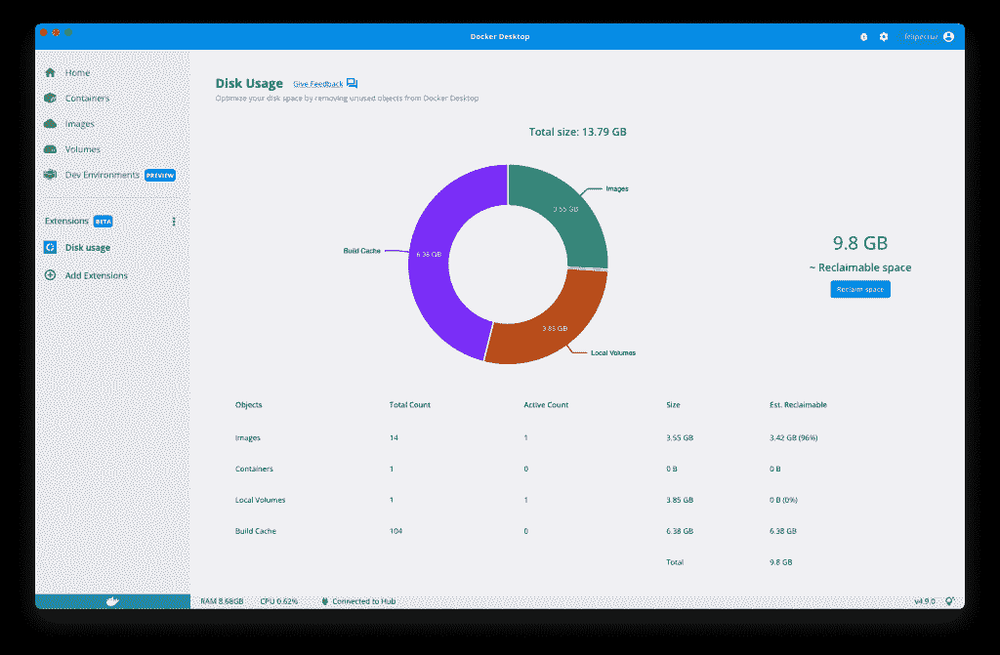
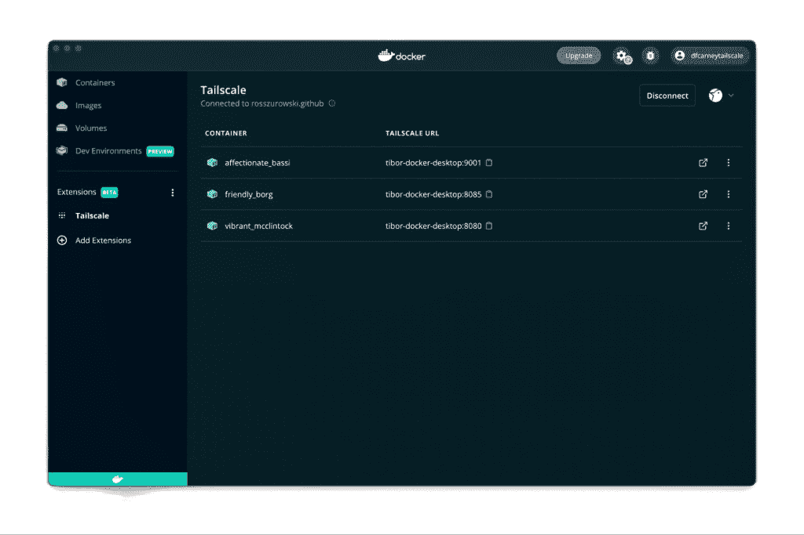
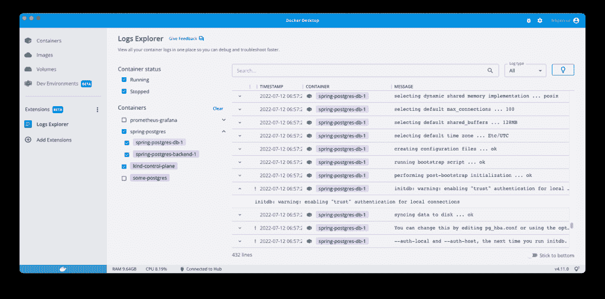
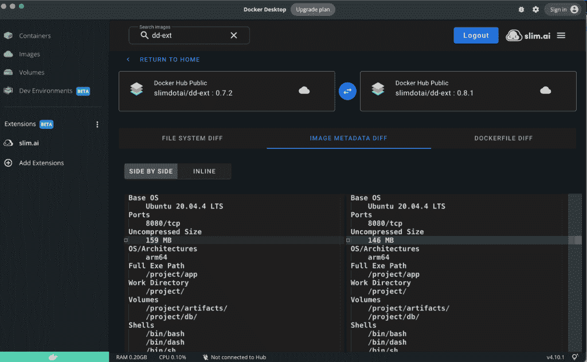

# 使用 Docker 扩展优化工作流程的 4 种方法

> 原文：<https://thenewstack.io/4-ways-to-optimize-your-workflows-with-docker-extensions/>

作为开发人员，您使用各种各样的工具来帮助您更快地编码、调试和部署——每天都有更多的工具推出。但是当这些工具被分散时，安装、管理和使用它们就变得复杂和耗时。

 [费利佩·克鲁兹

Felipe 是 Docker 的一名软件工程师，他在扩展团队工作。在此之前，他在 Go 和。NET，将应用打包成容器，通过 CI/CD 管道部署到云端。他也是 Kubernetes 的爱好者，喜欢为公司提供 Kubernetes 培训，并在科技活动中发表演讲。](https://www.linkedin.com/in/felipecruzmartinez/?originalSubdomain=es) 

在今年的年度 DockerCon 大会上，Docker 推出了 Docker 扩展来帮助开发者优化他们的工作流程，简化他们使用工具的方式。

Docker 扩展允许开发者在 Docker 桌面中构建新的功能，扩展其现有的能力，并发现和集成额外的工具。扩展可以通过 Docker Desktop 中的扩展市场进行安装，开发人员也可以使用 Docker 扩展 SDK 来创建他们自己的扩展，以适应他们的定制工作流。

自[发布该功能的测试版](https://www.docker.com/blog/docker-extensions-discover-build-integrate-new-tools-into-docker-desktop/)以来的三个月里，社区中的合作伙伴、Docker 和开发者已经找到了整合工具和创建更流畅、更简化的开发者体验的新方法。

让我们仔细看看社区安装的一些最流行的扩展，以及它们如何使您的工作流程更高效。

## 回收 Docker 使用的磁盘空间

使用 Docker Desktop 一段时间后，您可能已经构建了一些映像，运行了一些容器，并创建了一些卷来保存应用程序的数据。随着时间的推移，Docker 创建的所有这些资源都会占用您机器上的磁盘空间，最终可能导致您的机器耗尽。

过去，Docker 提供了一些命令来帮助您检查这些资源使用了多少磁盘空间，并删除它们来回收这些空间。

现在，有了磁盘使用扩展，您不再需要运行终端命令来执行此操作。

从 Docker 桌面的最新版本，你可以去扩展市场安装磁盘使用扩展。您将立即了解 Docker 资源在您的机器上使用了多少磁盘空间，并通过删除特定类型的资源来回收空间，如停止的容器、悬挂的映像和未使用的卷。一切从 Docker 桌面开始——无需终端！

## 使用 Tailscale 安全共享您的容器

当开发人员构建和容器化应用程序时，我们发现每次我们打算与队友分享新功能或错误修复时，我们都要通过 CI/CD 将我们的更改部署到服务器上。

这种内部循环(开发、测试和部署)需要时间。理想情况下，你想从队友那里得到即时反馈，而不必经历这个过程。那么，你的队友如何快速检查 Docker 桌面中作为容器运行的应用程序呢？或者你如何测试一个运行在你队友的 Docker 桌面上的 API？

Tailscale 扩展允许你在 Docker 桌面上这样做。Tailscale 私下和几乎即时共享你的容器，而你不必做任何网络设置。它检测所有暴露端口的容器，并使它们对您的私有 Tailscale 网络内部的人可用。任何属于你的 Tailscale 网络的人都可以看到你的容器。

这使得协作变得更加容易和安全，例如作为代码审查的一部分，与同事共享您工作的暂存副本，与队友共享 web 应用程序的进度反馈，或者让队友连接到本地计算机上运行的微服务。看看这个博客，看看有多简单。

## 使用日志浏览器浏览和过滤多个容器中的日志

当对由多个容器组成的应用程序进行故障排除时，您可能会发现很难跟踪每个容器输出的所有日志。例如，如果你用 Docker Compose 开发了一个 [ELK](https://github.com/docker/awesome-compose/tree/master/elasticsearch-logstash-kibana) (ElasticSearch，Logstash，和 Kibana)应用程序，你如何按容器对这些日志进行分组，以便有组织地查看它们？

Logs Explorer 扩展为您提供了一个位置，您可以同时浏览运行和停止的容器中的日志，使用正则表达式过滤它们，并使用粘性搜索过滤器。

这个集中查看日志的地方消除了对笨拙的文本编辑器的需要，并简化了您收集数据的方式。

## 使用 Slim 查看您的容器内部。人工智能

使用新映像构建服务时，您可能需要了解映像上显示了哪些端口、root 用户是谁或者哪些文件具有特殊权限。或者您可能想比较两幅图像的细节，看看哪一幅更符合您的需要。然而，这些数据和比较它们的方法并不总是容易获得的。

这种情况会随着身材变瘦而改变。AI 扩展，它让您能够深入了解本地图像的组成，如文件系统、元数据、图层信息等。这有助于您识别容器中的实用程序(例如 curl ),并探索它包含的任何基于文本的文件(如配置、shell 脚本、READMEs)。

苗条。AI 还为图像数据提供分析工具，如优化机会，对已删除和重复的文件进行计数，并对任意两个本地图像和图像标签进行并排比较。

这种洞察力通常是评估基础映像以构建服务、在意外行为发生时本地调试容器以及最大限度地减少软件供应链攻击的关键。在这个博客中了解更多关于它是如何工作的。

## 在 Docker 桌面中查找更多扩展

这只是 Docker 扩展能为您做的一切的一小部分。体验一下 Docker 扩展的精选列表，或者查看 Docker 桌面上的扩展市场。

立即开始下载最新版本的 Docker Desktop 或[了解如何使用我们的 SDK](https://www.docker.com/blog/build-your-first-docker-extension/) 构建自己的桌面。

<svg xmlns:xlink="http://www.w3.org/1999/xlink" viewBox="0 0 68 31" version="1.1"><title>Group</title> <desc>Created with Sketch.</desc></svg>