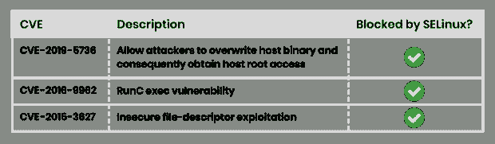

# 使用内核安全特性进行进程监控的 4 种方式

> 原文：<https://thenewstack.io/4-ways-to-use-kernel-security-features-for-process-monitoring/>

Kubernetes 的默认 pod 供应的大攻击面容易受到严重的安全漏洞的影响，其中一些漏洞包括恶意利用和容器突破。我认为防止此类攻击的最有效的工作负载运行时安全措施之一是在容器内逐层监控流程。

这听起来可能是一项需要额外资源的艰巨任务，但实际上，情况恰恰相反。在本文中，我将带您了解如何使用现有的 Linux 内核安全特性来实现逐层的进程监控和防止威胁。

## 威胁预防和流程监控

Kubernetes 中的容器化工作负载由许多层组成。有效的运行时安全策略考虑到了每一层，并监控每个容器中的进程，也称为进程监控。

流程监控中的威胁检测包括集成隔离工作负载或控制访问的机制。有了这些控制，您可以有效地防止恶意行为，减少工作负载的攻击面，并限制安全事件的爆炸半径。幸运的是，我们可以使用现有的 Kubernetes 机制和 Linux 防御来实现这一点。

## 内核安全特性

通过使 Linux 防御更靠近容器，我们可以利用现有的 Kubernetes 机制来监控进程并减少各个层的攻击面。

让我们来看看 seccomp、AppArmour、SELinux 和 systcl，它们都是内核安全特性，能够控制哪些系统调用是容器化应用程序所必需的，并且能够针对它们正在运行的工作负载虚拟地隔离和定制各个容器。这些功能还可以通过使用强制访问控制(MAC)来提供对卷或文件系统等资源的访问，从而防止容器突破。只需使用这四个特性的默认设置，您就可以大大减少集群中的[攻击面](https://thenewstack.io/modern-attack-methods-jeopardize-cybersecurity-strategies/)。

### Seccomp

作为 Linux 内核的一个特性，seccomp 能够在粒度级别过滤容器发出的系统调用。Kubernetes 将允许您自动实现由容器运行时(包括 podman、Docker 和 CRI-O)加载到节点上的 [seccomp](https://thenewstack.io/defend-the-core-kubernetes-security-at-every-layer/) 概要文件

一个简单的 seccomp 配置文件将有一个系统调用列表和一个每当进行系统调用时的相应操作。启用此功能后，您的攻击面将减少到允许的系统调用，并禁止使用危险的系统调用。危险的系统调用会导致内核漏洞、权限提升和容器突破。

### SELinux

如果你看一看 [CVE-2019-5736](https://nvd.nist.gov/vuln/detail/CVE-2019-5736) 、 [CVE-2016-9962](https://nvd.nist.gov/vuln/detail/CVE-2016-9962) 、 [CVE-2015-3627](https://nvd.nist.gov/vuln/detail/CVE-2015-3627) 等，你会发现最近的每一次容器运行时突破都是一种文件系统突破。您可以通过使用 SELinux 来缓解这个问题，SELinux 可以控制谁可以访问文件系统以及资源(如目录、文件和内存)之间的交互。我建议将 SELinux 配置文件应用到云计算中的工作负载，因为这有助于通过限制主机内核对文件系统的访问来减少攻击面，并允许更好的隔离实践。

SELinux 还可以有效地增强传统的 Linux 自主访问控制(DAC)系统，因为它提供了强制访问控制(MAC)。传统的 Linux DAC 允许用户更改文件和目录，并处理用户拥有的权限。这同样适用于根用户。

然而，对于 SELinux MAC，内核将标记每个 OS 资源，然后将其存储为扩展文件属性。这些标签用于检查内核中允许交互的 SELinux 策略。通过实现 SELinux，容器中的 root 用户将不再能够访问已挂载卷中的主机文件，即使标签不准确。

强制、许可和禁用是 SELinux 运行的三种模式，它们可以进一步分为有针对性的和严格的。强制和禁用，顾名思义，强制或禁用 SELinux 策略，而许可发出警告。您还可以使用 Targeted 对特定工作负载实施策略，或者使用 Strict 对所有进程应用策略。

为了进一步加强 SELinux，我建议使用多类别安全性(MCS)用类别来标记资源。此选项确保用户或进程只能访问标有用户或进程所属类别的文件。一旦启用了 SELinux，Docker、CRI-O、podman 和其他容器运行时将随机选择一个 MCS 标签来运行容器。

除非标记正确，否则容器不会访问主机或 Kubernetes 卷上的文件。这在资源之间创建了一个重要的屏障，有助于防止与容器突破相关的漏洞。

看看下面的例子。使用 SELinux 概要文件部署一个 pod。除非在主机上标记为 s0:c123、c456，否则此 pod 将无法访问任何主机卷装载文件。虽然您可以看到整个主机，但是文件系统是装载到 pod 上的。

```
apiVersion:  v1 metadata:
name:  pod-se-linux-label namespace:  default labels:
app:  normal-app spec:
containers:
-  name:  app-container
image:  alpine:latest args:  ["sleep",  "10000"]  securityContext:
seLinuxOptions:
level:  "s0:c123,c456"
volumes:
-  name:  rootfs
hostPath:  path:  /

```

维护 SELinux 策略可能会很困难。然而，SELinux 策略对于深度防御策略至关重要。下表列出了可以通过简单地在主机上实现和实施 SELinux 来防止的容器转义 CVE。



### 表观摩尔

与 SELinux 类似，AppArmor 配置文件定义了进程可以访问的内容。下面是一个 AppArmor 简介的例子:

```
  #include <tunables/global>
    /{usr/,}bin/ping flags=(complain)  {
      #include <abstractions/base>
      #include <abstractions/consoles>
      #include <abstractions/nameservice>
      capability net_raw,
      capability setuid,
      network inet raw,
      /bin/ping mixr,
    /etc/modules.conf  r,
      # Site-specific additions and overrides. See local/README for details.
      #include <local/bin.ping>
    }

```

如您所见，这里的 ping 只有三个功能:net_raw、setuid 和对/etc/modules.conf 的读取权限。有了适当的控制，ping 实用程序的攻击面减少了:它不能修改或写入文件系统，包括键、设置和二进制文件，也不能加载任何模块。如果遭到破坏，ping 实用程序将只能在有限的区域内执行任何恶意活动。

默认情况下，您的容器运行时，如 Docker、CRI-O 和 podman 将为您提供一个 AppArmor 配置文件。由于 AppArmor 灵活且易于维护，我建议您为每个微服务制定一个策略。

### Sysctl

使用 Kubernetes sysctl，您可以使用 sysctl 接口来配置集群中的内核参数。Sysctl 还允许您修改特定工作负载的内核行为，而不会影响集群的其他部分。例如，在处理大量并发连接时，或者如果您需要一个特殊的参数集来高效地运行工作负载，您可以使用 sysctls 来同时管理容器和资源密集型工作负载。

系统分为两组，安全系统和不安全系统。您可以自行设置这两个组。安全 sysctl 只影响容器，而不安全 sysctl 影响容器和运行它们的节点。如果您需要使用适用于该节点的 sysctl，我建议使用 node affinity 在应用了 sysctl 的节点上调度工作负载。

## 摘要

逐层流程监控是应对安全事件(如容器泄漏和对主机资源的未授权访问)的最有效解决方案之一。虽然您应该始终记得选择适合您的威胁模型的解决方案，但是我上面提供的解决方案是通过利用现有的 Kubernetes 机制和 Linux 防御来启动或改进您的进程监控的好方法。

如果你想深入了解 seccomp、SELinux、AppArmour 和 systcl 的例子，我推荐你看看我合著的电子书《 [Kubernetes 安全性和可观察性:保护容器和云原生应用的整体方法](https://link.tigera.io/ueMes)》的第 4 章。

*要了解更多关于为容器和 Kubernetes 建立安全性和可观察性的新云原生方法，请查看 Tigera 的这本* [*O'Reilly 电子书*](https://link.tigera.io/ueMes) *。*

<svg xmlns:xlink="http://www.w3.org/1999/xlink" viewBox="0 0 68 31" version="1.1"><title>Group</title> <desc>Created with Sketch.</desc></svg>